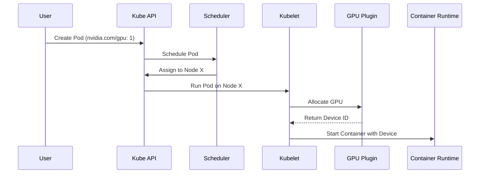

# AI Architecture & Design Masterclass

:::info Overview
This masterclass provides an exhaustive guide to NVIDIA AI Infrastructure operations, focusing on the underlying architecture, production deployment patterns, troubleshooting, and senior-level interview preparation.
:::


In enterprise generative AI deployments, inference represents 80% to 90% of total lifecycle computing spend. Unlike traditional stateless REST microservices that scale linearly with CPU and RAM utilization, Large Language Model (LLM) inference introduces complex stateful memory dynamics, non-linear latency trade-offs, and multi-GPU tensor parallelism.

When interviewing for an **NVIDIA Senior Solutions Architect** role, you must be prepared to deconstruct LLM execution into its underlying compute and memory phases, calculate **KV cache memory footprints** from first principles, compare serving runtimes (**TensorRT-LLM, Triton, vLLM, NVIDIA NIM**), and size production GPU clusters against strict Service Level Objectives (SLOs).




:::warning Caution
If the `nvidia-device-plugin` is not running or crashlooping, the Kubelet will fail to allocate the GPU, leaving the Pod in a `Pending` state indefinitely.
:::

:::warning Caution
If the `nvidia-device-plugin` is not running or crashlooping, the Kubelet will fail to allocate the GPU, leaving the Pod in a `Pending` state indefinitely.
:::
## 2. KV Cache Sizing Mathematics: The Architecture Behind Memory Sizing

During autoregressive decoding, calculating self-attention requires projecting Key (K) and Value (V) tensors for all previous tokens in the sequence. To prevent recomputing earlier tokens at every step, transformers cache these projections in GPU memory—the **KV Cache**.

In production, the KV cache—not the model weights—is the primary bottleneck that constrains batch size and triggers Out-of-Memory (OOM) crashes.

### The KV Cache Memory Formula

For a transformer model using standard Multi-Head Attention (MHA) or Grouped-Query Attention (GQA):

```text
KV_Bytes_Per_Token = 2 * Num_Layers * Num_KV_Heads * Head_Dimension * Precision_Bytes
```

Where:
- The factor of `2` accounts for storing both Key and Value matrices.
- `Num_Layers`: Number of transformer decoder blocks.
- `Num_KV_Heads`: Number of Key-Value heads (in GQA, this is significantly lower than query heads).
- `Head_Dimension`: Hidden dimension divided by total query attention heads.
- `Precision_Bytes`: 2 for FP16/BF16, 1 for FP8.

### Worked Architecture Example: Llama 3 70B (GQA)
- **Model Parameters:** 80 Layers, 8 KV Heads, Head Dimension 128, Precision FP16 (2 bytes).

```text
KV_Bytes_Per_Token = 2 * 80 * 8 * 128 * 2 = 327,680 Bytes = 320 KB per token
```

Now consider a production inference replica handling **Concurrent Requests = 64** with an average context length of **4,096 tokens**:

```text
Total_KV_Cache_Memory = 64 requests * 4,096 tokens * 320 KB/token
                      = 83,886,080 KB = 80.0 GB of VRAM!
```

**Architectural Consequence:**
The model weights of Llama 3 70B in FP16 consume **140 GB**. A batch of 64 requests with 4K context requires an additional **80 GB** for KV cache alone (140 + 80 = 220 GB). A single 8-GPU DGX node partitioned with Tensor Parallelism (TP = 4 or TP = 8) is required simply to hold the combined weights and KV cache memory in HBM.


:::tip Pro-Tip
Always visualize the request lifecycle when troubleshooting latency. The gap between `API Gateway` and `Triton Pods` is often where network jitter is introduced.
:::
## 4. Serving Runtime Landscape: TensorRT-LLM, Triton, vLLM, and NIM

Enterprise customers often struggle to choose among NVIDIA and open-source serving runtimes. An NVIDIA Solutions Architect must articulate their clear boundaries:

| Runtime / Engine | Core Focus & Architecture | Latency & Throughput | Production Fit |
|---|---|---|---|
| **NVIDIA TensorRT-LLM** | Highly optimized C++ CUDA library; custom fused kernels (FlashAttention-2, FP8 GEMM, KV cache management), in-flight batching. | **Maximum Throughput & Lowest Latency**. Saturates hardware limits. | Enterprise foundation model serving at extreme scale; core engine for production deployments. |
| **Triton Inference Server** | Multi-framework orchestration gateway (C++, Python, ONNX, TensorRT-LLM backend). Dynamic batching, model pipelining (BLS), concurrent models per GPU. | Enterprise Gateway layer with low overhead. | Production model routing, multi-model hosting, and unified enterprise monitoring. |
| **NVIDIA NIM** | Containerized, production-packaged microservice wrapping TensorRT-LLM and Triton with standard OpenAI-compatible REST APIs. | Peak TensorRT-LLM performance with zero compiler tuning needed. | Turnkey enterprise deployment on Kubernetes and DGX Cloud. |
| **vLLM** | Open-source Python/CUDA engine; introduced **PagedAttention** to eliminate KV cache fragmentation. | Excellent developer agility; slightly lower performance than custom TensorRT-LLM kernels. | Rapid AI prototyping, research experimentation, and community model integration. |


:::info Architecture Note
Separating storage traffic (often RoCE) from East-West compute traffic (Infiniband) is critical for isolating congestion events during large checkpointing operations.
:::
## 6. Senior Solutions Architect Interview Scenarios

### Scenario 1: Sizing an LLM Service for a Large Financial Enterprise
**Interviewer:** *"A bank wants to deploy an internal Copilot using Llama 3 70B for 5,000 employees. They expect peak loads of 150 requests per second. The P99 latency SLA is TTFT under 250 ms and ITL under 30 ms. How many GPUs and servers do you specify?"*

**Candidate Answer:**
> "I break this down using our benchmark-derived capacity sizing methodology:
> 1. **Model Placement & Tensor Parallelism:**
>    - Llama 3 70B in FP16 requires 140 GB for weights plus ~80 GB for KV cache under load = 220 GB VRAM.
>    - We place the model across **4x NVIDIA H100 80GB SXM5 GPUs using Tensor Parallelism (TP = 4)**. Each replica provides 320 GB of combined HBM3 memory, leaving 180 GB purely for continuous batch KV caching.
> 2. **Replica Throughput Benchmarking:**
>    - On TensorRT-LLM running continuous batching with FP8 quantization, a TP = 4 H100 replica achieves ~25 requests/sec while strictly meeting the TTFT under 250 ms and ITL under 30 ms SLO.
> 3. **Replica Sizing:**
>    - Raw Replicas needed: 150 req/sec / 25 req/sec/replica = 6 Replicas.
>    - GPUs required: 6 Replicas * 4 GPUs = 24 H100 GPUs.
> 4. **Resilience & Node Packaging:**
>    - Each DGX H100 contains 8 GPUs, hosting exactly 2 model replicas per chassis.
>    - 24 GPUs = 3 DGX H100 servers.
>    - Adding **N+1 high-availability redundancy** for hardware maintenance gives **4x DGX H100 servers (32 GPUs total)**, providing 200 req/sec peak capacity with automatic node failover."


### Advanced Production Considerations
When operating at scale, you must heavily monitor metrics like DCGM (Data Center GPU Manager) counters, Xid errors, and PCIe bandwidth saturation. In production, these parameters dictate your cluster's overall ROI. Ignoring PCIe topology, for instance, can lead to severe NCCL fallback, completely degrading multi-node training performance.
## Key Takeaways

1. **Prefill is Compute-Bound; Decode is Memory-Bound:** Prefill saturates Tensor Core TFLOPS and dictates TTFT; Decode saturates HBM3 memory bandwidth and dictates ITL.
2. **KV Cache is the Primary Capacity Limit:** Calculate KV cache memory per token using `2 * Layers * KV Heads * Dim * Precision`. Under concurrent multi-token loads, KV cache can exceed model weight sizes.
3. **In-Flight Batching is Mandatory:** Continuous iteration-level scheduling eliminates padding waste and yields 3x to 4x throughput gains over static batching.
4. **Never Autoscale on GPU Utilization:** Continuous batching keeps GPU utilization at 100%; autoscale LLMs based on **KV Cache %**, **Queue Depth**, and **P99 TTFT**.
5. **Size Sizing Off Benchmarked SLOs:** Capacity is always calculated as required throughput divided by per-replica throughput measured strictly at the target SLA.


# Chapter 7 — Accelerated Networking: InfiniBand, Spectrum-X, and Collective Fabrics

In an **NVIDIA AI Factory**, the network fabric is not merely an external pipe for moving data—it is an **active computational backplane**. Distributed foundation model pre-training across thousands of GPUs is an extreme network stress test. At every backward-pass step, thousands of GPUs simultaneously exchange hundreds of gigabytes of gradient tensors in synchronized collective patterns (`All-Reduce`, `All-to-All`).

If the fabric drops a single packet, experiences a hash-collision bottleneck on equal-cost multi-path (ECMP) uplinks, or encounters an optical transceiver with bit errors, the entire multi-thousand-GPU job halts at the collective barrier.

When interviewing for an **NVIDIA Senior Solutions Architect** role, you must be prepared to compare **Quantum-2 InfiniBand** and **Spectrum-X Ethernet**, design multi-rail non-blocking topologies, optimize **GPUDirect RDMA**, configure lossless RoCE v2 flow control (PFC & ECN), and isolate fabric-induced collective stragglers.


### Advanced Production Considerations
When operating at scale, you must heavily monitor metrics like DCGM (Data Center GPU Manager) counters, Xid errors, and PCIe bandwidth saturation. In production, these parameters dictate your cluster's overall ROI. Ignoring PCIe topology, for instance, can lead to severe NCCL fallback, completely degrading multi-node training performance.
## 2. Multi-Rail Fat-Tree Fabric Architecture

In an 8-GPU **NVIDIA DGX H100**, each SXM5 GPU is paired directly with an independent **ConnectX-7 400 Gbps HCA** via PCIe Gen5 switches. To prevent traffic contention, DGX SuperPODs deploy an **8-Rail Fat-Tree Network**.

```mermaid
flowchart TD
    subgraph DGX_Node01["DGX Compute Node 01"]
        GPU0["GPU 0"] <--> HCA0["HCA 0"]
        GPU1["GPU 1"] <--> HCA1["HCA 1"]
        GPU7["GPU 7"] <--> HCA7["HCA 7"]
    end

    subgraph DGX_Node02["DGX Compute Node 02"]
        N2_GPU0["GPU 0"] <--> N2_HCA0["HCA 0"]
        N2_GPU1["GPU 1"] <--> N2_HCA1["HCA 1"]
        N2_GPU7["GPU 7"] <--> N2_HCA7["HCA 7"]
    end

    subgraph Rails["8 Independent Leaf Switch Rails (Non-Blocking)"]
        SW0["Leaf Switch Rail 0 (Switch Plane 0)"]
        SW1["Leaf Switch Rail 1 (Switch Plane 1)"]
        SW7["Leaf Switch Rail 7 (Switch Plane 7)"]
    end

    HCA0 <-->|400G OSFP| SW0
    N2_HCA0 <-->|400G OSFP| SW0

### Why Multi-Rail Eliminates Collective Contention
- GPU 0 on all nodes communicates strictly over **Rail 0** (Leaf Switch 0).
- GPU 1 on all nodes communicates strictly over **Rail 1** (Leaf Switch 1).
- **Zero Cross-Rail Contention:** During an All-Reduce collective, GPU 0 never competes for switch uplinks with GPU 1. Cross-GPU tensor aggregation within the node happens over ultra-high-speed **NVLink (900 GB/s)**, while inter-node transport scales across 8 parallel 400G network rails.


### Advanced Production Considerations
When operating at scale, you must heavily monitor metrics like DCGM (Data Center GPU Manager) counters, Xid errors, and PCIe bandwidth saturation. In production, these parameters dictate your cluster's overall ROI. Ignoring PCIe topology, for instance, can lead to severe NCCL fallback, completely degrading multi-node training performance.
## 4. Lossless Ethernet Engineering: PFC and ECN on Spectrum-X

Running RDMA over Ethernet (RoCE v2) requires turning a naturally lossy best-effort protocol into a **lossless deterministic fabric**.

```mermaid
flowchart LR
    subgraph Tx["Transmitting Host (ConnectX-7)"]
        TX_QUEUE["Egress Queue (Priority 3)"]
    end

    subgraph Switch["Spectrum-4 Ethernet Leaf Switch"]
        INGRESS_BUF["Ingress Buffer Pool"]
        ECN_MARK{"Buffer > ECN Threshold?"}
        PFC_CHECK{"Buffer > PFC Threshold?"}
    end

    subgraph Rx["Receiving Host (ConnectX-7)"]
        RX_BUF["Receive Buffer"]
    end

    TX_QUEUE -->|RoCE v2 Packets| INGRESS_BUF
    INGRESS_BUF --> ECN_MARK
    ECN_MARK -->|Yes: Mark CE bits in IP header| PFC_CHECK
    PFC_CHECK -->|Critical: Send PFC PAUSE frame back| Tx
    INGRESS_BUF --> RX_BUF
    RX_BUF -->|Sends CNP (Congestion Notification Packet)| Tx
    Tx -->|Throttles transmission rate before drops occur| TX_QUEUE
```

### The Two Control Loops of Lossless RoCE:
1. **Coarse Loop: Priority Flow Control (PFC - IEEE 802.1Qbb)**:
   - When switch ingress buffer thresholds are breached, the switch sends an 802.1Qbb **PFC PAUSE frame** upstream for Priority 3 traffic. The sending NIC pauses transmission on that queue until buffers drain.
   - *Failure Mode:* **PFC Deadlock.** If pause frames form a circular dependency across switches, all packet transmission halts. Prevented by strict buffer headroom calculation and dynamic watchdog timers (`pfc_deadlock_prevention = auto`).
2. **Fine Loop: Explicit Congestion Notification (ECN / DCQCN)**:
   - When buffer occupancy exceeds a configured threshold, the switch marks Congestion Experienced (`CE`) bits in the IP header of transit packets without dropping them.
   - The receiving HCA detects the CE mark and generates a **Congestion Notification Packet (CNP)** back to the sender. The transmitting ConnectX-7 throttles its rate in hardware, preventing PFC pause frames from firing in steady state.


### Scenario 2: Diagnosing a "Network Is Slowing Training" Incident
**Interviewer:** *"A customer submits a ticket: 'Our 32-node training run is 30% slower than expected. We think your InfiniBand fabric is defective.' How do you prove whether the network is actually the culprit?"*

**Candidate Answer:**
> "I follow the **PBCTC methodology (Phase, Bench, Counters, Topology, Correlate)**:
> 1. **Phase Isolation:** Before touching fabric counters, I review the PyTorch profiler or PyTorch Lightning logs. I verify whether the 30% regression is in the **GPU compute phase**, **dataloader I/O phase**, or **collective communication phase (`ncclKernel_AllReduce`)**. If collective time is normal and dataloader time spiked, the issue is storage, not the network.
> 2. **Isolated Network Benchmark:** I execute `nccl-tests` (`all_reduce_perf`) across the allocated 32 nodes outside of their application code.
>    - If `all_reduce_perf` achieves full 400G bus bandwidth (~380 GB/s), the InfiniBand fabric is completely healthy, proving the regression is an application-level bottleneck (e.g., small batch sizes or CPU thread starvation).
> 3. **Query Physical Link Counters:** If `all_reduce_perf` is slow, I query InfiniBand error counters across all 256 HCA ports:
>    `ibqueryerrors -s SymbolErrors,LinkDowned,PortXmitWait`
>    - **High `SymbolErrors`:** Indicates a dirty optical transceiver or loose MPO fiber cable.
>    - **High `PortXmitWait`:** Indicates downstream congestion or a slow rank causing credit starvations.
> 4. **Isolate and Re-test:** I drain the node displaying symbol errors, replace it with a spare, and re-run the benchmark to confirm full line-rate performance."

