# AI Architecture & Design Masterclass

:::info Overview
This masterclass provides an exhaustive guide to NVIDIA AI Infrastructure operations, focusing on the underlying architecture, production deployment patterns, troubleshooting, and senior-level interview preparation.
:::

---
title: "Chapter 6 - AI Inference Architecture, LLM Serving, and System Sizing"
slug: "ai-architecture-and-design-masterclass"
sidebar_position: 6
description: "AI inference architecture for NVIDIA Solutions Architects: Prefill vs. Decode dynamics, KV cache memory mathematics, TensorRT-LLM vs. Triton vs. vLLM, and capacity sizing formulas."
source_document: "Volume_09_JR2018680_Interview_Preparation(2).docx"
---


In enterprise generative AI deployments, inference represents 80% to 90% of total lifecycle computing spend. Unlike traditional stateless REST microservices that scale linearly with CPU and RAM utilization, Large Language Model (LLM) inference introduces complex stateful memory dynamics, non-linear latency trade-offs, and multi-GPU tensor parallelism.

When interviewing for an **NVIDIA Senior Solutions Architect** role, you must be prepared to deconstruct LLM execution into its underlying compute and memory phases, calculate **KV cache memory footprints** from first principles, compare serving runtimes (**TensorRT-LLM, Triton, vLLM, NVIDIA NIM**), and size production GPU clusters against strict Service Level Objectives (SLOs).

---


### Advanced Production Considerations
When operating at scale, you must heavily monitor metrics like DCGM (Data Center GPU Manager) counters, Xid errors, and PCIe bandwidth saturation. In production, these parameters dictate your cluster's overall ROI. Ignoring PCIe topology, for instance, can lead to severe NCCL fallback, completely degrading multi-node training performance.


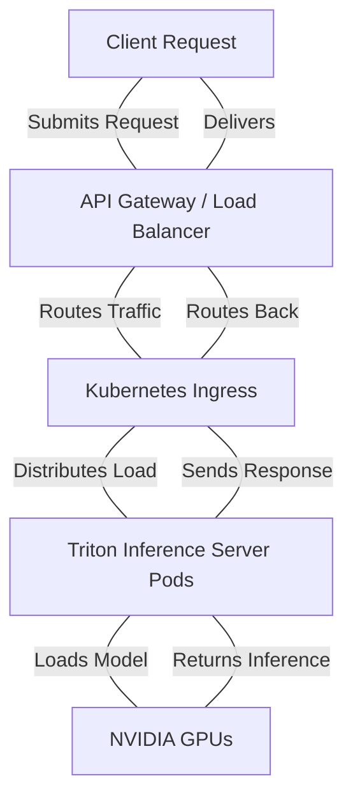

:::tip Pro-Tip
Always visualize the request lifecycle when troubleshooting latency. The gap between `API Gateway` and `Triton Pods` is often where network jitter is introduced.
:::

:::tip Pro-Tip
Always visualize the request lifecycle when troubleshooting latency. The gap between `API Gateway` and `Triton Pods` is often where network jitter is introduced.
:::
## 1. First Principles: The Two Phases of LLM Inference

Every generative autoregressive transformer request executes in two fundamentally different hardware operational regimes: the **Prefill Phase** and the **Decode Phase**.

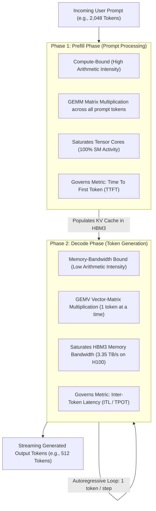

### Architectural Contrast

| Dimension | Prefill Phase (Prompt Processing) | Decode Phase (Token Generation) |
|---|---|---|
| **Mathematical Operation** | General Matrix-Matrix Multiply (**GEMM**) | General Matrix-Vector Multiply (**GEMV**) |
| **Hardware Bottleneck** | **Compute-Bound** (Tensor Core TFLOPS) | **Memory-Bandwidth Bound** (HBM3 Bandwidth GB/s) |
| **Operational Mechanism** | Processes all input tokens in parallel. | Autoregressively generates one token per step. |
| **Governing Latency Metric** | **Time To First Token (TTFT)** (Target: under 200 ms) | **Inter-Token Latency (ITL / TPOT)** (Target: 20-30 ms) |
| **Hardware Optimization** | High FP8/FP16 Tensor Core density (H100/B200). | Extreme HBM3e bandwidth and massive capacity. |

---


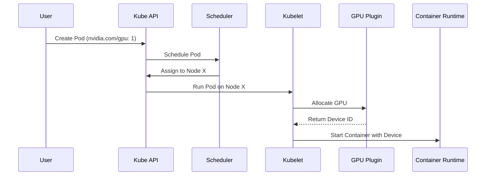

:::warning Caution
If the `nvidia-device-plugin` is not running or crashlooping, the Kubelet will fail to allocate the GPU, leaving the Pod in a `Pending` state indefinitely.
:::

:::warning Caution
If the `nvidia-device-plugin` is not running or crashlooping, the Kubelet will fail to allocate the GPU, leaving the Pod in a `Pending` state indefinitely.
:::
## 2. KV Cache Sizing Mathematics: The Architecture Behind Memory Sizing

During autoregressive decoding, calculating self-attention requires projecting Key (K) and Value (V) tensors for all previous tokens in the sequence. To prevent recomputing earlier tokens at every step, transformers cache these projections in GPU memory—the **KV Cache**.

In production, the KV cache—not the model weights—is the primary bottleneck that constrains batch size and triggers Out-of-Memory (OOM) crashes.

### The KV Cache Memory Formula

For a transformer model using standard Multi-Head Attention (MHA) or Grouped-Query Attention (GQA):

```text
KV_Bytes_Per_Token = 2 * Num_Layers * Num_KV_Heads * Head_Dimension * Precision_Bytes
```

Where:
- The factor of `2` accounts for storing both Key and Value matrices.
- `Num_Layers`: Number of transformer decoder blocks.
- `Num_KV_Heads`: Number of Key-Value heads (in GQA, this is significantly lower than query heads).
- `Head_Dimension`: Hidden dimension divided by total query attention heads.
- `Precision_Bytes`: 2 for FP16/BF16, 1 for FP8.

### Worked Architecture Example: Llama 3 70B (GQA)
- **Model Parameters:** 80 Layers, 8 KV Heads, Head Dimension 128, Precision FP16 (2 bytes).

```text
KV_Bytes_Per_Token = 2 * 80 * 8 * 128 * 2 = 327,680 Bytes = 320 KB per token
```

Now consider a production inference replica handling **Concurrent Requests = 64** with an average context length of **4,096 tokens**:

```text
Total_KV_Cache_Memory = 64 requests * 4,096 tokens * 320 KB/token
                      = 83,886,080 KB = 80.0 GB of VRAM!
```

**Architectural Consequence:**
The model weights of Llama 3 70B in FP16 consume **140 GB**. A batch of 64 requests with 4K context requires an additional **80 GB** for KV cache alone (140 + 80 = 220 GB). A single 8-GPU DGX node partitioned with Tensor Parallelism (TP = 4 or TP = 8) is required simply to hold the combined weights and KV cache memory in HBM.

---


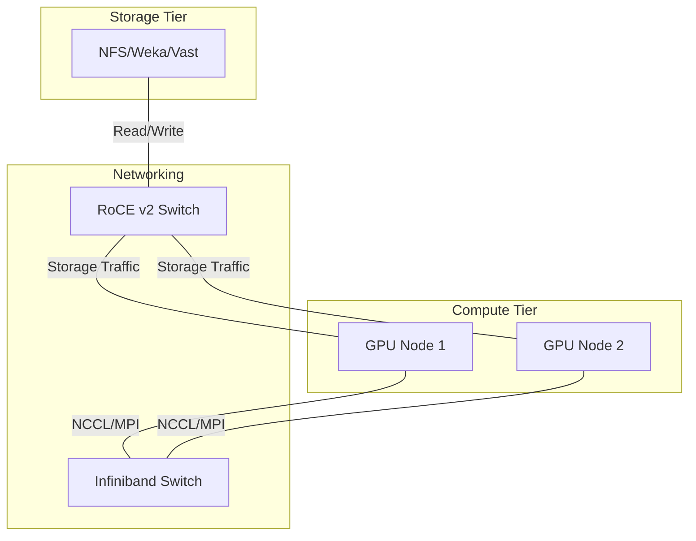

:::info Architecture Note
Separating storage traffic (often RoCE) from East-West compute traffic (Infiniband) is critical for isolating congestion events during large checkpointing operations.
:::

:::info Architecture Note
Separating storage traffic (often RoCE) from East-West compute traffic (Infiniband) is critical for isolating congestion events during large checkpointing operations.
:::
## 3. Dynamic Batching Strategies: Static vs. In-Flight Batching

Early inference servers used **Static Batching**: waiting for N requests to arrive, padding them to the longest request, and executing them together. If request 1 asked for 10 output tokens and request 2 asked for 500 output tokens, request 1 sat idle in GPU memory for 490 iterations, wasting compute capacity.

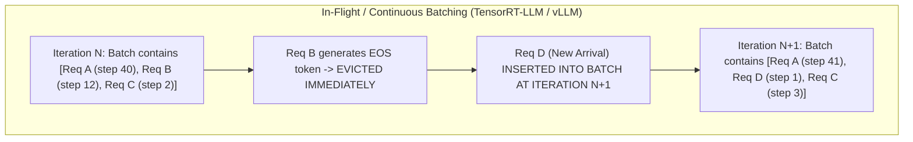

### Modern Techniques:
1. **Continuous / In-Flight Batching:** Iteration-level scheduling. As soon as a request emits an end-of-sequence (`EOS`) token, its memory is freed, and a new request from the queue enters the batch at the very next decode iteration. Increases serving throughput by **3x to 4x**.
2. **Chunked Prefill:** Long incoming prompt prefills (e.g., 8,000 tokens) are sliced into smaller chunks (e.g., 512 tokens) and co-scheduled alongside decode steps. This prevents a large prompt prefill from stalling ongoing decode streams, eliminating latency spikes.

---


:::tip Pro-Tip
Always visualize the request lifecycle when troubleshooting latency. The gap between `API Gateway` and `Triton Pods` is often where network jitter is introduced.
:::
## 4. Serving Runtime Landscape: TensorRT-LLM, Triton, vLLM, and NIM

Enterprise customers often struggle to choose among NVIDIA and open-source serving runtimes. An NVIDIA Solutions Architect must articulate their clear boundaries:

| Runtime / Engine | Core Focus & Architecture | Latency & Throughput | Production Fit |
|---|---|---|---|
| **NVIDIA TensorRT-LLM** | Highly optimized C++ CUDA library; custom fused kernels (FlashAttention-2, FP8 GEMM, KV cache management), in-flight batching. | **Maximum Throughput & Lowest Latency**. Saturates hardware limits. | Enterprise foundation model serving at extreme scale; core engine for production deployments. |
| **Triton Inference Server** | Multi-framework orchestration gateway (C++, Python, ONNX, TensorRT-LLM backend). Dynamic batching, model pipelining (BLS), concurrent models per GPU. | Enterprise Gateway layer with low overhead. | Production model routing, multi-model hosting, and unified enterprise monitoring. |
| **NVIDIA NIM** | Containerized, production-packaged microservice wrapping TensorRT-LLM and Triton with standard OpenAI-compatible REST APIs. | Peak TensorRT-LLM performance with zero compiler tuning needed. | Turnkey enterprise deployment on Kubernetes and DGX Cloud. |
| **vLLM** | Open-source Python/CUDA engine; introduced **PagedAttention** to eliminate KV cache fragmentation. | Excellent developer agility; slightly lower performance than custom TensorRT-LLM kernels. | Rapid AI prototyping, research experimentation, and community model integration. |

---


:::warning Caution
If the `nvidia-device-plugin` is not running or crashlooping, the Kubelet will fail to allocate the GPU, leaving the Pod in a `Pending` state indefinitely.
:::
## 5. Sizing and Capacity Planning Formula for Solutions Architects

When an executive asks: *"How many DGX H100 servers do I need to support 1,000 concurrent users?"* follow the deterministic **Benchmark-Derived Capacity Sizing Framework**:

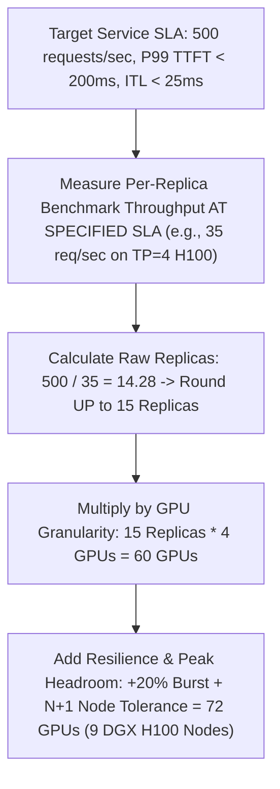

### The Production Sizing Equation

```text
Raw_Replicas = Ceiling( Target_Peak_Throughput_Req_Per_Sec / Benchmarked_Replica_Throughput_At_SLO )
Total_GPUs   = Raw_Replicas * GPUs_Per_Model_Replica (TP * PP)
Fleet_GPUs   = Total_GPUs * (1 + Headroom_Percentage) + N_Plus_Failure_Nodes
```

---


:::info Architecture Note
Separating storage traffic (often RoCE) from East-West compute traffic (Infiniband) is critical for isolating congestion events during large checkpointing operations.
:::
## 6. Senior Solutions Architect Interview Scenarios

### Scenario 1: Sizing an LLM Service for a Large Financial Enterprise
**Interviewer:** *"A bank wants to deploy an internal Copilot using Llama 3 70B for 5,000 employees. They expect peak loads of 150 requests per second. The P99 latency SLA is TTFT under 250 ms and ITL under 30 ms. How many GPUs and servers do you specify?"*

**Candidate Answer:**
> "I break this down using our benchmark-derived capacity sizing methodology:
> 1. **Model Placement & Tensor Parallelism:**
>    - Llama 3 70B in FP16 requires 140 GB for weights plus ~80 GB for KV cache under load = 220 GB VRAM.
>    - We place the model across **4x NVIDIA H100 80GB SXM5 GPUs using Tensor Parallelism (TP = 4)**. Each replica provides 320 GB of combined HBM3 memory, leaving 180 GB purely for continuous batch KV caching.
> 2. **Replica Throughput Benchmarking:**
>    - On TensorRT-LLM running continuous batching with FP8 quantization, a TP = 4 H100 replica achieves ~25 requests/sec while strictly meeting the TTFT under 250 ms and ITL under 30 ms SLO.
> 3. **Replica Sizing:**
>    - Raw Replicas needed: 150 req/sec / 25 req/sec/replica = 6 Replicas.
>    - GPUs required: 6 Replicas * 4 GPUs = 24 H100 GPUs.
> 4. **Resilience & Node Packaging:**
>    - Each DGX H100 contains 8 GPUs, hosting exactly 2 model replicas per chassis.
>    - 24 GPUs = 3 DGX H100 servers.
>    - Adding **N+1 high-availability redundancy** for hardware maintenance gives **4x DGX H100 servers (32 GPUs total)**, providing 200 req/sec peak capacity with automatic node failover."

---

### Scenario 2: Autoscaling an LLM Service in Kubernetes
**Interviewer:** *"Why is scaling an LLM inference service using standard Kubernetes Horizontal Pod Autoscaler (HPA) based on CPU or GPU utilization an anti-pattern? What metrics should drive autoscaling?"*

**Candidate Answer:**
> "Scaling LLMs based on CPU or GPU utilization is fundamentally flawed due to the operational mechanics of continuous batching:
> 1. **The Utilization Paradox:** In a modern inference server (vLLM, TensorRT-LLM), the GPU runs an active continuous batching loop. As long as at least one request is decoding, GPU compute utilization registers at **95% to 100%**. A server processing 1 request and a server processing 64 requests both show ~100% GPU utilization. An HPA monitoring GPU usage cannot distinguish between a server that is nearly empty and one that is saturated.
> 2. **Latency Degradation Before CPU Load:** High prompt arrival rates saturate KV cache memory, forcing incoming requests into software queues. Queue wait time explodes, breaching the TTFT SLA while CPU utilization remains flat.
> 3. **The Production Metrics for LLM HPA:**
>    - **KV Cache Utilization Percentage:** Scales when active KV cache memory approaches 85%, indicating impending memory exhaustion.
>    - **Inference Request Queue Depth:** Triggers horizontal scale-out when pending requests exceed zero for more than 5 seconds.
>    - **P99 Time To First Token (TTFT):** Scales when prefill queue latency exceeds target SLOs."

---


### Advanced Production Considerations
When operating at scale, you must heavily monitor metrics like DCGM (Data Center GPU Manager) counters, Xid errors, and PCIe bandwidth saturation. In production, these parameters dictate your cluster's overall ROI. Ignoring PCIe topology, for instance, can lead to severe NCCL fallback, completely degrading multi-node training performance.
## Key Takeaways

1. **Prefill is Compute-Bound; Decode is Memory-Bound:** Prefill saturates Tensor Core TFLOPS and dictates TTFT; Decode saturates HBM3 memory bandwidth and dictates ITL.
2. **KV Cache is the Primary Capacity Limit:** Calculate KV cache memory per token using `2 * Layers * KV Heads * Dim * Precision`. Under concurrent multi-token loads, KV cache can exceed model weight sizes.
3. **In-Flight Batching is Mandatory:** Continuous iteration-level scheduling eliminates padding waste and yields 3x to 4x throughput gains over static batching.
4. **Never Autoscale on GPU Utilization:** Continuous batching keeps GPU utilization at 100%; autoscale LLMs based on **KV Cache %**, **Queue Depth**, and **P99 TTFT**.
5. **Size Sizing Off Benchmarked SLOs:** Capacity is always calculated as required throughput divided by per-replica throughput measured strictly at the target SLA.
---
title: "Chapter 7 - Accelerated Networking: InfiniBand, Spectrum-X, and Collective Fabrics"
slug: "chapter-7-hpc-networking-questions"
sidebar_position: 7
description: "High-speed AI networking architectures for NVIDIA Solutions Architects: Quantum-2 InfiniBand vs. Spectrum-X Ethernet, GPUDirect RDMA, PFC deadlocks, ECN tuning, and SHARP in-network computing."
source_document: "Volume_09_JR2018680_Interview_Preparation(2).docx"
---

# Chapter 7 — Accelerated Networking: InfiniBand, Spectrum-X, and Collective Fabrics

In an **NVIDIA AI Factory**, the network fabric is not merely an external pipe for moving data—it is an **active computational backplane**. Distributed foundation model pre-training across thousands of GPUs is an extreme network stress test. At every backward-pass step, thousands of GPUs simultaneously exchange hundreds of gigabytes of gradient tensors in synchronized collective patterns (`All-Reduce`, `All-to-All`).

If the fabric drops a single packet, experiences a hash-collision bottleneck on equal-cost multi-path (ECMP) uplinks, or encounters an optical transceiver with bit errors, the entire multi-thousand-GPU job halts at the collective barrier.

When interviewing for an **NVIDIA Senior Solutions Architect** role, you must be prepared to compare **Quantum-2 InfiniBand** and **Spectrum-X Ethernet**, design multi-rail non-blocking topologies, optimize **GPUDirect RDMA**, configure lossless RoCE v2 flow control (PFC & ECN), and isolate fabric-induced collective stragglers.

---


### Advanced Production Considerations
When operating at scale, you must heavily monitor metrics like DCGM (Data Center GPU Manager) counters, Xid errors, and PCIe bandwidth saturation. In production, these parameters dictate your cluster's overall ROI. Ignoring PCIe topology, for instance, can lead to severe NCCL fallback, completely degrading multi-node training performance.
## 1. Architectural Battleground: Quantum-2 InfiniBand vs. Spectrum-X Ethernet

Customers frequently ask: *"Should we deploy NVIDIA Quantum-2 InfiniBand or NVIDIA Spectrum-X Ethernet for our new AI cluster?"* An NVIDIA Senior Solutions Architect must articulate their architectural divergence:

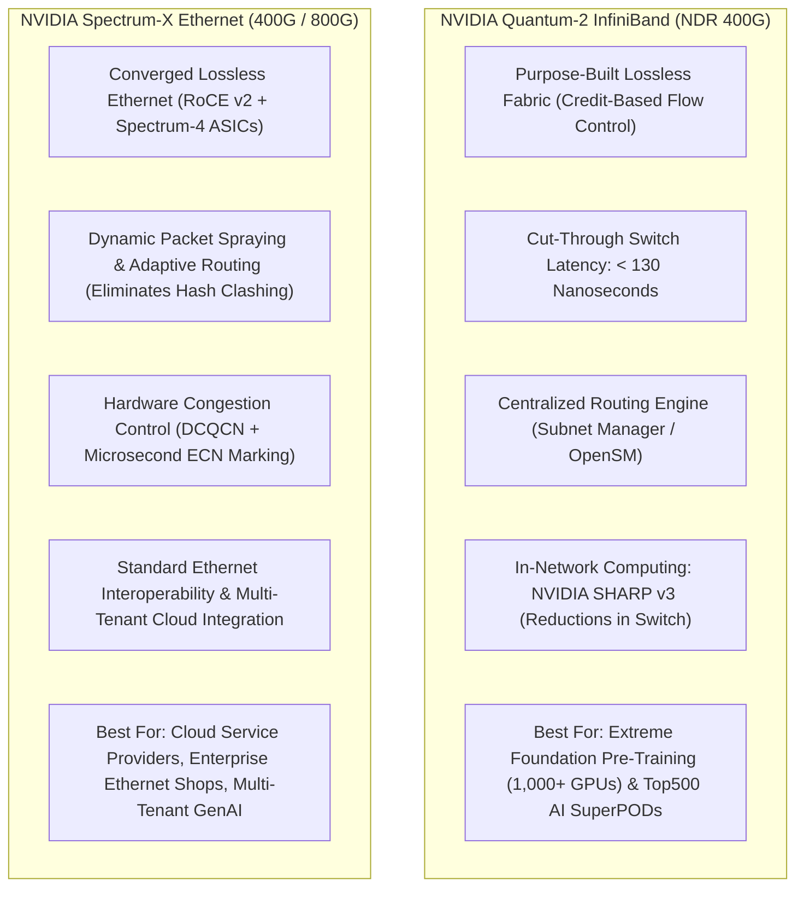

### Architectural Comparison

| Dimension | NVIDIA Quantum-2 InfiniBand | NVIDIA Spectrum-X Ethernet |
|---|---|---|
| **Port Speeds** | NDR 400 Gbps (Quantum-2) $\to$ XDR 800 Gbps (Quantum-X800) | 400 Gbps (Spectrum-4) $\to$ 800 Gbps (Spectrum-X800) |
| **Flow Control** | **Hardware Credit-Based**: Sender never transmits unless receiver has allocated buffer credits. Zero loss guaranteed natively. | **Lossless RoCE v2 via PFC (Priority Flow Control)**: Pause frames on Priority 3, managed by ConnectX-7 and Spectrum-4. |
| **Routing Mechanism** | Centralized Subnet Manager (OpenSM); deterministic source routing; hardware adaptive routing. | Dynamic **Packet Spraying** across all leaf-spine paths, reordered at receiver HCA in hardware. |
| **In-Network Computing** | **NVIDIA SHARP v3**: Switch ASICs perform FP16/FP8 vector reduction, cutting All-Reduce hops in half. | End-to-end host-based reductions; accelerated by ConnectX-7 hardware engines. |
| **Switch Latency** | $< 130$ nanoseconds (Cut-through switching). | $< 400$ nanoseconds (Cut-through Ethernet). |
| **Target Workload** | Dedicated supercomputers for LLM pre-training and scientific discovery. | Cloud-native multi-tenant AI factories, hyperscalers, enterprise data centers. |

---


### Advanced Production Considerations
When operating at scale, you must heavily monitor metrics like DCGM (Data Center GPU Manager) counters, Xid errors, and PCIe bandwidth saturation. In production, these parameters dictate your cluster's overall ROI. Ignoring PCIe topology, for instance, can lead to severe NCCL fallback, completely degrading multi-node training performance.
## 2. Multi-Rail Fat-Tree Fabric Architecture

In an 8-GPU **NVIDIA DGX H100**, each SXM5 GPU is paired directly with an independent **ConnectX-7 400 Gbps HCA** via PCIe Gen5 switches. To prevent traffic contention, DGX SuperPODs deploy an **8-Rail Fat-Tree Network**.

```mermaid
flowchart TD
    subgraph DGX_Node01["DGX Compute Node 01"]
        GPU0["GPU 0"] <--> HCA0["HCA 0"]
        GPU1["GPU 1"] <--> HCA1["HCA 1"]
        GPU7["GPU 7"] <--> HCA7["HCA 7"]
    end

    subgraph DGX_Node02["DGX Compute Node 02"]
        N2_GPU0["GPU 0"] <--> N2_HCA0["HCA 0"]
        N2_GPU1["GPU 1"] <--> N2_HCA1["HCA 1"]
        N2_GPU7["GPU 7"] <--> N2_HCA7["HCA 7"]
    end

    subgraph Rails["8 Independent Leaf Switch Rails (Non-Blocking)"]
        SW0["Leaf Switch Rail 0 (Switch Plane 0)"]
        SW1["Leaf Switch Rail 1 (Switch Plane 1)"]
        SW7["Leaf Switch Rail 7 (Switch Plane 7)"]
    end

    HCA0 <-->|400G OSFP| SW0
    N2_HCA0 <-->|400G OSFP| SW0

### Why Multi-Rail Eliminates Collective Contention
- GPU 0 on all nodes communicates strictly over **Rail 0** (Leaf Switch 0).
- GPU 1 on all nodes communicates strictly over **Rail 1** (Leaf Switch 1).
- **Zero Cross-Rail Contention:** During an All-Reduce collective, GPU 0 never competes for switch uplinks with GPU 1. Cross-GPU tensor aggregation within the node happens over ultra-high-speed **NVLink (900 GB/s)**, while inter-node transport scales across 8 parallel 400G network rails.

---


### Advanced Production Considerations
When operating at scale, you must heavily monitor metrics like DCGM (Data Center GPU Manager) counters, Xid errors, and PCIe bandwidth saturation. In production, these parameters dictate your cluster's overall ROI. Ignoring PCIe topology, for instance, can lead to severe NCCL fallback, completely degrading multi-node training performance.
## 3. GPUDirect RDMA and GPUDirect Storage Mechanics

Traditional network communication forces network packets to traverse host CPU memory:

```text
NIC  -->  Host PCIe  -->  CPU Memory (DRAM)  -->  Host PCIe  -->  GPU HBM
```

This CPU bounce-buffering adds microsecond latency, consumes CPU memory bandwidth, and introduces severe cache thrashing.

### The GPUDirect RDMA Direct Path

```text
ConnectX-7 HCA  <=== Direct PCIe Gen5 P2P DMA ===>  GPU HBM3 Memory
```

- **Mechanism:** The `nvidia-peermem` kernel module coordinates the PCIe address mapping between the Mellanox OFED InfiniBand driver and the NVIDIA GPU driver.
- The ConnectX-7 HCA issues direct 64-bit PCIe DMA read/write transactions into the GPU’s physical High Bandwidth Memory (HBM).
- **Result:** Latency drops from 15 microseconds to **under 1.5 microseconds**, and transfers achieve full 400 Gbps line-rate throughput without consuming a single host CPU cycle.

---


### Advanced Production Considerations
When operating at scale, you must heavily monitor metrics like DCGM (Data Center GPU Manager) counters, Xid errors, and PCIe bandwidth saturation. In production, these parameters dictate your cluster's overall ROI. Ignoring PCIe topology, for instance, can lead to severe NCCL fallback, completely degrading multi-node training performance.
## 4. Lossless Ethernet Engineering: PFC and ECN on Spectrum-X

Running RDMA over Ethernet (RoCE v2) requires turning a naturally lossy best-effort protocol into a **lossless deterministic fabric**.

```mermaid
flowchart LR
    subgraph Tx["Transmitting Host (ConnectX-7)"]
        TX_QUEUE["Egress Queue (Priority 3)"]
    end

    subgraph Switch["Spectrum-4 Ethernet Leaf Switch"]
        INGRESS_BUF["Ingress Buffer Pool"]
        ECN_MARK{"Buffer > ECN Threshold?"}
        PFC_CHECK{"Buffer > PFC Threshold?"}
    end

    subgraph Rx["Receiving Host (ConnectX-7)"]
        RX_BUF["Receive Buffer"]
    end

    TX_QUEUE -->|RoCE v2 Packets| INGRESS_BUF
    INGRESS_BUF --> ECN_MARK
    ECN_MARK -->|Yes: Mark CE bits in IP header| PFC_CHECK
    PFC_CHECK -->|Critical: Send PFC PAUSE frame back| Tx
    INGRESS_BUF --> RX_BUF
    RX_BUF -->|Sends CNP (Congestion Notification Packet)| Tx
    Tx -->|Throttles transmission rate before drops occur| TX_QUEUE
```

### The Two Control Loops of Lossless RoCE:
1. **Coarse Loop: Priority Flow Control (PFC - IEEE 802.1Qbb)**:
   - When switch ingress buffer thresholds are breached, the switch sends an 802.1Qbb **PFC PAUSE frame** upstream for Priority 3 traffic. The sending NIC pauses transmission on that queue until buffers drain.
   - *Failure Mode:* **PFC Deadlock.** If pause frames form a circular dependency across switches, all packet transmission halts. Prevented by strict buffer headroom calculation and dynamic watchdog timers (`pfc_deadlock_prevention = auto`).
2. **Fine Loop: Explicit Congestion Notification (ECN / DCQCN)**:
   - When buffer occupancy exceeds a configured threshold, the switch marks Congestion Experienced (`CE`) bits in the IP header of transit packets without dropping them.
   - The receiving HCA detects the CE mark and generates a **Congestion Notification Packet (CNP)** back to the sender. The transmitting ConnectX-7 throttles its rate in hardware, preventing PFC pause frames from firing in steady state.

---


### Advanced Production Considerations
When operating at scale, you must heavily monitor metrics like DCGM (Data Center GPU Manager) counters, Xid errors, and PCIe bandwidth saturation. In production, these parameters dictate your cluster's overall ROI. Ignoring PCIe topology, for instance, can lead to severe NCCL fallback, completely degrading multi-node training performance.
## 5. Senior Solutions Architect Interview Scenarios

### Scenario 1: InfiniBand vs. RoCE Architectural Decision for an Enterprise Customer
**Interviewer:** *"A customer's CTO tells you: 'Our networking team has 15 years of Cisco and Arista Ethernet experience. We don't know InfiniBand. Why shouldn't we just deploy our 512-GPU training cluster on standard 400G Ethernet?' How do you advise them?"*

**Candidate Answer:**
> "I advise them by framing the distinction between **Standard Enterprise Ethernet** and **NVIDIA Spectrum-X AI Ethernet vs. Quantum-2 InfiniBand**:
> 1. **The Flaw of Standard Enterprise Ethernet for AI:**
>    - Standard Ethernet relies on Equal-Cost Multi-Path (ECMP) hashing based on IP/Port tuples. In an All-Reduce collective with heavy elephant flows, ECMP causes **hash collisions**—multiple 400G flows are mapped to the same spine uplink while other uplinks sit idle, causing severe buffer drops.
>    - Standard TCP retransmissions take milliseconds, stalling gang-scheduled GPU training loops. Standard Ethernet is simply not viable for large-scale foundation pre-training.
> 2. **Comparing the Viable Solutions:**
>    - **Option A: NVIDIA Quantum-2 InfiniBand (The Gold Standard):** If time-to-market, zero packet loss, and peak training efficiency are the top priorities, InfiniBand is the proven industry path. It offers cut-through latency (< 130ns), hardware credit-based flow control, centralized Subnet Management, and in-network reduction (SHARP v3).
>    - **Option B: NVIDIA Spectrum-X (The Cloud Ethernet Path):** If corporate governance strictly mandates Ethernet, we deploy Spectrum-X with Spectrum-4 switches and ConnectX-7 HCAs. Spectrum-X solves standard Ethernet flaws through **hardware dynamic packet spraying** (scattering packets across all uplinks to eliminate hash collisions) and microsecond-level hardware DCQCN congestion control.
> 3. **The Executive Recommendation:**
>    If the customer deploys Spectrum-X, their Ethernet team retains familiar operational tooling while achieving near-InfiniBand training efficiency. However, deploying generic commodity Ethernet switches will result in catastrophic training slowdowns."

---

### Scenario 2: Diagnosing a "Network Is Slowing Training" Incident
**Interviewer:** *"A customer submits a ticket: 'Our 32-node training run is 30% slower than expected. We think your InfiniBand fabric is defective.' How do you prove whether the network is actually the culprit?"*

**Candidate Answer:**
> "I follow the **PBCTC methodology (Phase, Bench, Counters, Topology, Correlate)**:
> 1. **Phase Isolation:** Before touching fabric counters, I review the PyTorch profiler or PyTorch Lightning logs. I verify whether the 30% regression is in the **GPU compute phase**, **dataloader I/O phase**, or **collective communication phase (`ncclKernel_AllReduce`)**. If collective time is normal and dataloader time spiked, the issue is storage, not the network.
> 2. **Isolated Network Benchmark:** I execute `nccl-tests` (`all_reduce_perf`) across the allocated 32 nodes outside of their application code.
>    - If `all_reduce_perf` achieves full 400G bus bandwidth (~380 GB/s), the InfiniBand fabric is completely healthy, proving the regression is an application-level bottleneck (e.g., small batch sizes or CPU thread starvation).
> 3. **Query Physical Link Counters:** If `all_reduce_perf` is slow, I query InfiniBand error counters across all 256 HCA ports:
>    `ibqueryerrors -s SymbolErrors,LinkDowned,PortXmitWait`
>    - **High `SymbolErrors`:** Indicates a dirty optical transceiver or loose MPO fiber cable.
>    - **High `PortXmitWait`:** Indicates downstream congestion or a slow rank causing credit starvations.
> 4. **Isolate and Re-test:** I drain the node displaying symbol errors, replace it with a spare, and re-run the benchmark to confirm full line-rate performance."

---


1. **InfiniBand vs. Spectrum-X:** Quantum-2 InfiniBand provides native credit-based lossless transport and in-network computing (SHARP); Spectrum-X delivers near-InfiniBand efficiency over Ethernet via hardware packet spraying and microsecond DCQCN.
2. **Multi-Rail Topologies Prevent Contention:** DGX SuperPODs map 8 HCAs 1:1 to 8 independent leaf switch rails, eliminating cross-GPU link contention during distributed collectives.
3. **GPUDirect RDMA is Essential:** Direct PCIe Gen5 P2P DMA between ConnectX-7 and GPU HBM bypasses CPU DRAM bounce buffers, dropping transfer latency from 15 microseconds to $< 1.5$ microseconds.
4. **Standard Ethernet Fails for AI:** ECMP hash collisions and lossy retransmissions destroy collective step times; Lossless RoCE v2 mandates Priority Flow Control (PFC) on Priority 3 and tuned ECN marking.
5. **Always Prove the Phase First:** Never debug network error counters until application profilers confirm that the collective communication phase is the actual bottleneck.
---
title: "Chapter 11 - Question bank: foundations to SA depth"
slug: "chapter-11-question-bank-foundations-to-sa-depth"
sidebar_position: 11
description: "Chapter 11 - Question bank: foundations to SA depth — JR2018680 Interview Preparation."
source_document: "Volume_09_JR2018680_Interview_Preparation(2).docx"
---
> Learning outcome Use after studying the corresponding volumes; answer aloud and force one evidence/trade-off follow-up.

| Domain | Question |
| --- | --- |
| Python | Why is a set a better choice than a list for repeated membership checks? |
| Python | Design a retry policy for a POST API. What changes if the operation is not idempotent? |
| Linux | Why can load average be high while CPU is low? |
| Linux | Container OOMKilled with node memory available—explain. |
| Networking | DNS resolves but TCP connect times out. What does each next test prove? |
| Kubernetes | Deployment exists but no Pods—where can reconciliation have stopped? |
| Kubernetes | Why can an idle node be unschedulable? |
| Kubernetes | Explain HPA and cluster autoscaler as two loops. |
| GPU | Driver works but Kubernetes has no GPU resource—trace layers. |
| GPU | MIG versus time slicing for production inference. |
| AI | What makes TTFT different from tokens/s as a capacity signal? |
| AI | Why can GPU utilization be a poor HPA trigger? |
| HPC | RoCE versus InfiniBand from an architecture perspective. |
| HPC | How do you isolate NCCL/network versus storage slowdown? |
| Observability | Which metric/log/trace evidence do you want for rising P99 latency? |
| SA | Kubernetes or Slurm? Ask five questions before answering. |
| SA | How would you design a PoC for a new GPU platform? |
| Customer | Explain GPU sharing to a CTO versus an SRE. |


### Advanced Production Considerations
When operating at scale, you must heavily monitor metrics like DCGM (Data Center GPU Manager) counters, Xid errors, and PCIe bandwidth saturation. In production, these parameters dictate your cluster's overall ROI. Ignoring PCIe topology, for instance, can lead to severe NCCL fallback, completely degrading multi-node training performance.
## ➕ Additions

➕ **How to drill this bank (the mechanic, not just the list):** for each question, answer aloud with a 2-minute limit, in the C-M-H-E-R shape from Chapter 1, then force yourself to add one sentence naming the evidence that would distinguish your top hypothesis from your second one. If you can't name that sentence, you don't know the topic as deeply as the answer implied — go back to the source chapter.

➕ **Diagram: the drill loop for this question bank**
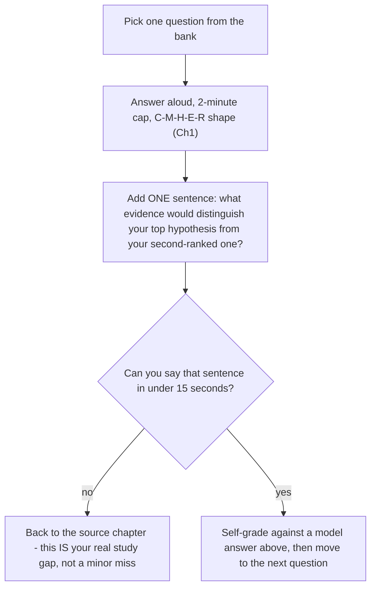
Run every row in this bank through this loop once before assuming you "know" the bank — the loop, not the answer key, is what the drill is actually training.

➕ **Model answers for a sample of the original bank's hardest rows (to calibrate what "good" sounds like against this specific bank — not exhaustive, use for calibration then self-grade the rest):**

**"Why can load average be high while CPU is low?"**
> Load average counts runnable tasks *and* tasks in uninterruptible sleep (D-state) — it is queue pressure, not a CPU percentage. A box with 40 processes blocked on slow storage or NFS shows load 40 with CPU sitting idle, because none of those 40 are consuming CPU cycles — they're waiting on I/O completion. Evidence that distinguishes this from a scheduling problem: `vmstat`'s `b` column (blocked count) high while `r` (runnable) is low, and `/proc/&lt;pid&gt;/wchan` naming the specific kernel wait function for the blocked processes.

**"Driver works but Kubernetes has no GPU resource — trace layers."**
> Layer order: host driver (confirm with `nvidia-smi` on the host, outside any container) → NVIDIA Container Toolkit (confirms containers can see the GPU via the runtime hook) → GPU Operator operand pods (device plugin, DCGM exporter, etc. — check they're `Running`, not `CrashLoopBackOff`) → device plugin reporting `nvidia.com/gpu` as allocatable to kubelet → scheduler seeing that allocatable. "Driver works" only confirms the first link; a broken toolkit version match or a crashing device plugin anywhere downstream leaves Kubernetes with zero visibility into a perfectly healthy GPU.

**"Why can GPU utilization be a poor HPA trigger?"**
> GPU utilization (SM busy %) can be 100% while doing low-value work — e.g., a badly-batched inference server can show 100% util with poor tokens/s, or a memory-bandwidth-bound decode phase shows moderate util while genuinely saturated on a different resource. Scaling on util alone can both under-scale (util looks fine, but queue depth/TTFT is climbing because of a KV-cache or batching bottleneck util doesn't capture) and over-scale (a transient util spike from a single large-batch request triggers a scale-up that isn't needed). Queue depth, TTFT/ITL, and request concurrency are better proxies for actual capacity pressure in an LLM-serving context.

➕ **New questions with full model answers — additive question bank content (this is the volume's "bank" chapter, so additive volume matters most here):**

**1. (Python) "You need to deduplicate 10 million log lines while preserving first-seen order. What's your approach and its memory cost?"**
> Use a `dict` (or `set` alongside a list) to track seen lines while iterating once — `dict`/`set` membership is O(1) average, so the whole pass is O(n) time. Memory cost is the real discussion: worst case (no duplicates) stores all 10M lines' hash/reference in the set, which at even modest per-line size could be gigabytes — worth naming explicitly rather than assuming memory is free. If lines are long, storing a hash (e.g. first store `hash(line)` in the seen-set instead of the line itself, accepting a vanishingly small collision risk) trades a small correctness risk for materially lower memory. If exact correctness matters (e.g. financial/audit logs), don't take that shortcut — state the trade-off rather than silently picking one side.

**2. (Linux) "A systemd service keeps restarting every 90 seconds indefinitely. What does that cadence itself tell you, before reading any logs?"**
> A perfectly regular restart interval (not accelerating, not backing off) suggests `systemd`'s `RestartSec` is fixed and the failure is deterministic and fast — the service crashes almost immediately every time, not after some variable runtime. This already narrows away "resource exhaustion that builds up over time" (which would show a lengthening or shortening interval) in favor of "immediate startup failure" — bad config, missing dependency, port already bound, or a crash in initialization code. The cadence is a free clue before you've read a single log line.

**3. (Kubernetes) "A StatefulSet Pod is stuck Terminating for 10+ minutes. What's actually happening, and what's the risk of `--force` deleting it?"**
> The kubelet is waiting for the container to exit gracefully within `terminationGracePeriodSeconds` after sending SIGTERM; a Pod stuck this long usually means the process isn't handling SIGTERM (e.g., PID 1 ignoring signals, or a slow/stuck shutdown hook) and the kubelet is waiting out the full grace period, or the grace period itself is unusually long. The risk of `--force` deleting: for a StatefulSet specifically, this removes the Pod object from the API server *without confirming the container has actually stopped* — if it's a stateful workload (e.g. writing to a PV), you can end up with two instances (old container still running somewhere, new one starting with the same identity/volume) corrupting shared state. This is exactly why StatefulSet Pods should never be force-deleted without independently confirming (e.g. via the node) that the process has actually exited.

**4. (GPU/AI) "A customer asks: 'Can we just give every Pod a fractional GPU with time-slicing so nothing ever waits for a full GPU?' What's the pushback?"**
> Time-slicing shares the whole GPU's memory space — there's no memory isolation between time-sliced workloads, so one tenant's memory-hungry request can OOM another tenant's process on the same physical GPU, and there's no compute isolation either, so latency-sensitive tenants inherit whatever jitter the noisiest co-located tenant creates. "Nothing ever waits for a full GPU" is true in the trivial sense that scheduling is instant, but it trades that for unpredictable per-request latency and a real cross-tenant memory-safety risk — the pushback is naming that trade explicitly and asking whether the workloads are latency-sensitive/multi-tenant-sensitive enough that MIG's hard isolation (at the cost of fixed partition granularity) is worth it instead.

**5. (HPC/Networking) "Two nodes in the same rack show identical `ibstat` output (both Active, both rated 200Gb/s), yet nccl-tests between just those two nodes underperforms nodes elsewhere in the fleet by 40%. What do you check next?"**
> `ibstat` only reports link state and negotiated rate — it says nothing about actual achieved bandwidth or the presence of retransmission/congestion. Next checks: `ibqueryerrors` for error counters possibly accumulating between exactly this pair (not fleet-wide — this needs a targeted pairwise check); the fabric topology/routing between these two specific nodes — if they're not on the same leaf switch and the path crosses a congested spine link, aggregate fleet health won't show it but this specific pair pays for it; and whether adaptive routing / static routing is misconfigured, causing this pair's traffic to take a suboptimal path even though both endpoints individually look healthy.

**6. (SA/Customer) "A customer's procurement team asks you to 'just confirm NVIDIA's GPUs are faster than the competitor's' in a single sentence for a slide. How do you respond without either refusing or giving a hollow marketing line?"**
> "Faster" isn't well-defined without a workload — training throughput, inference latency, and memory-bandwidth-bound workloads can rank hardware differently. The honest single sentence: "the right comparison is a benchmark on your actual model/workload, and I can help design that PoC rather than quote a spec-sheet number that may not reflect your traffic pattern." This is the same benchmark-derived-capacity principle from Chapter 6 and the PoC-validation principle from Chapter 8, applied to a procurement-pressure scenario — naming that connection is itself worth doing out loud if asked why you're pushing back.

**7. (Observability) "P99 latency for an inference service rose from 200ms to 900ms over 3 days, no deploys, no alerts fired. What's your evidence-gathering order?"**
> First, confirm it's genuinely P99 and not a metric artifact (check request volume didn't drop — P99 on low sample counts is noisy). Then correlate the rise's shape: sudden step vs gradual creep — gradual over 3 days with no deploy suggests a resource creep (memory fragmentation, KV-cache growth, a slow leak) rather than a discrete cause. Pull GPU metrics (util, memory, `cpu.stat` throttling per Chapter 1's Volume-1-style reasoning) time-series over the same 3 days, and check whether traffic mix shifted (longer prompts, different model routing) rather than assuming infrastructure regressed. "No alerts fired" is itself a finding — it means your alerting thresholds/coverage have a gap worth fixing regardless of the root cause found.


### Advanced Production Considerations
When operating at scale, you must heavily monitor metrics like DCGM (Data Center GPU Manager) counters, Xid errors, and PCIe bandwidth saturation. In production, these parameters dictate your cluster's overall ROI. Ignoring PCIe topology, for instance, can lead to severe NCCL fallback, completely degrading multi-node training performance.
## Practice
➕ 19. Pick five questions from this bank you haven't verbally rehearsed yet, and for each, write the ONE sentence of evidence that would distinguish your top hypothesis from your second-ranked one — if you can't write that sentence in under 15 seconds, that's your study gap.
➕ 20. Take new question 4 above (fractional GPU time-slicing) and argue the OPPOSITE side out loud for 60 seconds — i.e., make the strongest honest case FOR time-slicing-everywhere — this drill (steelmanning the position you'd normally push back on) is what separates "I memorized a pushback" from "I understand the actual trade-off."
---
title: "Question set B — Python coding and production automation"
slug: "question-set-b-python-coding-and-production-automation"
sidebar_position: 15
description: "Question set B — Python coding and production automation — JR2018680 Interview Preparation."
source_document: "Volume_09_JR2018680_Interview_Preparation(2).docx"
---
Practice coding in small increments. State the data structure before code, make parsing and policy pure, then add effects. Typical tasks: parse multi-format logs, aggregate errors by service/node, implement bounded retry, query many endpoints concurrently, compare desired/actual state, build a CLI and test it.

**Practice explaining complexity, malformed input and memory strategy**

```python
# Interview task skeleton: summarize failures by node and error type
from collections import Counter, defaultdict
import re

PATTERN = re.compile(
    r"^(?P<ts>\S+)\s+(?P<node>\S+)\s+"
    r"(?P<level>ERROR|CRITICAL|FATAL)\s+(?P<msg>.+)$"
)

def summarize(lines: list[str]) -> dict[str, Counter[str]]:
    result: dict[str, Counter[str]] = defaultdict(Counter)
    for line in lines:
        m = PATTERN.match(line.strip())
        if not m:
            continue
        # In a real problem, classify msg into stable error categories.
        result[m['node']][m['level']] += 1
    return dict(result)
```


➕ **Diagram: the increment ladder this question set expects (say the shape before typing anything):**
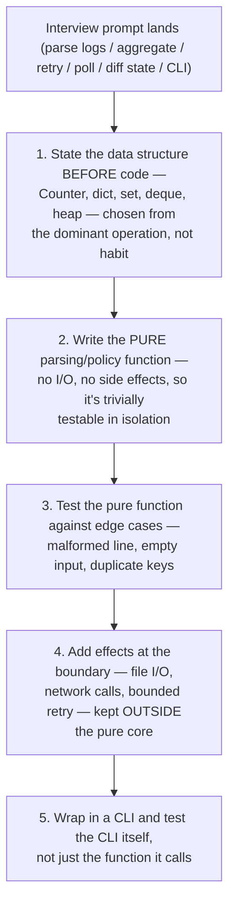
The recurring mistake this diagram guards against: mixing parsing/policy logic with I/O/effects from the first line, which makes the core untestable and the interviewer unable to see your algorithm separately from your plumbing.
---
title: "Question set E — AI inference architecture"
slug: "question-set-e-ai-inference-architecture"
sidebar_position: 18
description: "Question set E — AI inference architecture — JR2018680 Interview Preparation."
source_document: "Volume_09_JR2018680_Interview_Preparation(2).docx"
---
| Prompt | Expected reasoning |
| --- | --- |
| TTFT high, ITL normal | queue/prefill/input length/model load/cache routing |
| ITL high under concurrency | decode/KV/memory pressure/batching |
| When disaggregate prefill/decode? | different resource shapes + fast KV transfer + measured benefit |
| Round-robin vs KV-aware routing | cache reuse/load balance/worker state/failure complexity |
| Scale on what metric? | queue/tokens/SLO/engine state, warmup/model load, GPU scarcity |


➕ **Diagram: inference-latency symptom router (which subsystem a complaint actually points at):**
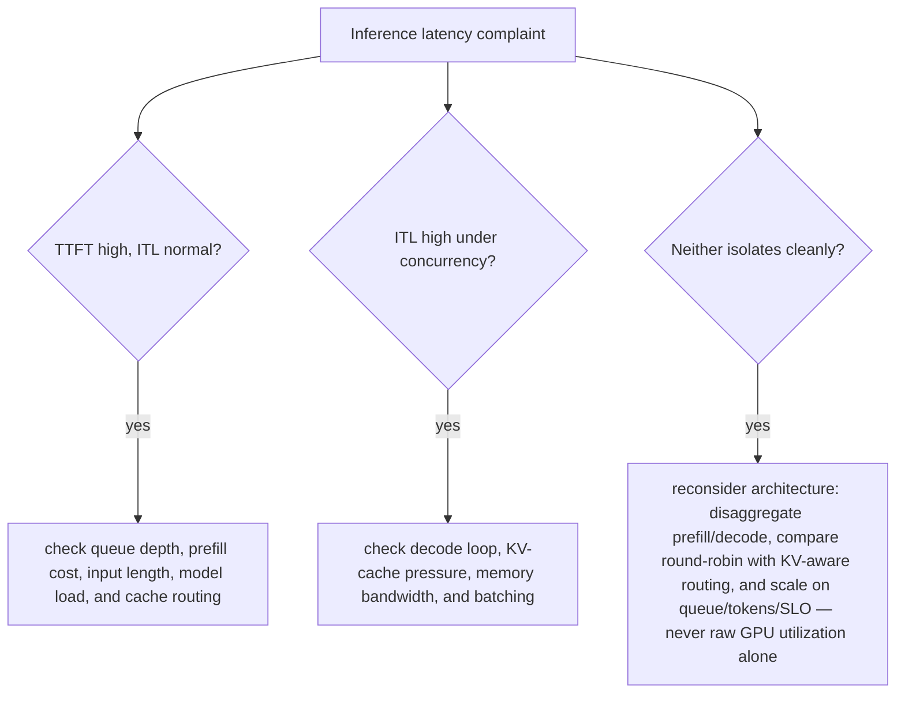
"The response feels slow" collapses two very different subsystems into one user complaint — TTFT and ITL point at prefill/queue and decode/batching respectively, and the fix for one rarely helps the other.

➕ **Sample annotated output — diagnosing "ITL high under concurrency" with real engine metrics (vLLM-style):**
```bash
$ curl -s localhost:8000/metrics | grep -E 'num_requests_running|gpu_cache_usage|time_per_output_token'
vllm:num_requests_running 24
vllm:gpu_cache_usage_perc 0.97 ← KV cache is nearly full
vllm:time_per_output_token_seconds_sum 184.2
vllm:time_per_output_token_seconds_count 9200
```
`gpu_cache_usage_perc=0.97` is the smoking gun: the KV cache is nearly exhausted, which forces the scheduler into smaller batches or preemption/swap to make room — that's exactly what inflates per-token decode latency under concurrency, independent of raw GPU compute headroom. **Interview-ready line:** "ITL degrading under load is usually a KV-cache-capacity story before it's a compute-capacity story — check `gpu_cache_usage` before assuming you need more GPUs."

➕ **Extra worked scenario (new) — "when to disaggregate prefill/decode," made concrete with numbers:**
> **Situation:** A 70B-parameter model serving long-context RAG requests (avg 6,000 input tokens, avg 200 output tokens) shows highly variable TTFT (200ms-4s) even at moderate load.
> 1. Clarify: is variability correlated with input length, or independent of it? (Long-context prefill is itself compute-heavy and can co-locate badly with decode-phase requests competing for the same GPU.)
> 2. Model: on a single-engine (non-disaggregated) server, a long prefill request occupies the GPU compute path in a way that can stall in-flight decode-phase requests behind it — this is the mechanism, not just "it's busy."
> 3. Hypothesize: prefill-heavy traffic mix (6,000 input : 200 output ratio is prefill-dominated) is a strong candidate for disaggregating prefill onto separate GPU pool(s) from decode, so long prefills stop stalling other requests' decode steps.
> 4. Evidence needed: measure whether TTFT variance correlates specifically with concurrent long-prefill requests in the trace, and benchmark disaggregated vs monolithic serving on the actual input distribution — the KV-cache transfer cost between prefill and decode workers (over NVLink/RDMA) has to be fast enough not to eat the benefit.
> 5. Recommend: only adopt disaggregation after the benchmark shows the transfer overhead is smaller than the stalling it removes — for short-context, decode-dominated workloads, disaggregation is usually not worth the added operational complexity (two pools, KV transfer infra, more failure modes).
> **Interview-ready line:** "Disaggregating prefill and decode is a real technique with a real cost — extra hop, extra infra, extra failure surface — so I'd only recommend it once a benchmark shows the stalling problem outweighs the KV-transfer cost, not by default."
---
title: "Question set F — Customer architecture and PoC"
slug: "question-set-f-customer-architecture-and-poc"
sidebar_position: 19
description: "Question set F — Customer architecture and PoC — JR2018680 Interview Preparation."
source_document: "Volume_09_JR2018680_Interview_Preparation(2).docx"
---
**•** A customer wants 32 H100-class GPUs for "an LLM platform". What workload facts do you request before sizing?

**•** The customer mandates Kubernetes but training team wants Slurm. Design an operating model that avoids two schedulers fighting for the same nodes.

**•** Storage vendor claims 200 GB/s. Design a PoC that proves whether training GPUs will stay fed during checkpointing.

**•** Security disallows privileged workloads. Explain why GPU node enablement may require elevated host access and propose governance/isolation options.

**•** The customer wants maximum GPU utilization and strict p99 latency. Explain the inherent tension and the experiments needed to choose a sharing model.


➕ **Diagram: the GPU-sizing discovery funnel (never size from a GPU count alone):**
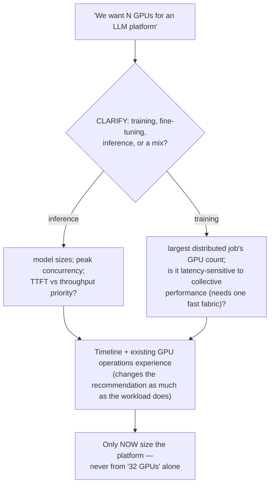

➕ **Annotated sample discovery transcript — "we need 32 H100-class GPUs for an LLM platform," narrated with WHY each question is asked:**

> **Customer:** "We want to buy 32 H100-class GPUs for an LLM platform."
>
> **Candidate:** "Happy to help size that — a few questions first. Is this for training, fine-tuning, inference, or a mix?" *(← this single question can change the entire architecture — training and inference have almost opposite topology/scheduling needs, per Chapter 8)*
>
> "If inference: what model sizes, and what's your expected peak concurrency and target latency — is TTFT or throughput the priority?" *(← ties directly to Chapter 6's capacity formula; without this, "32 GPUs" is not a number anyone can validate)*
>
> "If training: what's your largest single distributed job's GPU count, and is that job latency-sensitive to collective performance — i.e., do you need those GPUs on one fast fabric, or can they be spread across less-connected nodes?" *(← ties to Chapter 5/7's topology reasoning — this determines whether 32 GPUs is even a valid unit, or needs to be a specific topology shape)*
>
> "And separately from workload: what's your timeline, and do you have existing GPU operations experience, or is this the first GPU platform your team will run day-to-day?" *(← the "current state" and "constraints" funnel stages — operational readiness changes the recommendation as much as the workload does)*
>
> **Why this works:** every question is traceable to a specific downstream architecture decision from an earlier chapter in this volume — this is what makes discovery "consultative" instead of a generic intake form; a senior SA asks questions because the answer changes what they'd design, not to seem thorough.

➕ **Extra worked scenario (new) — "customer wants maximum GPU utilization AND strict p99 latency," fully talked through:**
> **Situation:** A customer states both goals in the same sentence, expecting both to be fully satisfied.
> 1. **Name the tension explicitly, out loud, first:** "Those two goals pull in opposite directions — maximizing utilization generally means packing more concurrent work onto each GPU (bigger batches, more co-located requests), and that's exactly what increases p99 latency variance, because now some requests wait behind others' batches. I want to be upfront that this is a real tradeoff, not something I can architect away entirely."
> 2. **Ask which one has a harder constraint:** is p99 latency an actual contractual SLA, or an internal target with some flexibility? Is "maximum utilization" a cost target, or a literal operational goal?
> 3. **Propose the experiment, not a guess:** "I'd run a PoC sweeping batch size / concurrency / sharing granularity (full GPU vs MIG vs time-slicing) and plot achieved utilization against measured p99 at each point — that curve is the actual answer, and it lets you pick a point on it deliberately instead of us guessing."
> 4. **State the likely shape of the answer, to show judgment even before the PoC:** "My expectation, to be validated: MIG or dedicated-per-tenant GPUs will hold p99 much more predictably at the cost of some idle capacity; time-slicing or dynamic batching will raise utilization but with fatter latency tails under load spikes. The PoC tells us where on that curve your specific workload lands, and whether the tradeoff is even as sharp as I'm describing for your traffic pattern."
> **Interview-ready line:** "I'd rather tell a customer the tradeoff exists and offer to measure it than pretend an architecture can make both goals free — that's the sentence that actually builds trust in this kind of conversation."


### Advanced Production Considerations
When operating at scale, you must heavily monitor metrics like DCGM (Data Center GPU Manager) counters, Xid errors, and PCIe bandwidth saturation. In production, these parameters dictate your cluster's overall ROI. Ignoring PCIe topology, for instance, can lead to severe NCCL fallback, completely degrading multi-node training performance.
## Practice
➕ 6. Take the "customer mandates Kubernetes but training team wants Slurm" prompt from Question set F and run the full BWCCRD funnel on it live, narrating which funnel stage surfaces the real constraint driving the mandate (hint: it's rarely a technical reason at the "Business outcome" stage — dig for it).
➕ 7. Write your own one-sentence version of the "name the tension explicitly" move from the worked scenario above, applied to a different competing-goals customer statement of your choosing (e.g., "we want on-prem control AND cloud elasticity") — practice saying the tradeoff out loud before proposing anything.
---
title: "Question set G — Whiteboard: production GenAI platform"
slug: "question-set-g-whiteboard-production-genai-platform"
sidebar_position: 20
description: "Question set G — Whiteboard: production GenAI platform — JR2018680 Interview Preparation."
source_document: "Volume_09_JR2018680_Interview_Preparation(2).docx"
---
Whiteboard from requirements outward: client/gateway -> auth/rate limits -> model routing -> serving runtime -> GPU scheduling -> compute topology -> network/storage -> observability -> lifecycle/CI/CD -> failure domains. Ask about model count, prompt/output distribution, concurrency, data residency, availability and cost. Then choose components. A diagram that begins with "NIM" or "Kubernetes" before requirements is backwards.


➕ **Diagram: this question set's build order in box form (draw left to right, live, in this sequence):**
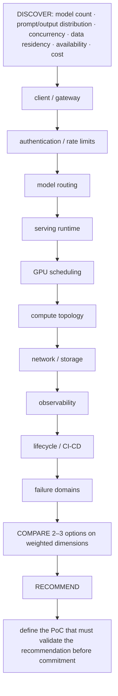
A diagram that starts with "NIM" or "Kubernetes" instead of the DISCOVER row above is exactly the anti-pattern this question set warns against.

➕ **Extra worked scenario (new) — the whiteboard method applied to Question set G's production GenAI platform, end-to-end:**
> **Prompt:** "Whiteboard a production GenAI platform serving 3 different model sizes to external customers."
> 1. **Discover:** how many distinct models, expected prompt/output token distribution per model, expected concurrency, any data residency requirement (customer data must stay in-region?), required availability (single-region ok, or multi-region failover?), cost sensitivity.
> 2. **Draw left to right:** client → API gateway (auth, per-customer rate limits) → model router (which model does this request need — by explicit selection or classification) → serving runtime (NIM/Triton/vLLM per model, chosen only now, after the shape is clear) → GPU scheduling layer (Kubernetes with device plugin/MIG, sized per Chapter 6's formula) → compute topology (does the largest model need multi-GPU tensor parallelism, hence NVLink locality) → network/storage (model weight storage/loading path, KV-cache/session state if any) → observability (per-model TTFT/ITL dashboards, GPU util/Xid alerting) → lifecycle/CI-CD (model version rollout without downtime — canary a new model version behind the router) → failure domains (one model's GPU pool failing shouldn't take down the other two).
> 3. **Compare options** on 2-3 weighted dimensions relevant to what discovery revealed — e.g., if data residency is strict, self-hosted NIM/Triton beats a hosted API regardless of other factors; state that dimension as the deciding one explicitly.
> 4. **Recommend + validate:** name the recommendation, then state the PoC: load-test each model's serving path independently at expected peak concurrency, and validate the router's failure isolation by deliberately failing one model's pool and confirming the other two are unaffected.
> **Interview-ready line:** "The requirements determine whether this ends up being three separate small deployments or one shared router in front of a multi-model serving layer — I wouldn't draw the router box until I know whether these models actually need to share infrastructure or just share a brand."
---
title: "Question set H — Behavioral stories for a senior SA"
slug: "question-set-h-behavioral-stories-for-a-senior-sa"
sidebar_position: 21
description: "Question set H — Behavioral stories for a senior SA — JR2018680 Interview Preparation."
source_document: "Volume_09_JR2018680_Interview_Preparation(2).docx"
---
Prepare evidence-rich stories around: a production incident where you reduced uncertainty; a design where you rejected a fashionable technology; a disagreement with an application/customer team; a cost optimization that preserved reliability; an automation that replaced manual toil; a migration with risk control; and a situation where you explained a complex system to a non-specialist stakeholder. Use situation/context briefly, spend most time on decisions, trade-offs and measurable outcome.


➕ **Diagram: advisory-vs-autonomous, the reusable decision for any "automation that replaced manual toil" story:**
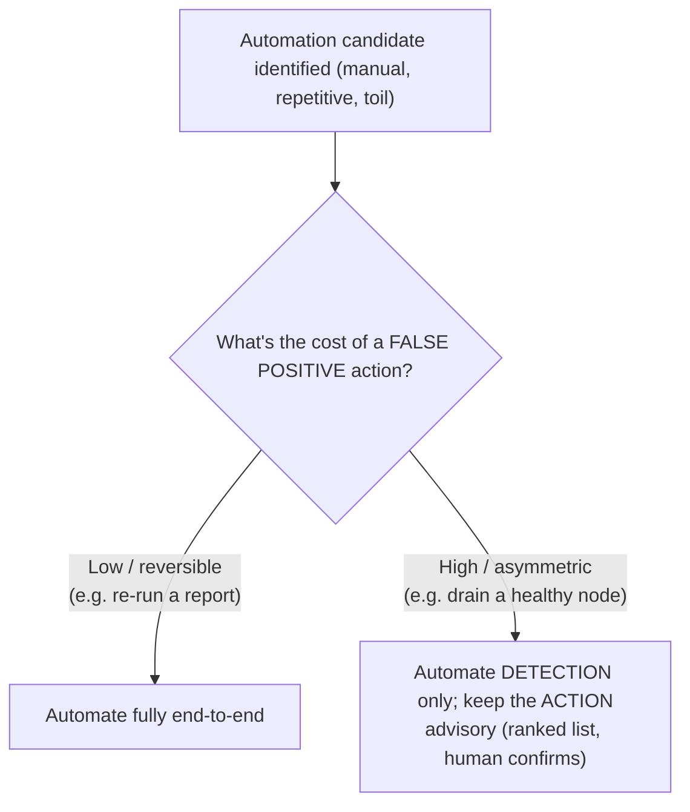
This is the judgment call worth naming explicitly in a behavioral story — choosing a less-automated option deliberately, because the failure cost is asymmetric, reads as more senior than "I automated it."

➕ **Extra worked story sketch (new) — filling a gap the original theme table doesn't explicitly cover: "an automation that replaced manual toil" (named in Question set H but with no worked example anywhere in the source):**
> **Situation/Task:** Weekly GPU node health checks (driver version drift, Xid history, ECC error trend) were done manually by whoever was on-call, taking ~3 hours and frequently skipped under load.
> **Action:** I wrote a scheduled job that pulled `nvidia-smi`/DCGM data fleet-wide, classified nodes using thresholds derived from Chapter 5's Xid-severity distinctions (hardware-likely vs software-recoverable), and posted a ranked drain-candidate list to the team channel automatically. The key decision was making it advisory (post a ranked list) rather than fully automated draining — I explicitly chose not to auto-drain nodes because a false positive draining a healthy node under load has a worse blast radius than a 10-minute delay for a human to confirm.
> **Result:** Manual check time went from ~3 hours/week to ~15 minutes of review, and mean time to detect a degrading GPU node dropped from "next scheduled manual check" (up to a week) to under an hour.
> **Interview-ready line:** "The judgment call worth highlighting isn't the automation itself, it's choosing advisory-not-autonomous action for anything with an asymmetric failure cost — that's usually the more senior decision than 'I automated it.'"


### Advanced Production Considerations
When operating at scale, you must heavily monitor metrics like DCGM (Data Center GPU Manager) counters, Xid errors, and PCIe bandwidth saturation. In production, these parameters dictate your cluster's overall ROI. Ignoring PCIe topology, for instance, can lead to severe NCCL fallback, completely degrading multi-node training performance.
## Practice
➕ 4. Draft your own "automation that replaced manual toil" story using the sketch above as a template — specifically identify one decision in your story where you chose a *less* automated / *less* aggressive option deliberately, and be ready to explain why.

## Appendix A: Detailed NVIDIA AI Factory Operations Glossary

1. **GPUDirect RDMA**: A technology that enables a direct path for data exchange between the GPU and a third-party peer device using standard features of PCI Express.
2. **NVLink**: A high-speed, direct GPU-to-GPU interconnect that provides significantly higher bandwidth than traditional PCIe.
3. **NVSwitch**: A chip that allows multiple NVLinks to be connected together, enabling all-to-all communication between GPUs within a single node or across nodes (in NVLink Network).
4. **DCGM (Data Center GPU Manager)**: A suite of tools for managing and monitoring NVIDIA GPUs in cluster environments.
5. **MIG (Multi-Instance GPU)**: A feature that allows a single A100/H100 GPU to be partitioned into multiple smaller, isolated GPU instances.
6. **NCCL (NVIDIA Collective Communications Library)**: A library of standard collective communication routines (like all-gather, reduce, broadcast) optimized for NVIDIA GPUs.
7. **Triton Inference Server**: An open-source inference serving software that streamlines AI inferencing by supporting multiple frameworks.
8. **InfiniBand**: A computer networking communications standard used in high-performance computing that features very high throughput and very low latency.
9. **RoCE (RDMA over Converged Ethernet)**: A network protocol that allows remote direct memory access (RDMA) over an Ethernet network.
10. **RDMA (Remote Direct Memory Access)**: Direct memory access from the memory of one computer into that of another without involving either one's operating system.
11. **TensorRT**: A machine learning framework that optimizes neural networks for inference on NVIDIA GPUs.
12. **Xid Errors**: NVIDIA driver error codes that indicate various types of hardware or software issues.
13. **CUDA Streams**: A sequence of operations that execute in issue-order on the GPU.
14. **GDRCopy**: A low-latency GPU memory copy library based on GPUDirect RDMA.
15. **UFM (Unified Fabric Manager)**: NVIDIA's InfiniBand management software.

:::tip Continuous Learning
The AI Infrastructure landscape evolves rapidly. Always consult the official NVIDIA documentation for the most up-to-date specifications, support matrices, and best practices.
:::

## Appendix B: Example Troubleshooting Playbook

### Scenario: Pod Stuck in Pending (Insufficient GPUs)
1. **Check Pod Events**: `kubectl describe pod <pod-name>`
2. **Check Node Capacity**: `kubectl get nodes -o yaml | grep -i nvidia.com/gpu`
3. **Check Device Plugin**: Ensure `nvidia-device-plugin` DaemonSet is running.
4. **Check Node Allocatable**: Are GPUs allocatable or are there pending taints?

### Scenario: NCCL Timeout during Training
1. **Check Network Connectivity**: Run `ib_write_bw` or `qperf` between nodes.
2. **Verify NCCL Topology**: Set `NCCL_DEBUG=INFO` to inspect how NCCL detects the topology.
3. **Check Fabric Logs**: Inspect Subnet Manager (SM) logs for port flapping.
4. **Review GPU PCIe Tree**: Ensure GPUs are not falling back to QPI/UPI or host CPU for communication.


### Deep Dive: Analyzing GPU Memory Bottlenecks

In many deep learning workloads, memory bandwidth—rather than raw compute (TFLOPS)—becomes the primary bottleneck. This is commonly referred to as being "memory-bound." 

#### Identifying Memory-Bound Workloads
When profiling with tools like Nsight Systems or Nsight Compute, look for high DRAM utilization coupled with relatively low SM (Streaming Multiprocessor) utilization. If your arithmetic intensity (FLOPs per byte of memory accessed) is low, you will likely hit the memory wall.

#### Strategies for Mitigation
1. **Kernel Fusion**: Combining multiple small operations into a single custom CUDA kernel to prevent intermediate results from being written back to global memory.
2. **Mixed Precision**: Utilizing FP16 or FP8 reduces memory footprint by half or more, effectively doubling the apparent bandwidth and cache capacity.
3. **Activation Checkpointing**: Recomputing forward pass activations during the backward pass instead of storing them, trading compute (which is abundant) for memory (which is scarce).
4. **Zero Redundancy Optimizer (ZeRO)**: Partitioning optimizer states, gradients, and model parameters across multiple GPUs to fit large models into aggregate VRAM.

:::warning Memory Fragmentation
In long-running inference servers (e.g., vLLM or Triton), memory fragmentation can lead to Out of Memory (OOM) errors even when total free memory seems sufficient. Using paged attention or careful memory pool management is essential.
:::


### Deep Dive: Analyzing GPU Memory Bottlenecks


### Deep Dive: Analyzing GPU Memory Bottlenecks

