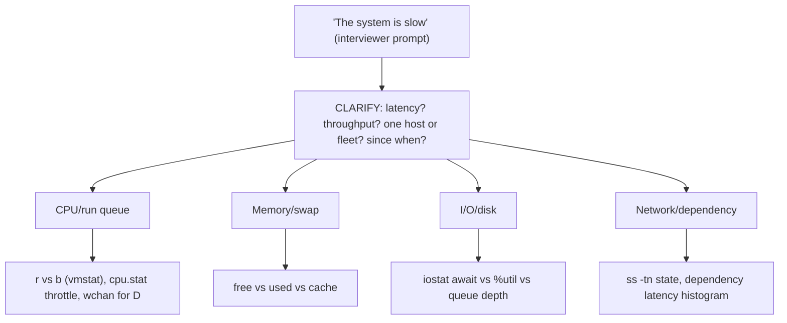
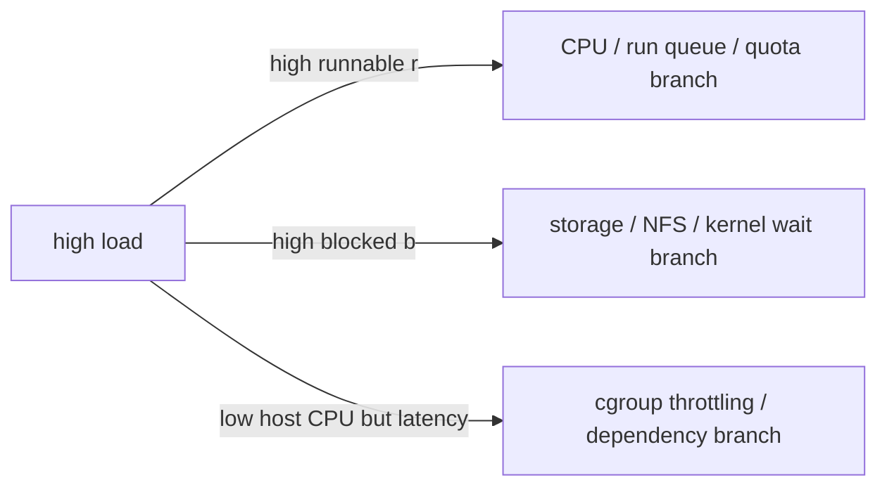

> Learning outcome Practice translating symptoms into CPU, memory, I/O, process or network evidence.

| Question | Strong first branch |
| --- | --- |
| Load 30, CPU 40% | runnable vs D-state blocked tasks vs cgroup throttling |
| OOMKilled but node has free memory | container cgroup limit vs node OOM |
| disk is slow | capacity vs inode vs latency/queue vs workload pattern |
| service restarts | exit code/app crash vs OOM/signal vs systemd policy/dependency |

## Worked scenario
**Situation:** Interviewer: "The system is slow. What do you do?"

1. Clarify what "system" and "slow" mean: request latency, shell responsiveness, job throughput, one node or fleet.
2. Check recent changes and scope.
3. Use a resource saturation snapshot: CPU/run queue, memory/swap, I/O latency, network/dependency latency.
4. Drill into the subsystem that correlates with the symptom.
5. Propose a safe mitigation only after evidence.

**Conclusion:** The senior answer converts an ambiguous symptom into measurable dimensions before commands.

## Worked explanation and practice

**Troubleshooting decision tree — "the system is slow" (turn the vague symptom into a branch, before any command):**


**Sample annotated output — the "load 30, CPU 40%" question, made concrete with real commands:**
```
$ uptime
 14:32:10 up 12 days,  3:41,  2 users,  load average: 30.14, 28.90, 25.02

$ vmstat 1 3
procs -----------memory---------- ---swap-- -----io---- -system-- ------cpu-----
 r  b   swpd   free   buff  cache   si   so    bi    bo   in   cs us sy id wa st
 6 24      0 512300  88120 4021144   0    0   840  1200 5210 8890 22 6 40 32  0
 5 26      0 511800  88120 4021900   0    0   910  1340 5340 9010 21 7 39 33  0
```
`r=6` — CPU is genuinely not oversubscribed (matches the "CPU 40%" the interviewer stated). `b=26` — 26 tasks blocked in uninterruptible sleep, which is where the load-average-30 is actually coming from; load average sums runnable *and* uninterruptible-sleep tasks, so this single field (`b`) is the evidence that separates "CPU problem" from "I/O problem" without touching a single CPU metric. `wa=32` (I/O wait) corroborates it.
```
$ for p in $(ps -eo pid,stat | awk '$2 ~ /D/ {print $1}'); do
    echo "$p: $(cat /proc/$p/comm) -> $(cat /proc/$p/wchan)"
  done
4021: java -> nfs_wait_bit_uninterruptible
4055: java -> nfs_wait_bit_uninterruptible
4102: python3 -> wait_on_page_bit
```
Two distinct root causes hiding under one "load 30" symptom: an NFS mount stalling most of the `java` processes, and ordinary page-cache I/O wait for `python3`. **Interview-ready line:** "Load average by itself never tells you if it's CPU or I/O — `b` in `vmstat` and `wchan` per PID do."

## Practice
6. Reproduce the D-state/NFS scenario: mount a deliberately slow/throttled NFS/loopback target, drive writes against it, and confirm `vmstat`'s `b` column and `wchan` both point at it before you'd normally suspect CPU.

**Visual model — classify load before proposing capacity:**

**Key takeaway:** *"Load is queued work, not CPU percentage."*
