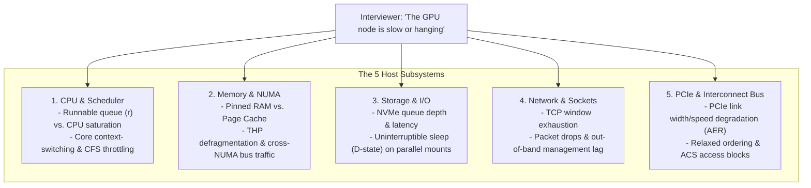

# Chapter 3 — Linux and Host Troubleshooting for AI Infrastructure

In an **NVIDIA AI Factory**, high-end GPUs cannot overcome a misbehaving host operating system. Distributed training frameworks (PyTorch DDP, Megatron-Core) and inference engines (Triton, vLLM) depend on the Linux kernel to schedule worker threads, allocate pinned host staging buffers, manage hugepages, service NVMe I/O, and coordinate GPUDirect DMA over PCIe switches.

When interviewing for an **NVIDIA Senior Solutions Architect** role, generic Linux answers ("I run `top` and restart the service") will result in immediate disqualification. You must demonstrate a **first-principles mental model** of the Linux kernel, diagnose subsystem saturation through precise evidence, and correlate kernel-level stalls with GPU performance degradation.

---

## 1. The Core Mental Model: The 5 Host Subsystems

When an interviewer presents a vague prompt such as *"The GPU node is unresponsive or running slow,"* divide the physical host into five deterministic subsystems before issuing a single command:



---

## 2. Beginner to Advanced Diagnostics

### A. Load Average: Deconstructing the Metric
**Beginner Trap:** Assuming a load average of 64 on a 64-core system means 100% CPU utilization.
**Architectural Truth:** Linux load average is not a CPU measurement. It counts the average number of processes in the **Run queue (R state)** *plus* tasks blocked in **Uninterruptible Sleep (D state)** waiting for disk I/O, NFS locks, or kernel mutexes.

```bash
# 1. Inspect run queue (r) vs. blocked queue (b)
$ vmstat 1 3
procs -----------memory---------- ---swap-- -----io---- -system-- ------cpu-----
 r  b   swpd   free   buff  cache   si   so    bi    bo   in   cs us sy id wa st
 2 38      0 412900  12090 8920100   0    0  1200  4500 4200 6100 12  4 34 50  0
```

- `r = 2`: Only 2 processes are actively competing for CPU execution.
- `b = 38`: 38 processes are stalled in uninterruptible D-state!
- `wa = 50`: The CPU is spending 50% of its cycles idling while waiting for external I/O completion.

#### Isolating D-State Tasks via Kernel Wait Channels (`wchan`):
```bash
# Identify which kernel function is blocking D-state processes
$ for pid in $(ps -eo pid,stat | awk '$2 ~ /D/ {print $1}'); do
    echo "PID $pid ($(cat /proc/$pid/comm)): $(cat /proc/$pid/wchan)"
  done
PID 4102 (python3): nfs_wait_bit_uninterruptible
PID 4103 (python3): nfs_wait_bit_uninterruptible
PID 4821 (torch_worker): wait_on_page_bit
```
*Diagnosis:* The CPU is idle. The training job is stalled because an NFS or parallel storage mount has locked up, causing worker threads to hang in the kernel VFS layer.

---

### B. Linux Pressure Stall Information (PSI)
Modern Linux kernels (v4.20+) introduce **PSI (`/proc/pressure/`)**, which provides definitive, hardware-level metrics on resource starvation:

```bash
$ cat /proc/pressure/memory
some avg10=42.10 avg60=38.40 avg300=25.10 total=18492012
full avg10=18.50 avg60=12.20 avg300=8.10 total=8921040
```
- **`some`**: Percentage of time during which at least one task was stalled on memory allocation.
- **`full`**: Percentage of time during which **all non-idle tasks** were stalled on memory. A non-zero `full` metric indicates severe host memory thrashing where CPU execution has completely halted.

---

### C. Transparent Huge Pages (THP) and Memory Compaction
In deep learning, allocating large GPU staging buffers requires multi-gigabyte memory pools. If Transparent Huge Pages are misconfigured (`always`), the kernel background daemon (`khugepaged`) attempts to compact fragmented 4KB pages into contiguous 2MB pages:

```bash
# Check memory compaction activity
$ grep -E "compact_stall|compact_fail" /proc/vmstat
compact_stall 148291   # Times processes stalled waiting for memory compaction
compact_fail  49201    # Times compaction failed entirely
```
*Impact on AI Workloads:* Memory compaction acquires global spinlocks across CPU cores, introducing **50ms to 2-second latency spikes** into the training loop. This causes NCCL watchdog timeouts.
*The Production Fix:* Set `transparent_hugepage=never` at boot time, and pre-allocate static hugepages if required.

---

### D. PCIe Bus Degradation and Advanced Error Reporting (AER)
Modern H100/H200 SXM5 systems communicate with ConnectX-7 network adapters over PCIe Gen5 (32 GT/s per lane, x16 width = 64 GB/s theoretical bandwidth).
Under thermal stress or electrical interference, the PCIe controller may silently renegotiate link parameters:

```bash
# 1. Audit link speed and width for all ConnectX-7 network adapters
$ lspci -s 0000:07:00.0 -vvv | grep -E "LnkCap|LnkSta"
LnkCap: Port #0, Speed 32GT/s, Width x16, ASPM not supported
LnkSta: Speed 2.5GT/s (downgraded), Width x4 (downgraded)  <-- CRITICAL HARDWARE FAULT!

# 2. Check for PCIe AER errors in kernel log
$ sudo dmesg -T | grep -i aer
[Thu Aug 12 14:10:22 2026] pcieport 0000:00:01.0: AER: Corrected error received: 0000:07:00.0
[Thu Aug 12 14:10:22 2026] mlx5_core 0000:07:00.0: PCIe Bus Error: severity=Corrected, type=Physical Layer, (Receiver Error)
```
*Diagnosis:* The network card has trained down from Gen5 x16 (32 GT/s) to Gen1 x4 (2.5 GT/s). The link is technically "up", but GPUDirect RDMA bandwidth has collapsed by 90%, causing massive training slowdowns across the entire multi-node cluster.

---

## 3. High-Stakes Senior Solutions Architect Interview Scenarios

### Scenario 1: High System Load with Low CPU Utilization
**Interviewer:** *"You SSH into an accelerated compute node hosting an LLM inference service. `uptime` shows a load average of 48 on a 32-core server, but `top` reports CPU usage is only 15%. What is happening, and how do you locate the root cause?"*

**Candidate Answer:**
> "A high load average paired with low CPU utilization indicates that the system is saturated with processes blocked in **uninterruptible sleep (D-state)** rather than runnable tasks competing for CPU time:
> 1. **Verify Process State:** I run `vmstat 1 3` and inspect the `b` (blocked) column versus the `r` (runnable) column. If `b` is elevated while `r` is low and `wa` (I/O wait) is high, the processes are blocked on external storage or kernel locks.
> 2. **Identify Blocked Tasks and Kernel Wait Channels:** I query `/proc` to inspect the wait channel of the blocked processes:
>    `ps -eo pid,stat,comm,wchan | grep ' D '`
>    If the wait channel shows `nfs_wait_bit_uninterruptible`, `lustre_wait`, or `wait_on_page_bit`, worker threads are stalled waiting on network-attached storage or NVMe page flushing.
> 3. **Inspect Storage Queue Depths and Latencies:** I run `iostat -xz 1 3` to evaluate disk utilization (`%util`), average request queue depth (`aqu-sz`), and average service latency (`await`). If an NVMe drive shows an `await` of > 50ms, a drive controller is failing or an NVMe-oF path is experiencing network drops."

---

### Scenario 2: Memory OOMKilled but Node Shows 128 GB Free RAM
**Interviewer:** *"A researcher submits a multi-GPU PyTorch container job via Slurm. Two minutes into the training run, the job aborts with exit code 137. Inspecting `dmesg` shows an `OOM-Killed process` message, yet running `free -m` on the host reveals 128 GB of unused, available RAM. How is this possible?"*

**Candidate Answer:**
> "This is a textbook distinction between **Host System OOM** and **Cgroup Memory Limit OOM**:
> 1. **Cgroup Enforcement:** When Slurm or Kubernetes launches a container, it places the process tree into a dedicated Linux cgroup (v1 or v2). If the user requested `--mem=64G` in their `sbatch` script or specified a container memory limit of 64 GB, the kernel enforces that hard ceiling inside `/sys/fs/cgroup/memory/` (or `memory.max` in cgroups v2).
> 2. **Kernel Behavior:** As soon as the PyTorch DataLoader pre-fetches datasets into host memory and exceeds 64 GB, the kernel invokes the cgroup-scoped OOM killer (`mem_cgroup_out_of_memory`), sending a `SIGKILL` (signal 9, exit code 128 + 9 = 137) to the primary Python process.
> 3. **Verification:** I verify this by inspecting the kernel log:
>    `dmesg -T | grep -i "invoked oom-killer: gfp_mask"`
>    The log will state: `Task in /slurm/uid_1001/job_48210 killed as a result of limit of /slurm/uid_1001/job_48210`.
> 4. **Solution:** The physical host had plenty of memory; the job was throttled by its declared allocation. The researcher must raise their `--mem` parameter or optimize PyTorch DataLoader worker memory using shared memory (`/dev/shm`)."

---

## Key Takeaways

1. **Load is Not CPU:** Load average measures queued work, combining runnable (`R`) and uninterruptible sleep (`D`) tasks. Always inspect `vmstat` (`r` vs. `b`) before concluding CPU saturation.
2. **PSI Provides Ground Truth:** Use `/proc/pressure/memory` and `/proc/pressure/io` to distinguish transient latency from true system-wide resource stalls.
3. **Disable Transparent Huge Pages:** Background `khugepaged` memory compaction locks CPU cores and introduces fatal latency spikes into distributed training loops.
4. **Audit PCIe Gen5 Link Integrity:** Under thermal or electrical noise, PCIe links train down to Gen1 or reduced widths, crippling GPUDirect RDMA bandwidth while appearing superficially active.
5. **Cgroup Ceilings Cause Exit Code 137:** A process killed by OOM when the host has free RAM indicates a cgroup-level memory quota breach.
