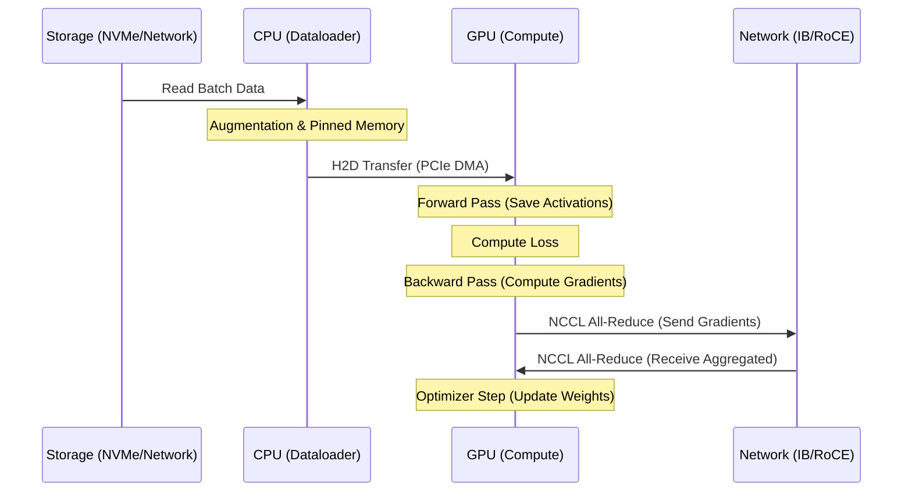
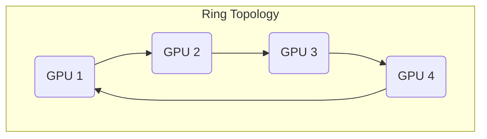

# Interview Gauntlet: Training, CUDA, and NCCL Masterclass

## Foundations: start here before using the interview question bank {#foundations-start-here-before-using-the-interview-question-bank}

Welcome to the definitive masterclass on Distributed Training, GPU Coordination, and NCCL. This chapter is designed as a deep technical Q&A to prepare you for the most grueling systems engineering, AI platform, and infrastructure architecture interviews. 

We will cover the end-to-end data flow of distributed training, the intricacies of CUDA and GPU workers, the depths of NCCL algorithms, and the high-stakes battle between RoCE and InfiniBand. 

---

## Question 8: Distributed Training End-to-End

**The Prompt:** "Walk me through the exact end-to-end data flow of a distributed training iteration. Where are the latency points? How do the GPUs coordinate over the network?"

:::info Whiteboard Strategy
Do not start by drawing a PyTorch logo. Start at the storage layer, move through the CPU/PCIe bus, explain the forward and backward pass at the CUDA level, and finish with the All-Reduce operation over the network. Divide your board into four columns: **Storage**, **CPU/RAM**, **GPU**, and **Network**.
:::

### 1. Storage and Data Loading pipeline

**Interviewer:** "Where does the data start, and how does it get to the GPU?"

**Candidate:**
"Data originates in distributed storage (e.g., NVMe arrays, parallel file systems like Lustre/WEKA, or object storage). 
1. **CPU Dataloaders:** The CPU spawns multiple worker processes to read this data.
2. **Preprocessing:** The CPU decompresses, decodes (e.g., JPEG to tensors), and applies data augmentation.
3. **Host-to-Device (H2D) Transfer:** The CPU pins the memory (Page-Locked memory) and initiates a DMA (Direct Memory Access) transfer over the PCIe bus to the GPU's HBM (High Bandwidth Memory)."

:::tip Golden Answer
Explicitly mention **Pinned Memory** (Page-Locked). If you use normal pageable memory, the CUDA driver must first copy it to a temporary pinned buffer before DMAing it to the GPU, costing precious CPU cycles and latency. You should also mention GPUDirect Storage (GDS) as the modern optimization, allowing NVMe to bypass the CPU bounce buffer and DMA directly to GPU HBM over PCIe.
:::

### 2. The Forward Pass

**Interviewer:** "The data is in HBM. What happens during the forward pass?"

**Candidate:**
"The GPU executes a sequence of CUDA kernels launched by the CPU host program. 
- The input tensor passes through the neural network layers (e.g., GEMM operations for linear layers).
- Intermediate activations are computed and stored in HBM because they will be needed for the backward pass to compute gradients.
- This phase is largely compute-bound (dominated by Tensor Cores multiplying massive matrices) and memory-bandwidth bound (reading weights and writing activations)."

:::danger Interview Trap
Failing to mention that activations are saved for the backward pass. This is why training requires significantly more memory than inference. Activation checkpointing (rematerialization) is a common optimization where you drop intermediate activations and recompute them during the backward pass to save memory at the cost of compute.
:::

### 3. The Backward Pass

**Interviewer:** "How is the loss computed and gradients derived?"

**Candidate:**
"At the end of the forward pass, the loss function calculates the error. The backward pass (backpropagation) begins:
- It walks backward through the computational graph.
- Using the Chain Rule, it computes the gradient of the loss with respect to each weight.
- It consumes the activations saved during the forward pass.
- The output of this phase is a gradient tensor for every weight tensor in the model."

### 4. Gradient Synchronization (All-Reduce)

**Interviewer:** "In Data Parallel training, each GPU now has a different set of gradients. How do we synchronize them?"

**Candidate:**
"This is where NCCL (NVIDIA Collective Communications Library) takes over.
- The GPUs must aggregate their gradients so every GPU updates its weights identically.
- They perform an **All-Reduce** operation (specifically a Sum or Average).
- Over NVLink (intra-node) and InfiniBand/RoCE (inter-node), the GPUs exchange gradient chunks.
- Once All-Reduce completes, every GPU in the cluster possesses the exact same globally aggregated gradients."

### 5. The Optimizer Step

**Interviewer:** "What is the final step of the iteration?"

**Candidate:**
"The Optimizer Step. Using the globally synchronized gradients, the optimizer (e.g., AdamW) updates the model weights in HBM. Adam maintains state (momentum and variance), which must be updated. Once updated, the iteration concludes, and the next batch of data (already pre-fetched by CPU data loaders) is processed."

### End-to-End Diagram

### Latency Points and Bottlenecks

**Interviewer:** "Where are the latency points in this flow?"

**Candidate:**
1.  **Storage/Network Bottleneck:** If the storage backend cannot saturate the CPU dataloaders, GPUs starve. Monitored via GPU utilization dropping to 0%.
2.  **CPU Preprocessing Bottleneck:** Complex augmentations (e.g., 3D medical imaging) can max out CPU cores before GPUs are fed.
3.  **PCIe Bottleneck:** If H2D transfers are slow (e.g., sharing a PCIe switch with other high-traffic devices or lacking pinned memory).
4.  **Compute Bound:** Very large matrix multiplications. Optimized using Tensor Cores and lower precision (FP16/BF16/FP8).
5.  **Network Communication Bottleneck:** The All-Reduce phase. If the network topology is oversubscribed or there are stragglers, the entire cluster blocks waiting for the slowest node. This is the most critical bottleneck in large-scale distributed training.

---

## Question 10: CUDA, Runtime, GPU Workers, Parallelism

**The Prompt:** "Explain how a deep learning framework interacts with CUDA. How are kernels launched? What are streams, and how do they enable parallelism? How does tokenization fit in?"

:::info Whiteboard Strategy
Draw a CPU Host on the left and a GPU Device on the right. Show the command queue (CUDA Stream) bridging them. Explain the asynchronous nature of launches.
:::

### 1. Framework to CUDA Interaction

**Interviewer:** "When I call `loss.backward()` in PyTorch, what actually happens at the hardware level?"

**Candidate:**
"PyTorch (via its C++ backend, ATen) traverses the autograd graph. For each operation, it maps the mathematical function to an optimized kernel provided by libraries like cuBLAS (for matrix math) or cuDNN (for convolutions). 
- PyTorch calls the CUDA Runtime API (e.g., `cudaLaunchKernel`).
- This launch is **asynchronous**. The CPU pushes a command into a **CUDA Stream** (a queue of operations) and immediately returns to python.
- The GPU driver pulls commands from this stream and schedules them onto the GPU's Streaming Multiprocessors (SMs)."

:::tip Golden Answer
Highlight the asynchronous execution model. The CPU is almost always several steps ahead of the GPU, queueing up work. If you put a print statement right after a CUDA call in python, it prints instantly, long before the GPU finishes the work, unless you explicitly call `torch.cuda.synchronize()`.
:::

### 2. CUDA Streams and Concurrency

**Interviewer:** "How do we hide latency using CUDA streams?"

**Candidate:**
"A CUDA Stream is a sequence of commands that execute in order. By default, everything runs in the 'default stream' (Stream 0).
To achieve parallelism, we can create multiple streams:
- **Copy Engine vs Compute Engine:** A GPU has independent engines for copying data (PCIe) and computing.
- **Overlapping:** We can launch a memory copy (H2D) in Stream 1, and simultaneously launch a compute kernel in Stream 2. 
- Because they are in different streams, and use different hardware engines, they execute concurrently. This is how frameworks overlap data loading with computation, or overlap network communication (NCCL) with backward pass computation."

### 3. GPU Architecture: SMs and Warps

**Interviewer:** "How does the GPU actually execute the kernel?"

**Candidate:**
"A GPU consists of multiple Streaming Multiprocessors (SMs). 
- When a kernel is launched, it is divided into **Thread Blocks**. 
- These blocks are distributed across the SMs.
- Inside an SM, threads are grouped into **Warps** (typically 32 threads).
- Warps execute in Lockstep (SIMT - Single Instruction, Multiple Threads). All 32 threads execute the exact same instruction at the exact same time, but on different pieces of data.
- If threads in a warp take different branches (e.g., an `if/else` statement), the warp diverges. The SM must execute both branches sequentially, masking out threads, which ruins performance. This is **Warp Divergence**."

### 4. Tokenization

**Interviewer:** "Where does Tokenization happen in this pipeline? CPU or GPU?"

**Candidate:**
"Historically, Tokenization (converting raw text strings into integer IDs using algorithms like BPE) happens entirely on the **CPU** before the data is batched and sent to the GPU. 
- It involves complex string manipulation, regex, and dictionary lookups, which are highly branchy and irregular. 
- GPUs are terrible at branchy code (due to SIMT warp divergence).
- However, as models grow and CPU dataloading becomes a bottleneck, there is a push towards GPU-accelerated tokenization (e.g., using NVIDIA RAPIDS/cuDF), but CPU remains standard for most PyTorch pipelines."

---

## Question 11: NCCL Modes and Troubleshooting

**The Prompt:** "Explain the different algorithms NCCL uses (Ring vs Tree). How does NCCL handle topology detection? What happens if one GPU is slow?"

:::info Whiteboard Strategy
Draw the Ring All-Reduce. Show how data is chunked and passed in a circle. Then draw the Double Binary Tree for large-scale.
:::

### 1. Topology Detection

**Interviewer:** "How does NCCL know how to route traffic between GPUs?"

**Candidate:**
"When you initialize a distributed group (e.g., `dist.init_process_group`), NCCL performs topology discovery.
- It scans the PCIe tree (using `hwloc` or `sysfs`).
- It detects NVLink bridges connecting GPUs locally.
- It detects NICs (Network Interface Cards) and their proximity to specific GPUs (NUMA affinity).
- It runs a distributed algorithm over sockets (usually via MPI or PyTorch's TCP store) to discover the global cluster geometry.
- It then constructs a highly optimized routing graph. If it finds NVLink, it uses it. If it finds InfiniBand, it uses GPU Direct RDMA to bypass the CPU."

:::tip Golden Answer
Mention **NCCL_TOPO_FILE**. Advanced users can dump the auto-detected topology to an XML file, modify it (e.g., to force a specific routing path avoiding a bad switch), and feed it back to NCCL via an environment variable.
:::

### 2. Ring All-Reduce

**Interviewer:** "How does Ring All-Reduce work?"

**Candidate:**
"Ring All-Reduce is optimal for bandwidth but has higher latency at large scales.
1. The N GPUs are arranged in a logical ring.
2. The data tensor (e.g., gradients) is divided into N chunks.
3. **Scatter-Reduce Phase:** GPU $i$ sends chunk $i$ to GPU $i+1$, while simultaneously receiving chunk $i-1$ from GPU $i-1$. It adds the received chunk to its own. This happens $N-1$ times.
4. **All-Gather Phase:** The fully reduced chunks are now passed around the ring again so every GPU gets the final result. This also takes $N-1$ steps.
5. Total steps: $2(N-1)$. It perfectly utilizes bidirectional bandwidth."

### 3. Tree All-Reduce (Double Binary Tree)

**Interviewer:** "Ring is slow for 10,000 GPUs. What does NCCL use for large clusters?"

**Candidate:**
"NCCL switches to Tree-based algorithms (like Double Binary Tree).
- The GPUs form a tree hierarchy.
- **Reduce Phase:** Leaf nodes send data up to parents. Parents aggregate and send up to the root.
- **Broadcast Phase:** The root has the final sum and broadcasts it back down the tree.
- Tree algorithms significantly reduce latency ($O(\log N)$ steps instead of $O(N)$), which is critical for massive clusters."

### 4. Troubleshooting NCCL

**Interviewer:** "A training job is hanging. How do you troubleshoot NCCL?"

**Candidate:**
"NCCL hangs are notorious. 
1. **Enable Debug Logging:** Set `NCCL_DEBUG=INFO` and `NCCL_DEBUG_SUBSYS=ALL`. This will dump massive logs showing exactly what NCCL is detecting and where it's failing to connect.
2. **Check GPU/NIC Affinity:** Run `nvidia-smi topo -m` to verify NVLink and PCIe/NIC affinity.
3. **Network Partition/Firewall:** If inter-node hangs, check if InfiniBand/RoCE fabrics are up and pingable. Often it's an MTU mismatch or a closed port.
4. **Stragglers:** One slow GPU (e.g., due to thermal throttling or a bad PCIe lane) will stall the entire All-Reduce. I would use monitoring tools (DCGM) to check for ECC errors, thermal limits, or clock throttling on individual GPUs.
5. **NCCL Tests:** Run the official `nccl-tests` (e.g., `all_reduce_perf`) isolated from the training code to prove the hardware fabric is healthy."

:::danger Interview Trap
Saying "I would check the PyTorch code." If the framework hangs during `loss.backward()` in a distributed setting, 99% of the time it is an infrastructure issue (fabric, driver, hardware defect), not a python code bug. Go straight to infrastructure troubleshooting.
:::

---

## Question 15: RoCE vs InfiniBand

**The Prompt:** "You are designing a 4,000 GPU cluster. Compare RDMA over Converged Ethernet (RoCE v2) vs InfiniBand. Defend your choice."

:::info Whiteboard Strategy
Draw the OSI model. Show how IB replaces layers 1-4 entirely with a lossless, low-latency stack. Show how RoCE rides on top of UDP/IP/Ethernet and requires complex QoS/PFC to simulate losslessness.
:::

### 1. The Core Similarity: RDMA

**Candidate:**
"Both technologies provide **RDMA (Remote Direct Memory Access)**. This is the critical feature. RDMA allows a GPU in Node A to write directly into the HBM of a GPU in Node B, bypassing the CPU, the OS kernel, and the TCP/IP stack of both machines. This is required for GPUDirect RDMA. The difference is the transport layer."

### 2. InfiniBand (The Gold Standard)

**Interviewer:** "Why is InfiniBand considered the gold standard for AI?"

**Candidate:**
"InfiniBand was designed from the ground up for HPC.
- **Lossless by Design:** It uses credit-based flow control. A sender will not transmit a packet unless it knows the receiver has buffer space. This physically prevents dropped packets at the switch level.
- **Ultra-Low Latency:** Sub-microsecond latency. The protocol stack is incredibly thin and hardware-offloaded.
- **Adaptive Routing:** IB switches (like NVIDIA Quantum) can dynamically route packets around congestion on a packet-by-packet basis, achieving near 100% fabric utilization.
- **In-Network Computing:** Switches use SHARP (Scalable Hierarchical Aggregation and Reduction Protocol) to perform the All-Reduce math directly in the switch ASIC, offloading the GPUs.
- **Management:** Managed centrally via the Subnet Manager (OpenSM or UFM), which provisions paths deterministically."

### 3. RoCE v2 (RDMA over Converged Ethernet)

**Interviewer:** "If IB is so good, why does anyone use RoCE?"

**Candidate:**
"RoCE v2 encapsulates RDMA packets inside standard UDP/IP over Ethernet.
- **Familiarity & Cost:** Enterprises already have Ethernet expertise, Ethernet switches (Arista, Cisco), and management tools. Ethernet ports are often cheaper.
- **The Challenge (Lossy Ethernet):** Ethernet is natively lossy (best effort). If a buffer fills, it drops packets. Dropped packets cause TCP/UDP timeouts, which cause NCCL to hang or drastically slow down.
- **The Solution (PFC/ECN):** To make Ethernet lossless, you must configure DCB (Data Center Bridging), specifically PFC (Priority Flow Control) and ECN (Explicit Congestion Notification). 
- **The Reality:** Tuning PFC across a multi-tier leaf-spine network for 4,000 GPUs is notoriously difficult. Misconfigurations lead to 'PFC Storms' (head-of-line blocking) that can freeze the entire network."

:::tip Golden Answer
The key differentiator is **Congestion Management**. InfiniBand handles congestion gracefully via credit flow and adaptive routing. Ethernet relies on ECN to tell senders to slow down, and PFC as a last-resort PAUSE frame. PFC is a sledgehammer that pauses all traffic on a priority queue, causing cascading delays.
:::

### 4. The Decision

**Interviewer:** "So for 4,000 GPUs, what is your recommendation?"

**Candidate:**
"For a dedicated, high-performance AI cluster of 4,000 GPUs, **InfiniBand is the only responsible choice**. 
The CapEx savings of Ethernet switches will be rapidly eclipsed by the OpEx nightmare of tuning PFC and the lost revenue from GPUs idling while waiting on network retransmissions. Ethernet is acceptable for smaller scale (e.g., a few racks) or cloud environments where you must integrate with a massive existing IP fabric, but for a greenfield supercomputer, InfiniBand guarantees the predictable, lossless latency NCCL requires at scale."

---

## Deep Dive: GPUDirect Storage (GDS) vs GPUDirect RDMA

**Interviewer:** "You mentioned GPUDirect earlier. Distinguish between GDS and GPUDirect RDMA."

**Candidate:**
"They solve two different bottlenecks in the data path, both by bypassing the CPU bounce buffer.

1. **GPUDirect RDMA (Inter-Node):**
   - **Problem:** When Node A's GPU wants to send data to Node B's GPU over the network, standard networking requires copying data: GPU HBM -> CPU System RAM -> Network Card (NIC).
   - **Solution:** GPUDirect RDMA maps the GPU HBM memory addresses directly to the NIC's PCIe BAR. The NIC reads straight from GPU HBM over the PCIe bus and sends it across the wire.
   - **Use Case:** NCCL All-Reduce, accelerating gradient synchronization between nodes.

2. **GPUDirect Storage (GDS) (Intra-Node / Storage):**
   - **Problem:** When loading training data from local NVMe drives or networked storage, data flows: NVMe -> System RAM -> CPU (processing) -> GPU HBM.
   - **Solution:** GDS allows the NVMe controller (or networked storage NIC) to DMA data directly into the GPU's HBM via the PCIe switch, bypassing CPU memory entirely.
   - **Use Case:** Massive data loading for I/O bound workloads like Recommendation Systems (DLRM) or large-scale video processing."

:::danger Interview Trap
Mixing these up is a common red flag. GDS is for disk-to-GPU. GPUDirect RDMA is for GPU-to-GPU across a network. Both require PCIe switches that support Peer-to-Peer (P2P) transactions.
:::

## Summary & Key Takeaways

1. **The Critical Path:** Understand every hop from disk to HBM to network to HBM.
2. **Asynchrony is King:** CUDA execution is asynchronous. Streams are the mechanism for parallelism and overlapping compute with I/O.
3. **NCCL is the Backbone:** Know Ring vs Tree algorithms. When troubleshooting distributed hangs, blame the infrastructure (fabric/drivers) before the code.
4. **Networks matter:** InfiniBand > RoCE for dedicated large-scale AI because of hardware-level flow control and adaptive routing. 

*(End of Masterclass Volume 09, Chapter 3)*
