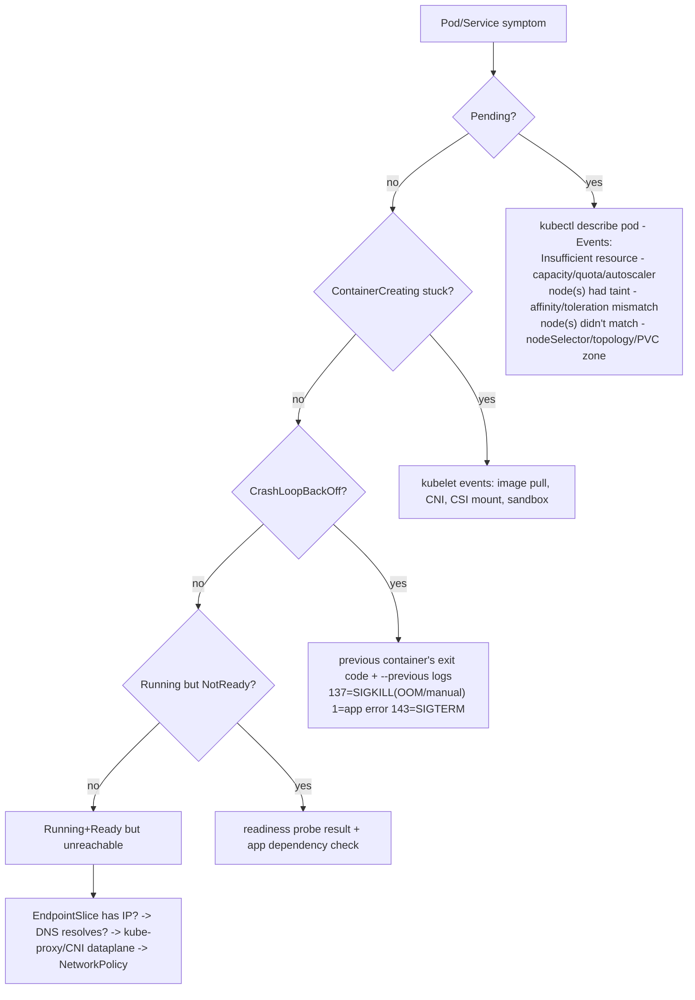
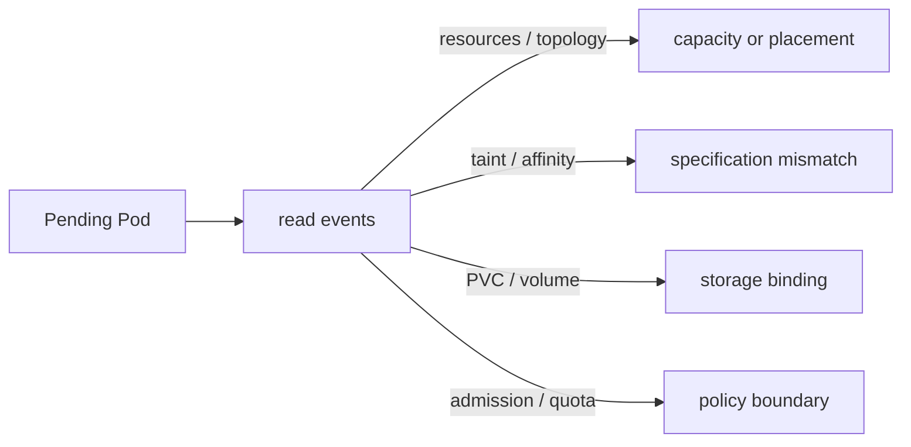

> Learning outcome Use object status/events to find the control-loop stage, then descend to node/Linux evidence.

| Symptom | First evidence |
| --- | --- |
| Pending | Pod events + scheduler constraints |
| ContainerCreating | kubelet/CNI/CSI/image/sandbox events |
| CrashLoopBackOff | previous termination reason/exit code + previous logs |
| NotReady | readiness probe/dependency/application evidence |
| Service unreachable | EndpointSlice -> DNS -> service dataplane -> CNI/policy |

## Worked scenario
**Situation:** Interviewer: "Pods are Pending despite cluster autoscaler enabled."

1. Read FailedScheduling reason.
2. Ask whether any node type the autoscaler can create would satisfy the Pod.
3. Check max size/resource limits/quota.
4. Check affinity/taints/PVC topology/GPU resource type that may prevent expansion from helping.
5. Only then investigate autoscaler implementation/logs.

**Conclusion:** Autoscaler is not a universal cure for unschedulable constraints.

## Worked explanation and practice

**Kubernetes symptom-to-layer decision tree:**


**Sample annotated output — GPU-specific Pending Pod, the exact evidence chain:**
```
$ kubectl describe pod bert-train-0 | tail -15
Events:
  Type     Reason            Age   From               Message
  ----     ------            ----  ----               -------
  Warning  FailedScheduling  38s   default-scheduler   0/12 nodes are available:
           8 Insufficient nvidia.com/gpu, 4 node(s) had untolerated taint
           {nvidia.com/gpu: present}.
```
Two distinct causes in one message: 8 nodes simply don't have enough free GPU allocatable (capacity question — will autoscaler help, or is the whole fleet saturated?), and 4 nodes are GPU nodes tainted to keep non-GPU workloads off them, and this Pod has no matching toleration (spec bug, not a capacity problem — adding nodes won't fix it). **Interview-ready line:** "One FailedScheduling message can bundle two unrelated root causes — I'd never add capacity before reading which specific nodes failed for which specific predicate."

## Practice
6. Deliberately create a Pod with a `nodeSelector` that matches zero nodes and one with a GPU resource request exceeding cluster capacity — compare the two `FailedScheduling` messages verbatim and explain in one sentence how you'd tell them apart without reading the message (hint: you can't reliably — always read the actual message).

**Visual model — Pending is a scheduler explanation, not one failure state:**

**Key takeaway:** *"The event names the predicate; do not guess from the phase."*
