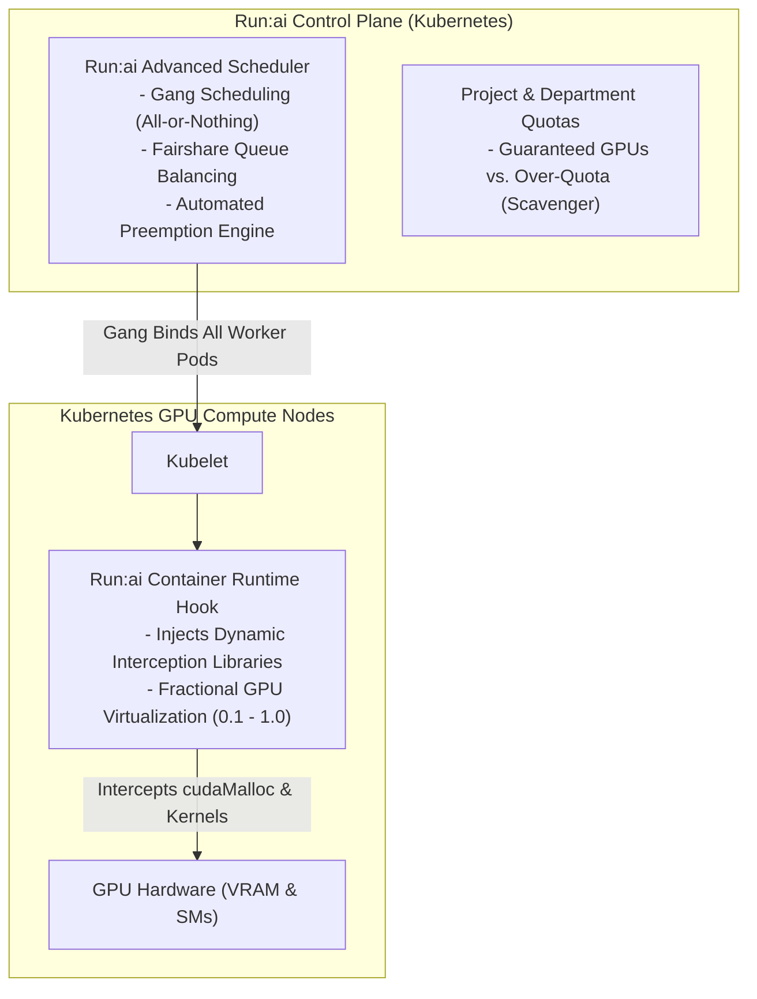

# Chapter 4 — Kubernetes, GPU Operator, and Run:ai Platform Troubleshooting

In cloud-native AI platforms, Kubernetes orchestrates both distributed training jobs and real-time inference microservices. However, Kubernetes does not natively understand GPU hardware, NVLink meshes, or CUDA driver boundaries. It relies on a layered extension architecture: **Node Feature Discovery (NFD)**, the **NVIDIA GPU Operator**, the **NVIDIA Device Plugin**, the **Container Device Interface (CDI)**, and virtualization layers like **Run:ai**.

When a Pod requesting `nvidia.com/gpu` fails to start or crashes, the defect rarely lives in the user's Python script. It usually stems from a broken contract between the Kubelet, the container runtime (`containerd`), the device plugin gRPC socket, or the underlying driver operand.

As an **NVIDIA Senior Solutions Architect**, you must understand the exact lifecycle of a GPU Pod, navigate the GPU Operator operand dependency tree, diagnose missing allocatable resources, and troubleshoot multi-tenant scheduling under Run:ai.

---

## 1. The Kubernetes GPU Control and Runtime Architecture

A GPU Pod cannot run until two distinct control paths succeed: the **Control-Plane Advertisement Path** and the **Runtime Sandbox Injection Path**.

```mermaid
flowchart TD
    subgraph Host["Host Operating System Layer"]
        DRV["NVIDIA Kernel Modules (nvidia.ko, nvidia-uvm.ko)"]
        DEV["Device Nodes (/dev/nvidia0..7, /dev/nvidiactl)"]
        NVML["NVIDIA Management Library (libnvidia-ml.so)"]
    end

    subgraph GPUOperator["NVIDIA GPU Operator (Namespace: gpu-operator)"]
        NFD["Node Feature Discovery (Labels hardware features)"]
        GFD["GPU Feature Discovery (Labels GPU model, VRAM, arch)"]
        DP["NVIDIA Device Plugin DaemonSet"]
        CDI_OP["NVIDIA Container Toolkit / CDI Operand"]
        DCGM_EXP["DCGM Exporter DaemonSet (Prometheus Metrics)"]
    end

    subgraph K8sNode["Kubernetes Node Architecture"]
        KUBELET["Kubelet (Node Agent)"]
        SOCKET["Plugin Socket: /var/lib/kubelet/device-plugins/nvidia.sock"]
        CRI["Container Runtime (containerd / CRI-O)"]
        CDI_SPEC["CDI Spec: /etc/cdi/nvidia.yaml"]
    end

    subgraph SchedulerPlane["Cluster Control Plane"]
        API["kube-apiserver (Node Status: allocatable.nvidia.com/gpu)"]
        SCHED["kube-scheduler / Run:ai Scheduler"]
    end

    DRV --> DEV
    DEV --> NVML
    NVML --> DP
    DP -->|Registers via gRPC| SOCKET
    SOCKET --> KUBELET
    KUBELET -->|Reports Capacity| API
    API --> SCHED
    
    SCHED -->|Binds Pod to Node| KUBELET
    KUBELET -->|Calls Allocate via gRPC| DP
    DP -->> KUBELET: Returns Device IDs (e.g., GPU-UUID-0)
    KUBELET -->|Instructs Sandbox Creation| CRI
    CRI -->|Consults| CDI_SPEC
    CDI_SPEC -->|Injects /dev/nvidia* & libraries| POD["Running GPU Pod Sandbox"]
```

---

## 2. The GPU Pod Lifecycle: State-to-Evidence Matrix

When diagnosing a GPU Pod failure, map the Kubernetes Pod Phase to its exact diagnostic boundary:

| Pod Phase / Status | Primary Diagnostic Boundary | Evidence Command | Likely Root Cause |
|---|---|---|---|
| **`Pending` (Reason: `FailedScheduling`)** | Cluster Scheduler, Quotas, Taints, or GRES Allocatable | `kubectl describe pod <pod> \| grep -A 10 Events` | 1. Cluster GPU capacity saturated.<br/>2. Node tainted (e.g., `nvidia.com/gpu:NoSchedule`) without matching toleration.<br/>3. NodeSelector or NFD label mismatch.<br/>4. PVC storage binding pending in a different zone. |
| **`Pending` (Allocatable: 0 across nodes)** | GPU Operator Device Plugin DaemonSet | `kubectl get nodes -o jsonpath='{.items[*].status.allocatable}'` | Host driver failed to load, preventing the Device Plugin from initializing NVML and registering with Kubelet. |
| **`ContainerCreating` (Stuck > 2m)** | Kubelet, CNI, or CSI Volume Mount | `kubectl describe pod <pod>` | Volume mount lock, container image pull timeout, or CNI IP address exhaustion. |
| **`CreateContainerError` / `RunContainerError`** | Container Runtime (`containerd`), CDI, or NVIDIA Container Toolkit | `crictl inspectp <sandbox_id>` or `journalctl -u containerd` | 1. CDI specification missing or invalid (`/etc/cdi/nvidia.yaml`).<br/>2. `nvidia-container-cli` failed to locate host driver libraries.<br/>3. Missing `RuntimeClass: nvidia`. |
| **`CrashLoopBackOff` (Exit Code 137)** | Linux Memory Cgroups (Host or Container OOM) | `kubectl describe pod <pod> \| grep -i "OOMKilled"` | Process exceeded container `resources.limits.memory` (SIGKILL). |
| **`CrashLoopBackOff` (Exit Code 1)** | Application Layer / CUDA Framework | `kubectl logs <pod> --previous` | PyTorch CUDA initialization failure, library version mismatch, or application exception. |

---

## 3. Deep-Dive Failure Modes in Production

### Failure 1: The Node Reports `allocatable: nvidia.com/gpu: 0`
**The Symptom:** `kubectl get nodes` shows the node is `Ready`, but Pods requesting GPUs remain `Pending`. Checking the node status reveals:
```bash
$ kubectl get node gpu-node-04 -o jsonpath='{.status.allocatable}'
{"cpu":"128","memory":"515921Mi","pods":"110"}
# Notice: "nvidia.com/gpu" is completely absent from Allocatable and Capacity!
```

#### The Diagnostic Sequence:
1. **Check the Device Plugin Pod on that Node:**
   ```bash
   $ kubectl get pods -n gpu-operator -l app=nvidia-device-plugin-daemonset -o wide | grep gpu-node-04
   nvidia-device-plugin-daemonset-4j2kx   0/1   CrashLoopBackOff   12   28m   gpu-node-04
   ```
2. **Inspect the Device Plugin Container Logs:**
   ```bash
   $ kubectl logs -n gpu-operator nvidia-device-plugin-daemonset-4j2kx
   level=error msg="Failed to initialize NVML: driver/library version mismatch"
   level=fatal msg="Failed to create device plugin: could not load NVML"
   ```
3. **The Root Cause:** A background host OS update refreshed the user-space NVIDIA driver libraries, but the node was not rebooted to reload the matching kernel module. Because NVML cannot talk to the mismatched kernel driver, the Device Plugin crashes.
4. **The Fix:** Drain the node, reboot to load the updated kernel module, verify `nvidia-smi` works, and let the Device Plugin re-register with Kubelet.

---

### Failure 2: `CreateContainerError` — CDI Specification Desynchronization
Starting with modern Kubernetes (1.28+) and Containerd (1.7+), the industry is transitioning from legacy OCI prestart hooks to the **Container Device Interface (CDI)**.

#### The Error Signature:
```text
$ kubectl describe pod triton-inference-0 | tail -8
Warning  Failed   14s   kubelet   Error: failed to create containerd task: failed to generate spec: 
cdi: failed to inject devices: device "nvidia.com/gpu=0" not found in CDI registry
```

#### The Architecture & Remedy:
1. CDI replaces dynamic OCI runtime hooks with static, validated YAML manifests located at `/etc/cdi/nvidia.yaml`.
2. The NVIDIA Container Toolkit operand in the GPU Operator automatically generates this file at boot.
3. If an administrator manually modifies GPU configurations or MIG profiles without restarting the toolkit daemon, the CDI manifest goes stale.
4. **Resolution:** Re-generate the CDI specification on the affected node:
   ```bash
   sudo nvidia-ctk cdi generate --output=/etc/cdi/nvidia.yaml
   sudo systemctl restart containerd
   ```

---

## 4. Run:ai Architecture and Multi-Tenant Scheduling Triage

**Run:ai** runs on top of bare-metal Kubernetes clusters to transform static GPU infrastructure into an elastic, shared computing fabric.



### Why Run:ai Over Native Kubernetes Scheduling:
1. **Dynamic Fractional GPUs:** Native Kubernetes extended resources only support whole integers (`nvidia.com/gpu: 1`). Hardware MIG partitions require re-flashing GPU baseboards and reboots. Run:ai intercepts CUDA memory allocation calls (`cudaMalloc`) in user space, allowing multiple pods to share a single physical H100 GPU (e.g., requesting `gpu: 0.25`) with strict memory isolation.
2. **Gang Scheduling:** Native Kubernetes schedules distributed jobs pod-by-pod. If a 32-pod training job requests 32 GPUs, Kubernetes might schedule 28 pods and leave 4 pods pending, while the 28 running pods sit idle and block other users. Run:ai enforces atomic **Gang Scheduling**: all 32 pods schedule concurrently, or none do.
3. **Fairshare & Over-Quota Preemption:** Research teams are allocated guaranteed GPU quotas. If a team exceeds its quota (bursting into idle cluster capacity), Run:ai marks those jobs as **preemptible**. When the owning team submits work, Run:ai automatically checkpoints and evicts the over-quota jobs within 30 seconds.

---

## 5. Senior Solutions Architect Interview Scenarios

### Scenario 1: GPU Pod Stuck in Pending Despite Cluster Autoscaler
**Interviewer:** *"A customer reports that their distributed training Pods are stuck in `Pending` with `FailedScheduling: 0/32 nodes are available: 32 Insufficient nvidia.com/gpu`. The Kubernetes Cluster Autoscaler is active, but it refuses to spin up new GPU node instances. How do you troubleshoot this?"*

**Candidate Answer:**
> "When the Cluster Autoscaler refuses to scale up despite unschedulable Pods, the failure is governed by **autoscaler predicates, node group constraints, or cloud quota exhaustion**:
> 1. **Step 1: Inspect the Cluster Autoscaler Status ConfigMap:**
>    `kubectl get configmap cluster-autoscaler-status -n kube-system -o yaml`
>    This reveals whether the autoscaler is actively evaluating the pending Pod and whether it identified eligible node groups.
> 2. **Step 2: Check Node Group Max Size and Taints:**
>    - If the GPU node group has reached its maximum size (`maxNodes: 32`), the autoscaler will not scale.
>    - If the Pod lacks tolerations for the default GPU node taints (e.g., `sku=gpu:NoSchedule`), the autoscaler evaluates the new nodes as unable to satisfy the Pod's placement, and rejects scale-up.
> 3. **Step 3: Inspect Autoscaler Logs for Cloud Quota Rejections:**
>    I inspect `kubectl logs -n kube-system -l app=cluster-autoscaler`:
>    Look for `Failed to create instance: OperationNotPermitted: QuotaExceeded for GPU_TOTAL`. The cloud provider (AWS/GCP/Azure) or bare-metal pool is rejecting new instances due to account-level capacity limits."

---

### Scenario 2: PyTorch Pod Crashes with Exit Code 137 vs. Exit Code 1
**Interviewer:** *"A customer's multi-GPU training job crashes 10 minutes into an epoch. The Pod status flips to `CrashLoopBackOff`. How do you immediately determine whether the crash was caused by a hardware failure, a platform memory limit, or a bug in their machine learning code?"*

**Candidate Answer:**
> "I determine the failure boundary immediately by inspecting the **Termination Exit Code and Kernel Audit Logs**:
> 1. **Analyze Termination Status:**
>    `kubectl describe pod <pod_name> | grep -A 5 "Last State"`
>    - **Exit Code 137:** Indicates the process received a `SIGKILL` (128 + 9). I check `OOMKilled: true`. If `OOMKilled` is true, the container exceeded its Kubernetes memory limit (`limits.memory`).
>    - **Exit Code 1 / 255:** Indicates an unhandled user-space exception (e.g., a PyTorch assertion failure, NaN loss crash, or missing Python library). I run `kubectl logs <pod> --previous` to read the Python traceback.
> 2. **Check for Hardware / Driver Kernel XIDs:**
>    If the exit code is 137 or 1, but logs show CUDA runtime initialization failure (`CUDA error: an illegal memory access was encountered`), I query the node's kernel log:
>    `sudo dmesg -T | grep -i "NVRM: Xid"`
>    If an XID 31 (MMU Page Fault), XID 48 (Double-bit ECC), or XID 79 (GPU fallen off the bus) is logged, the failure is a hardware or driver fault, not an application bug."

---

## Key Takeaways

1. **Two Paths Govern GPU Pods:** Control-plane advertisement (Device Plugin $\to$ Kubelet $\to$ API Server) and runtime injection (CRI $\to$ CDI/Container Toolkit $\to$ Sandbox). A failure can occur in either path.
2. **Missing Allocatable GPUs Trace to Driver Failures:** If `nvidia.com/gpu` is absent from node status, the Device Plugin DaemonSet is almost certainly crashlooping due to an NVML driver mismatch.
3. **CDI is Modern Standard:** In Kubernetes 1.28+, Containerd uses `/etc/cdi/nvidia.yaml` to inject GPU devices; stale CDI manifests cause immediate `CreateContainerError`.
4. **Run:ai Solves Native Kubernetes Limitations:** Run:ai enables fractional GPU sharing without hardware MIG, guarantees atomic gang scheduling for multi-node training, and enforces fairshare over-quota preemption.
5. **Exit Codes Localize the Fault:** Exit code 137 points to Linux memory cgroup limits; exit code 1 points to application exceptions; kernel XIDs indicate physical hardware or driver failures.
