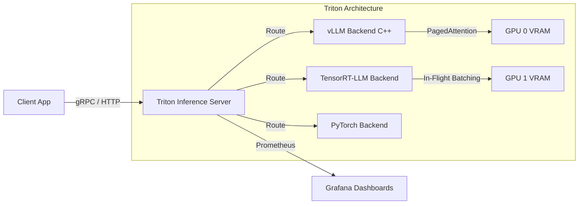
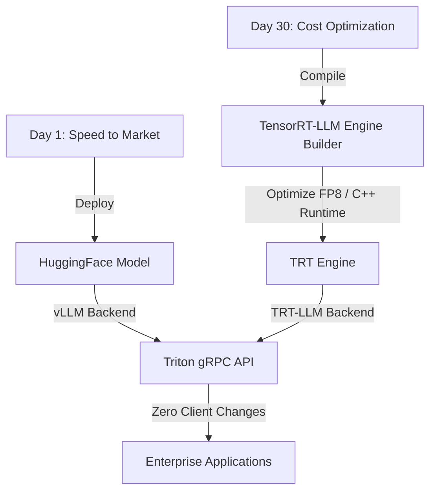
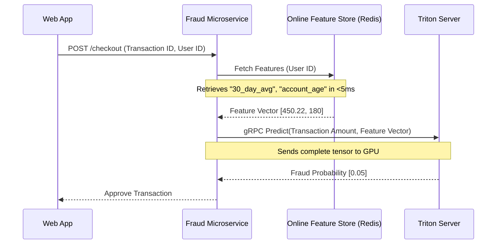

# Masterclass: Inference, MLOps, and L7 Networking

## Foundations: start here before using the interview question bank {#foundations-start-here-before-using-the-interview-question-bank}

Welcome to the definitive gauntlet on scaling AI inference in production. Serving a Large Language Model (LLM) or a massive recommender system is fundamentally different from serving a traditional microservice. The compute density, the memory bandwidth requirements, and the sheer length of network connections shatter traditional stateless assumptions.

This masterclass is designed for Principal Engineers, AI Infrastructure Architects, and Senior SREs. We will dissect the absolute limits of Layer 7 load balancing (Avi vs. NGINX), the deep internals of serving engines (Triton, vLLM, TensorRT), and the data pipelines required to feed these beasts continuously.

---

## Part 1: The Inference Load Balancing Conundrum

When moving from stateless web servers to stateful, long-lived, gRPC-streaming AI inference servers, the network data plane becomes the first major bottleneck. Let's explore the architectural divide between traditional reverse proxies and enterprise-grade Application Delivery Controllers (ADCs) in an AI context.

### Question 3: Avi LB vs NGINX LB (Why Enterprise L7/L4 Matters for AI)

**The Prompt:** "You are designing the inference endpoint for an LLM that utilizes gRPC streaming for token generation. Your team is currently using NGINX Open Source for traditional microservices and wants to reuse it for the LLM inference. What are the architectural limits of this approach, and how does an enterprise solution like VMware Avi (NSX Advanced Load Balancer) alter the design?"

:::danger Interview Trap
Do not start talking about SSL termination or basic round-robin routing. Do not assume all load balancers handle HTTP/2 and gRPC the same way. The trap is treating AI inference like a standard stateless HTTP/1.1 API. LLM generation uses long-lived streaming connections (Server-Sent Events or gRPC streams). 
:::

:::tip Golden Answer
NGINX Open Source struggles with LLM inference due to its event-driven worker model handling long-lived gRPC streams, leading to uneven load distribution (connection pinning) and configuration reloads causing dropped tokens. Avi networks separates the control plane from the data plane, scaling out Service Engines (SEs) dynamically. Avi provides native gRPC analytics, BGP/ECMP integration for scale-out at L4, and avoids connection pinning through deep L7 inspection and dynamic flow rebalancing.
:::

#### The Architecture of the Problem: gRPC and Connection Pinning

Inference for LLMs like Llama-3 or Mixtral typically uses gRPC for high-performance, low-latency communication. gRPC runs on HTTP/2. HTTP/2 multiplexes multiple requests over a single, persistent TCP connection. 

When a standard reverse proxy (like NGINX) load balances HTTP/2 traffic, it balances the *TCP connections* (L4), not the *individual streams* within the HTTP/2 connection (L7), unless specifically and optimally configured for deep L7 inspection which introduces heavy CPU overhead on the NGINX worker.

1.  **Connection Pinning (The NGINX Dilemma):** Multiple clients connect to a frontend application, which opens a single HTTP/2 connection to the Load Balancer, which opens persistent HTTP/2 connections to the Triton Inference Servers. Because requests are multiplexed over these pinned connections, backend servers become unbalanced. One GPU might be at 100% utilization while another is at 10%, strictly because heavy streams happened to get multiplexed onto the TCP connection terminating at GPU 1.
2.  **Configuration Reloads:** In dynamic Kubernetes environments, Pod IPs change constantly. NGINX Open Source (and even NGINX Ingress Controller in many setups) requires a process reload (`nginx -s reload`) to apply new upstream IP addresses. Reloading gracefully handles HTTP/1.1, but for long-lived gRPC streams returning tokens, reloads frequently sever the connection, causing "broken pipe" errors for the end user mid-generation.

#### NGINX Deep Dive (The Baseline)

To make NGINX work even marginally well for gRPC, you have to bypass L4 and force L7 gRPC routing.

```nginx
# Typical NGINX configuration for gRPC - notice the manual tuning required
http {
    upstream grpc_inference_servers {
        # Keepalive is mandatory for performance, but exacerbates pinning
        keepalive 32; 
        
        # We must use IP hash or least_conn to try and mitigate pinning, 
        # but it's fundamentally flawed for long-lived HTTP/2
        least_conn;   
        
        server triton-backend-1:8001;
        server triton-backend-2:8001;
    }

    server {
        listen 80 http2;
        server_name inference.ai.corp;

        location / {
            grpc_pass grpc://grpc_inference_servers;
            
            # Timeout tuning is critical for LLMs. Default 60s will break long generations
            grpc_read_timeout 300s;
            grpc_send_timeout 300s;
            
            # Buffer tuning: LLM tokens are small, so buffering can actually induce latency
            grpc_buffer_size 4k;
        }
    }
}
```

Even with this configuration, NGINX lacks the granular visibility into the gRPC payload to balance based on *computational cost*. A request for 10 tokens looks identical at L4/L7 header level as a request for 8000 tokens.

#### VMware Avi (NSX Advanced Load Balancer) Architecture

Avi fundamentally shifts the architecture from an appliance-centric model to a Software-Defined model.

1.  **Control Plane / Data Plane Separation:** Avi Controller (Control Plane) manages fleets of Service Engines (SEs - Data Plane). When a new Triton model is deployed, the Controller automatically provisions or reconfigures SEs without dropping existing flows.
2.  **Elastic HA and Scale-Out:** Instead of Active/Standby, Avi scales out. A single Virtual IP (VIP) is advertised via BGP (ECMP) to the upstream router. Traffic hits multiple SEs simultaneously.
3.  **True L7 gRPC Multiplexing:** Avi's data plane is written (often leveraging DPDK for kernel bypass) to deeply inspect HTTP/2 frames. It can demultiplex gRPC streams from a single client connection and distribute individual requests across different backends based on server latency (measured in microseconds).
4.  **Hardware Health Checking:** NGINX does basic TCP/HTTP checks. Avi can run custom Python scripts as health monitors. We can configure Avi to query Triton's `/v2/health/ready` AND check NVIDIA DCGM metrics to ensure the GPU isn't experiencing Xid errors before sending traffic.

:::info Whiteboard Strategy: Avi BGP/ECMP Routing
Draw the client connecting to a Top of Rack (ToR) switch.
Show BGP ECMP hashing the flow to one of N Avi Service Engines.
Show the Service Engine doing L7 decryption/inspection.
Show the SE multiplexing individual gRPC streams to M Triton/vLLM backends.
Emphasize the isolation of failure domains.
:::

```mermaid
graph TD
    Client[Client Application] -->|TCP / TLS| Switch[ToR Switch / Router]
    Switch -->|BGP ECMP Hash| SE1[Avi Service Engine 1]
    Switch -->|BGP ECMP Hash| SE2[Avi Service Engine 2]
    Switch -->|BGP ECMP Hash| SE3[Avi Service Engine 3]
    
    subgraph Avi Data Plane
    SE1
    SE2
    SE3
    end
    
    SE1 -->|L7 gRPC Demux| Triton1[Triton Server 1 (GPU 0)]
    SE1 -->|L7 gRPC Demux| Triton2[Triton Server 2 (GPU 1)]
    SE2 -->|L7 gRPC Demux| Triton3[Triton Server 3 (GPU 2)]
    SE3 -->|L7 gRPC Demux| Triton1
    
    style Avi Data Plane fill:#f9f,stroke:#333,stroke-width:4px
```

#### Production Trade-offs

*   **Cost vs. Performance:** Avi is enterprise software; NGINX OS is free. For a 4-GPU setup, NGINX is fine. For a 1024-GPU cluster serving millions of users, the stranded compute (idle GPUs due to connection pinning) costs vastly more than the Avi licenses.
*   **Observability:** Avi provides per-request telemetry (Network Round Trip Time, Application Response Time). NGINX requires parsing access logs or installing expensive NGINX Plus / App Protect modules.

---

## Part 2: The Core of the Beast - Serving Engines

Once the network layer is solved, the traffic reaches the serving engine. Let's dissect the big three: Triton Inference Server, vLLM, and TensorRT/TensorRT-LLM.

### Question 9: Inferencing using Triton, vLLM, TensorRT

**The Prompt:** "Explain the layered architecture of serving an LLM. How do vLLM, TensorRT-LLM, and Triton Inference Server relate to each other? When would you use Triton standalone vs. Triton encapsulating vLLM or TensorRT-LLM?"

:::danger Interview Trap
Do not treat them as mutually exclusive competitors. Triton is a *serving framework*, TensorRT is an *optimization compiler*, and vLLM is an *execution engine* focused on memory management (PagedAttention). The trap is saying "We switched from Triton to vLLM" without realizing you lost all of Triton's enterprise features (metrics, multi-model serving, ensemble pipelines).
:::

:::tip Golden Answer
TensorRT-LLM compiles and optimizes the model weights for specific NVIDIA GPU architectures, applying techniques like FP8 quantization and operator fusion. vLLM is an execution engine that revolutionizes memory management during inference using PagedAttention, drastically increasing batch sizes. Triton Inference Server is the enterprise wrapper—it provides the gRPC/HTTP endpoints, dynamic batching, model versioning, and Prometheus metrics. In production, the optimal stack is Triton Inference Server running the vLLM or TensorRT-LLM backend.
:::

#### 1. TensorRT & TensorRT-LLM: The Compiler Layer

TensorRT is an SDK for high-performance deep learning inference. It includes a deep learning inference optimizer and runtime that delivers low latency and high throughput.

**What it does:**
1.  **Precision Calibration:** Converts FP16 or FP32 weights to INT8 or FP8, utilizing the Transformer Engine on Hopper (H100) and Ada Lovelace architectures.
2.  **Layer & Tensor Fusion:** Combines multiple operations (e.g., matrix multiplication followed by a bias add and an activation function) into a single CUDA kernel. This reduces kernel launch overhead and GPU memory reads/writes.
3.  **Kernel Auto-Tuning:** Selects the optimal CUDA kernel for the specific GPU architecture (e.g., A100 vs. H100).

*TensorRT-LLM* is a specific extension designed for the unique challenges of Large Language Models, specifically handling KV Cache and decoding optimizations (like FlashAttention and In-Flight Batching).

#### 2. vLLM: The Memory Management Revolution

Prior to vLLM, serving LLMs was severely bottlenecked by memory. When an LLM generates tokens, it stores intermediate states (Keys and Values) in the KV Cache.
Historically, serving engines allocated a contiguous block of maximum possible memory for the KV Cache of every request (e.g., max_sequence_length = 2048). If a request only generated 10 tokens, the remaining 2038 tokens' worth of memory was locked and wasted.

**The Solution: PagedAttention (The core of vLLM)**

vLLM borrowed a concept from operating systems: Virtual Memory and Paging.
Instead of contiguous blocks, vLLM divides the KV Cache into fixed-size "blocks" (e.g., 16 or 32 tokens).
As a request generates tokens, it dynamically allocates blocks. This reduces memory waste (internal fragmentation) from ~60% down to under 4%.

*Because memory waste is eliminated, vLLM can fit massively larger batch sizes into the GPU VRAM, increasing throughput by 2x to 4x.*

#### 3. Triton Inference Server: The Enterprise Gateway

Triton is the orchestrator. You do not want applications talking directly to Python-based vLLM API servers in production. You want Triton.

**Why Triton?**
1.  **Multi-Backend Support:** Triton can run Python (vLLM), ONNX, TensorRT, PyTorch, and TensorFlow models *concurrently* on the same GPU.
2.  **Concurrent Model Execution:** It manages GPU memory to allow multiple different models to share a single GPU.
3.  **Ensemble Pipelines:** You can define a pipeline: Client -> Preprocessing (Python) -> Model Execution (TensorRT) -> Postprocessing (Python) -> Client. This data never leaves the GPU memory (CUDA IPC).
4.  **Dynamic Batching:** Triton intercepts incoming requests and holds them for a configurable window (e.g., 5ms) to combine them into a larger batch before sending them to the GPU.



#### Production Configuration: Triton + vLLM

To deploy vLLM inside Triton, you configure a `model.json` or `config.pbtxt`. Here is a production-grade Triton configuration for a vLLM backend:

```protobuf
# config.pbtxt
name: "llama-3-8b-vllm"
backend: "vllm"
max_batch_size: 0 # Handled internally by vLLM continuous batching

model_transaction_policy {
  decoupled: True # Essential for streaming responses!
}

# Input for prompt
input [
  {
    name: "text_input"
    data_type: TYPE_STRING
    dims: [ 1 ]
  },
  {
    name: "stream"
    data_type: TYPE_BOOL
    dims: [ 1 ]
  },
  {
    name: "sampling_parameters"
    data_type: TYPE_STRING
    dims: [ 1 ]
    optional: true
  }
]

# Output for generated text
output [
  {
    name: "text_output"
    data_type: TYPE_STRING
    dims: [ -1 ]
  }
]

instance_group [
  {
    count: 1
    kind: KIND_GPU
  }
]

# vLLM Engine Arguments mapped to Triton
parameters: {
  key: "model",
  value: {string_value: "/model-repository/llama-3-8b-hf"}
}
parameters: {
  key: "gpu_memory_utilization",
  value: {string_value: "0.85"} # Reserve 15% for Triton/OS overhead
}
parameters: {
  key: "max_num_batched_tokens",
  value: {string_value: "8192"}
}
parameters: {
  key: "tensor_parallel_size",
  value: {string_value: "1"} # Increase if spanning multiple GPUs
}
```

:::info Whiteboard Strategy: Decoupled Mode
When diagramming Triton for LLMs, always explicitly draw the `decoupled: True` policy. Explain that in standard inference, 1 request = 1 response. In LLM streaming, 1 request = N responses (tokens). The decoupled transaction policy allows the Triton backend to send responses back over the gRPC stream asynchronously as they are generated by vLLM.
:::

---

## Part 3: Data Preparation Pipelines and MLOps

Models are useless without data. In classical ML, we had static datasets. In generative AI, data is dynamic, unstructured, and massive.

### The Problem: The Data Bottleneck

You have a 128-GPU cluster ready for Fine-Tuning or RAG (Retrieval-Augmented Generation). If your data preparation pipeline runs on a single CPU node using Pandas, your $3,000,000 GPU cluster will sit idle at 5% utilization waiting for data.

### Question: Designing the High-Throughput Data Pipeline

**The Prompt:** "Describe the architecture of a data preparation pipeline for an enterprise RAG system. How do you handle document ingestion, chunking, embedding generation, and vector database ingestion at scale without bottlenecking on compute?"

:::danger Interview Trap
The trap is suggesting synchronous, monolithic pipelines. "I will write a Python script that reads PDFs, uses LangChain to chunk them, calls the OpenAI/Triton API to embed, and writes to Pinecone." This fails at scale. It ignores failure domains, lacks idempotency, and bottlenecks heavily on I/O.
:::

:::tip Golden Answer
A production data pipeline must be distributed and asynchronous. I would use an orchestrator like Apache Airflow or Prefect to manage state. Data processing (parsing, chunking) should be distributed across a CPU cluster using Ray Data or Apache Spark. Embedding generation must be done in batches using Triton Inference Server on dedicated GPUs. The final embeddings are asynchronously sunk into a distributed Vector Database like Milvus or Qdrant using Kafka as a buffer to handle backpressure.
:::

#### 1. Distributed Data Processing (Ray Data)

For AI workloads, **Ray** has become the de facto standard over Spark due to its native integration with Python ML ecosystems and GPU awareness.

**The Ray Pipeline:**
1.  **Read:** Ray distributes the reading of raw files (PDFs, JSON, Parquet) from S3 across hundreds of CPU workers.
2.  **Map_Batches (Chunking):** Instead of processing row-by-row, Ray processes in batches. We use libraries like Unstructured.io to parse PDFs and LangChain/LlamaIndex token splitters to create chunks (e.g., 512 tokens with 50 token overlap).
3.  **Map_Batches (Embedding - The GPU Step):** This is the critical handoff. Ray sends batches of text chunks to Triton Inference Server hosting an embedding model (e.g., `bge-m3` or `nomic-embed-text`).

```python
# Conceptual Ray Data Pipeline for massive scale embedding
import ray

# 1. Initialize Ray cluster connection
ray.init(address="auto")

# 2. Read raw text from S3 distributed
ds = ray.data.read_parquet("s3://corp-data-lake/raw_documents/")

def chunk_document(batch):
    # Process a batch of rows (Pandas DataFrame or dict)
    chunks = []
    for doc in batch["text"]:
        # Apply recursive character splitting
        chunks.extend(splitter.split_text(doc))
    return {"text_chunks": chunks}

# 3. Distributed CPU execution for chunking
chunked_ds = ds.map_batches(chunk_document, batch_size=100)

class EmbeddingPredictor:
    def __init__(self):
        # Initialize gRPC client to Triton here to avoid overhead
        import tritonclient.grpc as grpcclient
        self.client = grpcclient.InferenceServerClient(url="triton.ai.corp:8001")
        
    def __call__(self, batch):
        # 4. Distributed GPU execution via Triton
        # Convert text to tokens, send to Triton, receive vectors
        vectors = query_triton_embedding_model(self.client, batch["text_chunks"])
        return {"embedding": vectors, "metadata": batch["metadata"]}

# 5. Execute embedding on instances with GPUs or optimized network paths to Triton
embedded_ds = chunked_ds.map_batches(
    EmbeddingPredictor,
    concurrency=50, # Scale out 50 concurrent embedding tasks
    batch_size=256
)

# 6. Sink to Vector DB
embedded_ds.write_datasource(MilvusDatasource(), uri="tcp://milvus.ai.corp:19530")
```

#### 2. Vector Database Architecture (Milvus/Qdrant)

A Vector DB is not just a standard database with a cosine similarity function. At scale, it requires complex indexing.

*   **HNSW (Hierarchical Navigable Small World):** The standard algorithm for Approximate Nearest Neighbor (ANN) search. It builds a multi-layered graph. The top layers have few nodes (fast, coarse search), and lower layers have more nodes (fine, exact search).
*   **Memory Footprint:** HNSW indices are massive and must reside in RAM for low-latency retrieval. 1 billion 768-dimensional vectors can consume hundreds of gigabytes of RAM.
*   **Separation of Compute and Storage:** Modern Vector DBs (like Milvus) separate the storage (S3/MinIO), the metadata (etcd), the message broker for real-time ingestion (Kafka/Pulsar), and the Query Nodes (memory-intensive CPU nodes executing HNSW).

#### 3. MLOps: Monitoring the Unpredictable (Drift and Metrics)

In traditional software, if latency is < 200ms and HTTP 500s are < 1%, the system is healthy.
In Generative AI, the system can return HTTP 200 and < 200ms latency, but the output could be complete garbage (hallucinations, toxicity, data drift).

**Triton Prometheus Metrics:**
Triton exposes deep metrics. You must monitor:
*   `nv_inference_request_success`: Standard success rate.
*   `nv_inference_queue_duration_us`: Time spent waiting in the dynamic batcher. If this spikes, your batch size is too large or you lack GPU compute.
*   `nv_inference_compute_input_duration_us` / `nv_inference_compute_infer_duration_us`: Time spent copying data to GPU (PCIe bottleneck) vs actual execution time.

**LLM Observability (The New MLOps layer):**
You must deploy an LLM evaluation proxy (like LangSmith, Arize, or TruEra) or route a percentage of outputs to an evaluator model (LLM-as-a-Judge) to monitor:
1.  **Context Relevance:** Did the retrieved RAG chunks actually answer the question?
2.  **Faithfulness:** Is the generated answer strictly derived from the context, or did the model hallucinate?
3.  **Toxicity/Jailbreaks:** Did the user bypass system prompts?

---
## Summary of the Inference Gauntlet

Scaling AI is a full-stack engineering challenge.
1.  **Network:** You cannot use standard HTTP/1.1 load balancing. You need deep L7 inspection, gRPC multiplexing, and BGP ECMP (Avi) to saturate GPUs.
2.  **Compute:** You cannot naively run PyTorch scripts. You need TensorRT to compile for hardware, vLLM to manage VRAM via PagedAttention, and Triton to orchestrate the entire pipeline securely.
3.  **Data:** You cannot use single-threaded scripts. You need Ray Data for distributed chunking and highly available Vector Databases with HNSW indexing to feed the beast.

Master these three pillars, and you transition from "running models" to "engineering AI platforms."

---

## Part 4: Production Troubleshooting Scenarios (The War Room)

Let's dive into real-world outages and how a Principal Engineer isolates the fault across the complex AI infrastructure stack.

### Scenario A: The P99 Latency Spike during High Load

**Symptom:** During peak hours, the P50 latency of your LLM application remains stable at 1.5 seconds, but the P99 latency spikes drastically to 15 seconds. End users complain of extreme sluggishness. 

**Initial Triage (The Wrong Path):** Junior engineers immediately blame the GPU. They look at `nvidia-smi` and see 95% utilization and assume the GPUs are maxed out, requesting more nodes.

**Deep Architecture Analysis (The Right Path):**
High P99 with stable P50 in LLMs is almost always a queuing or token-length problem, not a pure compute bottleneck. 

1.  **Investigating Triton Metrics:** Look at `nv_inference_queue_duration_us`. If this metric is skyrocketing specifically for a small subset of requests, the dynamic batcher is holding requests too long, OR the continuous batching engine (vLLM) is starved for KV Cache memory.
2.  **The vLLM KV Cache Starvation:** In vLLM, if a prompt comes in that is exceptionally large (e.g., a user pastes a 20-page document into the chat), vLLM must allocate hundreds of KV Cache blocks immediately. If the GPU VRAM is highly utilized by existing streams (high concurrency), vLLM will *preempt* existing requests.
3.  **Preemption and Recomputation:** When vLLM preempts a request, it swaps its KV Cache to CPU RAM, or worse, drops it and forces a recomputation (Prefill phase) when memory frees up. The Prefill phase is incredibly compute-intensive compared to the Decode (generation) phase. This recomputation causes the massive 15-second delay.

**The Fix:**
*   **Short Term:** Reduce `max_num_batched_tokens` in Triton/vLLM config. This forces the system to take fewer concurrent requests, reserving more VRAM per request, eliminating preemption.
*   **Long Term:** Implement strict API Gateway limits on input token length. Introduce a routing tier that sends massive prompts to a dedicated pool of A100 80GB/H100 GPUs, while routing short conversational prompts to L4/A10G GPUs.

### Scenario B: The Silent Out-of-Memory (OOM) Killer

**Symptom:** Your Triton inference server pods are randomly restarting. Kubernetes events show `OOMKilled`. 

**Initial Triage:** You check GPU memory using DCGM exporter, but GPU memory (VRAM) never hits 100%. 

**Deep Architecture Analysis:**
AI engineers often focus exclusively on GPU VRAM and forget System RAM.
1.  **Model Loading Overhead:** When Triton loads a 40GB model (like a quantized 70B parameter model) from disk/network, it first loads it into System RAM before transferring it to GPU VRAM via PCIe.
2.  **Concurrent Model Loading:** If you instruct Triton to load multiple models simultaneously, or if you are using PyTorch backends that have massive CPU memory overheads, the Kubernetes Pod will exceed its CPU RAM `limits` and be aggressively killed by the Linux kernel's OOM Killer.
3.  **Shared Memory (shm):** Triton heavily utilizes shared memory (`/dev/shm`) for passing data between the Python backend processes and the main C++ Triton server process. If the pod's `shm_size` is too small (default in Docker is often 64MB), Triton will crash or fall back to slow disk I/O.

**The Fix:**
*   **Pod Configuration:** Ensure the Kubernetes Pod specification has `resources.requests.memory` and `resources.limits.memory` set adequately high (e.g., 2x the size of the model weights).
*   **Shared Memory Mount:** Always mount a large `emptyDir` backed by memory to `/dev/shm` in the Kubernetes pod spec for Triton.

```yaml
# Kubernetes Pod Spec Snippet for Triton
containers:
  - name: triton
    image: nvcr.io/nvidia/tritonserver:23.10-py3
    resources:
      limits:
        nvidia.com/gpu: 1
        memory: "128Gi" # System RAM, not VRAM
    volumeMounts:
      - mountPath: /dev/shm
        name: dshm
volumes:
  - name: dshm
    emptyDir:
      medium: Memory # Crucial for high-throughput IPC
      sizeLimit: "16Gi"
```

### Scenario C: The L4 Load Balancer Connection Pinning Deadlock

**Symptom:** You have 10 inference servers behind an NGINX L4 load balancer (TCP mode). Traffic scales up. Servers 1 and 2 are crashing from overload, while Servers 3 through 10 are completely idle.

**Deep Architecture Analysis:**
This is the classic gRPC/HTTP2 connection pinning issue mentioned in Part 1, played out in production.
Because the downstream microservice (e.g., the Chat API) established persistent HTTP/2 connections to the NGINX LB when the cluster first started, NGINX balanced those TCP connections across available backends. 
However, as *request volume* inside those connections increased, NGINX at L4 has no visibility. It just sees active TCP pipes. If one specific microservice pod suddenly sends a massive burst of chat requests, all those requests flow down the *single* pinned TCP connection to Server 1.

**The Fix:**
*   **Immediate Mitigation:** Force the downstream Chat API clients to periodically disconnect and reconnect (e.g., set `max_connection_age` in the gRPC client to 5 minutes). This forces NGINX to re-balance new TCP connections.
*   **Architectural Fix:** Migrate to true L7 gRPC load balancing (VMware Avi, Envoy, or Linkerd service mesh) that inspects the HTTP/2 frames and routes *requests* (streams), not *connections*.

---

## Part 5: Deep Dive - TensorRT-LLM Paged KV Cache vs. vLLM PagedAttention

A common senior interview question asks to contrast how vLLM and TensorRT-LLM handle memory. 

While vLLM introduced PagedAttention, TensorRT-LLM adopted the concept and optimized it deeply for NVIDIA hardware via specialized CUDA kernels.

### vLLM's PagedAttention
vLLM manages the KV cache strictly at the Python/C++ integration layer. It maintains a block table mapping logical tokens to physical memory blocks. When a kernel executes, it uses a custom Triton (OpenAI's Triton language, not NVIDIA's Inference Server) or CUDA kernel that understands these pointers.
*   **Pros:** Highly flexible, rapidly supports new model architectures as they emerge on HuggingFace.
*   **Cons:** Python overhead in the scheduling loop can become a bottleneck at extremely high concurrency.

### TensorRT-LLM In-Flight Batching and Paged KV Cache
TensorRT-LLM pushes the scheduling and memory management deeper into the C++ runtime and specifically compiled CUDA kernels.
*   **In-Flight Batching (Continuous Batching):** Similar to vLLM, it doesn't wait for all requests in a batch to finish. As soon as one sequence finishes generating, another sequence is slotted into the active batch on the GPU in the very next iteration.
*   **Hardware Alignment:** TensorRT-LLM's implementation is rigorously aligned with the specific hardware layout of the GPU's memory hierarchy (L1/L2 cache sizes, memory controllers). It leverages the Transformer Engine for mixed-precision caching (storing KV cache in FP8 format on H100s, drastically doubling the available memory capacity compared to FP16).
*   **Pros:** Absolute maximum performance, lowest latency, highest throughput on NVIDIA hardware. Native integration with NVIDIA's hardware roadmaps.
*   **Cons:** Requires an Ahead-of-Time (AoT) compilation step (building the TRT engine). The workflow is slightly more complex than just pointing vLLM to a HuggingFace repository.

### The Synergy in Triton
This is why Triton is the ultimate wrapper. You can deploy vLLM via the Triton python backend for rapid prototyping and Day 1 support of a new model.
Three weeks later, once the model is stable and you need to optimize COGS (Cost of Goods Sold), you compile the model with TensorRT-LLM, swap the Triton backend configuration from `vllm` to `tensorrtllm`, and update the model repository. 
**The downstream client applications experience zero downtime and zero API changes.**



---

## Part 6: Advanced MLOps - Feature Stores and Online Inference

When moving from LLMs back to traditional Deep Learning (e.g., massive Recommender Systems, Fraud Detection), the MLOps pipeline shifts focus from "Chunking Text" to "Feature Synchronization."

### The Challenge: Training-Serving Skew
A fraud detection model is trained on historical data (e.g., "User account age", "Average transaction size over 30 days"). 
When a transaction happens in real-time, the inference engine must have access to the *exact same* features, computed in real-time. If the logic to compute "Average transaction size" in the streaming pipeline (Flink) differs slightly from the logic used in the batch training pipeline (Spark), the model will make wildly inaccurate predictions. This is Training-Serving Skew.

### The Solution: The Feature Store
A Feature Store (like Feast or Hopsworks) is a centralized repository for ML features.

1.  **Offline Store (The Data Lake):** Backed by Parquet/S3/Snowflake. Used for batch processing and generating massive datasets for model training. Optimized for high-throughput scans.
2.  **Online Store (The Redis/Memcached layer):** Backed by high-speed, low-latency KV stores. Used during real-time inference.
3.  **The Ingestion Engine:** Ensure that when a new transaction occurs, the feature is updated in *both* the offline and online stores using the identical transformation logic.

### Inference Data Flow with Feature Store



Notice the critical architecture here: **Triton does not fetch data.** Triton is purely a computational engine. The application layer (API) fetches the necessary context (Features from the Feature Store, or Text from a Vector DB) and packages it into a dense Tensor to send to Triton. This preserves separation of concerns and keeps the GPU strictly focused on math.

---

## Conclusion

Scaling AI is not about writing better PyTorch code. It is a distributed systems engineering discipline. 
It requires understanding hardware memory hierarchies, deep network protocols (HTTP/2, gRPC), container orchestration, and stateful memory management (PagedAttention). 
By mastering enterprise load balancing (Avi), advanced serving engines (Triton, TensorRT-LLM), and robust MLOps data pipelines (Ray, Feature Stores), you bridge the gap between a data scientist's Jupyter notebook and a global, highly available AI service.


---

## Part 7: Multi-Node Inference and Distributed Parallelism

When model weights exceed the capacity of a single GPU, or even a single 8-GPU node (like serving a 405B parameter model or a massive Mixture of Experts (MoE) architecture), single-node serving engines fail. We must enter the realm of distributed inference.

### Question: Tensor Parallelism vs. Pipeline Parallelism in Inference

**The Prompt:** "You are tasked with deploying a 175B parameter LLM in FP16 format for inference. It requires approximately 350GB of VRAM just for weights, exceeding a single 80GB A100 GPU. How do you partition this model across multiple GPUs, and what are the networking implications if you must span across physical server nodes?"

:::danger Interview Trap
Do not suggest simply using CPU RAM to hold the weights and swapping them into the GPU. That is called Offloading (like in HuggingFace Accelerate or DeepSpeed ZeRO-Offload), and while it works for local experimentation, the PCIe bus latency will destroy production inference throughput. You must distribute the weights across multiple GPUs natively.
:::

:::tip Golden Answer
For a 175B model, we must use Model Parallelism. **Tensor Parallelism (TP)** splits individual matrix operations across multiple GPUs (e.g., splitting a linear layer's weight matrix into chunks). This requires extremely high-bandwidth, low-latency communication (NVLink/NVSwitch) because GPUs must synchronize after every layer. **Pipeline Parallelism (PP)** splits the model layer-by-layer across GPUs (e.g., layers 1-10 on GPU 0, 11-20 on GPU 1). If we must cross physical nodes, we use Pipeline Parallelism across the nodes (connected via InfiniBand/RoCEv2) and Tensor Parallelism within the node (connected via NVLink).
:::

#### Deep Architecture: Tensor Parallelism (Intra-Node)
In Tensor Parallelism, a single matrix multiplication is divided. 
If $Y = XA$, we can split the weight matrix $A$ column-wise into $A_1$ and $A_2$. 
GPU 0 computes $Y_1 = XA_1$. GPU 1 computes $Y_2 = XA_2$.
The final output is simply concatenating the results $[Y_1, Y_2]$.

**The Network Bottleneck:** 
Because the output of this layer is the input to the next, GPU 0 and GPU 1 must exchange their results *immediately* via an `AllReduce` operation. 
If this communication happens over PCIe or standard Ethernet, the GPUs will stall waiting for data. This is why Tensor Parallelism is almost exclusively restricted to GPUs within the same physical chassis, connected by NVLink (up to 900 GB/s bidirectional bandwidth on Hopper).

#### Deep Architecture: Pipeline Parallelism (Inter-Node)
In Pipeline Parallelism, the model is sliced horizontally. 
GPU 0 holds the Embedding layer and Transformer blocks 1-10. GPU 1 holds blocks 11-20, etc.

**The Network Bottleneck:**
GPU 0 processes the input and sends the intermediate hidden states (activations) to GPU 1. 
This is a point-to-point communication (`Send/Recv`). The bandwidth requirement is much lower than Tensor Parallelism, making it suitable for crossing physical server boundaries over a high-speed network like NVIDIA Quantum InfiniBand or RoCEv2 (RDMA over Converged Ethernet).

#### The MPI and NCCL Layer for Inference
To execute distributed inference, serving engines like Triton and TensorRT-LLM rely on the same primitives used in training:
*   **MPI (Message Passing Interface):** Used by Triton to launch multiple instances of the backend process across different GPUs or nodes. 
*   **NCCL (NVIDIA Collective Communications Library):** Used by the GPUs to execute the `AllReduce` (for TP) and `Send/Recv` (for PP) operations over NVLink or InfiniBand bypassing the CPU entirely (RDMA/GPUDirect).

```mermaid
graph TD
    subgraph Node 1: NVLink Domain (Tensor Parallelism = 4)
        GPU0[GPU 0: TP Rank 0, PP Rank 0] <-->|NVLink AllReduce| GPU1[GPU 1: TP Rank 1, PP Rank 0]
        GPU1 <-->|NVLink AllReduce| GPU2[GPU 2: TP Rank 2, PP Rank 0]
        GPU2 <-->|NVLink AllReduce| GPU3[GPU 3: TP Rank 3, PP Rank 0]
    end
    
    subgraph Node 2: NVLink Domain (Tensor Parallelism = 4)
        GPU4[GPU 0: TP Rank 0, PP Rank 1] <-->|NVLink AllReduce| GPU5[GPU 1: TP Rank 1, PP Rank 1]
        GPU5 <-->|NVLink AllReduce| GPU6[GPU 2: TP Rank 2, PP Rank 1]
        GPU6 <-->|NVLink AllReduce| GPU7[GPU 3: TP Rank 3, PP Rank 1]
    end
    
    Node 1 <-->|InfiniBand / RoCEv2 / NCCL Send-Recv| Node 2
    
    style Node 1 fill:#e6f7ff,stroke:#333,stroke-width:2px
    style Node 2 fill:#e6f7ff,stroke:#333,stroke-width:2px
```

---

## Part 8: Infrastructure as Code (IaC) for AI

A Masterclass is incomplete without the actual code to deploy this infrastructure. Let's look at the exact Kubernetes configurations required for a highly available, telemetry-rich Triton deployment.

### 1. The Triton Kubernetes Deployment (Production Grade)

This manifest demonstrates best practices: anti-affinity rules, shared memory mounts, proper readiness probes querying the Triton health endpoint, and Prometheus annotations.

```yaml
apiVersion: apps/v1
kind: Deployment
metadata:
  name: triton-inference-server
  namespace: ai-platform
  labels:
    app: triton
spec:
  replicas: 4
  selector:
    matchLabels:
      app: triton
  template:
    metadata:
      labels:
        app: triton
      annotations:
        # Crucial for MLOps observability
        prometheus.io/scrape: "true"
        prometheus.io/port: "8002"
        prometheus.io/path: "/metrics"
    spec:
      # Spread pods across different physical nodes to survive node failure
      affinity:
        podAntiAffinity:
          preferredDuringSchedulingIgnoredDuringExecution:
          - weight: 100
            podAffinityTerm:
              labelSelector:
                matchExpressions:
                - key: app
                  operator: In
                  values:
                  - triton
              topologyKey: kubernetes.io/hostname
      containers:
      - name: triton
        image: nvcr.io/nvidia/tritonserver:23.10-vllm-python-py3
        command: ["tritonserver"]
        args:
          - "--model-repository=s3://corp-ai-models/production-registry"
          - "--log-verbose=1"
          - "--strict-model-config=false"
        ports:
        - containerPort: 8000
          name: http
        - containerPort: 8001
          name: grpc
        - containerPort: 8002
          name: metrics
        env:
        - name: AWS_ACCESS_KEY_ID
          valueFrom:
            secretKeyRef:
              name: s3-credentials
              key: access_key
        - name: AWS_SECRET_ACCESS_KEY
          valueFrom:
            secretKeyRef:
              name: s3-credentials
              key: secret_key
        # Required for S3 model repository
        - name: AWS_REGION
          value: "us-west-2"
        resources:
          limits:
            nvidia.com/gpu: 2 # Assuming Tensor Parallelism = 2
            memory: "64Gi"
            cpu: "16"
        volumeMounts:
        - mountPath: /dev/shm
          name: dshm
        readinessProbe:
          httpGet:
            path: /v2/health/ready
            port: 8000
          initialDelaySeconds: 30
          periodSeconds: 10
          # LLMs take a long time to load weights into VRAM
          timeoutSeconds: 5
          failureThreshold: 30 
      volumes:
      - name: dshm
        emptyDir:
          medium: Memory
          sizeLimit: "32Gi"
```

### 2. The Avi NSX Advanced Load Balancer Ingress

To wire up the gRPC routing we discussed in Part 1, we use Avi's AKO (Avi Kubernetes Operator). The following `IngressClass` and custom annotations instruct Avi to handle the L7 HTTP/2 gRPC traffic, utilizing its DPDK data plane.

```yaml
apiVersion: networking.k8s.io/v1
kind: Ingress
metadata:
  name: triton-grpc-ingress
  namespace: ai-platform
  annotations:
    # Instruct AKO to provision an Avi Virtual Service
    kubernetes.io/ingress.class: avi
    # Critical: Tell Avi this is gRPC, so it demultiplexes streams
    ako.vmware.com/app-profile: "System-gRPC"
    # Enable L7 Analytics for observability
    ako.vmware.com/analytics-profile: "System-Analytics-Profile"
spec:
  rules:
  - host: inference.ai.corp
    http:
      paths:
      - path: /
        pathType: Prefix
        backend:
          service:
            name: triton-grpc-service
            port:
              number: 8001
```

---

## Part 9: Building the Custom Python Backend for Triton

While vLLM and TensorRT-LLM are pre-compiled C++ backends, you often need to write custom Python backends for pre-processing (like LangChain document parsing before embedding) or for models not supported by standard engines.

Writing a Triton Python backend requires implementing a specific `TritonPythonModel` class.

### The Decoupled Streaming Python Backend

Here is a raw, deep-dive example of a custom Python backend utilizing the `decoupled: True` policy we discussed in Part 2. This is how you implement Server-Sent Events (SSE) or streaming gRPC manually.

```python
# model.py (Inside the Triton model repository)
import triton_python_backend_utils as pb_utils
import json
import time
import threading

class TritonPythonModel:
    def initialize(self, args):
        """
        Called once when the model is loaded.
        """
        self.model_config = json.loads(args['model_config'])
        
        # Verify the model is configured for decoupled mode
        if not pb_utils.is_decoupled(self.model_config):
            raise pb_utils.TritonModelException(
                "This model must be configured with 'decoupled: True' in config.pbtxt"
            )
            
        print("Model initialized. Loaded weights and custom logic.")

    def execute(self, requests):
        """
        In decoupled mode, execute() must return immediately.
        We spawn a thread to handle the asynchronous generation and send responses back.
        """
        for request in requests:
            # Create a Response Sender object tied to this specific request
            response_sender = request.get_response_sender()
            
            # Extract input tensors
            in_tensor = pb_utils.get_input_tensor_by_name(request, "prompt")
            prompt_str = in_tensor.as_numpy()[0].decode('utf-8')
            
            # Spawn a thread to process the stream
            thread = threading.Thread(
                target=self._generate_and_stream,
                args=(prompt_str, response_sender)
            )
            thread.start()
            
        # Return nothing immediately (the thread handles responses)
        return None

    def _generate_and_stream(self, prompt, response_sender):
        """
        Simulates an LLM generating tokens over time.
        """
        try:
            tokens = ["This", " is", " a", " custom", " streamed", " response."]
            
            for token in tokens:
                # 1. Create the output tensor
                out_tensor = pb_utils.Tensor(
                    "generated_text",
                    np.array([token.encode('utf-8')], dtype=np.object_)
                )
                
                # 2. Package into an InferenceResponse
                response = pb_utils.InferenceResponse(
                    output_tensors=[out_tensor]
                )
                
                # 3. Send the response over the open gRPC stream
                response_sender.send(response)
                
                # Simulate compute time
                time.sleep(0.1)
                
            # 4. Critical: Signal that the stream is finished
            response_sender.send(
                flags=pb_utils.TRITONSERVER_RESPONSE_COMPLETE_FINAL
            )
            
        except Exception as e:
            # Send an error if something crashes mid-generation
            error = pb_utils.TritonError(f"Stream failed: {str(e)}")
            response = pb_utils.InferenceResponse(error=error)
            response_sender.send(response)
            response_sender.send(flags=pb_utils.TRITONSERVER_RESPONSE_COMPLETE_FINAL)

    def finalize(self):
        """
        Called when Triton unloads the model. Clean up resources here.
        """
        print("Cleaning up model resources.")
```

### Why this matters for the AI Engineer
Understanding the Python backend API means you are not reliant on black-box containers. If a new RAG technique emerges (like GraphRAG or complex routing agents), you can embed that entire logic *inside* the Triton server via this API, ensuring it runs on the identical high-performance memory bus as the embedding model, eliminating network hops.

---

## Part 10: The Grafana Observability Dashboard (JSON)

To round out the gauntlet, MLOps requires observability. Below is an excerpt of the raw JSON for a Grafana dashboard panel designed to monitor the Triton Dynamic Batcher queue—the exact metric we discussed in Troubleshooting Scenario A.

```json
{
  "type": "timeseries",
  "title": "Triton Dynamic Batcher Queue Time (Microseconds)",
  "gridPos": {
    "h": 8,
    "w": 12,
    "x": 0,
    "y": 0
  },
  "targets": [
    {
      "datasource": {
        "type": "prometheus",
        "uid": "prometheus-prod-uid"
      },
      "expr": "rate(nv_inference_queue_duration_us{model=\"llama-3-8b\"}[1m]) / rate(nv_inference_request_success{model=\"llama-3-8b\"}[1m])",
      "legendFormat": "Queue Duration per Request",
      "refId": "A"
    }
  ],
  "options": {
    "tooltip": {
      "mode": "single",
      "sort": "none"
    },
    "legend": {
      "displayMode": "list",
      "placement": "bottom"
    }
  },
  "fieldConfig": {
    "defaults": {
      "color": {
        "mode": "palette-classic"
      },
      "custom": {
        "axisPlacement": "right",
        "axisLabel": "Microseconds",
        "drawStyle": "line",
        "lineInterpolation": "smooth",
        "lineWidth": 2,
        "fillOpacity": 10
      },
      "thresholds": {
        "mode": "absolute",
        "steps": [
          {
            "color": "green",
            "value": null
          },
          {
            "color": "orange",
            "value": 50000
          },
          {
            "color": "red",
            "value": 200000
          }
        ]
      }
    }
  }
}
```

This specific PromQL query `rate(queue_duration) / rate(request_success)` normalizes the queue time per request. The thresholds in the JSON (50,000 µs / 50ms for Orange, 200,000 µs / 200ms for Red) are enterprise standard alerts for conversational AI. If queuing exceeds 200ms, the Time To First Token (TTFT) will breach SLA, and you must scale out your replicas.


---

## Part 11: End-to-End Performance Tuning (The Hardware / Software Interface)

The final test in an architect's gauntlet is understanding what happens below the operating system layer. When you have perfectly optimized Triton, deployed on Avi, with vLLM PagedAttention, but are *still* missing your latency SLAs, you must drop down to the hardware topologies.

### Question: NUMA and PCIe Topologies in Inference Scale-Out

**The Prompt:** "You have a DGX or HGX 8-GPU system. Your inference workloads involve massive inputs (high network ingress) and require frequent GPU-to-GPU communication. You notice that networking throughput is inexplicably capped at 40% of the NIC's theoretical maximum, and CPU utilization is spiking on random cores. Diagnose the architectural failure."

:::danger Interview Trap
Do not immediately suggest upgrading the network switches or blaming Python's Global Interpreter Lock (GIL). The trap is assuming all CPU cores and all Network Interface Cards (NICs) have equal physical distance to all GPUs.
:::

:::tip Golden Answer
This is a classic Non-Uniform Memory Access (NUMA) and PCIe topology misalignment. Modern 8-GPU systems have multiple CPU sockets and complex PCIe switches. If the Network Interface Card (NIC) receiving the inference request is physically connected to CPU Socket 0, but the GPU executing the inference is connected to CPU Socket 1, the data must traverse the slow, congested QPI/UPI interconnect between the CPUs. We must pin the Triton execution threads and map the incoming network flows to the specific NUMA node and NIC that are physically closest to the target GPU.
:::

#### Deep Architecture: The HGX Topology

Let's look at a simplified, abstract mapping of an NVIDIA HGX baseboard architecture:

*   **NUMA Node 0 (CPU 0):** Connected via PCIe Switch 0 to GPU 0, GPU 1, and NIC 0.
*   **NUMA Node 1 (CPU 0):** Connected via PCIe Switch 1 to GPU 2, GPU 3, and NIC 1.
*   **NUMA Node 2 (CPU 1):** Connected via PCIe Switch 2 to GPU 4, GPU 5, and NIC 2.
*   **NUMA Node 3 (CPU 1):** Connected via PCIe Switch 3 to GPU 6, GPU 7, and NIC 3.

**The Failure Scenario:**
1. A gRPC request for inference arrives on NIC 3 (which is physically bound to NUMA Node 3).
2. Kubernetes, unaware of hardware topologies by default, schedules the Triton process handling this request onto CPU Core 2 (which is on NUMA Node 0).
3. The Triton process instructs GPU 0 (bound to NUMA Node 0) to execute the math.

**The Data Path:** 
`NIC 3 -> PCIe Switch 3 -> CPU 1 -> UPI/QPI Interconnect -> CPU 0 -> PCIe Switch 0 -> GPU 0`.

This cross-socket UPI/QPI jump introduces massive latency and bandwidth bottlenecks. It completely defeats the purpose of high-speed networking.

#### The Solution: Topology Manager and GPUDirect RDMA

To fix this, an AI Infrastructure Engineer must implement two technologies:

1.  **Kubernetes Topology Manager:** 
    You must configure the `kubelet` with the `--topology-manager-policy=single-numa-node` flag. This forces Kubernetes to only schedule a Pod if it can allocate the CPU, the RAM, and the GPU all from the *same* NUMA node.

2.  **GPUDirect RDMA (Remote Direct Memory Access):**
    For distributed inference (Pipeline Parallelism across nodes), we must bypass the CPU entirely. GPUDirect RDMA allows the NIC to write the incoming network payload *directly* into the GPU's VRAM.
    
    *Path with GPUDirect:* `NIC 0 -> PCIe Switch 0 -> GPU 0`. (The CPU is completely bypassed on the data plane).

### Troubleshooting NCCL Algorithms

When running Tensor Parallelism across GPUs, the NVIDIA Collective Communications Library (NCCL) automatically determines the fastest path (NVLink, PCIe, or Network) and the fastest algorithm (Ring or Tree).

Sometimes, due to a failing NVLink or a misconfigured PCIe ACS (Access Control Services) setting in the server BIOS, NCCL will silently fall back to routing traffic through the CPU or using a slow algorithm.

**How to Detect:**
You must run Triton with `NCCL_DEBUG=INFO` injected into the environment variables.

Look at the startup logs:
```text
# Good Log:
NCCL INFO Channel 00/02 :    0   1   2   3
NCCL INFO Ring 00 : 0[0] -> 1[1] via NVLS/IPC
NCCL INFO Ring 00 : 1[1] -> 2[2] via NVLS/IPC
```
*`via NVLS/IPC` confirms NVLink is active and the GPUs are directly talking.*

```text
# Bad Log (Silent Failure):
NCCL INFO Channel 00/02 :    0   1   2   3
NCCL INFO Ring 00 : 0[0] -> 1[1] via SYS/IPC/SHM
```
*`via SYS/IPC/SHM` means NVLink failed, and the GPUs are copying data up to System RAM (CPU) and back down. Your inference throughput will drop by 90%, and latency will spike massively.*

By mastering these low-level hardware traces, you ensure the upper-layer applications—the Avi Load Balancers, the vLLM PagedAttention algorithms, and the distributed Feature Stores—can actually operate at the speed of the silicon.

---


---

## Part 12: The Production Release Checklist

Before any AI inference workload is permitted to receive production traffic, an AI Infrastructure Architect must validate the following checklist. This ensures the theoretical knowledge we have discussed is practically enforced.

### 1. Networking & Ingress Validation
- [ ] **L7 gRPC Demultiplexing Verified:** The load balancer (Avi, Envoy) is actively splitting HTTP/2 streams across multiple backend Triton pods.
- [ ] **BGP ECMP Configured:** The Virtual IP (VIP) is advertised via BGP to the Top of Rack (ToR) switches, allowing scale-out of the load balancer Service Engines.
- [ ] **Health Checks are Hardware-Aware:** The load balancer health check queries Triton's `/v2/health/ready` AND verifies NVIDIA DCGM metrics to ensure no `Xid` hardware errors are present on the GPU.

### 2. Serving Engine Optimization (Triton / vLLM / TensorRT-LLM)
- [ ] **Dynamic Batching Enabled:** Triton is configured to hold requests for a minimum window (e.g., 5ms) to construct efficient batches.
- [ ] **Paged KV Cache Configured:** vLLM or TensorRT-LLM is configured to utilize block-based memory allocation (PagedAttention) to prevent VRAM fragmentation.
- [ ] **Decoupled Mode Enabled for LLMs:** Triton's `config.pbtxt` explicitly sets `decoupled: True` to support asynchronous streaming of tokens.
- [ ] **Shared Memory (`/dev/shm`) Scaled:** The Kubernetes Pod has a large `emptyDir` backed by memory mounted to `/dev/shm` to prevent IPC (Inter-Process Communication) bottlenecks between Python and C++ backends.

### 3. Distributed Execution & Hardware Topologies
- [ ] **NUMA Node Pinning:** Kubernetes Topology Manager is set to `single-numa-node` to ensure the CPU, NIC, and GPU are physically adjacent.
- [ ] **NCCL Transport Validated:** `NCCL_DEBUG=INFO` logs have been reviewed in staging to confirm `NVLS/IPC` (NVLink) or `NET/IB` (InfiniBand/RoCEv2) is being used, and it has not silently fallen back to `SYS/IPC/SHM` (CPU memory).
- [ ] **GPUDirect RDMA Active:** Network traffic for multi-node inference is bypassing the CPU entirely.

### 4. Data Pipelines & MLOps
- [ ] **Asynchronous Data Preparation:** Feature extraction and document chunking are distributed via Ray or Spark, not single-threaded scripts.
- [ ] **Feature Store Synchronization:** The Online Feature Store (Redis) and Offline Feature Store (Data Lake) are synchronized without Training-Serving Skew.
- [ ] **Prometheus Telemetry Scraped:** `nv_inference_queue_duration_us` and `nv_inference_compute_infer_duration_us` are actively alerting in Grafana.

---

## Glossary of Advanced Inference Terms

*   **PagedAttention:** An algorithm popularized by vLLM that partitions the KV cache into fixed-size blocks, vastly reducing memory fragmentation and allowing for larger batch sizes.
*   **In-Flight Batching (Continuous Batching):** The ability of a serving engine to eject a finished request from a batch and immediately slot in a new request on the very next iteration, rather than waiting for the entire batch to finish.
*   **KV Cache (Key-Value Cache):** Memory allocated during autoregressive text generation to store the previously computed attention keys and values, preventing the model from re-computing the entire context on every new token.
*   **Tensor Parallelism (TP):** Distributing a single matrix multiplication across multiple GPUs. Requires exceptionally high bandwidth (NVLink).
*   **Pipeline Parallelism (PP):** Distributing a model layer-by-layer across multiple GPUs or nodes.
*   **CUDA IPC (Inter-Process Communication):** A mechanism allowing different OS processes to share the same GPU memory pointers, used heavily by Triton for ensemble pipelines.
*   **FP8 Quantization:** Reducing the precision of model weights from 16-bit to 8-bit floats. Supported natively on Hopper architectures via the Transformer Engine, effectively doubling VRAM capacity.
*   **Service Engine (SE):** In the Avi Load Balancer architecture, the SE is the data-plane worker node that physically terminates the TCP connections and performs L7 gRPC inspection.

---

*End of Masterclass.*
