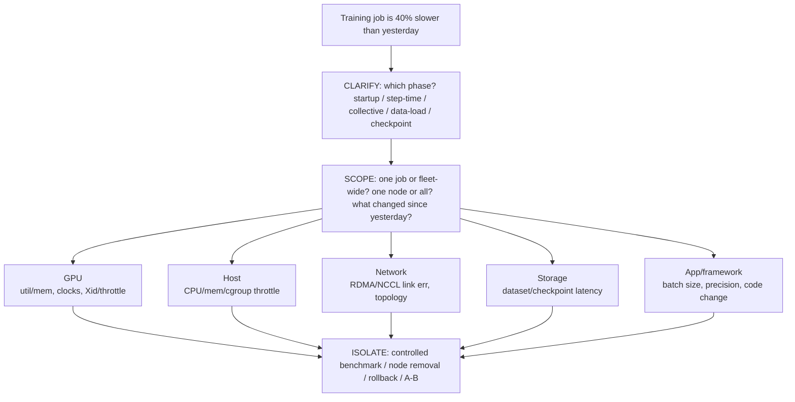

> Learning outcome Walk application -> serving/training -> GPU -> runtime/operator -> host -> network/storage.

## Worked scenario
**Situation:** Interviewer: "A distributed GPU training job is 40% slower than yesterday."

1. Clarify whether slowdown is startup, step time, collective phase, data load or checkpointing.
2. Scope across jobs/nodes and identify recent infrastructure changes.
3. GPU: utilization, memory, clocks, errors/throttling.
4. Host: CPU/memory/I/O/cgroup pressure.
5. Network: link/RDMA counters, errors, topology, NCCL/collective benchmark.
6. Storage: dataset/checkpoint latency/throughput.
7. Isolate with controlled benchmark, node removal or rollback.

**Conclusion:** The answer is a layered hypothesis tree with phase timing—not "check GPU utilization."

## Worked explanation and practice

**The layered hypothesis tree as a diagram (this IS the answer shape for every "GPU job is slow" question in this volume):**

**Key takeaway:** *"GHNS-A — GPU, Host, Network, Storage, App."* Five hop points, always checked in that order for a GPU workload symptom, because each hop is cheap to check and rules out an entire category before you go deeper. Never open with "let's check GPU utilization" — that's step 3 of 5, not step 1.

## Evidence ladder and interpretation

Collect the same time window for the slow run and a known-good run. A current snapshot cannot explain a slowdown that happened hours earlier.

| Layer | First evidence | What a suspicious result suggests | What it does not prove |
|---|---|---|---|
| workload phase | framework step, data-load, collective and checkpoint timings | the phase responsible for elapsed-time growth | the infrastructure component causing it |
| GPU | DCGM time series, `nvidia-smi -q`, Xid/ECC logs | throttling, reset/error evidence, low active time or memory pressure | that application code is unchanged |
| host | CPU pressure, NUMA placement, cgroup throttling, memory and block-I/O latency | feeder starvation or host contention | that the fabric and storage paths are healthy |
| network | per-port errors, retransmits/congestion, RDMA counters, NCCL test distribution | bad link, rail imbalance or slow rank | that production dataset access is healthy |
| storage | read/checkpoint latency and throughput by client/node | metadata, cache or backend bottleneck | that compute and collectives are healthy |
| application | image digest, framework/config/batch/precision changes | a workload-level regression | that the hardware is faulty |

Useful read-only commands include `nvidia-smi -q`, `nvidia-smi topo -m`, `dmesg -T`, `journalctl -k`, `numactl --hardware`, `iostat -xz 1`, `ss -s`, and scheduler/job accounting views. Name the permission and data-retention limits: kernel logs may be restricted, snapshots miss history, and a clean `nvidia-smi` output proves only that the driver can currently query the device.

### Complete answer structure

1. Restate the user impact and define the degraded metric: for example, median step time increased from 1.2 s to 1.7 s at the same model, batch and node count.
2. Split elapsed time into compute, input, collective and checkpoint phases.
3. Compare the distribution per rank/node; an average can hide one straggler that delays every synchronization point.
4. Correlate the first divergence with deployment, image, firmware, network or storage changes.
5. Run the smallest controlled comparison: known-good versus suspect node, single-node versus multi-node, synthetic NCCL versus production training, cached versus uncached data.
6. Mitigate safely by removing a suspect node, rolling back a known change or reducing scope. Preserve evidence before restart or reset.
7. Validate with the original workload metric and at least one component metric; then define the prevention action and owner.

If one node shows normal GPU utilization but every collective waits for it, inspect that node's CPU feeder, NUMA/NIC locality, link counters and storage latency. “GPU healthy” and “job healthy” are different statements.
