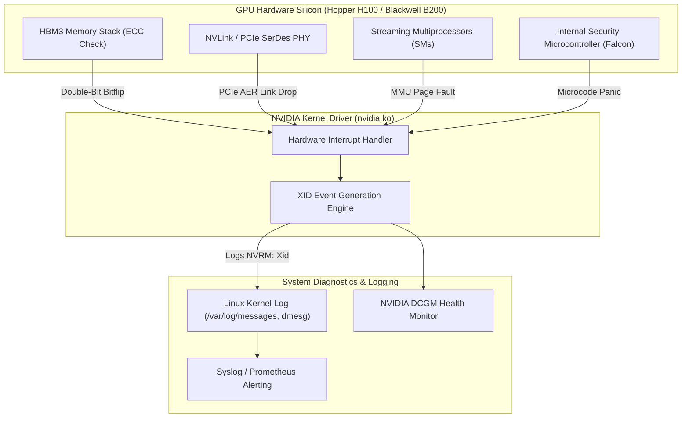

# Chapter 5 — GPU Silicon, NVLink, NVSwitch, and Hardware Triage

In large-scale AI supercomputers, GPU hardware does not simply operate in a binary "working" or "broken" state. Under extreme thermal, electrical, and computational stress—such as continuous 700W FP8 tensor operations across 8x SXM5 GPUs—hardware degrades along subtle analog boundaries. GPUs throttle clock frequencies due to voltage ripple, NVLink high-speed serializer/deserializer (SerDes) channels experience symbol errors, and HBM3 memory stacks encounter cosmic ray bit-flips.

When interviewing for an **NVIDIA Senior Solutions Architect** role, you must demonstrate mastery of the silicon and interconnect layers. You are expected to interpret NVIDIA driver **XID error codes**, diagnose NVLink mesh degradation, triage NVSwitch fabric failures, and leverage **DCGM** for deterministic hardware health qualification.

---

## 1. The NVIDIA XID Error Architecture and Taxonomy

An **XID error** is an interrupt-driven error report generated by the NVIDIA GPU driver (`nvidia.ko`) and logged directly to the Linux kernel ring buffer (`dmesg`). It represents the single most authoritative diagnostic artifact for GPU silicon and memory failures.



### The Critical XID Reference Table for Solutions Architects

| XID Code | Error Classification | Severity | Root Cause & Silicon Mechanics | Field Remediation Action |
|---|---|---|---|---|
| **XID 31** | **GPU Memory Page Fault** | Moderate (App) | A CUDA thread attempted to read or write an unmapped virtual address, dereferenced a null pointer, or breached memory bounds. | User-space software bug. Inspect CUDA core dump or run `cuda-gdb` / Compute Sanitizer. **Do not RMA hardware.** |
| **XID 43** | **GPU Stopped Processing** | Critical | A compute or graphics engine hung, exceeding the driver's watchdogs. Frequently triggered by an infinite kernel loop or clock domain lockup. | Kill process (`pkill -9`). If persistent across multiple frameworks, suspect power delivery or driver bug. |
| **XID 48** | **Double-Bit ECC Memory Error** | Fatal (Hardware) | An uncorrectable multi-bit error occurred in HBM3/HBM3e memory. Parity cannot restore data integrity; data corruption risk. | **Immediate Node Quarantine.** The GPU is unsafe for training. Drain node in Slurm/K8s, run Level 3 DCGM diagnostic, and initiate RMA. |
| **XID 62** | **Internal Microcontroller Halt** | Fatal (Silicon) | The internal Falcon/GSP (GPU System Processor) microcontroller firmware encountered an unrecoverable exception or bus hang. | Reset GPU via `nvidia-smi --gpu-reset`. If recurring upon reboot, schedule motherboard/SXM tray replacement. |
| **XID 79** | **GPU Fallen Off the Bus** | Catastrophic | The GPU completely vanished from the PCIe configuration space. Caused by fatal power supply droop, PCIe link training collapse, or thermal shutdown. | Node warm reboot fails; requires out-of-band **cold chassis power cycle** via Redfish/IPMI. Inspect PCIe AER logs and power cables. |
| **XID 92** | **High Single-Bit ECC Rate** | Warning | Correctable single-bit errors exceeded the dynamic threshold, indicating impending physical memory cell failure. | Schedule maintenance. The driver will attempt Dynamic Page Retirement (DPR). If pending retirement list overflows, RMA GPU. |

---

## 2. NVLink and NVSwitch Interconnect Diagnostics

On an 8-GPU **NVIDIA DGX H100**, intra-node communication does not traverse PCIe switches. Instead, all 8 GPUs connect via **NVLink 4** through **4 onboard NVSwitch ASICs**, providing **900 GB/s bidirectional bandwidth per GPU** (7.2 TB/s aggregate per chassis).

```mermaid
flowchart TD
    subgraph SXM_Tray["DGX H100 GPU Tray (8x H100 SXM5 GPUs)"]
        GPU0["GPU 0"]
        GPU1["GPU 1"]
        GPU7["GPU 7"]
    end

    subgraph NVSwitch_Mesh["NVSwitch Interconnect Mesh (4x ASICs)"]
        NVS0["NVSwitch 0"]
        NVS1["NVSwitch 1"]
        NVS2["NVSwitch 2"]
        NVS3["NVSwitch 3"]
    end

    GPU0 <-->|18x NVLinks (900 GB/s)| NVSwitch_Mesh
    GPU1 <-->|18x NVLinks (900 GB/s)| NVSwitch_Mesh
    GPU7 <-->|18x NVLinks (900 GB/s)| NVSwitch_Mesh
```

### Diagnosing NVLink Degradation

If even one of the 18 NVLinks on a GPU drops or suffers physical electrical noise, the entire NVLink mesh becomes asymmetric. NCCL cannot form uniform All-Reduce rings, and collective communication throttles down to the speed of the slowest link.

```bash
# 1. Audit active link counts across all 8 GPUs (Expected: 18 active links per GPU)
$ nvidia-smi nvlink --status
GPU 0: NVIDIA H100 80GB HBM3
        Link 0: Active
        Link 1: Active
        ...
        Link 16: Active
        Link 17: Recovery  <-- CRITICAL: Link 17 is flapping in SerDes recovery!

# 2. Query cumulative NVLink error counters
$ nvidia-smi nvlink -e -i 0
GPU 0: NVIDIA H100 80GB HBM3
        Link 0:
                Data Replay Errors          : 0
                Packet Recovery Errors       : 0
        Link 17:
                Data Replay Errors          : 1482912  <-- Extreme packet retransmissions!
                Packet Recovery Errors       : 42019
```

- **Data Replay Errors:** The physical SerDes receiver detected corrupted cyclic redundancy check (CRC) bits and requested an hardware packet retransmission.
- **Packet Recovery Errors:** The link suffered a physical loss of symbol lock and renegotiated link training.
- **Architectural Impact:** High replay counts consume link bandwidth. A single flapping link causes multi-second pauses in PyTorch backward passes.

---

## 3. Thermal and Power Throttling Analysis

An NVIDIA H100 SXM5 GPU operates with a thermal design power (TDP) of up to **700 Watts**. Under heavy sustained GEMM kernels, cooling or power delivery imbalances force the GPU controller to throttle clock frequencies to prevent physical destruction.

### Detecting Throttling via NVML Telemetry

```bash
$ nvidia-smi --query-gpu=index,clocks.current.graphics,clocks.current.sm,clocks.max.sm,temperature.gpu,power.draw,clocks_event_reasons.hw_slowdown,clocks_event_reasons.sw_thermal_slowdown,clocks_event_reasons.hw_power_brake_slowdown --format=csv
index, clocks.current.graphics [MHz], clocks.current.sm [MHz], clocks.max.sm [MHz], temperature.gpu, power.draw [W], clocks_event_reasons.hw_slowdown, clocks_event_reasons.sw_thermal_slowdown, clocks_event_reasons.hw_power_brake_slowdown
0, 1980 MHz, 1980 MHz, 1980 MHz, 48, 680 W, NOT_ACTIVE, NOT_ACTIVE, NOT_ACTIVE
1, 1980 MHz, 1980 MHz, 1980 MHz, 49, 675 W, NOT_ACTIVE, NOT_ACTIVE, NOT_ACTIVE
2, 1140 MHz, 1140 MHz, 1980 MHz, 86, 420 W, ACTIVE, ACTIVE, NOT_ACTIVE
```

#### Interpretation:
- **GPU 0 & 1:** Running at full boost clocks (1980 MHz) and full power (~680 W).
- **GPU 2:** Core clock throttled from 1980 MHz down to **1140 MHz** (a 42% compute drop). Temperature is at 86C with `hw_slowdown` and `sw_thermal_slowdown` marked `ACTIVE`.
- **Root Cause:** Uneven thermal interface material (TIM), air bubble in direct liquid cooling cold plate, or a failed fan tray directly upstream of GPU 2. In synchronized training, this single GPU will slow down the entire cluster.

---

## 4. Hardware Qualification via NVIDIA DCGM

The **NVIDIA Data Center GPU Manager (DCGM)** provides standardized diagnostic engines for field triage:

```bash
# Execute Level 3 comprehensive stress validation (Run before returning node to service)
$ sudo dcgmi diag -r 3
+---------------------------+------------------------------------------------+
| Diagnostic                | Result                                         |
+===========================+================================================+
| Deployment                | Pass                                           |
| Blacklist                 | Pass                                           |
| NVML Library              | Pass                                           |
| CUDA Main Library         | Pass                                           |
| Permissions and Devices   | Pass                                           |
| Hardware                  | Pass                                           |
| Memory                    | Pass (HBM3 stress pattern clean)               |
| PCIe                      | Pass (Gen5 32 GT/s line rate validated)        |
| Targeted Stress           | Pass (FP8 GEMM sustained at 700W for 15 mins)  |
+---------------------------+------------------------------------------------+
```

---

## 5. Senior Solutions Architect Interview Scenarios

### Scenario 1: Triaging an XID 79 ("GPU Has Fallen Off the Bus")
**Interviewer:** *"During a customer's large foundation model pre-training run on a DGX H100 SuperPOD, node 14 abruptly halts. `nvidia-smi` on node 14 reports: `No devices were found`. The kernel log is flooded with `NVRM: GPU at PCI:0000:19:00.0 has fallen off the bus (Xid 79)`. Walk me through the exact failure mechanics and your remediation plan."*

**Candidate Answer:**
> "XID 79 is one of the most severe failure states in accelerated infrastructure:
> 1. **Silicon Mechanics:** XID 79 means the PCIe Root Complex lost communication with the GPU device endpoint. The GPU ceased acknowledging PCIe Transaction Layer Packets (TLPs). This is triggered by three primary hardware events:
>    - **Power Supply Transient Droop:** A sudden current surge during an intense FP8 GEMM kernel caused voltage on the 12V / 48V power plane to drop below the GPU voltage regulator module (VRM) brownout threshold, causing the GPU silicon to reset.
>    - **Thermal Trip:** The GPU junction temperature exceeded thermal trip thresholds (e.g., > 95C), triggering an emergency hardware power cut to prevent silicon burn.
>    - **PCIe Fatal Link Collapse:** Severe signal integrity degradation on the PCIe Gen5 bus resulting in an uncorrectable PCIe AER fatal error.
> 2. **Immediate Remediation Sequence:**
>    - A standard OS reboot (`sudo reboot`) will fail because the PCIe link was severed; the BIOS POST will not detect the device.
>    - I issue a **cold power cycle via out-of-band Redfish or IPMI**:
>      `curl -k -u admin:$PASS -X POST https://<bmc-ip>/redfish/v1/Systems/System_0/Actions/ComputerSystem.Reset -d '{"ResetType": "ForceRestart"}'`
>      This cuts auxiliary power rails, forcing PCIe bridge re-enumeration.
> 3. **Post-Recovery Hardware Qualification:**
>    - Once booted, I inspect `dmesg -T | grep -i aer` for PCIe receiver errors and query BMC sensor logs for power supply faults.
>    - I run a full DCGM Level 3 stress test (`dcgmi diag -r 3`). If the GPU drops off the bus again under 700W load, I submit an RMA for the GPU SXM tray."

---

### Scenario 2: Uncorrectable Double-Bit ECC Memory Error (XID 48)
**Interviewer:** *"A node throws XID 48 on GPU 4 during a multi-node checkpoint write. The customer asks: 'Can we just restart the Slurm job and let it run, since the checkpoint write already finished?' How do you respond?"*

**Candidate Answer:**
> "I strictly advise **against** restarting the job on that node and immediately drain the machine:
> 1. **Data Integrity Risk:** XID 48 represents an uncorrectable multi-bit ECC error in the HBM3 memory array. While single-bit errors (XID 92) are corrected transparently by hardware Hamming codes, double-bit errors cannot be corrected.
> 2. **Silent Model Corruption:** If the bitflip occurred in model weights, activation buffers, or optimizer states, the tensor values are corrupted. Continuing training will propagate corrupted gradients throughout the All-Reduce collective, causing loss divergence or NaN values hours or days later.
> 3. **Operational Action:**
>    - Immediately mark the node drained in Slurm: `scontrol update NodeName=<host> State=DRAIN Reason="XID 48: Double-bit ECC on GPU 4"`.
>    - Inspect Dynamic Page Retirement status via `nvidia-smi -q -d PAGE_RETIREMENT`. If the memory controller cannot isolate the corrupted page, the GPU memory module is physically compromised and requires physical replacement."

---

## Key Takeaways

1. **XIDs are the Source of Truth:** Never guess at GPU failures. Always inspect `dmesg` for specific XID signatures (XID 31 = app bug, XID 48 = uncorrectable ECC, XID 79 = PCIe link collapse).
2. **NVLink Degradation Destroys Collective Performance:** A single flapping NVLink link (high data replay errors) breaks collective symmetry and bottlenecks the entire cluster.
3. **Monitor Thermal Clocks, Not Just GPU Utilization:** A GPU running at 100% utilization while throttled from 1980 MHz to 1140 MHz slows down all 1,024 ranks in a synchronized training run.
4. **XID 79 Mandates Out-of-Band Cold Reset:** Software reboots cannot recover a device that has fallen off the PCIe bus; use Redfish or IPMI to perform a cold chassis power cycle.
5. **Never Tolerate Double-Bit ECC Errors:** Immediately quarantine and drain any node reporting XID 48 to prevent silent mathematical corruption in training runs.
