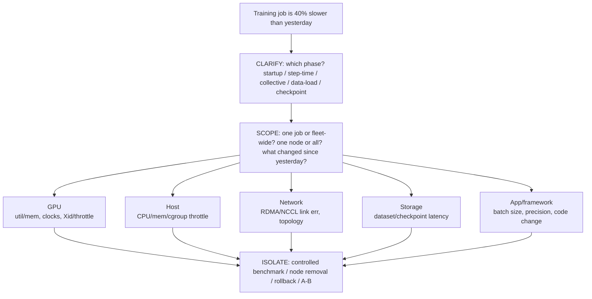

> Learning outcome Walk application -> serving/training -> GPU -> runtime/operator -> host -> network/storage.

## Worked scenario
**Situation:** Interviewer: "A distributed GPU training job is 40% slower than yesterday."

1. Clarify whether slowdown is startup, step time, collective phase, data load or checkpointing.
2. Scope across jobs/nodes and identify recent infrastructure changes.
3. GPU: utilization, memory, clocks, errors/throttling.
4. Host: CPU/memory/I/O/cgroup pressure.
5. Network: link/RDMA counters, errors, topology, NCCL/collective benchmark.
6. Storage: dataset/checkpoint latency/throughput.
7. Isolate with controlled benchmark, node removal or rollback.

**Conclusion:** The answer is a layered hypothesis tree with phase timing—not "check GPU utilization."

## ➕ Additions

➕ **The layered hypothesis tree as a diagram (this IS the answer shape for every "GPU job is slow" question in this volume):**

➕ **Memory hook:** *"GHNS-A — GPU, Host, Network, Storage, App."* Five hop points, always checked in that order for a GPU workload symptom, because each hop is cheap to check and rules out an entire category before you go deeper. Never open with "let's check GPU utilization" — that's step 3 of 5, not step 1.
