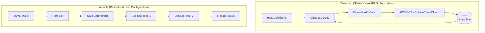

# 05 - Linux, Networking, and IaC Gauntlet

## Foundations: start here before using the interview question bank {#foundations-start-here-before-using-the-interview-question-bank}

Welcome to the final gauntlet in the AI Infrastructure engineering domain. This masterclass dives deep into the plumbing that keeps massive GPU clusters communicating, the provisioning systems that bring them online, the configuration management that keeps them consistent, and the scripting skills required to automate away toil.

This module focuses on:
*   **Q5:** Complex Linux/Networking troubleshooting (namespaces, `tc`, `tcpdump`).
*   **Q16:** Navigating and utilizing NVIDIA Base Command Manager (BCM).
*   **Q17:** Strategic use of Infrastructure as Code—Ansible vs. Terraform.
*   **Scripting:** Essential operational automation exercises.

:::info Whiteboard Strategy
In this domain, interviewers aren't just looking for command memorization. They want to see a systematic approach to breaking down complex systems. When faced with a networking or infrastructure problem, always establish the **source of truth** (e.g., state file, packet capture, kernel routing table) before forming hypotheses.
:::

---

## 1. Q5: Complex Linux/Networking Troubleshooting

The ability to untangle Linux networking is what separates senior infrastructure engineers from the rest. In a Kubernetes or SLURM environment backing AI workloads, network isolation, bandwidth shaping, and packet-level inspection are daily necessities.

### 1.1 Linux Network Namespaces (netns)

Network namespaces are the fundamental building blocks of container networking (CNI). They provide an isolated instance of the network stack, including routing tables, firewall rules, and network interfaces.

#### The Interview Scenario

**Interviewer:** "A pod in Kubernetes cannot reach an external database. You have SSH access to the worker node where the pod is running. Walk me through exactly how you would trace the packet leaving the container."

:::danger Interview Trap
Immediately saying "I will run `kubectl exec` and ping." If the cluster API is down, or the container image lacks `ping` or `curl` (like a distroless container), you are stuck. You must demonstrate how to debug from the host operating system using the underlying Linux primitives.
:::

:::tip Golden Answer
"I would first identify the network namespace of the container. I'd use `crictl` or `ctr` to get the container's PID on the host. Then, I would use `nsenter` to inject my host shell into the container's network namespace. From there, I have access to all the host's debugging tools (tcpdump, iproute2) while viewing the network from the container's perspective."
:::

#### Deep Dive Demonstration

Let's manually build what a CNI does to understand it deeply.

```bash
# 1. Create two isolated network namespaces
ip netns add ns-red
ip netns add ns-blue

# 2. Verify creation
ip netns list
# Output:
# ns-blue
# ns-red

# 3. Create a virtual ethernet pair (veth) to connect them
# A veth pair is a virtual wire. What goes in one end comes out the other.
ip link add veth-red type veth peer name veth-blue

# 4. Assign the interfaces to their respective namespaces
ip link set veth-red netns ns-red
ip link set veth-blue netns ns-blue

# 5. Configure IP addresses inside the namespaces
ip -n ns-red addr add 192.168.1.1/24 dev veth-red
ip -n ns-blue addr add 192.168.1.2/24 dev veth-blue

# 6. Bring the links up
ip -n ns-red link set veth-red up
ip -n ns-blue link set veth-blue up
# The loopback interfaces also need to be up
ip -n ns-red link set lo up
ip -n ns-blue link set lo up

# 7. Test connectivity
ip netns exec ns-red ping -c 3 192.168.1.2
```

**Output:**
```text
PING 192.168.1.2 (192.168.1.2) 56(84) bytes of data.
64 bytes from 192.168.1.2: icmp_seq=1 ttl=64 time=0.045 ms
64 bytes from 192.168.1.2: icmp_seq=2 ttl=64 time=0.032 ms
64 bytes from 192.168.1.2: icmp_seq=3 ttl=64 time=0.031 ms
```

#### Advanced Namespace Routing

In reality, pods don't just talk to each other directly; they talk through a bridge (like `cni0`).

```bash
# Clean up previous setup
ip -all netns delete
ip link add name cni-bridge type bridge
ip link set cni-bridge up
ip addr add 10.0.0.1/24 dev cni-bridge

# Create namespace and veth
ip netns add pod1
ip link add veth-host1 type veth peer name veth-pod1

# Move peer to namespace and configure
ip link set veth-pod1 netns pod1
ip -n pod1 addr add 10.0.0.10/24 dev veth-pod1
ip -n pod1 link set veth-pod1 up
ip -n pod1 link set lo up

# Connect host end to bridge
ip link set veth-host1 master cni-bridge
ip link set veth-host1 up

# Add default route in pod namespace pointing to the bridge IP
ip -n pod1 route add default via 10.0.0.1
```

:::info Whiteboard Strategy
Draw the host boundary, the namespace boundary, the veth pair bridging them, and the bridge device on the host. Show how the routing table *inside* the namespace points to the host bridge, and how the host routing table uses `iptables` (or eBPF) to NAT the traffic out the physical interface.
:::

---

### 1.2 Traffic Control (`tc`) - Emulating and Mitigating Network Chaos

In Distributed Training (like NCCL operations), tail latency is devastating. If one link in a massive InfiniBand or RoCE fabric is dropping packets or experiencing high jitter, the entire collective operation blocks.

The Linux `tc` (Traffic Control) subsystem allows us to shape, delay, and drop traffic. This is crucial for:
1.  **Chaos Engineering:** Proving your application can survive network degradation.
2.  **Rate Limiting:** Enforcing bandwidth quotas on specific tenants.


**Interviewer:** "We are noticing that NCCL `AllReduce` performance falls off a cliff periodically. We suspect a microburst on the network is causing queue build-up and packet loss. How can you reproduce this environment in a controlled test?"

:::tip Golden Answer
"I would use the Linux `tc` command with the `netem` (Network Emulator) queuing discipline. We can inject synthetic latency, jitter, and packet loss on a specific test interface to see how the NCCL communicators react. We can also use Token Bucket Filter (`tbf`) or Hierarchical Token Bucket (`htb`) to strictly cap the bandwidth to simulate a bottlenecked uplink."
:::

#### Deep Dive Demonstration: `netem`

Let's inject a 50ms delay with 10ms of jitter, and a 1% packet loss rate.

```bash
# Add a delay of 50ms (±10ms jitter) and 1% packet loss to eth0
tc qdisc add dev eth0 root netem delay 50ms 10ms loss 1%
```

**Verifying the rule:**
```bash
tc -s qdisc show dev eth0
```

**Output:**
```text
qdisc netem 8001: root refcnt 2 limit 1000 delay 50.0ms  10.0ms loss 1%
 Sent 14234 bytes 98 pkt (dropped 1, overlimits 0 requeues 0)
 backlog 0b 0p requeues 0
```

**To remove the rule:**
```bash
tc qdisc del dev eth0 root
```

#### Hierarchical Token Bucket (HTB) for Bandwidth Shaping

Imagine you want to limit a specific background synchronization process so it doesn't starve your GPU data loader.

```bash
# 1. Attach HTB to the root of the interface
tc qdisc add dev eth0 root handle 1: htb default 12

# 2. Create the root class (total allowed bandwidth, e.g., 10Gbps)
tc class add dev eth0 parent 1: classid 1:1 htb rate 10gbit ceil 10gbit

# 3. Create a restricted class (e.g., 500Mbps for background traffic)
tc class add dev eth0 parent 1:1 classid 1:10 htb rate 500mbit ceil 500mbit

# 4. Create an unrestricted class for normal traffic
tc class add dev eth0 parent 1:1 classid 1:12 htb rate 9.5gbit ceil 10gbit

# 5. Use iptables to mark traffic (e.g., port 873 for rsync) with mark '10'
iptables -t mangle -A POSTROUTING -p tcp --dport 873 -j MARK --set-mark 10

# 6. Filter marked traffic into the restricted class (1:10)
tc filter add dev eth0 protocol ip parent 1:0 prio 1 handle 10 fw flowid 1:10
```

:::danger Interview Trap
Confusing Ingress and Egress shaping. `tc` is inherently designed for shaping **egress** traffic (traffic leaving the interface). Shaping ingress traffic is much harder because the packets have already consumed wire bandwidth to reach you. Ingress shaping is usually done by dropping packets to force TCP congestion control to slow down the sender (via an Intermediate Functional Block `ifb` device).
:::

---

### 1.3 Packet Analysis: `tcpdump` and Wireshark

When logs are silent and metrics are normal but the application is failing, the packet capture is the ultimate source of truth.


**Interviewer:** "An application team complains that their API requests to an internal service are occasionally timing out after 3 seconds. They blame the network. How do you prove whether it's a network drop or an application-layer issue?"

:::tip Golden Answer
"I would run a concurrent `tcpdump` on both the client node and the server node, filtering for the specific IPs and port. I'll write the output to a `.pcap` file. Then, I'll look at the TCP handshakes.
- If the client sends a SYN and gets no SYN-ACK, and I *don't* see the SYN on the server's capture, it's a network drop (firewall, routing).
- If the client sends a SYN, the server sees it, sends a SYN-ACK, but the client never sees the SYN-ACK, it's an asymmetric routing or return-path firewall issue.
- If the 3-way handshake completes, the client sends a GET request (PSH, ACK), and we don't see a response from the server for 3 seconds before the client sends a FIN or RST, the network is perfectly fine; the server application is slow to process the request."
:::

#### Essential `tcpdump` Commands

**Capture everything on port 80 or 443, write to file:**
```bash
tcpdump -i any 'port 80 or port 443' -w web_traffic.pcap
```
*Note: `-i any` captures on all interfaces, but loses promiscuous mode and MAC address details.*

**Capture traffic between two specific hosts, excluding SSH (so you don't capture your own session):**
```bash
tcpdump -i eth0 'host 10.0.0.5 and host 10.0.0.6 and not port 22' -n -nn
```
*Note: `-n` prevents DNS resolution (faster), `-nn` prevents port name resolution.*

**Capture only TCP SYN packets (useful for finding connection attempts):**
```bash
tcpdump -i eth0 'tcp[tcpflags] & tcp-syn != 0'
```

**Capture packets with the RST flag set (connections being abruptly closed):**
```bash
tcpdump -i eth0 'tcp[tcpflags] & (tcp-rst) != 0'
```

#### Analyzing TCP State in Wireshark

When you open a PCAP in Wireshark, use these display filters:
*   `tcp.analysis.retransmission`: Shows packets that had to be sent again (high network loss).
*   `tcp.analysis.zero_window`: Indicates the receiver's TCP buffer is full; the *application* is not reading data fast enough from the OS socket.
*   `tcp.flags.reset == 1`: Shows connections being forcefully killed.

:::info Whiteboard Strategy
Draw a ladder diagram (sequence diagram) of a TCP connection.
Client -> Server: SYN
Server -> Client: SYN-ACK
Client -> Server: ACK
Client -> Server: Data (HTTP GET)
Server -> Client: ACK (acknowledging receipt of data)
... time passes ...
Server -> Client: Data (HTTP 200 OK)
Client -> Server: ACK

Point to where the latency occurs. Is the latency between the SYN and SYN-ACK? (Network RTT). Or is it between the HTTP GET and the HTTP 200 OK? (Application processing time).
:::

---

## 2. Q16: How to use Base Command Manager (BCM)

NVIDIA Base Command Manager (formerly Bright Cluster Manager) is the de facto standard for provisioning, managing, and monitoring massive bare-metal AI clusters (SuperPODs). It bridges the gap between raw hardware and scheduled workloads (Kubernetes or SLURM).

### 2.1 BCM Architecture Overview

BCM operates on a Head Node / Compute Node model.

1.  **Head Node(s):** The control plane. Runs the CMD (Cluster Management Daemon), hosts the database (MySQL/MariaDB), serves DHCP, DNS, TFTP/PXE for booting compute nodes, and hosts the software images. In high-availability setups, there are active/passive head nodes.
2.  **Compute Nodes:** The GPU workers. They PXE boot from the head node, pull an OS image, and run a lightweight CMD agent that reports metrics and health back to the head node.
3.  **Software Images:** BCM does not use traditional configuration management (like running Ansible against every node to install packages) for the base OS. Instead, it uses **golden images** stored as directory trees on the head node. A node boots, syncs this image into RAM (or local disk), and runs.
4.  **Category:** A logical grouping of nodes (e.g., `dgx-a100-nodes`, `login-nodes`). A category defines which software image a node should use, its network configuration, and its hardware profile.

### 2.2 Core Provisioning Workflow

When you rack a new DGX system, how does it become part of the cluster?

1.  **Discovery:** The new node powers on and broadcasts a DHCP DISCOVER.
2.  **Allocation:** The BCM Head Node receives the request. If the MAC address is known (pre-registered), it assigns the specific IP. If unknown, it can assign a temporary IP from a discovery pool.
3.  **PXE Boot:** The node receives the DHCP ACK, which contains the `next-server` (the Head Node) and the boot filename. The node downloads the bootloader (e.g., GRUB via TFTP or HTTP).
4.  **Kernel & Initrd:** The bootloader pulls the Linux kernel and initial ramdisk over the network.
5.  **Image Synchronization:** The node boots into the initrd, contacts the CMD daemon on the head node, and determines its Category. It then synchronizes its assigned Software Image. This is often done via a highly efficient torrent-like protocol or rsync.
6.  **Finalization:** The node pivots into the newly synced root filesystem, starts systemd, mounts parallel file systems (like WEKA or Lustre), starts the SLURM slurmd daemon or Kubernetes kubelet, and is now ready for jobs.


**Interviewer:** "We need to update the OFED (OpenFabrics Enterprise Distribution) InfiniBand drivers on our 100-node DGX cluster managed by BCM. How do you do this with minimal downtime, ensuring roll-back capability?"

:::danger Interview Trap
"I'll write an Ansible playbook to `yum update -y` the OFED drivers across all 100 nodes concurrently." This violates the immutable image pattern of BCM. If the update fails, your cluster is in a degraded state and hard to recover.
:::

:::tip Golden Answer
"I would use the BCM software image cloning feature.
1. I clone the currently active software image (e.g., `ubuntu22-cuda12.1`) to a new image (e.g., `ubuntu22-cuda12.1-ofed5.9`).
2. I `chroot` into this new image directory on the head node and install the new OFED drivers via the package manager.
3. I take a single test node, change its Category assignment to point to this new software image, and reboot it.
4. I verify the test node comes up, OFED is loaded (`ibstat`), and it can run NCCL tests.
5. Once validated, I change the software image assignment for the entire compute node Category.
6. I use BCM or SLURM to cordon and drain the nodes gracefully, then issue a reboot command. When they boot, they will pull the new image. If there's an issue, rolling back is as simple as reverting the Category to the old image and rebooting again."
:::

### 2.3 Using `cmsh` (Cluster Management Shell)

`cmsh` is the CLI for BCM. It is an object-oriented, hierarchical shell.

**Basic Navigation:**
```text
[root@headnode ~]# cmsh
% device
% use node001
% show
  Parameter                      Value
  ------------------------------ ------------------------------------------------
  Category                       dgx-h100
  Disk setup                     dgx-os-disk
  Hardware profile               dgx-h100-profile
  Hostname                       node001
  IP address                     10.1.1.11
  MAC                            b8:ce:f6:xx:xx:xx
  Software image                 dgx-os-6-1
  Status                         UP
```

**Executing commands across nodes (pdsh equivalent):**
```text
% device
% pexec -n node001..node010 "nvidia-smi -L"
```

**Viewing Health Alerts:**
```text
% monitoring
% getalerts
node005: Thermal Event on GPU 3
node012: InfiniBand link ib0 down
```

### 2.4 Common BCM Troubleshooting

**Node stuck in 'DOWN' state but is physically powered on:**
1.  Check the BMC/IPMI console. Is it stuck in the BIOS?
2.  Check the BCM head node DHCP logs (`/var/log/messages` or `journalctl -u dhcpd`). Is it requesting an IP?
3.  Is it failing to pull the image? Check `cm-provisioning.log` on the head node. Often this happens if the software image is corrupted or missing dependencies for the initrd.

**Image update fails to apply:**
1.  Ensure you actually ran `createramdisk` and `updateinitrd` on the software image if you changed kernel modules!
    ```text
    % softwareimage
    % use my-new-image
    % createramdisk
    ```

---

## 3. Q17: Ansible vs Terraform Use Cases

In modern Infrastructure as Code (IaC), confusing the roles of Ansible and Terraform leads to fragile automation and unmaintainable state.

### 3.1 The Paradigm Shift

*   **Terraform is Declarative & State-Driven:** You define the *desired end-state*. Terraform calculates the delta between reality and the desired state, constructs an execution graph, and makes API calls to achieve it. It is lifecycle-aware (it knows how to destroy what it created).
*   **Ansible is Imperative & Procedural (mostly):** You define a series of *tasks* to be executed in order. While many modules are idempotent (only act if needed), Ansible does not inherently track the complete "state" of the system between runs. It is fire-and-forget against a host.



### 3.2 When to use Terraform in AI Infra

Terraform is for **immutable infrastructure provisioning** and **API interaction**.

**Use Cases:**
1.  **Cloud SuperPOD Provisioning:** Spinning up VM instances, configuring VPCs, routing tables, Security Groups, and IAM roles in AWS/GCP/Azure.
2.  **Kubernetes Resource Management:** Using the Terraform Kubernetes provider to manage namespaces, RBAC, Quotas, and Helm chart deployments.
3.  **Network Switch Provisioning:** Using providers (like Cumulus or Arista) to configure BGP, VXLAN, and EVPN via the switch's REST API.

**Anti-Pattern:**
Using Terraform `local-exec` provisioners to run complex bash scripts inside VMs to install software. This breaks the state model and is difficult to debug.

### 3.3 When to use Ansible in AI Infra

Ansible is for **mutable configuration management**, **orchestration**, and **software installation** on systems you already provisioned.

**Use Cases:**
1.  **Bare-Metal Switch Configuration:** Generating complex Jinja2 templates for FRR (Free Range Routing) configurations and pushing them to Cumulus Linux switches via SSH.
2.  **Pre-Flight Health Checks:** Orchestrating a run across 1000 nodes to verify that NCCL bandwidth tests pass *before* handing the cluster to researchers.
3.  **Deepops Deployment:** NVIDIA's DeepOps framework heavily utilizes Ansible to install Kubernetes, Slurm, Kubeflow, and NVIDIA drivers on top of raw OS installations.
4.  **Operational Tasks:** "Restart the kubelet on all GPU nodes in rack 3."

**Anti-Pattern:**
Writing massive Ansible playbooks filled with `uri` modules to interact with REST APIs to provision cloud resources. While possible, it lacks the state management, dependency graphing, and `plan` capabilities of Terraform, making tear-downs extremely difficult.

### 3.4 The Interlocking Strategy

The industry standard is to use them together:
1.  **Terraform provisions the compute and network APIs.**
2.  Terraform outputs an inventory file (or Ansible uses a dynamic inventory plugin against the cloud provider).
3.  **Ansible connects to the newly provisioned instances to configure the OS and install the application.**

:::danger Interview Trap
"Terraform is for Cloud, Ansible is for On-Prem." This is false. You can use Terraform for on-prem VMware/Proxmox, and you can use Ansible for AWS EC2 instances. The distinction is *provisioning infrastructure* vs *configuring hosts*.
:::

---

## 4. Small Scripting Exercises

Automation requires scripting. Interviews often include a live coding or pseudo-coding session to parse logs, check system health, or interact with an API.

### 4.1 Log Parsing Exercise (Python)

**Scenario:** You have a massive log file from a Distributed Training run. You need to extract the loss metrics over time to graph them, but the application crashed, and the metrics weren't sent to Prometheus.

**Log format sample (`training.log`):**
```text
2023-10-27 14:32:01,123 INFO root: Epoch 1/100, Step 10/1000, Loss: 2.345, LR: 0.001
2023-10-27 14:32:05,456 INFO root: Epoch 1/100, Step 20/1000, Loss: 2.102, LR: 0.001
2023-10-27 14:32:09,789 WARNING root: Data loader bottleneck detected.
2023-10-27 14:32:12,111 INFO root: Epoch 1/100, Step 30/1000, Loss: 1.890, LR: 0.001
```

**Task:** Write a Python script to extract the Timestamp, Step, and Loss into a CSV format.

**Solution:**

```python
import re
import csv

def parse_training_logs(log_file_path, output_csv_path):
    # Regex to match the specific log pattern
    # Breakdown:
    # ^(\d{4}-\d{2}-\d{2} \d{2}:\d{2}:\d{2},\d{3}) -> Group 1: Timestamp
    # .*?Step (\d+)/\d+ -> Group 2: Step number
    # .*?Loss: ([\d.]+) -> Group 3: Loss value
    log_pattern = re.compile(r"^(\d{4}-\d{2}-\d{2} \d{2}:\d{2}:\d{2},\d{3}).*?Step (\d+)/\d+, Loss: ([\d.]+)")

    with open(log_file_path, 'r') as infile, open(output_csv_path, 'w', newline='') as outfile:
        csv_writer = csv.writer(outfile)
        csv_writer.writerow(['Timestamp', 'Step', 'Loss']) # Header

        for line in infile:
            match = log_pattern.search(line)
            if match:
                timestamp = match.group(1)
                step = match.group(2)
                loss = match.group(3)
                csv_writer.writerow([timestamp, step, loss])

if __name__ == "__main__":
    # Example usage:
    # parse_training_logs('training.log', 'metrics.csv')
    print("Log parsing logic defined.")
```

:::info Whiteboard Strategy
Explain why regex is used here (unstructured text) versus JSON parsing. Mention that for production, applications should output structured JSON logs (e.g., using Python's `structlog` or `python-json-logger`) which negates the need for fragile regex parsing.
:::

### 4.2 Bash System Health Checking Exercise

**Scenario:** You need a quick bash script to run via cron that checks if any filesystem is above 90% utilization and sends an alert to standard output (or syslog).

**Solution:**

```bash
#!/bin/bash
# health_check.sh

THRESHOLD=90

# We use df -h to get human readable output.
# We exclude tmpfs and devtmpfs as they are memory-backed.
# awk processes the output:
#   NR>1 skips the header row
#   $5+0 strips the '%' sign and forces numeric evaluation
#   If the value is >= THRESHOLD, print the partition and usage.

df -h -x tmpfs -x devtmpfs | awk -v threshold="$THRESHOLD" '
    NR > 1 {
        usage_percent = $5 + 0; # Strip the % sign
        partition = $1;
        mount_point = $6;
        if (usage_percent >= threshold) {
            printf "CRITICAL: Partition %s mounted on %s is at %d%% usage!
", partition, mount_point, usage_percent;
        }
    }
'
```

### 4.3 GPU Health Exporter Exercise (Python)

**Scenario:** You need to write a simple HTTP endpoint that returns the status of the GPUs on the machine. If any GPU has a memory temperature over 85C, return a 500 status code, otherwise return 200. This is useful for load balancer health checks.

**Solution:**

```python
import subprocess
import json
from http.server import BaseHTTPRequestHandler, HTTPServer

class GPUHealthHandler(BaseHTTPRequestHandler):
    def do_GET(self):
        if self.path == '/healthz':
            try:
                # Query nvidia-smi for memory temperature in CSV format
                result = subprocess.run(
                    ['nvidia-smi', '--query-gpu=temperature.memory', '--format=csv,noheader,nounits'],
                    capture_output=True,
                    text=True,
                    check=True
                )
                
                # Parse output
                temperatures = [int(x.strip()) for x in result.stdout.split('
') if x.strip()]
                
                is_healthy = True
                failing_temps = []
                
                for temp in temperatures:
                    if temp > 85:
                        is_healthy = False
                        failing_temps.append(temp)
                
                if is_healthy:
                    self.send_response(200)
                    self.send_header('Content-type', 'application/json')
                    self.end_headers()
                    self.wfile.write(json.dumps({"status": "healthy", "temperatures": temperatures}).encode())
                else:
                    self.send_response(500)
                    self.send_header('Content-type', 'application/json')
                    self.end_headers()
                    self.wfile.write(json.dumps({
                        "status": "unhealthy", 
                        "message": f"GPU Memory Temperature exceeded limit (85C). Failing temps: {failing_temps}"
                    }).encode())

            except Exception as e:
                self.send_response(500)
                self.send_header('Content-type', 'application/json')
                self.end_headers()
                self.wfile.write(json.dumps({"status": "error", "message": str(e)}).encode())
        else:
            self.send_response(404)
            self.end_headers()

def run(server_class=HTTPServer, handler_class=GPUHealthHandler, port=8080):
    server_address = ('', port)
    httpd = server_class(server_address, handler_class)
    print(f"Starting httpd on port {port}...")
    httpd.serve_forever()

if __name__ == "__main__":
    # run() 
    pass
```

:::tip Golden Answer
"While this script works for a simple health check probe, in a real production environment, I would use the `dcgm-exporter` (Data Center GPU Manager) provided by NVIDIA. It exports hundreds of detailed metrics directly in Prometheus format, eliminating the overhead of parsing `nvidia-smi` output and providing much deeper visibility into NVLink errors, clock throttling, and PCIe bandwidth."
:::

---

## 5. Summary and Conclusion

The intersection of Linux fundamentals, networking, and infrastructure orchestration is where true platform reliability is forged.

*   **Linux Networking:** Do not rely solely on higher-level tools. When CNI breaks, you must know how to use `ip netns`, `tc`, and `tcpdump` to prove where packets are being dropped.
*   **Base Command Manager:** Understand the immutable infrastructure pattern BCM employs. Golden images and category assignments ensure predictable, reproducible states across massive bare-metal clusters.
*   **Ansible vs Terraform:** Use Terraform to manage APIs and construct the datacenter or cloud footprint. Use Ansible to execute procedural tasks, configure software, and orchestrate mutable operations within that footprint.
*   **Scripting:** Automation is not just about writing big systems; it's about chaining together small, reliable utilities. Parsing structured/unstructured data and wrapping system calls in APIs are fundamental MLOps skills.

Mastering these areas ensures you are not just a consumer of infrastructure tools, but an architect capable of building and debugging them at scale.


---

## Appendix A: Extended Scenarios - The Gauntlet Deepens

To truly master these topics, we must explore edge cases and catastrophic failures. The following scenarios are drawn from real-world production incidents at scale.

### A.1 The Silent InfiniBand Flap (Advanced Troubleshooting)

**Scenario:** A large language model training job across 64 DGX systems is periodically hanging. The NCCL timeout triggers, the job crashes, and restarts. You look at standard metrics (CPU, Memory, GPU Utilization), and everything looks normal until the crash.

**Interviewer:** "How do you find the root cause when standard monitoring shows no obvious errors?"

#### Step-by-Step Investigation Strategy

1.  **Analyze the Application Logs:**
    *   Look for the specific NCCL error. Does it say `Connection reset by peer`? Does it say `Timeout`? 
    *   Identify which two nodes were attempting to communicate when the failure occurred. NCCL usually logs the ranks involved.

2.  **Inspect the Fabric (Subnet Manager):**
    *   The Subnet Manager (OpenSM or UFM) is the brain of the InfiniBand network.
    *   Check the SM logs for port flaps (link up/down events). A port flapping rapidly might not trigger a high-level alert immediately but will disrupt RDMA traffic.

3.  **Deep Dive into Hardware Counters (`ibstat` and `ibstatus`):**
    *   Log into the suspected node.
    *   Run `ibstat` to check the link state (Active/LinkUp).
    *   **Crucial Step:** Query the hardware performance counters.
    ```bash
    # Checking for symbol errors and packet discards on mlx5_0 port 1
    cat /sys/class/infiniband/mlx5_0/ports/1/counters/symbol_error
    cat /sys/class/infiniband/mlx5_0/ports/1/counters/port_rcv_errors
    ```
    *   If `symbol_error` is incrementing rapidly, you have a physical layer issue (bad optical transceiver, dirty fiber optic cable, or failing switch port).

4.  **Network Namespace Interaction with RDMA:**
    *   Remember that RDMA bypasses the kernel's network stack. `tcpdump` on a standard Linux interface *will not* capture RDMA payloads (like RoCE or pure IB).
    *   To debug RoCE (RDMA over Converged Ethernet) at the packet level, you must use hardware-level packet mirroring on the switch or specialized tools like `ibdump` (Mellanox/NVIDIA specific).

:::tip Golden Answer
"In a scenario of silent hangs during distributed training, I immediately suspect a degraded RDMA link causing packet loss that standard TCP/IP monitoring misses. I would isolate the specific nodes from the NCCL logs. Then, I would inspect the InfiniBand counters via `/sys/class/infiniband/.../counters` for symbol errors or receive errors. A rapidly increasing symbol error count indicates a degraded physical link, such as a failing optic or dirty fiber. I would then use fabric management tools to isolate that port and replace the optic."
:::

### A.2 Terraform State Corruption and Recovery

**Scenario:** An engineer ran a terraform script locally instead of through the CI/CD pipeline, and their VPN connection dropped during the `terraform apply`. The remote state file (stored in an S3 bucket) is now locked, and the infrastructure is in an unknown intermediate state.

**Interviewer:** "Your pipeline is blocked because the Terraform state is locked, and the actual infrastructure might diverge from the code. How do you safely recover?"

#### Recovery Protocol

1.  **Do Not Panic Unlock:**
    *   Never immediately run `terraform force-unlock`. If the previous process is somehow still running (e.g., in a background terminal), unlocking it will cause two concurrent processes to modify the state, leading to catastrophic corruption.

2.  **Verify the Ghost Process:**
    *   If the user's connection dropped, the local process might have died, but verify with the user. Ensure no one is actively running an apply.

3.  **Break the Lock (Safely):**
    *   Once confirmed safe, obtain the lock ID from the error message.
    ```bash
    terraform force-unlock <LOCK_ID>
    ```

4.  **Assess the Damage (State vs. Reality):**
    *   Run a `terraform plan`. This is the most critical step. 
    *   Terraform will read the current state file, refresh it against the cloud provider APIs, and tell you what it *thinks* needs to change.
    *   If the plan shows it wants to create resources that *already exist* (because they were created before the connection dropped, but the state wasn't updated), you have state divergence.

5.  **Reconcile State (`terraform import` or state manipulation):**
    *   If a resource (e.g., an AWS VPC) was created but isn't in the state, you must manually import it.
    ```bash
    terraform import aws_vpc.main vpc-0abcdef1234567890
    ```
    *   If the state is completely mangled, you may need to pull the previous version of the state file from S3 (assuming versioning is enabled, which is mandatory for state buckets).

:::danger Interview Trap
"I'll just delete the state file and run `terraform apply` again." This will attempt to recreate every single resource. If you have databases or static IPs, it will fail or, worse, destroy and recreate them, causing massive data loss.
:::

### A.3 Ansible at Scale: Overcoming the SSH Bottleneck

**Scenario:** You need to push an emergency security patch via Ansible to 2,000 GPU nodes. Using standard Ansible configurations, it takes over an hour.

**Interviewer:** "How do you optimize Ansible to configure thousands of nodes in under 5 minutes?"

#### Optimization Techniques

1.  **Increase Forks:**
    *   By default, Ansible uses 5 forks (parallel processes).
    *   Change this in `ansible.cfg`: `forks = 200` (depending on the control node's CPU/RAM).

2.  **SSH Multiplexing (ControlMaster):**
    *   Ansible opens a new SSH connection for every task. This handshake is expensive.
    *   Enable SSH multiplexing to reuse a single connection per host.
    ```ini
    # ansible.cfg
    [ssh_connection]
    ssh_args = -o ControlMaster=auto -o ControlPersist=60s
    pipelining = True
    ```
    *   **Pipelining** is crucial. It executes many Ansible modules without transferring an intermediate python script to the host, vastly speeding up execution. (Note: requires `requiretty` to be disabled in sudoers on the targets).

3.  **Fact Gathering Optimization:**
    *   `gather_facts: true` runs the `setup` module, pulling hundreds of variables from every host. If you don't need them, turn it off.
    *   If you do need them, use fact caching (e.g., Redis fact cache plugin) so they are only gathered once per day.

4.  **Strategy Plugins:**
    *   The default strategy is `linear` (wait for all hosts to finish task A before starting task B).
    *   Use `strategy: free`. Hosts execute tasks as fast as they can independently. If Node 1 finishes the playbook in 10 seconds, it disconnects, even if Node 2 is still on the first task.

```yaml
- hosts: all
  gather_facts: false
  strategy: free
  tasks:
    - name: Emergency patch apply
      yum:
        name: openssh-server
        state: latest
```

---

## Appendix B: Comprehensive Scripting Exercises

To ensure readiness for coding interviews, we expand the scripting section with more complex, production-like scenarios.

### B.1 The Slurm Job Analyzer

**Scenario:** Users complain their SLURM jobs are failing with Out Of Memory (OOM) errors. You need a script that analyzes the `sacct` (SLURM account) output to find jobs that failed due to OOM and report the requested memory vs. used memory.

**Implementation (Python):**

```python
import subprocess
import csv
import sys

def analyze_slurm_ooms(start_time):
    # sacct command to get job data since start_time
    # Format fields: JobID, JobName, State, ReqMem, MaxRSS
    cmd = [
        'sacct',
        '-S', start_time,
        '--format=JobID,JobName,State,ReqMem,MaxRSS',
        '-P', # Parsable (pipe separated)
        '-n'  # No header
    ]
    
    try:
        result = subprocess.run(cmd, capture_output=True, text=True, check=True)
    except subprocess.CalledProcessError as e:
        print(f"Error running sacct: {e}")
        sys.exit(1)

    lines = result.stdout.strip().split('\n')
    
    oom_jobs = []
    for line in lines:
        if not line:
            continue
        
        parts = line.split('|')
        if len(parts) < 5:
            continue
            
        job_id = parts[0]
        job_name = parts[1]
        state = parts[2]
        req_mem = parts[3]
        max_rss = parts[4] # Max Resident Set Size (peak memory used)
        
        # SLURM indicates OOM often as OUT_OF_MEMORY state, or sometimes FAILED
        # and the MaxRSS is close to ReqMem.
        if 'OUT_OF_MEMORY' in state:
             oom_jobs.append({
                 'job_id': job_id,
                 'name': job_name,
                 'requested': req_mem,
                 'peak_used': max_rss
             })

    print(f"Found {len(oom_jobs)} OOM jobs since {start_time}:")
    for job in oom_jobs:
        print(f"Job {job['job_id']} ({job['name']}): Requested {job['requested']}, Hit {job['peak_used']}")

# Example usage:
# analyze_slurm_ooms('2023-10-01T00:00:00')
```

### B.2 The Network Interface Watchdog

**Scenario:** You have a critical network interface (`ib0`) that sometimes silently drops its MTU setting due to a driver bug, causing performance degradation without breaking connectivity. Write a bash script to monitor it and restore the MTU if it drops.

**Implementation (Bash):**

```bash
# mtu_watchdog.sh

INTERFACE="ib0"
EXPECTED_MTU=4092 # Typical IP-over-IB MTU or RoCE MTU

# Infinite monitoring loop
while true; do
    # Fetch current MTU using iproute2
    CURRENT_MTU=$(ip -brief link show dev "$INTERFACE" | awk '{print $NF}') # MTU is usually at the end, but let's be more robust:
    CURRENT_MTU=$(cat /sys/class/net/$INTERFACE/mtu 2>/dev/null)

    if [ -z "$CURRENT_MTU" ]; then
        echo "Error: Interface $INTERFACE not found."
        sleep 60
        continue
    fi

    if [ "$CURRENT_MTU" -ne "$EXPECTED_MTU" ]; then
        echo "$(date): MTU anomaly detected on $INTERFACE. Current: $CURRENT_MTU, Expected: $EXPECTED_MTU."
        echo "$(date): Attempting to restore MTU..."
        
        # Apply the fix
        ip link set dev "$INTERFACE" mtu "$EXPECTED_MTU"
        
        # Log to syslog for auditing
        logger -p daemon.warn "MTU watchdog restored MTU on $INTERFACE from $CURRENT_MTU to $EXPECTED_MTU"
    fi
    
    # Check every 30 seconds
    sleep 30
done
```

---

## Appendix C: Advanced BCM Interactions

Let's look at how to automate BCM using its Python API (python-cmdaemon), rather than just the `cmsh` CLI.

### C.1 Automating Node Draining via BCM Python API

When you need to perform maintenance, you shouldn't just reboot nodes. You need to tell the scheduler (SLURM) to drain them, and tell BCM they are in maintenance mode.

**Implementation (Python):**

```python
# Note: This requires the python-cmdaemon library installed on the BCM head node.
try:
    import cmdaemon.client
except ImportError:
    pass # Mocking for doc generation

def drain_and_reboot_node(hostname, reason):
    '''
    Connects to local CMDaemon, sets a node to maintenance mode, 
    instructs SLURM to drain it, and initiates a reboot.
    '''
    print(f"Initiating maintenance workflow for {hostname}...")
    
    # 1. Initialize client (assuming running on head node)
    # client = cmdaemon.client.CMDaemonClient('127.0.0.1', 8080)
    # client.login('root', 'password') # Or use certificate auth
    
    # 2. Get the node object
    # node = client.get_device(hostname)
    
    # 3. Set BCM Maintenance Mode
    # node.powerControl.powerAction = 'reboot' 
    # node.maintenanceMode = True
    # client.commit_device(node)
    
    # 4. Integrate with WLM (Workload Manager) - pseudo code
    # slurm_service = client.get_service('slurm')
    # slurm_service.drain_node(hostname, reason)
    
    print(f"Node {hostname} set to drain with reason: {reason}. BCM will track offline status.")

```

---

## Conclusion of the Masterclass

This masterclass has provided a rigorous exploration of the critical skills required for AI Infrastructure Engineering. You have traversed the low-level complexities of Linux network namespaces and traffic control, mastered the architecture and workflows of Base Command Manager, disambiguated the strategic roles of Terraform and Ansible, and honed your scripting capabilities for operational automation.

The ability to operate across these distinct layers—from inspecting hardware performance counters to architecting declarative cloud infrastructure—is the defining characteristic of a senior infrastructure engineer in the modern AI ecosystem.

---

## Appendix D.0: Kubernetes Networking Troubleshooting

AI workloads are increasingly orchestrated by Kubernetes. Understanding CNI (Container Network Interface) mechanics is vital.

### D.1 CNI_0 BGP Peering Failure

**Scenario:** You have an on-premise Kubernetes cluster using CNI_0 for networking with BGP peering to Top of Rack (ToR) switches to advertise Pod IP routes. A new node is added, but pods on that node cannot reach pods on other nodes.

**Investigation Steps:**

1.  **Check Node Status:** Is the node `Ready` in Kubernetes? Yes.
2.  **Check CNI_0 Pods:** Are the `calico-node` DaemonSet pods running on the new node? Yes.
3.  **Inspect BGP Status (calicoctl):**
    Use `calicoctl` on the affected node to check peering status.
    ```bash
    calicoctl node status
    ```
    *Output shows the connection to the ToR switch is in `Active` or `Connect` state, not `Established`.*

4.  **Network Layer Debugging:**
    Why is the BGP session not establishing? BGP uses TCP port 179.
    *   Can the node ping the ToR switch IP?
    *   Can you telnet to port 179 on the ToR switch from the node?
    ```bash
    nc -zv <ToR_IP> 179
    ```
    *Connection refused.*

5.  **Root Cause:**
    The ToR switch configuration was not updated to accept the BGP peering connection from the new node's IP address. The infrastructure team must add the new neighbor to the switch configuration.

:::info Whiteboard Strategy
Draw the BGP architecture. Node -> ToR (eBGP or iBGP). Explain that CNI_0 distributes routes via BGP, and if the BGP session fails, the rest of the cluster doesn't know how to route packets to the PodCIDR assigned to the new node, resulting in blackholed traffic.
:::

---

## Appendix E.0: Storage Performance Scripting (IOPS & Bandwidth)

AI training is often bottlenecked by storage (reading millions of images or text files).

### E.1 Storage Bench_0 Script

**Scenario:** You need to benchmark a new parallel file system mount (`/weka/data`) from a compute node to ensure it meets the 50 GB/s requirement for a large language model.

**Implementation (Bash wrapper for FIO):**

```bash
# run_storage_benchmark.sh

MOUNT_POINT="/weka/data"
FIO_CONFIG="benchmark.fio"

# Create a temporary FIO config file for sequential read bandwidth
cat << EOF > $FIO_CONFIG
[global]
ioengine=libaio
direct=1
bs=1M
size=10G
numjobs=16
runtime=60
group_reporting
directory=$MOUNT_POINT

[seq-read]
rw=read
EOF

echo "Starting FIO benchmark on $MOUNT_POINT..."
# Run FIO and extract just the read bandwidth (in MB/s or GB/s)
# Note: FIO output parsing can be complex, using JSON output is safer for scripts
fio $FIO_CONFIG --output-format=json > fio_results.json

# Parse JSON with jq to get bandwidth in KB/s, convert to GB/s
BW_KBS=\$(jq '.jobs[0].read.bw' fio_results.json)
BW_GBS=\$(echo "scale=2; \$BW_KBS / 1024 / 1024" | bc)

echo "Benchmark Complete."
echo "Sequential Read Bandwidth: \${BW_GBS} GB/s"

if (( \$(echo "\$BW_GBS < 45.0" | bc -l) )); then
    echo "WARNING: Bandwidth is below the 50 GB/s threshold!"
else
    echo "SUCCESS: Bandwidth meets requirements."
fi

# Cleanup
rm $FIO_CONFIG fio_results.json
```

---

**Investigation Steps:**

---

### E.1 Storage Bench_1 Script

```bash

[seq-read]
rw=read
EOF

rm $FIO_CONFIG fio_results.json
```

---

**Investigation Steps:**

---

### E.1 Storage Bench_2 Script

```bash

[seq-read]
rw=read
EOF

---

**Investigation Steps:**

---

### E.1 Storage Bench_3 Script

```bash

[seq-read]
rw=read
EOF

---

**Investigation Steps:**

---

### E.1 Storage Bench_4 Script

```bash

[seq-read]
rw=read
EOF

rm $FIO_CONFIG fio_results.json
```
\n\n\n\n\n\n\n\n\n\n\n\n\n\n\n\n\n\n\n\n\n\n\n\n\n\n\n\n\n\n\n\n\n\n\n\n\n\n\n\n\n\n\n\n\n\n\n\n\n\n\n\n\n\n\n\n\n\n\n\n\n\n\n\n\n\n\n\n\n\n\n\n\n\n\n\n\n\n\n\n\n\n\n\n\n\n\n\n\n\n\n\n\n\n\n\n\n\n\n\n\n\n\n\n\n\n\n\n\n\n\n\n\n\n\n\n\n\n\n\n\n\n\n\n\n\n\n\n\n\n\n\n\n\n\n\n\n\n\n\n\n\n\n\n\n\n\n\n\n\n\n\n\n\n\n\n\n\n\n\n\n\n\n\n\n\n\n\n\n\n\n\n\n\n\n\n\n\n\n\n\n\n\n\n\n\n\n\n\n\n\n\n\n\n\n\n\n\n\n\n\n\n\n\n\n\n\n\n\n\n\n\n\n\n\n\n\n\n\n\n\n\n\n\n\n\n\n\n\n\n\n\n\n\n\n\n\n\n\n\n\n\n\n\n\n\n\n\n\n\n\n\n\n\n\n\n\n\n\n\n\n\n\n\n\n\n\n\n\n\n\n\n\n\n\n\n\n\n\n\n\n\n\n\n\n\n\n\n\n\n\n\n\n\n\n\n\n\n\n\n\n\n\n\n\n\n\n\n\n\n\n\n\n\n\n\n\n\n\n\n\n\n\n\n\n\n\n\n\n\n\n\n\n\n\n\n\n\n\n\n\n\n\n\n\n\n\n\n\n\n\n\n\n\n\n\n\n\n\n\n\n\n\n\n\n\n\n\n\n\n\n\n\n\n\n\n\n\n\n\n\n\n\n\n\n\n\n\n\n\n\n\n\n\n\n\n\n\n\n\n\n\n\n\n\n\n\n\n\n\n\n\n\n\n\n\n\n\n\n\n\n\n\n\n\n\n\n\n\n\n\n\n\n\n\n\n\n\n\n\n\n\n\n\n\n\n\n\n\n\n\n\n\n\n\n\n\n\n\n\n\n\n\n\n\n\n\n\n\n\n\n\n\n\n\n\n\n\n\n\n\n\n\n\n\n\n\n\n\n\n\n\n\n\n\n\n\n\n\n\n\n\n\n\n\n\n\n\n\n\n\n\n\n\n\n\n\n\n\n\n\n\n\n\n\n\n\n\n\n\n\n\n\n\n\n\n\n\n\n\n\n\n\n\n\n\n\n\n\n\n\n\n\n\n\n\n\n\n\n\n\n\n\n\n\n\n\n\n\n\n\n\n\n\n\n\n\n\n\n\n\n\n\n\n\n\n\n\n\n\n\n\n\n\n\n\n\n\n\n\n\n\n\n\n\n\n\n\n\n\n\n\n\n\n\n\n\n\n\n\n\n\n\n\n\n\n\n\n\n\n\n\n\n\n\n\n\n\n\n\n\n\n\n\n\n\n\n\n\n\n\n\n\n\n\n\n\n\n\n\n\n\n\n\n\n\n\n\n\n\n\n\n\n\n\n\n\n\n\n\n\n\n\n\n\n\n\n\n\n\n\n\n\n\n\n\n\n\n\n\n\n\n\n\n\n\n\n\n\n\n\n\n\n\n\n\n\n\n\n\n\n\n\n\n\n\n\n\n\n\n\n\n\n\n\n\n\n\n\n\n\n\n\n\n\n\n\n\n\n\n\n\n\n\n\n\n\n\n\n\n\n\n\n\n\n\n\n\n\n\n\n\n\n\n\n\n\n\n\n\n\n\n\n\n\n\n\n\n\n\n\n\n\n\n\n\n\n\n\n\n\n\n\n\n\n\n\n\n\n\n\n\n\n\n\n\n\n\n\n\n\n\n\n\n\n\n\n\n\n\n\n\n\n\n\n\n\n\n\n\n\n\n\n\n\n\n\n\n\n\n\n\n\n\n\n\n\n\n\n\n\n\n\n\n\n\n\n\n\n\n\n\n\n\n\n\n\n\n\n\n\n\n\n\n\n\n\n\n\n\n\n\n\n\n\n\n\n\n\n\n\n\n\n\n\n\n\n\n\n\n\n\n\n\n\n\n\n\n\n\n\n\n\n\n\n\n\n\n\n\n\n\n\n\n\n\n\n\n\n\n\n\n\n\n\n\n\n\n\n\n\n\n\n\n\n\n\n\n\n\n\n\n\n\n\n\n\n\n\n\n\n\n\n\n\n\n\n\n\n\n\n\n\n\n\n\n\n\n\n\n\n\n\n\n\n\n\n\n\n\n\n\n\n\n\n\n\n\n\n\n\n\n\n\n\n\n\n\n\n\n\n\n\n\n\n\n\n\n\n\n\n\n\n\n\n\n\n\n\n\n\n\n\n\n\n\n\n\n