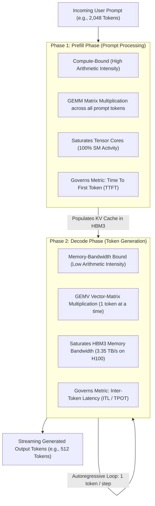
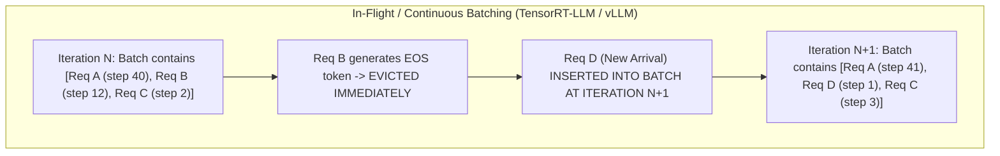
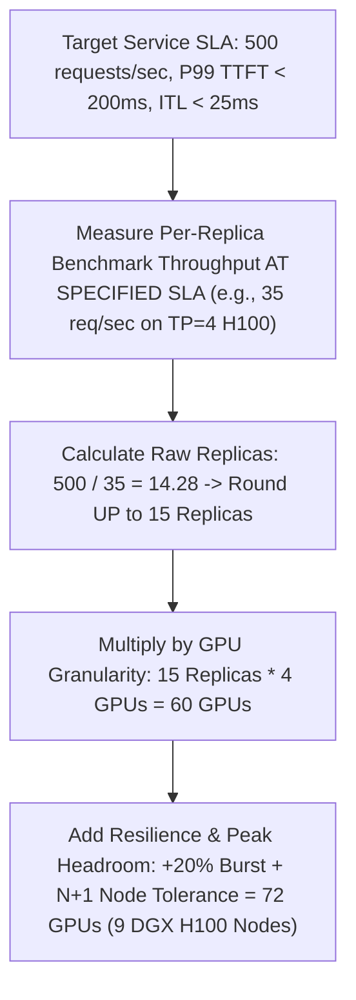

# Chapter 6 — AI Inference Architecture, LLM Serving, and System Sizing

In enterprise generative AI deployments, inference represents 80% to 90% of total lifecycle computing spend. Unlike traditional stateless REST microservices that scale linearly with CPU and RAM utilization, Large Language Model (LLM) inference introduces complex stateful memory dynamics, non-linear latency trade-offs, and multi-GPU tensor parallelism.

When interviewing for an **NVIDIA Senior Solutions Architect** role, you must be prepared to deconstruct LLM execution into its underlying compute and memory phases, calculate **KV cache memory footprints** from first principles, compare serving runtimes (**TensorRT-LLM, Triton, vLLM, NVIDIA NIM**), and size production GPU clusters against strict Service Level Objectives (SLOs).

---

## 1. First Principles: The Two Phases of LLM Inference

Every generative autoregressive transformer request executes in two fundamentally different hardware operational regimes: the **Prefill Phase** and the **Decode Phase**.



### Architectural Contrast

| Dimension | Prefill Phase (Prompt Processing) | Decode Phase (Token Generation) |
|---|---|---|
| **Mathematical Operation** | General Matrix-Matrix Multiply (**GEMM**) | General Matrix-Vector Multiply (**GEMV**) |
| **Hardware Bottleneck** | **Compute-Bound** (Tensor Core TFLOPS) | **Memory-Bandwidth Bound** (HBM3 Bandwidth GB/s) |
| **Operational Mechanism** | Processes all input tokens in parallel. | Autoregressively generates one token per step. |
| **Governing Latency Metric** | **Time To First Token (TTFT)** (Target: under 200 ms) | **Inter-Token Latency (ITL / TPOT)** (Target: 20-30 ms) |
| **Hardware Optimization** | High FP8/FP16 Tensor Core density (H100/B200). | Extreme HBM3e bandwidth and massive capacity. |

---

## 2. KV Cache Sizing Mathematics: The Architecture Behind Memory Sizing

During autoregressive decoding, calculating self-attention requires projecting Key (K) and Value (V) tensors for all previous tokens in the sequence. To prevent recomputing earlier tokens at every step, transformers cache these projections in GPU memory—the **KV Cache**.

In production, the KV cache—not the model weights—is the primary bottleneck that constrains batch size and triggers Out-of-Memory (OOM) crashes.

### The KV Cache Memory Formula

For a transformer model using standard Multi-Head Attention (MHA) or Grouped-Query Attention (GQA):

```text
KV_Bytes_Per_Token = 2 * Num_Layers * Num_KV_Heads * Head_Dimension * Precision_Bytes
```

Where:
- The factor of `2` accounts for storing both Key and Value matrices.
- `Num_Layers`: Number of transformer decoder blocks.
- `Num_KV_Heads`: Number of Key-Value heads (in GQA, this is significantly lower than query heads).
- `Head_Dimension`: Hidden dimension divided by total query attention heads.
- `Precision_Bytes`: 2 for FP16/BF16, 1 for FP8.

### Worked Architecture Example: Llama 3 70B (GQA)
- **Model Parameters:** 80 Layers, 8 KV Heads, Head Dimension 128, Precision FP16 (2 bytes).

```text
KV_Bytes_Per_Token = 2 * 80 * 8 * 128 * 2 = 327,680 Bytes = 320 KB per token
```

Now consider a production inference replica handling **Concurrent Requests = 64** with an average context length of **4,096 tokens**:

```text
Total_KV_Cache_Memory = 64 requests * 4,096 tokens * 320 KB/token
                      = 83,886,080 KB = 80.0 GB of VRAM!
```

**Architectural Consequence:**
The model weights of Llama 3 70B in FP16 consume **140 GB**. A batch of 64 requests with 4K context requires an additional **80 GB** for KV cache alone (140 + 80 = 220 GB). A single 8-GPU DGX node partitioned with Tensor Parallelism (TP = 4 or TP = 8) is required simply to hold the combined weights and KV cache memory in HBM.

---

## 3. Dynamic Batching Strategies: Static vs. In-Flight Batching

Early inference servers used **Static Batching**: waiting for N requests to arrive, padding them to the longest request, and executing them together. If request 1 asked for 10 output tokens and request 2 asked for 500 output tokens, request 1 sat idle in GPU memory for 490 iterations, wasting compute capacity.



### Modern Techniques:
1. **Continuous / In-Flight Batching:** Iteration-level scheduling. As soon as a request emits an end-of-sequence (`EOS`) token, its memory is freed, and a new request from the queue enters the batch at the very next decode iteration. Increases serving throughput by **3x to 4x**.
2. **Chunked Prefill:** Long incoming prompt prefills (e.g., 8,000 tokens) are sliced into smaller chunks (e.g., 512 tokens) and co-scheduled alongside decode steps. This prevents a large prompt prefill from stalling ongoing decode streams, eliminating latency spikes.

---

## 4. Serving Runtime Landscape: TensorRT-LLM, Triton, vLLM, and NIM

Enterprise customers often struggle to choose among NVIDIA and open-source serving runtimes. An NVIDIA Solutions Architect must articulate their clear boundaries:

| Runtime / Engine | Core Focus & Architecture | Latency & Throughput | Production Fit |
|---|---|---|---|
| **NVIDIA TensorRT-LLM** | Highly optimized C++ CUDA library; custom fused kernels (FlashAttention-2, FP8 GEMM, KV cache management), in-flight batching. | **Maximum Throughput & Lowest Latency**. Saturates hardware limits. | Enterprise foundation model serving at extreme scale; core engine for production deployments. |
| **Triton Inference Server** | Multi-framework orchestration gateway (C++, Python, ONNX, TensorRT-LLM backend). Dynamic batching, model pipelining (BLS), concurrent models per GPU. | Enterprise Gateway layer with low overhead. | Production model routing, multi-model hosting, and unified enterprise monitoring. |
| **NVIDIA NIM** | Containerized, production-packaged microservice wrapping TensorRT-LLM and Triton with standard OpenAI-compatible REST APIs. | Peak TensorRT-LLM performance with zero compiler tuning needed. | Turnkey enterprise deployment on Kubernetes and DGX Cloud. |
| **vLLM** | Open-source Python/CUDA engine; introduced **PagedAttention** to eliminate KV cache fragmentation. | Excellent developer agility; slightly lower performance than custom TensorRT-LLM kernels. | Rapid AI prototyping, research experimentation, and community model integration. |

---

## 5. Sizing and Capacity Planning Formula for Solutions Architects

When an executive asks: *"How many DGX H100 servers do I need to support 1,000 concurrent users?"* follow the deterministic **Benchmark-Derived Capacity Sizing Framework**:



### The Production Sizing Equation

```text
Raw_Replicas = Ceiling( Target_Peak_Throughput_Req_Per_Sec / Benchmarked_Replica_Throughput_At_SLO )
Total_GPUs   = Raw_Replicas * GPUs_Per_Model_Replica (TP * PP)
Fleet_GPUs   = Total_GPUs * (1 + Headroom_Percentage) + N_Plus_Failure_Nodes
```

---

## 6. Senior Solutions Architect Interview Scenarios

### Scenario 1: Sizing an LLM Service for a Large Financial Enterprise
**Interviewer:** *"A bank wants to deploy an internal Copilot using Llama 3 70B for 5,000 employees. They expect peak loads of 150 requests per second. The P99 latency SLA is TTFT under 250 ms and ITL under 30 ms. How many GPUs and servers do you specify?"*

**Candidate Answer:**
> "I break this down using our benchmark-derived capacity sizing methodology:
> 1. **Model Placement & Tensor Parallelism:**
>    - Llama 3 70B in FP16 requires 140 GB for weights plus ~80 GB for KV cache under load = 220 GB VRAM.
>    - We place the model across **4x NVIDIA H100 80GB SXM5 GPUs using Tensor Parallelism (TP = 4)**. Each replica provides 320 GB of combined HBM3 memory, leaving 180 GB purely for continuous batch KV caching.
> 2. **Replica Throughput Benchmarking:**
>    - On TensorRT-LLM running continuous batching with FP8 quantization, a TP = 4 H100 replica achieves ~25 requests/sec while strictly meeting the TTFT under 250 ms and ITL under 30 ms SLO.
> 3. **Replica Sizing:**
>    - Raw Replicas needed: 150 req/sec / 25 req/sec/replica = 6 Replicas.
>    - GPUs required: 6 Replicas * 4 GPUs = 24 H100 GPUs.
> 4. **Resilience & Node Packaging:**
>    - Each DGX H100 contains 8 GPUs, hosting exactly 2 model replicas per chassis.
>    - 24 GPUs = 3 DGX H100 servers.
>    - Adding **N+1 high-availability redundancy** for hardware maintenance gives **4x DGX H100 servers (32 GPUs total)**, providing 200 req/sec peak capacity with automatic node failover."

---

### Scenario 2: Autoscaling an LLM Service in Kubernetes
**Interviewer:** *"Why is scaling an LLM inference service using standard Kubernetes Horizontal Pod Autoscaler (HPA) based on CPU or GPU utilization an anti-pattern? What metrics should drive autoscaling?"*

**Candidate Answer:**
> "Scaling LLMs based on CPU or GPU utilization is fundamentally flawed due to the operational mechanics of continuous batching:
> 1. **The Utilization Paradox:** In a modern inference server (vLLM, TensorRT-LLM), the GPU runs an active continuous batching loop. As long as at least one request is decoding, GPU compute utilization registers at **95% to 100%**. A server processing 1 request and a server processing 64 requests both show ~100% GPU utilization. An HPA monitoring GPU usage cannot distinguish between a server that is nearly empty and one that is saturated.
> 2. **Latency Degradation Before CPU Load:** High prompt arrival rates saturate KV cache memory, forcing incoming requests into software queues. Queue wait time explodes, breaching the TTFT SLA while CPU utilization remains flat.
> 3. **The Production Metrics for LLM HPA:**
>    - **KV Cache Utilization Percentage:** Scales when active KV cache memory approaches 85%, indicating impending memory exhaustion.
>    - **Inference Request Queue Depth:** Triggers horizontal scale-out when pending requests exceed zero for more than 5 seconds.
>    - **P99 Time To First Token (TTFT):** Scales when prefill queue latency exceeds target SLOs."

---

## Key Takeaways

1. **Prefill is Compute-Bound; Decode is Memory-Bound:** Prefill saturates Tensor Core TFLOPS and dictates TTFT; Decode saturates HBM3 memory bandwidth and dictates ITL.
2. **KV Cache is the Primary Capacity Limit:** Calculate KV cache memory per token using `2 * Layers * KV Heads * Dim * Precision`. Under concurrent multi-token loads, KV cache can exceed model weight sizes.
3. **In-Flight Batching is Mandatory:** Continuous iteration-level scheduling eliminates padding waste and yields 3x to 4x throughput gains over static batching.
4. **Never Autoscale on GPU Utilization:** Continuous batching keeps GPU utilization at 100%; autoscale LLMs based on **KV Cache %**, **Queue Depth**, and **P99 TTFT**.
5. **Size Sizing Off Benchmarked SLOs:** Capacity is always calculated as required throughput divided by per-replica throughput measured strictly at the target SLA.
