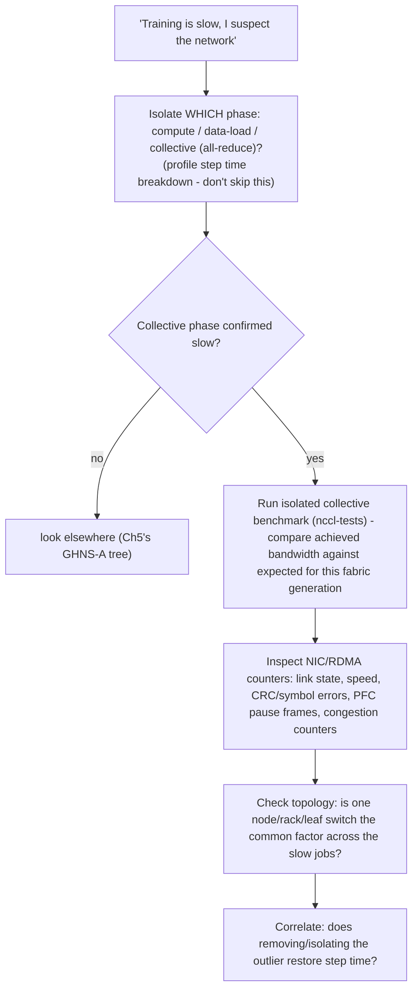
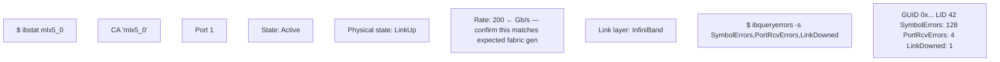
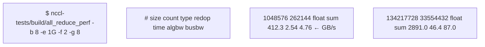
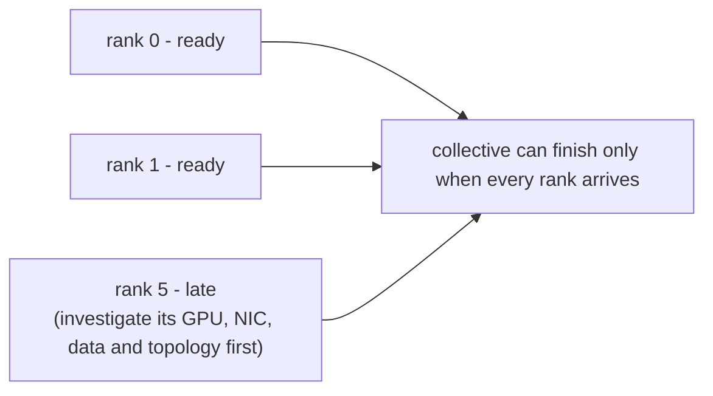

> Learning outcome Explain RDMA/RoCE/InfiniBand and troubleshoot performance from link to collective behavior.

A good explanation of RDMA starts from data movement and CPU-copy overhead, then describes registered memory/remote operations and fabric implications. A good RoCE answer includes Ethernet fabric/congestion/loss design rather than only "RDMA over Ethernet." A good training-network answer connects NIC/GPU topology and NCCL collectives to observed step time.

## Worked scenario
**Situation:** Interviewer: "How do you prove the network is slowing training?"

1. Show that the slow phase is communication/collective time, not data loading or compute.
2. Compare collective benchmark/bandwidth across nodes or before/after change.
3. Inspect NIC/RDMA link state, speed and error/congestion counters.
4. Check topology and outlier nodes/paths.
5. Correlate network evidence with job step time.

**Conclusion:** Network suspicion becomes network diagnosis only when communication timing and fabric evidence correlate.

## Worked explanation and practice

**The "prove the network is slowing training" decision flow:**

**Key takeaway:** *"Phase, Bench, Counters, Topology, Correlate — PBCTC."* Never skip straight to "check RDMA error counters" — confirm the collective phase is actually the slow one first, or you're debugging the wrong layer.

**RDMA/RoCE/InfiniBand — the crisp three-sentence version worth having cold:**
- **RDMA (the mechanism):** lets a NIC read/write registered memory on a remote host directly, bypassing the CPU and OS kernel for the data path — the point is eliminating CPU-copy overhead and kernel-transition latency, not just "faster networking."
- **InfiniBand (the fabric):** a purpose-built lossless fabric with credit-based flow control designed for RDMA from the ground up — congestion management is native to the fabric.
- **RoCE (RDMA over Converged Ethernet):** runs the same RDMA semantics over Ethernet, which is NOT natively lossless — RoCEv2 requires either a lossless Ethernet design (PFC — Priority Flow Control, ECN, careful QoS) or tolerates RDMA's retransmission being much more expensive than TCP's, which is why "RDMA over Ethernet" alone is an incomplete answer; the real answer is the congestion/lossless-fabric engineering RoCE requires to behave like InfiniBand.

**Sample annotated output — the NIC/RDMA counter check, made concrete:**

`LinkDowned: 1` on one specific port is the outlier signal: an active, correctly-rated (200Gb/s) link that has flapped once is a strong candidate for "this specific node/port is the straggler dragging down the whole collective," since an all-reduce's completion time is bounded by its slowest participant. **Interview-ready line:** "A single flapped link on one rank can slow an entire collective, not just that rank's local bandwidth — that's why I'd check for outliers across all ranks, not just aggregate fabric health."

Compare `busbw` (bus bandwidth — the metric that accounts for the algorithm's data-movement factor and is directly comparable across ring/tree algorithms) against the fabric's theoretical bandwidth for this many GPUs/NICs. A large gap (e.g. 87 GB/s achieved against a fabric rated for 3-4x that) is the quantified version of "the network is slowing training" — this number is what you'd actually put in an incident writeup, not "collectives seem slow."

**Extra worked scenario (new) — straggler amplification in multi-node training:**
> **Situation:** A 64-GPU (8-node) job's step time is dominated by all-reduce, and the collective is consistently ~3x slower than a benchmark run on the same node count last week. No individual node shows sustained high error counters.
> 1. Confirm phase: profiler shows >70% of step time in the NCCL all-reduce call — collective-bound, matches the symptom.
> 2. Run `nccl-tests` in isolation across the same 8 nodes — reproduces the slowdown outside the training framework, ruling out an application-level regression.
> 3. Because "no individual node shows sustained high error counters," check for a **transient/intermittent** issue instead of a persistent one: look at counters as time-series, not just current snapshot — a port that flapped for 30 seconds during the run and recovered won't show up in a point-in-time `ibqueryerrors` check.
> 4. Rank-by-rank timing inside one collective call (many NCCL/collective profilers expose per-rank contribution) — an all-reduce's wall time is bounded by its slowest participant, so one rank being transiently slow drags all 64 GPUs down every single step, not just its own throughput. This is "straggler amplification": a small local problem becomes a fleet-wide symptom because collectives synchronize.
> 5. Isolate: rerun the same job excluding the suspect node/rank; if step time returns to baseline, the straggler hypothesis is confirmed without needing to fully explain why that node flapped.
> **Conclusion:** in a synchronous collective, "no node has sustained errors" does not mean "no node is the problem" — transient/intermittent issues and straggler amplification are exactly why per-rank, time-series evidence beats an aggregate health check.

## Practice
6. Run `nccl-tests all_reduce_perf` on any multi-GPU box (even single-node, multi-GPU counts as a smaller-scale proxy) and practice narrating the `busbw` number against the theoretical link bandwidth out loud, as if reporting it in an incident channel.
7. Given a synthetic per-rank timing table where rank 5 of 8 consistently takes 3x longer to reach the collective barrier than the others, explain in one sentence why fixing rank 5 alone (vs adding more GPUs, vs blaming the whole fabric) is the correct next step.

**Visual model — a collective completes at its slowest rank:**

**Key takeaway:** *"One slow rank becomes everybody's latency."*
