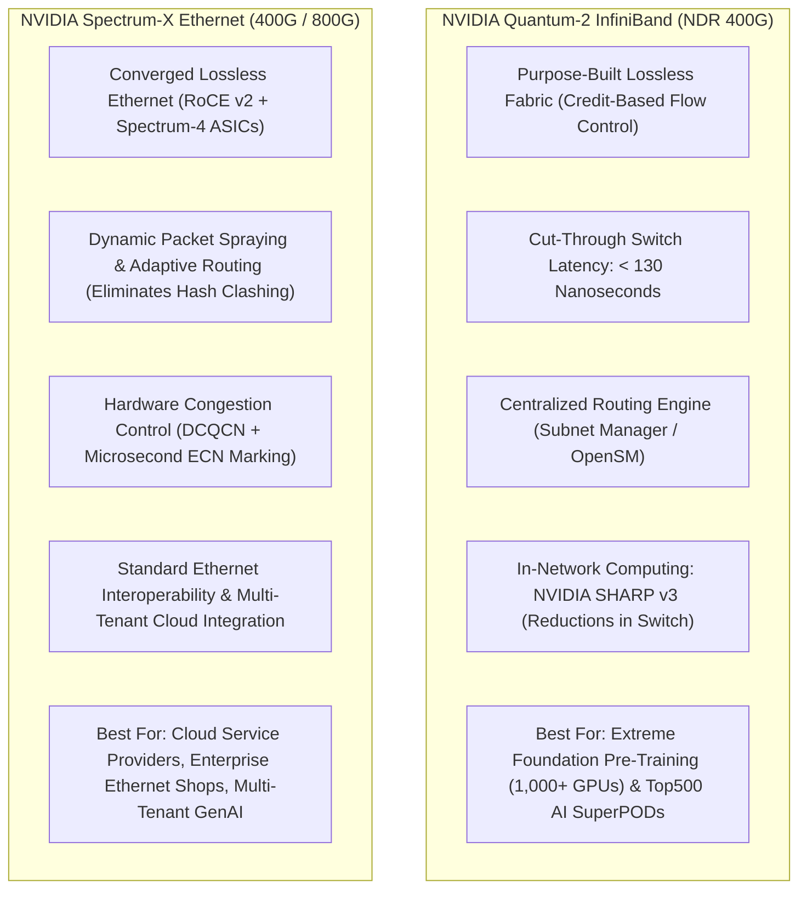
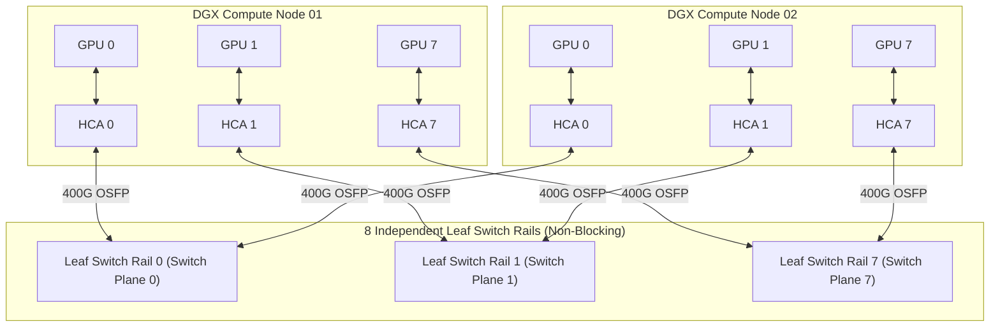

# Chapter 7 — Accelerated Networking: InfiniBand, Spectrum-X, and Collective Fabrics

In an **NVIDIA AI Factory**, the network fabric is not merely an external pipe for moving data—it is an **active computational backplane**. Distributed foundation model pre-training across thousands of GPUs is an extreme network stress test. At every backward-pass step, thousands of GPUs simultaneously exchange hundreds of gigabytes of gradient tensors in synchronized collective patterns (`All-Reduce`, `All-to-All`).

If the fabric drops a single packet, experiences a hash-collision bottleneck on equal-cost multi-path (ECMP) uplinks, or encounters an optical transceiver with bit errors, the entire multi-thousand-GPU job halts at the collective barrier.

When interviewing for an **NVIDIA Senior Solutions Architect** role, you must be prepared to compare **Quantum-2 InfiniBand** and **Spectrum-X Ethernet**, design multi-rail non-blocking topologies, optimize **GPUDirect RDMA**, configure lossless RoCE v2 flow control (PFC & ECN), and isolate fabric-induced collective stragglers.

---

## 1. Architectural Battleground: Quantum-2 InfiniBand vs. Spectrum-X Ethernet

Customers frequently ask: *"Should we deploy NVIDIA Quantum-2 InfiniBand or NVIDIA Spectrum-X Ethernet for our new AI cluster?"* An NVIDIA Senior Solutions Architect must articulate their architectural divergence:



### Architectural Comparison

| Dimension | NVIDIA Quantum-2 InfiniBand | NVIDIA Spectrum-X Ethernet |
|---|---|---|
| **Port Speeds** | NDR 400 Gbps (Quantum-2) $\to$ XDR 800 Gbps (Quantum-X800) | 400 Gbps (Spectrum-4) $\to$ 800 Gbps (Spectrum-X800) |
| **Flow Control** | **Hardware Credit-Based**: Sender never transmits unless receiver has allocated buffer credits. Zero loss guaranteed natively. | **Lossless RoCE v2 via PFC (Priority Flow Control)**: Pause frames on Priority 3, managed by ConnectX-7 and Spectrum-4. |
| **Routing Mechanism** | Centralized Subnet Manager (OpenSM); deterministic source routing; hardware adaptive routing. | Dynamic **Packet Spraying** across all leaf-spine paths, reordered at receiver HCA in hardware. |
| **In-Network Computing** | **NVIDIA SHARP v3**: Switch ASICs perform FP16/FP8 vector reduction, cutting All-Reduce hops in half. | End-to-end host-based reductions; accelerated by ConnectX-7 hardware engines. |
| **Switch Latency** | $< 130$ nanoseconds (Cut-through switching). | $< 400$ nanoseconds (Cut-through Ethernet). |
| **Target Workload** | Dedicated supercomputers for LLM pre-training and scientific discovery. | Cloud-native multi-tenant AI factories, hyperscalers, enterprise data centers. |

---

## 2. Multi-Rail Fat-Tree Fabric Architecture

In an 8-GPU **NVIDIA DGX H100**, each SXM5 GPU is paired directly with an independent **ConnectX-7 400 Gbps HCA** via PCIe Gen5 switches. To prevent traffic contention, DGX SuperPODs deploy an **8-Rail Fat-Tree Network**.



### Why Multi-Rail Eliminates Collective Contention
- GPU 0 on all nodes communicates strictly over **Rail 0** (Leaf Switch 0).
- GPU 1 on all nodes communicates strictly over **Rail 1** (Leaf Switch 1).
- **Zero Cross-Rail Contention:** During an All-Reduce collective, GPU 0 never competes for switch uplinks with GPU 1. Cross-GPU tensor aggregation within the node happens over ultra-high-speed **NVLink (900 GB/s)**, while inter-node transport scales across 8 parallel 400G network rails.

---

## 3. GPUDirect RDMA and GPUDirect Storage Mechanics

Traditional network communication forces network packets to traverse host CPU memory:

```text
NIC  -->  Host PCIe  -->  CPU Memory (DRAM)  -->  Host PCIe  -->  GPU HBM
```

This CPU bounce-buffering adds microsecond latency, consumes CPU memory bandwidth, and introduces severe cache thrashing.

### The GPUDirect RDMA Direct Path

```text
ConnectX-7 HCA  <=== Direct PCIe Gen5 P2P DMA ===>  GPU HBM3 Memory
```

- **Mechanism:** The `nvidia-peermem` kernel module coordinates the PCIe address mapping between the Mellanox OFED InfiniBand driver and the NVIDIA GPU driver.
- The ConnectX-7 HCA issues direct 64-bit PCIe DMA read/write transactions into the GPU’s physical High Bandwidth Memory (HBM).
- **Result:** Latency drops from 15 microseconds to **under 1.5 microseconds**, and transfers achieve full 400 Gbps line-rate throughput without consuming a single host CPU cycle.

---

## 4. Lossless Ethernet Engineering: PFC and ECN on Spectrum-X

Running RDMA over Ethernet (RoCE v2) requires turning a naturally lossy best-effort protocol into a **lossless deterministic fabric**.

```mermaid
flowchart LR
    subgraph Tx["Transmitting Host (ConnectX-7)"]
        TX_QUEUE["Egress Queue (Priority 3)"]
    end

    subgraph Switch["Spectrum-4 Ethernet Leaf Switch"]
        INGRESS_BUF["Ingress Buffer Pool"]
        ECN_MARK{"Buffer > ECN Threshold?"}
        PFC_CHECK{"Buffer > PFC Threshold?"}
    end

    subgraph Rx["Receiving Host (ConnectX-7)"]
        RX_BUF["Receive Buffer"]
    end

    TX_QUEUE -->|RoCE v2 Packets| INGRESS_BUF
    INGRESS_BUF --> ECN_MARK
    ECN_MARK -->|Yes: Mark CE bits in IP header| PFC_CHECK
    PFC_CHECK -->|Critical: Send PFC PAUSE frame back| Tx
    INGRESS_BUF --> RX_BUF
    RX_BUF -->|Sends CNP (Congestion Notification Packet)| Tx
    Tx -->|Throttles transmission rate before drops occur| TX_QUEUE
```

### The Two Control Loops of Lossless RoCE:
1. **Coarse Loop: Priority Flow Control (PFC - IEEE 802.1Qbb)**:
   - When switch ingress buffer thresholds are breached, the switch sends an 802.1Qbb **PFC PAUSE frame** upstream for Priority 3 traffic. The sending NIC pauses transmission on that queue until buffers drain.
   - *Failure Mode:* **PFC Deadlock.** If pause frames form a circular dependency across switches, all packet transmission halts. Prevented by strict buffer headroom calculation and dynamic watchdog timers (`pfc_deadlock_prevention = auto`).
2. **Fine Loop: Explicit Congestion Notification (ECN / DCQCN)**:
   - When buffer occupancy exceeds a configured threshold, the switch marks Congestion Experienced (`CE`) bits in the IP header of transit packets without dropping them.
   - The receiving HCA detects the CE mark and generates a **Congestion Notification Packet (CNP)** back to the sender. The transmitting ConnectX-7 throttles its rate in hardware, preventing PFC pause frames from firing in steady state.

---

## 5. Senior Solutions Architect Interview Scenarios

### Scenario 1: InfiniBand vs. RoCE Architectural Decision for an Enterprise Customer
**Interviewer:** *"A customer's CTO tells you: 'Our networking team has 15 years of Cisco and Arista Ethernet experience. We don't know InfiniBand. Why shouldn't we just deploy our 512-GPU training cluster on standard 400G Ethernet?' How do you advise them?"*

**Candidate Answer:**
> "I advise them by framing the distinction between **Standard Enterprise Ethernet** and **NVIDIA Spectrum-X AI Ethernet vs. Quantum-2 InfiniBand**:
> 1. **The Flaw of Standard Enterprise Ethernet for AI:**
>    - Standard Ethernet relies on Equal-Cost Multi-Path (ECMP) hashing based on IP/Port tuples. In an All-Reduce collective with heavy elephant flows, ECMP causes **hash collisions**—multiple 400G flows are mapped to the same spine uplink while other uplinks sit idle, causing severe buffer drops.
>    - Standard TCP retransmissions take milliseconds, stalling gang-scheduled GPU training loops. Standard Ethernet is simply not viable for large-scale foundation pre-training.
> 2. **Comparing the Viable Solutions:**
>    - **Option A: NVIDIA Quantum-2 InfiniBand (The Gold Standard):** If time-to-market, zero packet loss, and peak training efficiency are the top priorities, InfiniBand is the proven industry path. It offers cut-through latency (< 130ns), hardware credit-based flow control, centralized Subnet Management, and in-network reduction (SHARP v3).
>    - **Option B: NVIDIA Spectrum-X (The Cloud Ethernet Path):** If corporate governance strictly mandates Ethernet, we deploy Spectrum-X with Spectrum-4 switches and ConnectX-7 HCAs. Spectrum-X solves standard Ethernet flaws through **hardware dynamic packet spraying** (scattering packets across all uplinks to eliminate hash collisions) and microsecond-level hardware DCQCN congestion control.
> 3. **The Executive Recommendation:**
>    If the customer deploys Spectrum-X, their Ethernet team retains familiar operational tooling while achieving near-InfiniBand training efficiency. However, deploying generic commodity Ethernet switches will result in catastrophic training slowdowns."

---

### Scenario 2: Diagnosing a "Network Is Slowing Training" Incident
**Interviewer:** *"A customer submits a ticket: 'Our 32-node training run is 30% slower than expected. We think your InfiniBand fabric is defective.' How do you prove whether the network is actually the culprit?"*

**Candidate Answer:**
> "I follow the **PBCTC methodology (Phase, Bench, Counters, Topology, Correlate)**:
> 1. **Phase Isolation:** Before touching fabric counters, I review the PyTorch profiler or PyTorch Lightning logs. I verify whether the 30% regression is in the **GPU compute phase**, **dataloader I/O phase**, or **collective communication phase (`ncclKernel_AllReduce`)**. If collective time is normal and dataloader time spiked, the issue is storage, not the network.
> 2. **Isolated Network Benchmark:** I execute `nccl-tests` (`all_reduce_perf`) across the allocated 32 nodes outside of their application code.
>    - If `all_reduce_perf` achieves full 400G bus bandwidth (~380 GB/s), the InfiniBand fabric is completely healthy, proving the regression is an application-level bottleneck (e.g., small batch sizes or CPU thread starvation).
> 3. **Query Physical Link Counters:** If `all_reduce_perf` is slow, I query InfiniBand error counters across all 256 HCA ports:
>    `ibqueryerrors -s SymbolErrors,LinkDowned,PortXmitWait`
>    - **High `SymbolErrors`:** Indicates a dirty optical transceiver or loose MPO fiber cable.
>    - **High `PortXmitWait`:** Indicates downstream congestion or a slow rank causing credit starvations.
> 4. **Isolate and Re-test:** I drain the node displaying symbol errors, replace it with a spare, and re-run the benchmark to confirm full line-rate performance."

---

## Key Takeaways

1. **InfiniBand vs. Spectrum-X:** Quantum-2 InfiniBand provides native credit-based lossless transport and in-network computing (SHARP); Spectrum-X delivers near-InfiniBand efficiency over Ethernet via hardware packet spraying and microsecond DCQCN.
2. **Multi-Rail Topologies Prevent Contention:** DGX SuperPODs map 8 HCAs 1:1 to 8 independent leaf switch rails, eliminating cross-GPU link contention during distributed collectives.
3. **GPUDirect RDMA is Essential:** Direct PCIe Gen5 P2P DMA between ConnectX-7 and GPU HBM bypasses CPU DRAM bounce buffers, dropping transfer latency from 15 microseconds to $< 1.5$ microseconds.
4. **Standard Ethernet Fails for AI:** ECMP hash collisions and lossy retransmissions destroy collective step times; Lossless RoCE v2 mandates Priority Flow Control (PFC) on Priority 3 and tuned ECN marking.
5. **Always Prove the Phase First:** Never debug network error counters until application profilers confirm that the collective communication phase is the actual bottleneck.
