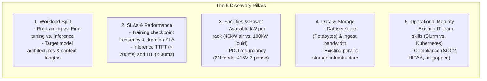
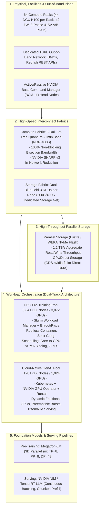
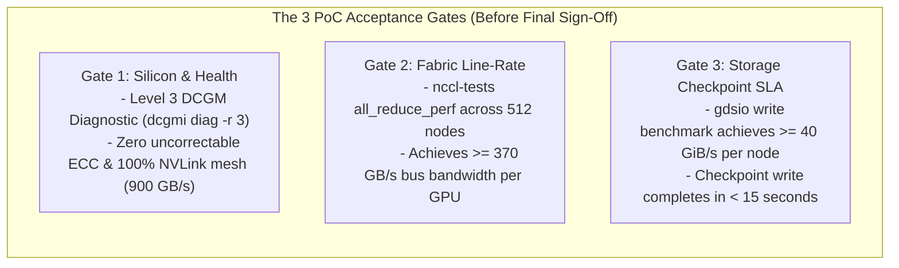

# Chapter 8 — The Solutions Architecture Whiteboard Masterclass

In an **NVIDIA Senior Solutions Architect** interview, the **Whiteboard Architecture Session** is the most heavily weighted evaluation block. The interview panel will present an intentionally ambiguous, multi-million dollar customer challenge, such as:

> *"Design an enterprise AI Factory for a sovereign nation or Fortune 50 enterprise deploying 512 DGX H100 servers (4,096 GPUs). The platform must support foundation model pre-training (405B parameters) while concurrently serving mission-critical real-time inference with sub-second SLAs."*

Junior candidates fail by immediately jumping to the whiteboard and drawing random boxes labeled "Kubernetes", "Docker", or "vLLM". 

An **NVIDIA Senior Solutions Architect** commands the room by executing a structured, **4-Phase Architectural Delivery Model**:
1. **Requirements Discovery & Boundary Extraction** (First 5–7 minutes)
2. **Multi-Tier Architectural Blueprint & Data Paths** (15–20 minutes)
3. **Deep Subsystem Engineering & Trade-Off Defenses** (10–15 minutes)
4. **Day-2 Operations, Failure Modes, and PoC Verification Gates** (5 minutes)

---

## 1. Phase 1: Requirements Discovery & Boundary Extraction

Never draw a single box until you have clarified the operational and physical boundaries. Open the session with an authoritative framing:

> *"Before I draw the architecture, I need to understand the physical, workload, and organizational constraints. May I ask five targeted discovery questions?"*



### The "Assumed Parameters" for the Whiteboard:
If the interviewer replies: *"Assume you have a modern data center and standard enterprise requirements,"* state your assumed architectural baseline aloud before drawing:
1. **Cluster Size:** 512x NVIDIA DGX H100 systems (4,096 H100 SXM5 GPUs).
2. **Workload Allocation:** 75% capacity (384 nodes / 3,072 GPUs) dedicated to Foundation Pre-training; 25% capacity (128 nodes / 1,024 GPUs) dedicated to fine-tuning, RAG, and real-time inference.
3. **Power Budget:** ~10.2 kW per DGX H100 (approximately 5.2 MW compute IT load), packaged at 4 DGX nodes per 45U rack (~42 kW per rack) requiring direct rear-door heat exchangers (RDHx) or liquid cooling.

---

## 2. Phase 2: The Multi-Tier AI Factory Blueprint

Draw the system from the physical ground up, dividing the architecture into five coordinated planes:



---

## 3. Phase 3: Deep Technical Subsystem Defenses

During the whiteboard walkthrough, proactively address the three hardest architectural trade-offs:

### 1. The Dual-Track Orchestrator: Why Slurm AND Kubernetes?
**The Trade-Off:** Customers often want a single orchestrator.
**The SA Defense:**
- **For 3,072-GPU Foundation Pre-Training (Slurm):** Pre-training requires synchronized gang-scheduling across thousands of ranks. Kubernetes' `kubelet`, `containerd`, and CNI background daemon threads introduce **CPU scheduling jitter**, causing microsecond delays during NCCL All-Reduce barriers. Slurm with **Enroot/Pyxis** is daemonless, unprivileged, and guarantees zero core jitter.
- **For 1,024-GPU Inference & Fine-Tuning (Kubernetes + Run:ai):** Inference requires dynamic HTTP ingress, horizontal pod autoscaling, canary rollouts, and microservice APIs. Run:ai adds **fractional GPU slicing** and over-quota preemption, allowing hundreds of data scientists to share GPUs without hardware partitioning.
- **Elastic Reallocation via BCM:** Because both pools run on bare-metal managed by **NVIDIA Base Command Manager (BCM)**, nodes are not permanently locked. If pre-training finishes, an administrator can reassign 128 nodes from Slurm to the Kubernetes category in minutes via `cmsh`.

---

### 2. Checkpoint Storage SLA: GPUDirect Storage (GDS)
**The Problem:** A 405B parameter model in FP8 produces a ~500 GB checkpoint file (weights, optimizer states, scheduler state). Across 384 nodes, saving a checkpoint generates **192 Terabytes of data**.
- **Without GDS:** Bouncing 192 TB through CPU memory locks the host system bus, stalling GPUs for 15 minutes every checkpoint.
- **With GPUDirect Storage (GDS):** ConnectX-7 adapters write directly from GPU HBM into NVMe-oF parallel storage (WEKA / Lustre) at **40 GB/s per node**:
```text
Checkpoint Duration = 500 GB / 40 GB/s = 12.5 seconds!
```
- Training resumes in under 15 seconds, saving hundreds of thousands of dollars in idling compute capacity.

---

### 3. Compute Interconnect: 8-Rail Quantum-2 InfiniBand
**The Architecture:**
- Each DGX H100 contains 8x ConnectX-7 400 Gbps HCAs.
- Each HCA connects to an independent **Leaf Switch Rail** (Rails 0 through 7).
- In an All-Reduce collective, GPU 0 across all nodes exchanges data strictly across Rail 0, eliminating cross-rail packet collisions.
- **NVIDIA SHARP v3**: In-network reduction engines inside the Quantum-2 switch ASICs perform tensor additions directly in the fabric, reducing inter-switch bandwidth by 50%.

---

## 4. Phase 4: Day-2 Operations and PoC Acceptance Gates

End the whiteboard session by demonstrating operational maturity: how this platform will be maintained and qualified.



### The Maintenance Policy:
- **Zero-Downtime Rollouts:** Platform updates follow the **4-Ring Canary Architecture** (Ring 0 Lab $\to$ Ring 1 Rail Canary $\to$ Ring 2 Switch Wave $\to$ Ring 3 Fleet Batches).
- **Automated Health Gating:** Slurm `Prolog` scripts run a 5-second DCGM Level 1 check before every job step. Damaged nodes are automatically drained before jobs can land on them.

---

## 5. Senior Solutions Architect Interview Scenarios

### Scenario 1: Handling Executive Pushback on Architecture Cost
**Interviewer:** *"The customer's CFO pushes back: 'Your architecture specifies 8 InfiniBand switches per leaf and expensive parallel NVMe storage. Can't we save $10M by using 100G commodity Ethernet and our existing enterprise NAS?' How do you respond?"*

**Candidate Answer:**
> "I address the CFO's concern by analyzing **Total Cost of Ownership (TCO) and Capital Efficiency**:
> 1. **Quantifying the Capital Waste:**
>    - 512 DGX H100 servers represent an asset worth over $150M. The operational cost of this cluster is dominated by GPU capital depreciation and data center power (5.2 MW).
>    - If we downgrade the interconnect to commodity 100G Ethernet, NCCL All-Reduce step times increase by 4x. Overall foundation pre-training throughput will drop by **40% to 50%**.
>    - Dropping throughput by 40% on a $150M cluster is equivalent to **destroying $60M of compute utility** to save $10M on networking!
> 2. **The Storage Bottleneck:**
>    - Standard enterprise NAS lacks GPUDirect Storage (GDS). Saving a 192 TB distributed checkpoint over NFS will take 15 to 20 minutes instead of 12 seconds.
>    - Checkpointing every 2 hours would mean the entire $150M cluster spends **15% of its entire operating life completely idle** waiting for disk writes.
> 3. **The Recommendation:**
>    The Quantum-2 8-rail InfiniBand fabric and GDS parallel storage are not luxury options—they are the essential enabling infrastructure that ensures the $150M GPU asset operates at 95%+ computational efficiency."

---

## Key Takeaways

1. **Discover Before You Draw:** Always extract workload splits, SLAs, facilities (power/cooling kW), storage scale, and team maturity before drawing architecture.
2. **Dual-Track Orchestration is Standard:** Deploy Slurm + Enroot for foundation pre-training to eliminate CPU daemon jitter; deploy Kubernetes + Run:ai for agile multi-tenant inference and fine-tuning.
3. **8-Rail InfiniBand Prevents Contention:** ConnectX-7 HCAs map 1:1 to independent switch rails, isolating GPU-to-GPU traffic during distributed All-Reduce steps.
4. **GDS Protects Checkpoint SLAs:** GPUDirect Storage enables direct DMA between NVMe-oF arrays and GPU HBM, shrinking multi-terabyte checkpoint durations from minutes to seconds.
5. **Frame Architecture in TCO and Efficiency:** Defend high-performance networking and storage by proving that saving money on infrastructure destroys the compute efficiency of the multi-million dollar GPU investment.
