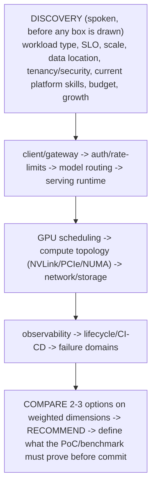

> Learning outcome Discover, model paths/state/failure domains, compare options, recommend and define validation.

Before drawing boxes, ask workload type, SLO, scale, data location, tenancy/security, current platform skills, budget and growth. Then draw request/data/control paths and failure domains. Compare two or three options on weighted dimensions. End with a recommendation plus what the PoC/benchmark must validate.

## Worked scenario
**Situation:** Design a shared 128-GPU platform for training and inference.

1. Clarify training/inference split, models, concurrency, distributed job sizes and SLOs.
2. Define GPU pool strategy: homogeneous/heterogeneous, full GPU vs MIG/shared pools, topology requirements.
3. Choose scheduler/orchestration model per workload; consider Kubernetes, Slurm or integration.
4. Design fabric/storage around distributed training and model/data paths.
5. Define identity/tenancy/quota, observability, lifecycle automation and failure domains.
6. Capacity-test peak inference + training contention and define admission/fair-share policy.

**Conclusion:** A platform architecture is workload + resource-control + data-path + operations, not a Kubernetes diagram.

## ➕ Additions

➕ **The whiteboard method as a strict left-to-right build order (this is the sequence to literally draw, live):**

➕ **Memory hook:** *"Discover before you draw, requirements before names."* The single most common failure mode named explicitly in the original text — starting with "NIM" or "Kubernetes" — is a mnemonic in itself: if the first word out of your mouth is a product name, you've already lost the "senior" signal, restart with a question instead.

➕ **Interview-ready line to open any whiteboard prompt with:**
> "Before I draw anything, I have six or seven questions — workload type, SLO, scale, data location, tenancy, current platform skills, and budget/growth trajectory. Can I ask a few of those first?"
This is nearly always granted, and even a partial answer ("it's mostly inference, multi-tenant, cost-sensitive") changes which of the next boxes you draw first.

➕ **Annotated sample whiteboard transcript — the 128-GPU shared platform scenario, narrated as if speaking while drawing:**

> "First — training and inference on the same 128 GPUs is a resource-contention problem before it's a scheduler problem, so let me ask: what's the expected split, and are these hard SLOs for inference or soft ones?" *(← clarify, and explicitly names the underlying tension before naming any tool)*
>
> "I'll draw two logical pools even if the hardware is homogeneous: a training pool sized for your largest distributed job's topology needs — same NVSwitch domain, ideally — and an inference pool that can use MIG or smaller GPU slices since inference replicas are usually smaller than a training job's minimum GPU count." *(← states WHY the pool split exists, ties back to Chapter 5's topology reasoning and Chapter 6's MIG/time-slicing tradeoffs)*
>
> "For scheduling, I'd lean toward Kubernetes if your team already operates it and inference dominates, since Kubernetes' Service/autoscaling primitives fit inference well; if training job sizes are large and long-running with gang-scheduling needs, Slurm's batch semantics are a more natural fit, or a Kubernetes+Slurm coexistence model where each owns a partition. I would not assume one scheduler is correct without hearing which workload dominates and what your team already knows." *(← comparison on weighted dimensions, explicitly deferring to discovery answers)*
>
> "For validation before commit: I'd want a PoC that runs your actual largest training job's collective benchmark on the training pool's topology, and a load test hitting the inference pool's SLO under realistic concurrency — both under simulated contention from the other pool, since 'shared 128 GPUs' means the interesting failure mode is exactly that contention." *(← ends with concrete PoC definition, not just "let's do a PoC")*

## Practice
➕ 5. Whiteboard (on paper or aloud) a platform for a customer who explicitly refuses to answer discovery questions and says "just tell me Kubernetes or Slurm." Practice the sentence that states your assumption explicitly and proceeds anyway, without either refusing to answer or silently guessing.
➕ 6. Take the 128-GPU worked scenario above and redo step 2 (GPU pool strategy) under the constraint that the customer has zero MIG-capable hardware (older GPU generation) — explain what changes in your recommendation and why time-slicing's operational-complexity tradeoff becomes more relevant, not less.
