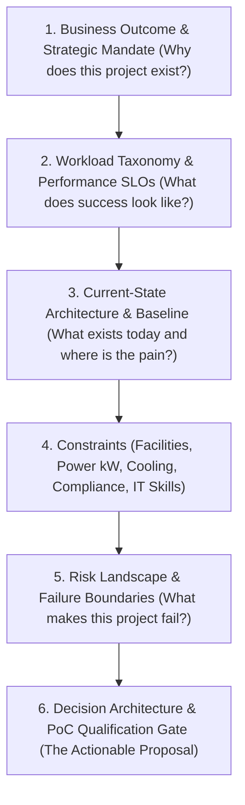

# Chapter 9 — Customer Discovery and Technical Qualification

In an **NVIDIA Senior Solutions Architect** interview, technical knowledge alone is insufficient. An SA is a trusted technical advisor who bridges customer business strategy and NVIDIA's accelerated computing platforms. Customers rarely arrive with well-formed, mathematically sound infrastructure specifications. More often, they present premature conclusions: *"We need 128 H100s on-prem because of security,"* or *"We want to build our entire LLM platform on standard Ethernet with Kubernetes."*

Junior engineers take customer statements literally and immediately draft a bill of materials. An **NVIDIA Senior Solutions Architect** uses consultative discovery to uncover hidden constraints, separate business requirements from technical misconceptions, and guide the customer toward an optimal, future-proof AI Factory architecture.

---

## 1. The 6-Tier Customer Discovery Funnel

Discovery is not an interrogation. It is a systematic funnel that moves from high-level business objectives down to concrete engineering constraints:

### The "Premise Challenge" Framework

When a customer presents an unverified assumption, never argue directly. Use **Inquiry-Driven Reframing**:

| Customer Premise | The Underlying Architectural Risk | The Senior SA Reframing Question |
|---|---|---|
| *"We want to run all distributed pre-training in Kubernetes because our DevOps team already knows it."* | Daemon CPU context-switching will cause scheduling jitter and stall NCCL collective barriers across 512 GPUs. | *"Kubernetes is fantastic for microservices. For your multi-node pre-training, have you modeled how background daemon threads and CNI layers impact NCCL All-Reduce latency? Let's discuss a dual-track architecture with BCM that provides Kubernetes agility alongside daemonless Slurm efficiency."* |
| *"We want to use our existing enterprise 100G Ethernet core switch for GPU compute."* | ECMP hash collisions on elephant flows and packet drops will destroy training throughput. | *"Standard Ethernet was designed for web traffic with millions of small mice flows. AI All-Reduce generates large elephant flows that cause hash collisions on ECMP uplinks. What is your tolerance for 40% slower training epochs, or should we evaluate Spectrum-X with dynamic packet spraying?"* |
| *"We need 64 GPUs on-prem strictly for security and data privacy."* | The customer may not have considered facilities (60 kW power delivery, liquid cooling, high-voltage PDUs). | *"Data sovereignty is paramount. To ensure your on-prem data center is ready: what is your current power envelope per rack (kW)? Are your facilities team prepared for 40kW air cooling or direct liquid cooling loops?"* |

---

## 2. Industry-Specific Discovery Playbooks

An NVIDIA Solutions Architect must seamlessly tailor their discovery approach to the customer's industry vertical:

### 1. Sovereign AI & Government Infrastructure
- **Core Drivers:** National data residency, indigenous language foundation models (LLMs), local data centers, supply chain independence.
- **Critical Discovery Inquiries:**
  1. *Classification Boundaries:* Must the cluster operate in a 100% air-gapped environment without external internet access for license servers or container registries?
  2. *Supply Chain & Hardware Standards:* Are there specific hardware Root-of-Trust (RoT) requirements or national cryptographic standards for firmware attestation?
  3. *Multi-Agency Tenancy:* Will multiple government ministries share the infrastructure, requiring hard cryptographically isolated partitions (MIG, VLANs, Slurm QoS accounts)?

---

### 2. Financial Services (Hedge Funds & Tier-1 Banks)
- **Core Drivers:** Ultra-low latency inference, high-frequency trading (HFT) risk modeling, fraud detection, deterministic training SLAs, strict regulatory audits (SOC2, FINRA).
- **Critical Discovery Inquiries:**
  1. *Deterministic Latency SLAs:* What is the strict P99.9 latency limit for trading signals or fraud evaluation? (e.g., sub-10ms vs. batch overnight).
  2. *Data Encryption in Transit:* Does compliance mandate line-rate MACsec or IPsec encryption across the InfiniBand/Ethernet fabric, and have you factored in the hardware crypto overhead?
  3. *Auditability & Checkpoint Retention:* How long must historical model checkpoints and training logs be preserved for regulatory audit compliance?

---

### 3. Healthcare, Life Sciences, and BioTech
- **Core Drivers:** Cryo-EM image processing, molecular dynamics, genomic sequencing, AlphaFold protein structure prediction, HIPAA compliance.
- **Critical Discovery Inquiries:**
  1. *I/O Ingestion Bottlenecks:* Genomic pipelines process millions of small files; Cryo-EM produces massive multi-terabyte raw TIFF streams. Does the storage backend support **GPUDirect Storage (GDS)** to prevent CPU host memory bottlenecks?
  2. *Batch Job Volatility:* Are workloads bursty (e.g., sequencing runs finishing in unpredictable waves), requiring dynamic fairshare queueing and automated over-quota preemption?

---

## 3. Senior Solutions Architect Interview Scenarios

### Scenario 1: Uncovering Hidden Constraints in an Enterprise GenAI PoC
**Interviewer:** *"A Fortune 500 retail customer tells you they have budget to buy 64 DGX H100 servers for customer-facing LLM chatbots. They want to start a 30-day hardware Proof of Concept (PoC) next week. How do you lead this discovery meeting?"*

**Candidate Answer:**
> "I structure this discovery session to protect both the customer and NVIDIA from a high-cost failed deployment:
> 1. **Qualify the Facilities Reality (The Silent Blocker):**
>    - 64 DGX H100 systems draw **~650 kW of continuous IT power** (~800 kW including cooling).
>    - I ask: *'Where do you plan to rack these 64 servers next week? What is the maximum power density per rack in that facility? Does the room support 40kW per rack with chilled water loops or rear-door heat exchangers?'*
>    - If their enterprise data center caps out at 10 kW per rack, racking 64 DGX servers physically cannot happen next week. We must explore a colocation partner or DGX Cloud hosting while their data center is retrofitted.
> 2. **Extract Workload Metrics:**
>    - *'What model architectures are you serving? What are your target concurrent users, context lengths, and P99 latency SLOs?'*
>    - If they are only serving a 7B parameter chatbot for internal testing, 64 DGX H100s (512 GPUs) is wildly oversized. Sizing properly builds customer trust.
> 3. **Establish a Qualified PoC Gate:**
>    - We never ship hardware for an undefined 'test'. I define strict, measurable acceptance criteria:
>      *'In this 30-day PoC, we will validate that TensorRT-LLM on a single DGX H100 node achieves 400 requests/sec with a P99 TTFT under 180 ms on your proprietary customer support dataset. Upon hitting this metric, we move to full phase-1 deployment.'*"

---

## Key Takeaways

1. **Discovery Precedes Architecture:** Never design a system from a customer's premature technical conclusions; drill down the 6-tier discovery funnel to identify real business constraints.
2. **Reframe Rather Than Argue:** Use inquiry-driven reframing to help customers realize why commodity Ethernet or single-orchestrator topologies threaten their AI milestones.
3. **Power and Facilities are the #1 Blocker:** Always qualify power density (kW/rack) and cooling infrastructure before discussing software stacks.
4. **Tailor to the Vertical:** Sovereign AI demands data residency and air-gapping; FinTech demands deterministic P99 latency and encryption; BioTech demands extreme GDS storage throughput.
5. **Always Bind PoCs to Measurable Gates:** Define explicit throughput and latency thresholds before committing hardware to a Proof of Concept.
