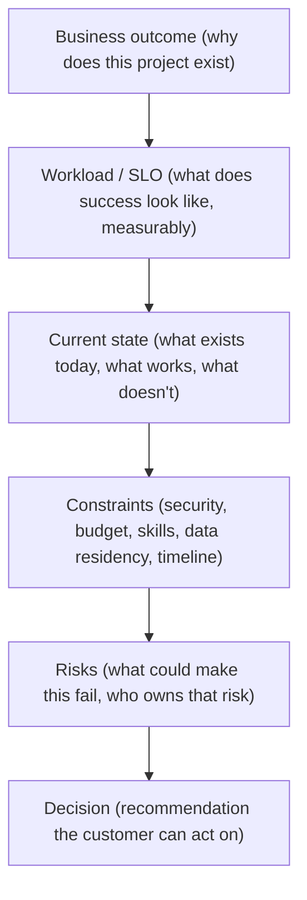

> Learning outcome Practice consultative questions that reveal constraints instead of demonstrating jargon.

Use a funnel: business outcome -> workload/SLO -> current state -> constraints -> risks -> decision. Ask follow-ups based on answers. If the customer says "on-prem because security," clarify which data/residency/control requirement prevents cloud; do not accept or challenge the premise without understanding it.

| Customer statement | Useful follow-up |
| --- | --- |
| We need GPUs | For training, inference or both? Which model sizes and peak concurrency/job sizes? |
| We need high availability | Which workload SLO and failure domains? What RTO/RPO for state/checkpoints? |
| We want Kubernetes | Which existing operational strengths or platform integration drive that choice? |
| We need low cost | Cost per what outcome—job completion, tokens, request SLO? What utilization/headroom is acceptable? |

## Worked explanation and practice

**The discovery funnel as a diagram:**

**Key takeaway:** *"BWCCRD — Business, Workload, Current-state, Constraints, Risks, Decision."* The funnel narrows on purpose — never open a discovery call at "Kubernetes or Slurm," always open at "why does this project exist."

**Interview-ready line for the "customer states a premise" trap (the "on-prem because security" example, generalized):**
> "When a customer states a conclusion — 'we need on-prem,' 'we need Kubernetes,' 'we need 32 GPUs' — I treat it as a data point about their constraints, not a requirement to execute literally. I ask what's behind it before agreeing or pushing back."
This line works for literally any premature-conclusion statement a customer makes, which is exactly why it's worth having verbatim.
