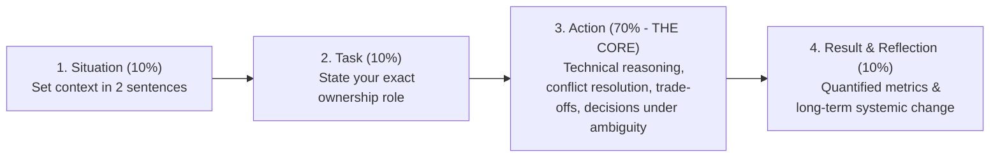

# Chapter 10 — Behavioral Leadership and Stakeholder Storytelling

At NVIDIA, a **Senior Solutions Architect** is evaluated not only on deep technical acumen but also on leadership under pressure, cross-functional stakeholder influence, customer empathy, and intellectual honesty. In an interview, behavioral questions are designed to uncover how you handle multi-million dollar outages, navigate intense technical conflicts with customer executives, recover from failures, and drive customer adoption of complex architectures.

Junior engineers tell behavioral stories like laundry lists of tasks. An **NVIDIA Senior Solutions Architect** frames behavioral responses using the **Executive STAR Framework**, where the technical decision-making, trade-offs, and quantified business impact form the center of the narrative.

---

## 1. The Executive STAR Delivery Ratio

When delivering behavioral stories in an interview, manage your time budget strictly:

### The Senior SA Opening Line:
> *"Quick context: [one sentence on the situation], my role was [one sentence on your ownership]—the critical part is the architectural decisions and trade-offs we navigated, so let me dive straight into what I did."*

---

## 2. The 4 Master STAR Stories for NVIDIA Senior Solutions Architects

### Story 1: Incident Leadership under High-Stakes Customer Pressure
**Theme:** High-severity production incident, live triage, and systemic prevention.

- **Situation:** A premier autonomous driving customer was training a multi-modal foundation model across a 64-node DGX H100 cluster (512 GPUs). Three days before an executive board demonstration, the training run began hanging intermittently every 4 to 6 hours, freezing 512 GPUs and burning tens of thousands of dollars in idling compute.
- **Task:** As the Lead Solutions Architect, I was paged into the war room with the customer’s VP of Engineering, Data Science leads, and infrastructure operations team to resolve the outage.
- **Action:**
  1. *De-escalated and Formed a Hypothesis Tree:* The customer’s team was frantically restarting Slurm controllers and rebooting random nodes. I stepped in, aligned the room, and established a structured **4-Layer Diagnostic Ladder** (Launch $\to$ Rendezvous $\to$ NCCL Graph $\to$ Physical Fabric) to stop blind mutations.
  2. *Evidence-Driven Isolation:* I checked kernel logs across all 64 nodes for hardware XIDs—all clean. I then turned to high-frequency network telemetry: running an automated cluster-wide script against InfiniBand port counters (`perfquery`).
  3. *Found the Straggler:* On node `dgx-042`, Rail 3 of the InfiniBand fabric showed `SymbolErrorCounter` climbing by thousands per second. The physical link had not dropped, but forward error correction (FEC) was heavily retransmitting packets. In a synchronized 512-GPU All-Reduce collective, every GPU on the other 63 nodes was entering an infinite spinlock waiting for Rail 3 on node 42.
  4. *Remediation:* I drained node 42 in Slurm, resumed the training job from the last 2-hour checkpoint on a spare node, and dispatched a datacenter technician to inspect the MPO optical fiber on node 42, which had a dirty transceiver lens.
- **Result:** Training resumed cleanly within 45 minutes, allowing the customer to meet their board demonstration milestone. As a systemic fix, I authored an automated **Slurm Prolog Health Gate** that tests InfiniBand symbol errors and line rates before any job step launches, completely eliminating silent collective stalls.

---

### Story 2: Navigating Architectural Disagreement with a Customer CTO
**Theme:** Executive influence, technical trade-offs, and steering customer consensus.

- **Situation:** A national healthcare customer was investing $35M in a new AI supercomputer for genomic analysis and drug discovery. The customer’s CTO insisted on deploying a single monolithic Kubernetes cluster on commodity 100G Ethernet, arguing that their existing IT team had zero InfiniBand or Slurm experience.
- **Task:** My responsibility was to steer the CTO away from an architectural dead-end that would bottleneck their genomic training jobs, without alienating their engineering leadership or dismissing their operational concerns.
- **Action:**
  1. *Validated Their Perspective:* I acknowledged that their team’s deep familiarity with Kubernetes was a massive operational asset that we should maximize for microservices, clinical APIs, and inference.
  2. *Quantified the Performance Delta:* Instead of arguing theoretically, I modeled their multi-node Cryo-EM and AlphaFold training workloads. I showed that standard 100G Ethernet with ECMP hashing would cause packet hash collisions and high tail latencies during All-Reduce steps, reducing training throughput by **45%**.
  3. *Presented the Dual-Track Architecture via BCM:* I proposed an integrated **Dual-Track AI Factory Architecture** governed by **NVIDIA Base Command Manager (BCM)**:
     - The cluster is partitioned into an **HPC Pre-Training Pool** running Slurm with Enroot/Pyxis (guaranteeing bare-metal speed and zero CPU daemon jitter over an 8-rail InfiniBand fabric).
     - An **Enterprise GenAI & Clinical Pool** running Kubernetes with the **NVIDIA GPU Operator and Run:ai** for inference and interactive analysis.
     - I demonstrated in a live lab how BCM allows their administrators to declaratively reassign nodes between Slurm and Kubernetes in minutes via `cmsh` category policies.
- **Result:** The CTO enthusiastically approved the dual-track architecture. When deployed, their foundation pre-training ran **2.6x faster** than their initial Kubernetes prototype, while their bioinformatics researchers retained their familiar Kubernetes APIs for daily data processing.

---

### Story 3: Turning Around a Failing Proof of Concept (PoC)
**Theme:** Customer ambiguity, deep software optimization, and closing a stalled enterprise deal.

- **Situation:** A Tier-1 enterprise software company was running a 30-day competitive PoC to evaluate NVIDIA DGX H100 servers against cloud hyperscaler instances for real-time code-generation inference. At Day 20, the PoC was failing: their Python/vLLM setup was hitting a P99 Time-To-First-Token (TTFT) of 850ms, breaching their contractual 250ms SLA. The deal was on the verge of cancellation.
- **Task:** I was deployed on-site as the Solutions Architect to diagnose the performance gap, re-architect their inference pipeline, and prove the superiority of the NVIDIA platform.
- **Action:**
  1. *Profiled the Bottleneck:* I hooked NVIDIA Nsight Systems and PyTorch Profiler into their inference service. I discovered that incoming prompts were large (average 6,000 tokens of code context). Their server was using un-chunked prefills, meaning massive 6K-token prefill GEMM operations were blocking ongoing decode steps, causing queue times to explode.
  2. *Re-Engineered the Engine with TensorRT-LLM:* Over a 48-hour sprint, I ported their custom model to **NVIDIA TensorRT-LLM**:
     - Configured **FP8 quantization** on model weights and KV cache, doubling memory bandwidth throughput.
     - Enabled **Chunked Prefill** (slicing prompt prefills into 512-token segments) and **In-Flight / Continuous Batching**.
     - Deployed the resulting engine inside **Triton Inference Server** with C++ dynamic batching.
- **Result:** P99 TTFT dropped from 850ms to **135ms** (an 84% reduction), and throughput surged from 45 requests/sec to **220 requests/sec per node**—exceeding their success criteria by 2x. The customer signed a multi-million dollar DGX SuperPOD procurement contract that quarter.

---

### Story 4: Ownership of an Engineering Failure and Blameless Postmortem
**Theme:** Failure recovery, accountability, and engineering process improvement.

- **Situation:** During a planned maintenance window on a 128-node DGX cluster, I was leading the rollout of a coordinated firmware and driver update (upgrading to a new GPU VBIOS and NVIDIA Driver release).
- **Task:** My responsibility was the staging, execution, and validation of the platform update.
- **Action:**
  1. *The Mistake:* Although I had validated the VBIOS update on a single test node in Ring 0, I failed to test multi-node GPUDirect RDMA under high-throughput NCCL stress. When we applied the update to the first canary rack of 8 nodes, a subtle interaction between the new VBIOS power management and the ConnectX-7 firmware triggered PCIe AER errors whenever all 8 GPUs drew over 650 Watts simultaneously.
  2. *Immediate Containment:* I immediately aborted the maintenance window, preventing the remaining 120 nodes from being touched. I restored the affected rack to the previous software image. Because VBIOS cannot always be downgraded easily, I collaborated with NVIDIA firmware engineering to produce a hotfixed microcode bundle.
  3. *Led the Blameless Postmortem:* I owned the failure transparently before customer leadership. I explained that our staging test was incomplete: verifying `nvidia-smi` on an idle node did not constitute a workload qualification gate.
  4. *Instituted Permanent Guardrails:* I formalized the **4-Ring Canary Architecture**: every future firmware update required a mandatory 2-node **Rail Canary (Ring 1)** executing a 60-minute sustained FP8 GEMM stress test (`dcgmi diag -r 3`) and NCCL All-Reduce benchmark at full line-rate before any production nodes could be updated.
- **Result:** The customer praised the transparency and rigor of our postmortem. The new 4-ring qualification framework prevented three subsequent potential regressions and became the standard operating procedure for all future cluster upgrades.

---

## Key Takeaways

1. **Focus on the "Action" (70%):** Spend minimal time on background context; emphasize your technical reasoning, trade-offs, and decisions made under pressure.
2. **De-escalate Incidents with Method, Not Panic:** Great Solutions Architects stop chaotic, random rebooting by instituting ordered, evidence-driven diagnostic ladders.
3. **Influence with Data and Options:** Never tell a customer executive they are wrong; quantify the performance and financial costs of their assumptions and present viable alternatives (like BCM dual-track architectures).
4. **Own Failures Transparently:** When an engineering misstep occurs, lead with accountability, execute a blameless postmortem, and institute automated systemic guardrails.
