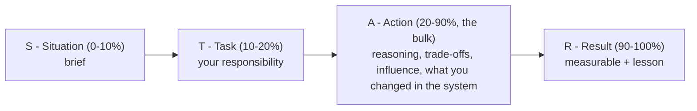

> Learning outcome Structure examples around ownership, conflict, customer ambiguity, incident leadership and measurable outcome.

Use STAR, but make the technical decision visible. Situation should be brief. Task states your responsibility. Action is the bulk: how you reasoned, influenced, handled trade-offs and changed the system. Result includes measurable impact and what you learned. Senior stories should show decisions under ambiguity, not only task execution.

| Theme | Story ingredients |
| --- | --- |
| Incident | scope, evidence, mitigation, coordination, prevention, MTTR/reliability result |
| Cost optimization | baseline, constraints, safe changes, performance guardrail, quantified savings |
| Architecture disagreement | requirements, alternatives, trade-off evidence, stakeholder alignment |
| Customer ambiguity | discovery, reframing problem, PoC/decision, adoption outcome |
| Failure/lesson | wrong assumption, signal missed, correction, system/process change |

## Worked explanation and practice

**STAR-for-seniors as a time-budget diagram (the ratio interviewers are actually grading):**

**Key takeaway:** *"Situation and Task are the appetizer, Action is the meal, Result is the receipt."* If your Situation/Task takes more than ~15% of your answer time, you're under-delivering on Action — the part that actually demonstrates seniority.

**Interview-ready line for opening ANY behavioral story concisely:**
> "Quick context: [one sentence on situation], my role was [one sentence on task] — the interesting part is what I actually decided, so let me get to that."
This explicitly signals to the interviewer that you know where the value is, and it's a permission-giving sentence that lets you skip ahead without feeling like you're withholding context.

**Annotated sample STAR transcript — an incident story, narrated with WHY each part works (using the "Incident" row's ingredients: scope, evidence, mitigation, coordination, prevention, MTTR/reliability result):**

> "**Situation:** A multi-tenant inference platform had a P99 latency spike affecting three customers simultaneously. **Task:** I was the on-call SA/SRE and the first person to triage." *(← 2 sentences, done — no elaboration on how the pager went off)*
>
> "**Action:** First move was scoping — was this one model, one node, or fleet-wide? I checked whether the affected customers shared a GPU pool, and they did, which immediately narrowed the hypothesis to something shared — noisy-neighbor contention or a shared dependency, not three independent problems." *(← shows the C-M-H-E-R framework from Chapter 1 being applied live inside a behavioral answer — this is a deliberate cross-reference technique: use the technical framework INSIDE your STAR story to demonstrate both skills at once)*
>
> "I found via DCGM metrics that one tenant's batch job had spiked GPU memory usage on the shared MIG-less pool, which was forcing the scheduler into smaller effective batches for everyone co-located. I mitigated by cordoning that node and draining the offending workload to a dedicated pool — a reversible, low-blast-radius action — rather than restarting the whole platform, which would have hit customers who weren't even affected." *(← names the specific mitigation AND explicitly justifies why it was chosen over a more drastic alternative — this is the trade-off-visibility the chapter asks for)*
>
> "I coordinated with the account team to communicate proactively to the three affected customers before they escalated, which mattered as much as the technical fix for how the incident was perceived." *(← coordination ingredient, tied to a customer-facing SA's actual job, not generic "I informed stakeholders")*
>
> "**Result:** MTTR was 22 minutes from page to mitigation. The prevention follow-up was proposing MIG-based hard isolation for that pool specifically, which we implemented within two weeks — since then, zero cross-tenant latency incidents on that pool." *(← quantified, and explicitly closes the loop with a system change, not just "we fixed it")*

## Practice
5. Take any one of your four prepared STAR stories from the original Practice section and time yourself — if Situation+Task exceeds 20% of your total answer time, rewrite the opening using the "Quick context..." interview-ready line above and re-time it.
