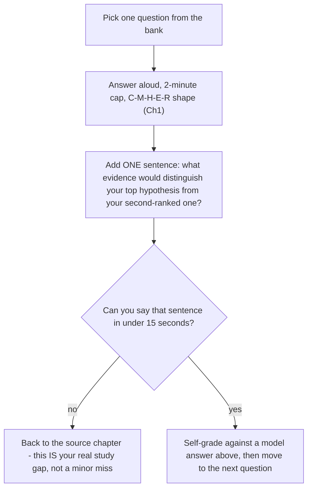

> Learning outcome Use after studying the corresponding volumes; answer aloud and force one evidence/trade-off follow-up.

| Domain | Question |
| --- | --- |
| Python | Why is a set a better choice than a list for repeated membership checks? |
| Python | Design a retry policy for a POST API. What changes if the operation is not idempotent? |
| Linux | Why can load average be high while CPU is low? |
| Linux | Container OOMKilled with node memory available—explain. |
| Networking | DNS resolves but TCP connect times out. What does each next test prove? |
| Kubernetes | Deployment exists but no Pods—where can reconciliation have stopped? |
| Kubernetes | Why can an idle node be unschedulable? |
| Kubernetes | Explain HPA and cluster autoscaler as two loops. |
| GPU | Driver works but Kubernetes has no GPU resource—trace layers. |
| GPU | MIG versus time slicing for production inference. |
| AI | What makes TTFT different from tokens/s as a capacity signal? |
| AI | Why can GPU utilization be a poor HPA trigger? |
| HPC | RoCE versus InfiniBand from an architecture perspective. |
| HPC | How do you isolate NCCL/network versus storage slowdown? |
| Observability | Which metric/log/trace evidence do you want for rising P99 latency? |
| SA | Kubernetes or Slurm? Ask five questions before answering. |
| SA | How would you design a PoC for a new GPU platform? |
| Customer | Explain GPU sharing to a CTO versus an SRE. |

## ➕ Additions

➕ **How to drill this bank (the mechanic, not just the list):** for each question, answer aloud with a 2-minute limit, in the C-M-H-E-R shape from Chapter 1, then force yourself to add one sentence naming the evidence that would distinguish your top hypothesis from your second one. If you can't name that sentence, you don't know the topic as deeply as the answer implied — go back to the source chapter.

➕ **Diagram: the drill loop for this question bank**

Run every row in this bank through this loop once before assuming you "know" the bank — the loop, not the answer key, is what the drill is actually training.

➕ **Model answers for a sample of the original bank's hardest rows (to calibrate what "good" sounds like against this specific bank — not exhaustive, use for calibration then self-grade the rest):**

**"Why can load average be high while CPU is low?"**
> Load average counts runnable tasks *and* tasks in uninterruptible sleep (D-state) — it is queue pressure, not a CPU percentage. A box with 40 processes blocked on slow storage or NFS shows load 40 with CPU sitting idle, because none of those 40 are consuming CPU cycles — they're waiting on I/O completion. Evidence that distinguishes this from a scheduling problem: `vmstat`'s `b` column (blocked count) high while `r` (runnable) is low, and `/proc/<pid>/wchan` naming the specific kernel wait function for the blocked processes.

**"Driver works but Kubernetes has no GPU resource — trace layers."**
> Layer order: host driver (confirm with `nvidia-smi` on the host, outside any container) → NVIDIA Container Toolkit (confirms containers can see the GPU via the runtime hook) → GPU Operator operand pods (device plugin, DCGM exporter, etc. — check they're `Running`, not `CrashLoopBackOff`) → device plugin reporting `nvidia.com/gpu` as allocatable to kubelet → scheduler seeing that allocatable. "Driver works" only confirms the first link; a broken toolkit version match or a crashing device plugin anywhere downstream leaves Kubernetes with zero visibility into a perfectly healthy GPU.

**"Why can GPU utilization be a poor HPA trigger?"**
> GPU utilization (SM busy %) can be 100% while doing low-value work — e.g., a badly-batched inference server can show 100% util with poor tokens/s, or a memory-bandwidth-bound decode phase shows moderate util while genuinely saturated on a different resource. Scaling on util alone can both under-scale (util looks fine, but queue depth/TTFT is climbing because of a KV-cache or batching bottleneck util doesn't capture) and over-scale (a transient util spike from a single large-batch request triggers a scale-up that isn't needed). Queue depth, TTFT/ITL, and request concurrency are better proxies for actual capacity pressure in an LLM-serving context.

➕ **New questions with full model answers — additive question bank content (this is the volume's "bank" chapter, so additive volume matters most here):**

**1. (Python) "You need to deduplicate 10 million log lines while preserving first-seen order. What's your approach and its memory cost?"**
> Use a `dict` (or `set` alongside a list) to track seen lines while iterating once — `dict`/`set` membership is O(1) average, so the whole pass is O(n) time. Memory cost is the real discussion: worst case (no duplicates) stores all 10M lines' hash/reference in the set, which at even modest per-line size could be gigabytes — worth naming explicitly rather than assuming memory is free. If lines are long, storing a hash (e.g. first store `hash(line)` in the seen-set instead of the line itself, accepting a vanishingly small collision risk) trades a small correctness risk for materially lower memory. If exact correctness matters (e.g. financial/audit logs), don't take that shortcut — state the trade-off rather than silently picking one side.

**2. (Linux) "A systemd service keeps restarting every 90 seconds indefinitely. What does that cadence itself tell you, before reading any logs?"**
> A perfectly regular restart interval (not accelerating, not backing off) suggests `systemd`'s `RestartSec` is fixed and the failure is deterministic and fast — the service crashes almost immediately every time, not after some variable runtime. This already narrows away "resource exhaustion that builds up over time" (which would show a lengthening or shortening interval) in favor of "immediate startup failure" — bad config, missing dependency, port already bound, or a crash in initialization code. The cadence is a free clue before you've read a single log line.

**3. (Kubernetes) "A StatefulSet Pod is stuck Terminating for 10+ minutes. What's actually happening, and what's the risk of `--force` deleting it?"**
> The kubelet is waiting for the container to exit gracefully within `terminationGracePeriodSeconds` after sending SIGTERM; a Pod stuck this long usually means the process isn't handling SIGTERM (e.g., PID 1 ignoring signals, or a slow/stuck shutdown hook) and the kubelet is waiting out the full grace period, or the grace period itself is unusually long. The risk of `--force` deleting: for a StatefulSet specifically, this removes the Pod object from the API server *without confirming the container has actually stopped* — if it's a stateful workload (e.g. writing to a PV), you can end up with two instances (old container still running somewhere, new one starting with the same identity/volume) corrupting shared state. This is exactly why StatefulSet Pods should never be force-deleted without independently confirming (e.g. via the node) that the process has actually exited.

**4. (GPU/AI) "A customer asks: 'Can we just give every Pod a fractional GPU with time-slicing so nothing ever waits for a full GPU?' What's the pushback?"**
> Time-slicing shares the whole GPU's memory space — there's no memory isolation between time-sliced workloads, so one tenant's memory-hungry request can OOM another tenant's process on the same physical GPU, and there's no compute isolation either, so latency-sensitive tenants inherit whatever jitter the noisiest co-located tenant creates. "Nothing ever waits for a full GPU" is true in the trivial sense that scheduling is instant, but it trades that for unpredictable per-request latency and a real cross-tenant memory-safety risk — the pushback is naming that trade explicitly and asking whether the workloads are latency-sensitive/multi-tenant-sensitive enough that MIG's hard isolation (at the cost of fixed partition granularity) is worth it instead.

**5. (HPC/Networking) "Two nodes in the same rack show identical `ibstat` output (both Active, both rated 200Gb/s), yet nccl-tests between just those two nodes underperforms nodes elsewhere in the fleet by 40%. What do you check next?"**
> `ibstat` only reports link state and negotiated rate — it says nothing about actual achieved bandwidth or the presence of retransmission/congestion. Next checks: `ibqueryerrors` for error counters possibly accumulating between exactly this pair (not fleet-wide — this needs a targeted pairwise check); the fabric topology/routing between these two specific nodes — if they're not on the same leaf switch and the path crosses a congested spine link, aggregate fleet health won't show it but this specific pair pays for it; and whether adaptive routing / static routing is misconfigured, causing this pair's traffic to take a suboptimal path even though both endpoints individually look healthy.

**6. (SA/Customer) "A customer's procurement team asks you to 'just confirm NVIDIA's GPUs are faster than the competitor's' in a single sentence for a slide. How do you respond without either refusing or giving a hollow marketing line?"**
> "Faster" isn't well-defined without a workload — training throughput, inference latency, and memory-bandwidth-bound workloads can rank hardware differently. The honest single sentence: "the right comparison is a benchmark on your actual model/workload, and I can help design that PoC rather than quote a spec-sheet number that may not reflect your traffic pattern." This is the same benchmark-derived-capacity principle from Chapter 6 and the PoC-validation principle from Chapter 8, applied to a procurement-pressure scenario — naming that connection is itself worth doing out loud if asked why you're pushing back.

**7. (Observability) "P99 latency for an inference service rose from 200ms to 900ms over 3 days, no deploys, no alerts fired. What's your evidence-gathering order?"**
> First, confirm it's genuinely P99 and not a metric artifact (check request volume didn't drop — P99 on low sample counts is noisy). Then correlate the rise's shape: sudden step vs gradual creep — gradual over 3 days with no deploy suggests a resource creep (memory fragmentation, KV-cache growth, a slow leak) rather than a discrete cause. Pull GPU metrics (util, memory, `cpu.stat` throttling per Chapter 1's Volume-1-style reasoning) time-series over the same 3 days, and check whether traffic mix shifted (longer prompts, different model routing) rather than assuming infrastructure regressed. "No alerts fired" is itself a finding — it means your alerting thresholds/coverage have a gap worth fixing regardless of the root cause found.

## Practice
➕ 19. Pick five questions from this bank you haven't verbally rehearsed yet, and for each, write the ONE sentence of evidence that would distinguish your top hypothesis from your second-ranked one — if you can't write that sentence in under 15 seconds, that's your study gap.
➕ 20. Take new question 4 above (fractional GPU time-slicing) and argue the OPPOSITE side out loud for 60 seconds — i.e., make the strongest honest case FOR time-slicing-everywhere — this drill (steelmanning the position you'd normally push back on) is what separates "I memorized a pushback" from "I understand the actual trade-off."
