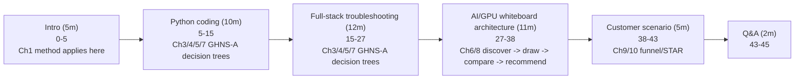

> Learning outcome Practice realistic pacing rather than endless question banks.

| Minutes | Segment |
| --- | --- |
| 0–5 | intro + current role / architecture summary |
| 5–15 | Python or automation coding/reasoning |
| 15–27 | full-stack troubleshooting |
| 27–38 | AI/GPU infrastructure architecture / whiteboard |
| 38–43 | customer/stakeholder scenario |
| 43–45 | candidate questions / wrap |

After each mock, score only meaningful competencies: clarity of assumptions, mechanism depth, evidence ordering, trade-off quality, coding correctness and customer communication. Choose one or two gaps for the next refresh session rather than re-studying everything.

## Practice

1. Answer five questions from the bank aloud with a 2-minute limit, then add a 1-minute follow-up.

2. Do one Python problem using algorithm-first workflow without looking at code.

3. Whiteboard a 64-GPU training platform and explicitly draw control path, data path and failure domains.

4. Prepare four STAR stories: incident, cost/reliability improvement, architecture trade-off, stakeholder disagreement.

## ➕ Additions

➕ **The 45-minute timeline as a visual (pin this to your desk before every mock run):**

➕ **Memory hook:** *"5-10-12-11-5-2 — front-load nothing, the middle two blocks (troubleshooting + architecture) are 23 of 45 minutes, over half the interview."* If you only have time to over-prepare two chapters in this volume, make them Chapters 4/5 (troubleshooting) and 8 (whiteboard) — that's where the clock actually is.

➕ **Per-segment timing discipline — the failure mode each segment invites, and the counter:**
| Segment | Common failure under time pressure | Counter |
|---|---|---|
| Intro (0-5) | rambling career history eating the whole 5 minutes | pre-script a 90-second version, literally time it once before the real interview |
| Coding (5-15) | diving into syntax before stating the algorithm (Ch2) | say the 8-step workflow's step 1-4 out loud before typing anything |
| Troubleshooting (15-27) | command-dumping (Ch1's named anti-pattern) | force yourself to say a hypothesis before every command |
| Whiteboard (27-38) | naming a product before requirements (Ch8's named anti-pattern) | ask 2-3 discovery questions before drawing the first box |
| Customer scenario (38-43) | jargon instead of consultative questions (Ch9) | use the BWCCRD funnel, don't skip straight to "Decision" |
| Wrap (43-45) | no questions prepared, or only compensation questions | prepare 2 technical/team questions, save comp for a later stage |

➕ **Annotated sample mock-interview segment transition — showing HOW a strong candidate manages the clock out loud, which is itself a signal interviewers notice:**
> *(at minute 26, still mid-troubleshooting-answer)* "I'm aware we're close to time on this section — let me give you my conclusion: the root cause is [X], and I'd validate it with [Y] if we had more time. Happy to go deeper on any part of this before we move on." *(← explicitly manages pacing rather than getting cut off mid-thought; shows self-awareness of the interview's structure, which reads as someone who has run interviews/meetings before)*

➕ **Extra full mock-run worked example (new) — a compressed, fully worked 45-minute run-through outline you can rehearse against, tying every segment to a specific chapter/question from this volume:**
```
0-5    Intro: "I'm a [role], currently running [1-sentence architecture
       summary — e.g. 'a 200-node GPU fleet split training/inference,
       Kubernetes-orchestrated, Prometheus/Grafana/Loki observability']."

5-15   Coding: Chapter 2's Question-set-B skeleton (parse multi-node log,
       aggregate by error type) OR the new concurrent-polling scenario
       from Ch2 — practice both, the interviewer picks.

15-27  Troubleshooting: draw from Ch3/4/5's worked scenarios — practice
       cold-opening with clarify+scope (Ch1's C-M-H-E-R) on a Pending-Pod
       GPU scenario (Ch4) AND a "training job slower than yesterday"
       scenario (Ch5) — you likely only have time for one, decide in
       the first 10 seconds which the interviewer is steering toward.

27-38  Whiteboard: Ch8's discovery-first method on a GenAI platform
       (Question set G) — budget 3 min discovery, 5 min draw, 3 min
       compare+recommend.

38-43  Customer scenario: one of Question set F's prompts (Ch9) — run
       the BWCCRD funnel, land on a PoC definition, not just an opinion.

43-45  Questions: two prepared technical questions about the team's
       current GPU platform / AI factory work — NOT "what's the comp
       band," save that for a recruiter conversation.
```

➕ **Post-mock scoring rubric, expanded with a concrete 1-5 scale (the original text says "score only meaningful competencies" — here's a usable version of that):**
| Competency | 1 (weak) | 3 (adequate) | 5 (strong) |
|---|---|---|---|
| Clarity of assumptions | states none, guesses silently | states them if asked | states them proactively, unprompted |
| Mechanism depth | names a tool, not why | names tool + rough reason | names tool + exact mechanism + evidence it produces |
| Evidence ordering | jumps to conclusion | roughly right order, some backtracking | clean hypothesis→evidence→conclusion chain |
| Trade-off quality | one-sided recommendation | names a trade-off if pushed | names trade-off unprompted, ties to workload specifics |
| Coding correctness | doesn't finish core logic | correct core, weak edge cases | correct core + edge cases + complexity stated unprompted |
| Customer communication | jargon-first | translates when asked | translates proactively, checks understanding |

➕ **Interview-ready line for the wrap-up (43-45 minute segment), a strong closing question that also signals SA-specific judgment:**
> "What does the team consider the hardest unsolved infrastructure problem on the GPU platform right now — not the roadmap item, the actual pain point?" This question is better than generic ones because it invites the interviewer to talk shop, often reveals real information about team maturity, and shows you're already thinking like someone who'd own that problem.

## More practice
➕ 5. Run one full 45-minute mock end-to-end, timed with a visible clock, using the compressed run-through outline above — record which segment you overran, and whether the overrun was discovery/thinking time or execution time (they call for different fixes: thinking-time overruns mean pre-rehearse more; execution overruns mean you need a tighter verbal template).
➕ 6. After the mock, self-score using the 1-5 rubric above, pick exactly ONE competency scoring 3 or below, and design a 20-minute focused drill against only that competency before your next mock — this directly implements the original text's "choose one or two gaps... rather than re-studying everything" instruction, made concrete.

➕ **Visual model — allocate the interview clock deliberately:**

**Memory hook:** *"Timebox thinking out loud, not just typing."* A strong answer leaves room to state the operational decision and its risk.
