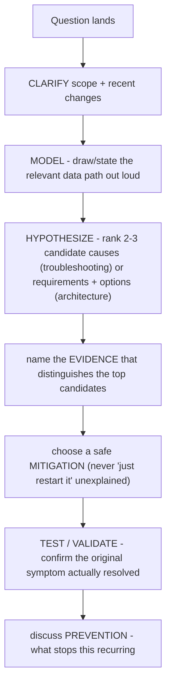

For troubleshooting questions, do not enumerate random commands. Clarify scope and recent changes; draw the relevant data path; rank hypotheses; name the evidence that separates them; choose a safe mitigation; validate the original symptom; then discuss prevention. For architecture questions, replace hypotheses with requirements and options, but keep the evidence-led structure.

_Figure B. When a GPU workload is slow, descend the stack systematically until evidence explains the symptom._

## Worked explanation and practice

**Diagram: the full Clarify-Model-Hypothesize-Test-Recommend chain (the seven moves in this method's name, expanded):**

The name "Clarify, model, hypothesize, test, recommend" compresses two of these seven moves each into "test" (mitigate + validate) and "recommend" (evidence-led choice + prevention) — say all seven out loud in an interview even though the method's name only lists five words.

## Worked answer: one distributed job is slow

**Clarify:** “Is the regression in startup, data loading, step compute, collective communication or checkpointing? Is it one job, one node group or the fleet, and what changed?”

**Model:** State the path: scheduler allocation → container/runtime → CPU data feeder → GPU compute → NCCL collective over the fabric → shared storage/checkpoint.

**Hypothesize:** Rank a changed workload configuration, one slow rank/node, fabric degradation and storage latency. Do not list every possible failure with equal weight.

**Test with separating evidence:** Compare phase timings and per-rank distributions with a known-good run. If only collective time widened, compare NCCL tests and link counters on the slow rank. If data wait widened, inspect client/storage latency before blaming the GPU.

**Mitigate and validate:** Remove a proven suspect node or roll back a known change, then rerun the original workload and verify step time—not merely `nvidia-smi` health.

**Recommend:** Add the missing admission test, canary or per-rank alert that would have detected the condition earlier. State the owner and the evidence that will close the action.

A strong answer can be incomplete while evidence is missing. Say what you know, what you do not know, and which observation would change the decision. That is stronger than inventing a confident root cause.
