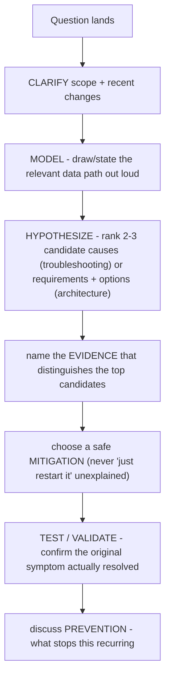

For troubleshooting questions, do not enumerate random commands. Clarify scope and recent changes; draw the relevant data path; rank hypotheses; name the evidence that separates them; choose a safe mitigation; validate the original symptom; then discuss prevention. For architecture questions, replace hypotheses with requirements and options, but keep the evidence-led structure.

_Figure B. When a GPU workload is slow, descend the stack systematically until evidence explains the symptom._

## ➕ Additions

➕ **Diagram: the full Clarify-Model-Hypothesize-Test-Recommend chain (the seven moves in this method's name, expanded):**

The name "Clarify, model, hypothesize, test, recommend" compresses two of these seven moves each into "test" (mitigate + validate) and "recommend" (evidence-led choice + prevention) — say all seven out loud in an interview even though the method's name only lists five words.
