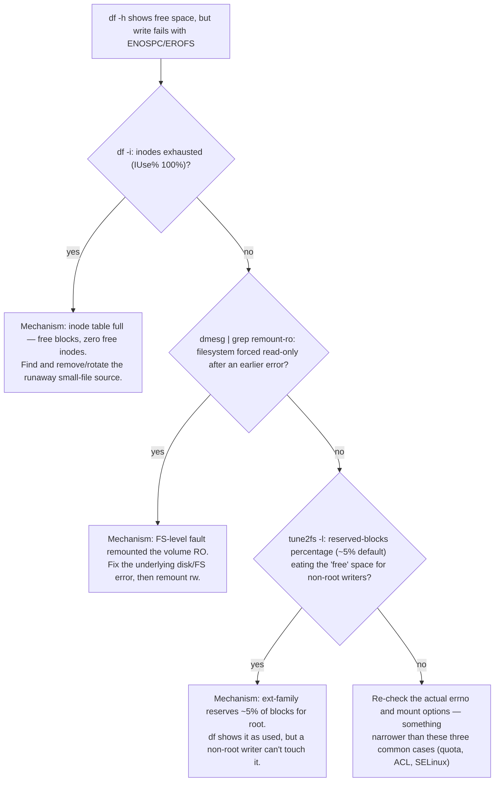

| Question | What a senior answer should expose |
| --- | --- |
| Load average 40 but CPU 25% — explain | runnable vs D-state tasks, I/O, per-cgroup throttling, vmstat/ps/wchan/PSI |
| Container OOM but node has free RAM | cgroup memory boundary, memory.events, working set, requests/limits |
| Only some GPU nodes are slow | NUMA, PCIe/NIC topology, driver/kernel image, CPU feeder/storage/fabric evidence |
| TCP connection times out | DNS/route/SYN path/firewall/conntrack/listener; packet capture and ss |
| Disk 70% full yet writes fail | inodes, quotas, read-only FS, mount/device errors, filesystem reservations |

## ➕ Additions

➕ **Extra worked scenario (new) — "disk 70% full yet writes fail," fully diagnosed:**
> **Situation:** `df -h` shows 30% free on `/var/log`, but an application logging to that mount gets `ENOSPC`.
> 1. Clarify: is it every write or specific paths? Since when?
> 2. Check inodes, not just blocks: `df -i /var/log` — a directory with millions of tiny files (a runaway per-request log file, a stuck rotation job) can exhaust the inode table while block usage looks fine.
> ```
> $ df -i /var/log
> Filesystem      Inodes  IUsed   IFree IUse% Mounted on
> /dev/sdb1      1310720 1310720      0  100% /var/log
> ```
> 3. If inodes are fine, check for a read-only remount after a filesystem error (`dmesg | grep -i "remount-ro"`), quota (`repquota`), or a reserved-blocks percentage (`tune2fs -l` shows `Reserved block count` — ext-family filesystems reserve ~5% for root by default; a non-root writer can hit ENOSPC while `df` still shows "free" space that's actually root-reserved).
> **Conclusion:** "70% full" from `df -h` and "writes fail" are only connected through one of at least three distinct mechanisms (inodes, RO remount, reserved blocks) — never assume block-capacity is the story just because a percentage is quoted.

➕ **Diagram: "disk has free space, writes still fail" — the three-branch check:**

Whichever branch matches is the actual mechanism — never assume block-capacity is the story just because `df -h` quotes a percentage.

## Practice
➕ 7. Fill an inode table on a scratch filesystem (`for i in $(seq 1 200000); do touch /mnt/scratch/f$i; done` on a small filesystem) and reproduce ENOSPC with free blocks still showing — narrate the `df -i` evidence out loud.
