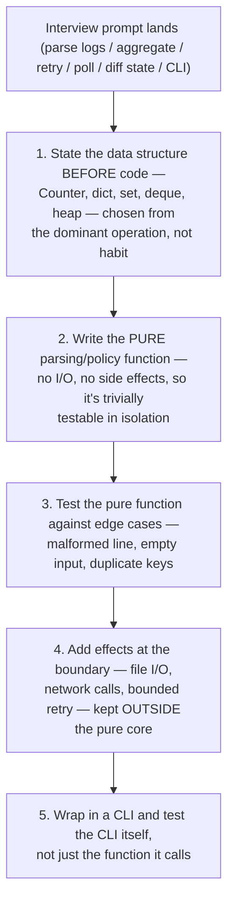

Practice coding in small increments. State the data structure before code, make parsing and policy pure, then add effects. Typical tasks: parse multi-format logs, aggregate errors by service/node, implement bounded retry, query many endpoints concurrently, compare desired/actual state, build a CLI and test it.

**Practice explaining complexity, malformed input and memory strategy**

```python
# Interview task skeleton: summarize failures by node and error type
from collections import Counter, defaultdict
import re

PATTERN = re.compile(
    r"^(?P<ts>\S+)\s+(?P<node>\S+)\s+"
    r"(?P<level>ERROR|CRITICAL|FATAL)\s+(?P<msg>.+)$"
)

def summarize(lines: list[str]) -> dict[str, Counter[str]]:
    result: dict[str, Counter[str]] = defaultdict(Counter)
    for line in lines:
        m = PATTERN.match(line.strip())
        if not m:
            continue
        # In a real problem, classify msg into stable error categories.
        result[m['node']][m['level']] += 1
    return dict(result)
```

## ➕ Additions

➕ **Diagram: the increment ladder this question set expects (say the shape before typing anything):**

The recurring mistake this diagram guards against: mixing parsing/policy logic with I/O/effects from the first line, which makes the core untestable and the interviewer unable to see your algorithm separately from your plumbing.
