Practice coding in small increments. State the data structure before code, make parsing and policy pure, then add effects. Typical tasks: parse multi-format logs, aggregate errors by service/node, implement bounded retry, query many endpoints concurrently, compare desired/actual state, build a CLI and test it.

**Practice explaining complexity, malformed input and memory strategy**

```python
# Interview task skeleton: summarize failures by node and error type
from collections import Counter, defaultdict
import re

PATTERN = re.compile(
    r"^(?P<ts>\S+)\s+(?P<node>\S+)\s+"
    r"(?P<level>ERROR|CRITICAL|FATAL)\s+(?P<msg>.+)$"
)

def summarize(lines: list[str]) -> dict[str, Counter[str]]:
    result: dict[str, Counter[str]] = defaultdict(Counter)
    for line in lines:
        m = PATTERN.match(line.strip())
        if not m:
            continue
        # In a real problem, classify msg into stable error categories.
        result[m['node']][m['level']] += 1
    return dict(result)
```

## Worked explanation and practice

**Diagram: the increment ladder this question set expects (say the shape before typing anything):**

```mermaid
flowchart TD
  %% Converted from the original ASCII diagram; source wording is preserved.
  n0["Interview prompt lands (parse logs / aggregate / retry / poll / diff state / CLI)"]
  n1["State the data structure BEFORE code — Counter, dict, set,"]
  n2["deque, heap — chosen from the dominant operation, not habit"]
  n3["Write the PURE parsing/policy function — no I/O, no side"]
  n4["effects, so it's trivially testable in isolation"]
  n5["Test the pure function against edge cases — malformed line,"]
  n6["empty input, duplicate keys"]
  n7["Add effects at the boundary — file I/O, network calls,"]
  n8["bounded retry — kept OUTSIDE the pure core"]
  n9["Wrap in a CLI and test the CLI itself, not just the"]
  n10["function it calls"]
```

The recurring mistake this diagram guards against: mixing parsing/policy logic with I/O/effects from the first line, which makes the core untestable and the interviewer unable to see your algorithm separately from your plumbing.

## Turn the skeleton into a complete interview solution

Before coding, state the contract: input is an iterable of text lines; malformed lines are counted rather than crashing the run; the result groups failure levels by node; memory grows with the number of distinct nodes and categories, not the number of lines.

```python
from collections import Counter, defaultdict
from dataclasses import dataclass
from typing import Iterable

@dataclass(frozen=True)
class Summary:
    failures: dict[str, Counter[str]]
    malformed_lines: int

def summarize_safely(lines: Iterable[str]) -> Summary:
    failures: defaultdict[str, Counter[str]] = defaultdict(Counter)
    malformed = 0

    for raw_line in lines:
        match = PATTERN.match(raw_line.strip())
        if match is None:
            malformed += 1
            continue
        failures[match["node"]][match["level"]] += 1

    return Summary(failures=dict(failures), malformed_lines=malformed)
```

Why these constructs appear:

- `Iterable[str]` allows a list, file object or generator, so a large log need not be loaded fully into memory.
- `defaultdict(Counter)` creates the per-node counter only when that node appears.
- `@dataclass(frozen=True)` gives the returned result named fields and prevents accidental reassignment; a tuple would work, but is less self-explanatory at the call site.
- Parsing remains pure: it does not open files, print, exit or call an API. A CLI can add those effects at the boundary.

```python
def test_summarize_safely() -> None:
    result = summarize_safely([
        "2026-01-01T10:00:00Z gpu-01 ERROR Xid-79",
        "bad line",
        "2026-01-01T10:00:01Z gpu-01 CRITICAL ECC",
    ])
    assert result.failures["gpu-01"] == Counter(ERROR=1, CRITICAL=1)
    assert result.malformed_lines == 1
```

Complexity is `O(n)` time for `n` lines and `O(k)` memory for `k` distinct node/category pairs. Follow-up discussion should cover whether malformed input is skipped, quarantined or fatal; how timestamps and multiline records change parsing; how exit codes expose partial success; and where bounded concurrency belongs if lines arrive from multiple remote endpoints.

### Practice prompts

1. Extend the result with the first and last failure timestamp per node.
2. Read from `sys.stdin` without changing `summarize_safely`.
3. Query 100 nodes with a concurrency limit of 10, a per-request timeout and no retry on authentication failures.
4. Return exit code `0` for no failures, `1` for detected failures and `2` for an unusable input/configuration error.
