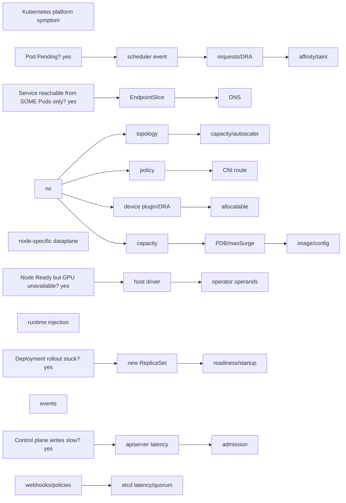

| Prompt | Expected reasoning |
| --- | --- |
| Pod Pending on GPU cluster | scheduler event -> requests/DRA -> affinity/taint -> topology -> capacity/autoscaler |
| Service reachable from some Pods only | EndpointSlice, DNS, policy, CNI route, node-specific dataplane |
| Node Ready but GPU unavailable | host driver -> operator operands -> device plugin/DRA -> allocatable -> runtime injection |
| Deployment rollout stuck | new ReplicaSet, readiness/startup, capacity, PDB/maxSurge, image/config, events |
| Control plane writes slow | apiserver latency, admission webhooks/policies, etcd latency/quorum |

## ➕ Additions

➕ **Diagram: this question set's five prompts as one symptom router (work top to bottom, stop at the first match):**

➕ **Annotated output — "Node Ready but GPU unavailable," the layer trace:**

```mermaid
flowchart TD
  %% Converted from the original ASCII diagram; source wording is preserved.
  n0["$ kubectl describe node gpu-worker-07 | grep -A5 Allocatable"]
  n1["Allocatable"]
  n2["cpu: 62"]
  n3["memory: 240Gi"]
  n4["nvidia.com/gpu: 0 ← Ready node, zero GPUs allocatable"]
  n5["$ kubectl get pods -n gpu-operator -o wide | grep gpu-worker-07"]
  n6["nvidia-device-plugin-daemonset-x9k2p 0/1 CrashLoopBackOff gpu-worker-07"]
  n7["$ kubectl logs -n gpu-operator nvidia-device-plugin-daemonset-x9k2p --previous"]
  n8["Failed to initialize NVML: Driver/library version mismatch"]
```

The chain: node is `Ready` (kubelet is healthy) but `nvidia.com/gpu` allocatable is 0 because the device plugin — the thing that reports GPU count to the kubelet — can't even start, because the host driver and the container-toolkit-loaded NVML library versions disagree. This is exactly the "host driver → operator operands → device plugin → allocatable" chain the original question set names; the evidence at each layer is a specific `kubectl` object, not a guess.

➕ **Extra worked scenario (new) — "Control plane writes slow," fully diagnosed for a GPU-heavy cluster:**
> **Situation:** `kubectl apply` and Pod creation across the cluster feel sluggish; read operations (`get`, `describe`) are fine.
> 1. Clarify: is it all writes, or specifically Pod creates on GPU nodes? (Admission webhooks scoped to Pods with GPU resources — e.g. the NVIDIA GPU Operator's or a scheduling extender's webhook — are a common culprit that reads-only traffic never touches.)
> 2. Check apiserver metrics: `apiserver_request_duration_seconds` bucketed by verb and resource — isolates whether it's genuinely apiserver-side or downstream.
> 3. Check admission webhook latency specifically — a slow or overloaded mutating/validating webhook adds synchronous latency to every matching write, and GPU-scheduling extenders are exactly the kind of custom webhook that regresses without much operational visibility.
> 4. Check etcd: `etcd_disk_wal_fsync_duration_seconds` and leader/quorum stability — a slow disk under etcd or a recent leader election storm degrades every write cluster-wide, not just GPU-scoped ones.
> **Conclusion:** "Slow writes, fast reads" narrows the search to the write path specifically (admission chain + etcd), and separating "all writes" from "only GPU-Pod writes" is the single fastest way to tell webhook-scoped slowness from etcd-wide slowness.

## Practice
➕ 7. Simulate the device-plugin CrashLoopBackOff scenario above (or read a real cluster's) and write the one-line rule you'd give a junior engineer: "Node Ready + GPU allocatable 0 always means check the device plugin/operator pods on that node before touching the workload."
