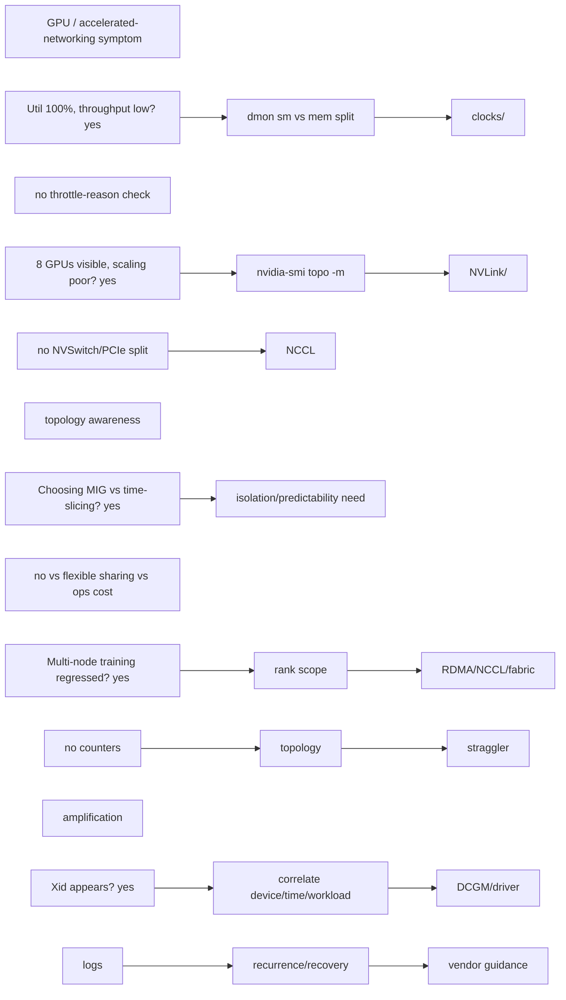
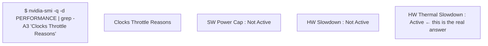

| Prompt | Expected reasoning |
| --- | --- |
| GPU util 100%, throughput low | compute vs memory/communication, clocks, batch, kernel/engine metrics |
| 8 GPUs visible, scaling poor | NVLink/NVSwitch/PCIe topology, NCCL algorithm, CPU/NIC locality |
| MIG or time-slicing? | hard isolation/predictability vs flexible sharing, workload memory/latency, ops |
| Multi-node training regressed | rank scope, RDMA/NCCL/fabric counters, topology, straggler amplification |
| Xid appears | correlate device/time/workload, DCGM/driver logs, recurrence/recovery, vendor guidance |

## ➕ Additions

➕ **Diagram: this question set's five prompts as one GPU/networking triage router:**


➕ **Sample annotated output — GPU util 100% but throughput low, the exact evidence:**
```
$ nvidia-smi dmon -s ucm -c 5
# gpu   sm  mem  enc  dec  mclk  pclk
    0   99   34    0    0  1215  1410
    0   98   35    0    0  1215  1410
    0   99   33    0    0  1215  1410
```
`sm=99%` (SM/compute engine busy) but `mem=34%` (memory bandwidth utilization) is the tell: the GPU is compute-bound and NOT memory-bandwidth-bound, so "GPU is at 100%" alone doesn't tell you if that 100% is doing useful FLOPs efficiently. Cross-check with `mclk`/`pclk` — clocks at their max boost values rules out thermal/power throttling as the cause of "low throughput despite 100% util."

`sm=99%` looked healthy at a glance, but `HW Thermal Slowdown: Active` means the GPU is pinned at 99% *utilization* while its actual *clock* has been reduced by thermal throttling — this is the single most common way "GPU util 100%, throughput low" resolves, and it's completely invisible unless you check throttle reasons specifically, not just `dmon`.

➕ **Second annotated output — Xid error correlation, the DCGM/driver-log evidence chain:**
```
$ dmesg -T | grep -i xid
[Tue Jul 29 03:14:22 2026] NVRM: Xid (PCI:0000:17:00): 79, pid=48213, GPU has fallen off the bus

$ nvidia-smi -q | grep -A2 "GPU UUID\|ECC Errors"
    GPU UUID                     : GPU-3fa1...
    ECC Errors
        Aggregate                : 14200
```
Xid 79 ("GPU has fallen off the bus") is one of the small set of Xid codes that means the GPU has effectively gone offline at the PCIe level — almost always hardware/thermal/power, not a driver or application bug, and it typically does NOT recover without a node reboot/reset. **Interview-ready line:** "Not all Xids are equal — some (like memory ECC double-bit) are software-recoverable-ish with process kill, others (like 'fallen off the bus') mean the node needs to be drained and rebooted; I'd never treat 'an Xid appeared' as one category of severity."

➕ **Extra worked scenario (new) — "8 GPUs visible, scaling poor," fully diagnosed with topology evidence:**
> **Situation:** An 8-GPU single-node job scales to only ~4.5x instead of near-8x on an all-reduce-heavy workload.
> 1. Clarify: is scaling poor from 1→2 GPUs already, or does it degrade specifically past 4?
> 2. `nvidia-smi topo -m` — check whether all 8 GPUs are on the same NVSwitch/NVLink fabric, or split across PCIe switches with no direct GPU-GPU link:
> ```
> $ nvidia-smi topo -m
>       GPU0  GPU1  GPU2  GPU3  GPU4  GPU5  GPU6  GPU7
> GPU0   X    NV12  NV12  NV12  SYS   SYS   SYS   SYS
> GPU1  NV12   X    NV12  NV12  SYS   SYS   SYS   SYS
> GPU4  SYS   SYS   SYS   SYS    X   NV12  NV12  NV12
> ```
> `SYS` between GPU0-3 and GPU4-7 means those two groups only talk over the system/PCIe/QPI path, not NVLink — an all-reduce spanning all 8 GPUs pays a much higher cost crossing that `SYS` link than staying within an NVLink-connected quad. This alone explains sub-linear scaling past 4 GPUs.
> 3. Correlate with `NCCL_DEBUG=INFO` output showing which algorithm/ring NCCL chose and whether it's aware of the topology split.
> 4. Fix directions: confirm NCCL topology detection is correct (`NCCL_TOPO_FILE` if auto-detection is wrong), or restructure the collective (e.g., hierarchical/2-level all-reduce that does intra-quad first) if the hardware topology genuinely has this split.
> **Conclusion:** "8 GPUs visible" says nothing about how they're wired — `nvidia-smi topo -m` is the one command that turns "scaling is poor" into a specific, fixable topology fact.

## Practice
➕ 6. Run `nvidia-smi topo -m` on any multi-GPU box you have access to (even a workstation) and explain out loud, in one sentence per link type (`NV#`, `PIX`, `PXB`, `SYS`), what an all-reduce crossing that link would cost relative to the others.
➕ 7. Given a synthetic `dmesg` log with three different Xid codes (e.g. 79, 48, 13), classify each as "likely hardware, drain the node" vs "possibly software/application-recoverable" and state which single follow-up command you'd run for each to confirm your classification.
