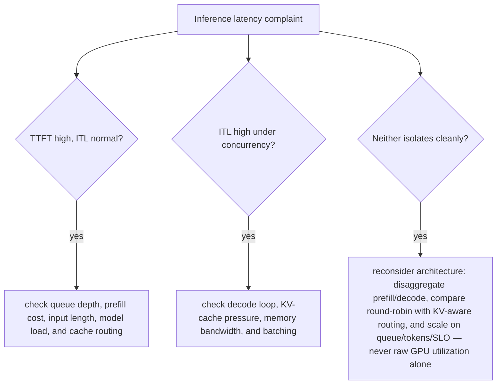

| Prompt | Expected reasoning |
| --- | --- |
| TTFT high, ITL normal | queue/prefill/input length/model load/cache routing |
| ITL high under concurrency | decode/KV/memory pressure/batching |
| When disaggregate prefill/decode? | different resource shapes + fast KV transfer + measured benefit |
| Round-robin vs KV-aware routing | cache reuse/load balance/worker state/failure complexity |
| Scale on what metric? | queue/tokens/SLO/engine state, warmup/model load, GPU scarcity |

## ➕ Additions

➕ **Diagram: inference-latency symptom router (which subsystem a complaint actually points at):**

"The response feels slow" collapses two very different subsystems into one user complaint — TTFT and ITL point at prefill/queue and decode/batching respectively, and the fix for one rarely helps the other.

➕ **Sample annotated output — diagnosing "ITL high under concurrency" with real engine metrics (vLLM-style):**
```bash
$ curl -s localhost:8000/metrics | grep -E 'num_requests_running|gpu_cache_usage|time_per_output_token'
vllm:num_requests_running 24
vllm:gpu_cache_usage_perc 0.97 ← KV cache is nearly full
vllm:time_per_output_token_seconds_sum 184.2
vllm:time_per_output_token_seconds_count 9200
```
`gpu_cache_usage_perc=0.97` is the smoking gun: the KV cache is nearly exhausted, which forces the scheduler into smaller batches or preemption/swap to make room — that's exactly what inflates per-token decode latency under concurrency, independent of raw GPU compute headroom. **Interview-ready line:** "ITL degrading under load is usually a KV-cache-capacity story before it's a compute-capacity story — check `gpu_cache_usage` before assuming you need more GPUs."

➕ **Extra worked scenario (new) — "when to disaggregate prefill/decode," made concrete with numbers:**
> **Situation:** A 70B-parameter model serving long-context RAG requests (avg 6,000 input tokens, avg 200 output tokens) shows highly variable TTFT (200ms-4s) even at moderate load.
> 1. Clarify: is variability correlated with input length, or independent of it? (Long-context prefill is itself compute-heavy and can co-locate badly with decode-phase requests competing for the same GPU.)
> 2. Model: on a single-engine (non-disaggregated) server, a long prefill request occupies the GPU compute path in a way that can stall in-flight decode-phase requests behind it — this is the mechanism, not just "it's busy."
> 3. Hypothesize: prefill-heavy traffic mix (6,000 input : 200 output ratio is prefill-dominated) is a strong candidate for disaggregating prefill onto separate GPU pool(s) from decode, so long prefills stop stalling other requests' decode steps.
> 4. Evidence needed: measure whether TTFT variance correlates specifically with concurrent long-prefill requests in the trace, and benchmark disaggregated vs monolithic serving on the actual input distribution — the KV-cache transfer cost between prefill and decode workers (over NVLink/RDMA) has to be fast enough not to eat the benefit.
> 5. Recommend: only adopt disaggregation after the benchmark shows the transfer overhead is smaller than the stalling it removes — for short-context, decode-dominated workloads, disaggregation is usually not worth the added operational complexity (two pools, KV transfer infra, more failure modes).
> **Interview-ready line:** "Disaggregating prefill and decode is a real technique with a real cost — extra hop, extra infra, extra failure surface — so I'd only recommend it once a benchmark shows the stalling problem outweighs the KV-transfer cost, not by default."
