**•** A customer wants 32 H100-class GPUs for "an LLM platform". What workload facts do you request before sizing?

**•** The customer mandates Kubernetes but training team wants Slurm. Design an operating model that avoids two schedulers fighting for the same nodes.

**•** Storage vendor claims 200 GB/s. Design a PoC that proves whether training GPUs will stay fed during checkpointing.

**•** Security disallows privileged workloads. Explain why GPU node enablement may require elevated host access and propose governance/isolation options.

**•** The customer wants maximum GPU utilization and strict p99 latency. Explain the inherent tension and the experiments needed to choose a sharing model.

## Worked explanation and practice

**Diagram: the GPU-sizing discovery funnel (never size from a GPU count alone):**

```mermaid
flowchart TD
  %% Converted from the original ASCII diagram; source wording is preserved.
  n0["'We want N GPUs for an LLM platform'"]
  n1["CLARIFY: training, fine-tuning, inference, or a mix?"]
  n2["Inference Training"]
  n3["model sizes, largest distributed job's GPU count;"]
  n4["peak concurrency, is it latency-sensitive to collective"]
  n5["TTFT vs throughput performance (needs one fast fabric)?"]
  n6["priority?"]
  n7["Timeline + existing GPU operations experience"]
  n8["(changes the recommendation as much as the workload does)"]
  n9["Only NOW size the platform — never from '32 GPUs' alone"]
```

**Annotated sample discovery transcript — "we need 32 H100-class GPUs for an LLM platform," narrated with WHY each question is asked:**

> **Customer:** "We want to buy 32 H100-class GPUs for an LLM platform."
>
> **Candidate:** "Happy to help size that — a few questions first. Is this for training, fine-tuning, inference, or a mix?" *(← this single question can change the entire architecture — training and inference have almost opposite topology/scheduling needs, per Chapter 8)*
>
> "If inference: what model sizes, and what's your expected peak concurrency and target latency — is TTFT or throughput the priority?" *(← ties directly to Chapter 6's capacity formula; without this, "32 GPUs" is not a number anyone can validate)*
>
> "If training: what's your largest single distributed job's GPU count, and is that job latency-sensitive to collective performance — i.e., do you need those GPUs on one fast fabric, or can they be spread across less-connected nodes?" *(← ties to Chapter 5/7's topology reasoning — this determines whether 32 GPUs is even a valid unit, or needs to be a specific topology shape)*
>
> "And separately from workload: what's your timeline, and do you have existing GPU operations experience, or is this the first GPU platform your team will run day-to-day?" *(← the "current state" and "constraints" funnel stages — operational readiness changes the recommendation as much as the workload does)*
>
> **Why this works:** every question is traceable to a specific downstream architecture decision from an earlier chapter in this volume — this is what makes discovery "consultative" instead of a generic intake form; a senior SA asks questions because the answer changes what they'd design, not to seem thorough.

**Extra worked scenario (new) — "customer wants maximum GPU utilization AND strict p99 latency," fully talked through:**
> **Situation:** A customer states both goals in the same sentence, expecting both to be fully satisfied.
> 1. **Name the tension explicitly, out loud, first:** "Those two goals pull in opposite directions — maximizing utilization generally means packing more concurrent work onto each GPU (bigger batches, more co-located requests), and that's exactly what increases p99 latency variance, because now some requests wait behind others' batches. I want to be upfront that this is a real tradeoff, not something I can architect away entirely."
> 2. **Ask which one has a harder constraint:** is p99 latency an actual contractual SLA, or an internal target with some flexibility? Is "maximum utilization" a cost target, or a literal operational goal?
> 3. **Propose the experiment, not a guess:** "I'd run a PoC sweeping batch size / concurrency / sharing granularity (full GPU vs MIG vs time-slicing) and plot achieved utilization against measured p99 at each point — that curve is the actual answer, and it lets you pick a point on it deliberately instead of us guessing."
> 4. **State the likely shape of the answer, to show judgment even before the PoC:** "My expectation, to be validated: MIG or dedicated-per-tenant GPUs will hold p99 much more predictably at the cost of some idle capacity; time-slicing or dynamic batching will raise utilization but with fatter latency tails under load spikes. The PoC tells us where on that curve your specific workload lands, and whether the tradeoff is even as sharp as I'm describing for your traffic pattern."
> **Interview-ready line:** "I'd rather tell a customer the tradeoff exists and offer to measure it than pretend an architecture can make both goals free — that's the sentence that actually builds trust in this kind of conversation."

## Practice
6. Take the "customer mandates Kubernetes but training team wants Slurm" prompt from Question set F and run the full BWCCRD funnel on it live, narrating which funnel stage surfaces the real constraint driving the mandate (hint: it's rarely a technical reason at the "Business outcome" stage — dig for it).
7. Write your own one-sentence version of the "name the tension explicitly" move from the worked scenario above, applied to a different competing-goals customer statement of your choosing (e.g., "we want on-prem control AND cloud elasticity") — practice saying the tradeoff out loud before proposing anything.
