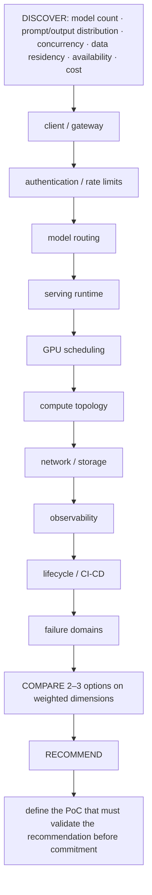

Whiteboard from requirements outward: client/gateway -> auth/rate limits -> model routing -> serving runtime -> GPU scheduling -> compute topology -> network/storage -> observability -> lifecycle/CI/CD -> failure domains. Ask about model count, prompt/output distribution, concurrency, data residency, availability and cost. Then choose components. A diagram that begins with "NIM" or "Kubernetes" before requirements is backwards.

## ➕ Additions

➕ **Diagram: this question set's build order in box form (draw left to right, live, in this sequence):**

A diagram that starts with "NIM" or "Kubernetes" instead of the DISCOVER row above is exactly the anti-pattern this question set warns against.

➕ **Extra worked scenario (new) — the whiteboard method applied to Question set G's production GenAI platform, end-to-end:**
> **Prompt:** "Whiteboard a production GenAI platform serving 3 different model sizes to external customers."
> 1. **Discover:** how many distinct models, expected prompt/output token distribution per model, expected concurrency, any data residency requirement (customer data must stay in-region?), required availability (single-region ok, or multi-region failover?), cost sensitivity.
> 2. **Draw left to right:** client → API gateway (auth, per-customer rate limits) → model router (which model does this request need — by explicit selection or classification) → serving runtime (NIM/Triton/vLLM per model, chosen only now, after the shape is clear) → GPU scheduling layer (Kubernetes with device plugin/MIG, sized per Chapter 6's formula) → compute topology (does the largest model need multi-GPU tensor parallelism, hence NVLink locality) → network/storage (model weight storage/loading path, KV-cache/session state if any) → observability (per-model TTFT/ITL dashboards, GPU util/Xid alerting) → lifecycle/CI-CD (model version rollout without downtime — canary a new model version behind the router) → failure domains (one model's GPU pool failing shouldn't take down the other two).
> 3. **Compare options** on 2-3 weighted dimensions relevant to what discovery revealed — e.g., if data residency is strict, self-hosted NIM/Triton beats a hosted API regardless of other factors; state that dimension as the deciding one explicitly.
> 4. **Recommend + validate:** name the recommendation, then state the PoC: load-test each model's serving path independently at expected peak concurrency, and validate the router's failure isolation by deliberately failing one model's pool and confirming the other two are unaffected.
> **Interview-ready line:** "The requirements determine whether this ends up being three separate small deployments or one shared router in front of a multi-model serving layer — I wouldn't draw the router box until I know whether these models actually need to share infrastructure or just share a brand."
