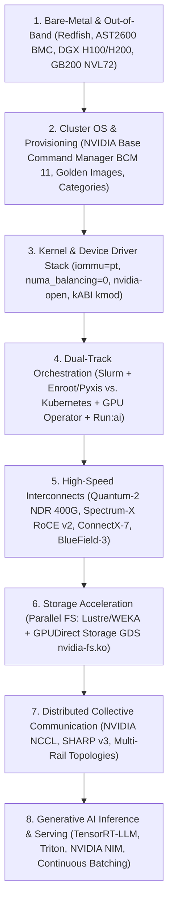

# Current Role-Family Signals and AI Factory Competency Map

In modern technical hiring for the **NVIDIA Senior Solutions Architect (AI Infrastructure & Supercomputing)** role family (including job requisitions like **JR2018680**), interviewers do not evaluate candidates on isolated point tools. They test your ability to synthesize the entire **AI Factory Lifecycle**—from physical chassis bring-up and out-of-band management to distributed foundation model pre-training and real-time inference microservices.

An NVIDIA Senior Solutions Architect is expected to converse with equal fluency before a Data Center Facilities Director (power density, liquid cooling, 3-phase PDUs), an Infrastructure Platform Lead (BCM, Redfish, Slurm, Kubernetes, Run:ai), an Enterprise Network Architect (Quantum-2 InfiniBand vs. Spectrum-X RoCE), and a Chief AI Officer / Head of Research (Megatron-LM 3D parallelism, TensorRT-LLM, KV cache sizing).

---

## 1. The 8 Core AI Factory Architectural Domains

---

## 2. Comprehensive Competency Matrix: What Interviewers Listen For

| Architecture Domain | Baseline Candidate Signal (Mid-Level) | Senior Solutions Architect Signal (NVIDIA Standard) |
|---|---|---|
| **Bare-Metal & BMC** | Uses `ipmitool` for remote power status and basic server reboots. | Replaces legacy IPMI with **DMTF Redfish REST APIs** (TLS 1.3); automates chassis inventory via `/redfish/v1/Chassis/GPU_Tray_0/Thermal`; understands dual-tray architecture and BMC-to-Host KCS interface lockups. |
| **Cluster Provisioning** | Writes custom Bash or Ansible playbooks to install Linux on bare-metal servers. | Architects **NVIDIA Base Command Manager (BCM 11)** with active/passive head node HA (Corosync, Pacemaker, DRBD); manages declarative node categories and golden software images (`/cm/images`); uses BitTorrent/Multicast to eliminate provisioning storms across 1,000+ nodes. |
| **Linux Kernel Tuning** | Sets `vm.swappiness=0` and checks `top` for CPU load. | Enforces **`iommu=pt`**, **`numa_balancing=0`**, and **`transparent_hugepage=never`** to eliminate microsecond CPU jitter in NCCL barriers; bans DKMS in production fleets in favor of deterministic **kABI `kmod-nvidia`** packages. |
| **HPC Orchestration** | Submits basic Slurm scripts requesting `--gres=gpu:8`. | Configures hardware-aware **`gres.conf` and `cgroup.conf`** mapping GPUs 1:1 to local NUMA CPU cores; designs multi-tenant fairshare decay hierarchies `F = 2^(-U_E / S_N)` and QoS preemption tiers; executes zero-downtime rolling upgrades. |
| **Cloud-Native & Run:ai** | Deploys NVIDIA GPU Operator on standard Kubernetes. | Integrates **Container Device Interface (CDI)**; deploys **Run:ai** for dynamic fractional GPU virtualization (0.1 to 1.0) and atomic gang scheduling; designs dynamic node reallocation between Slurm and K8s via BCM category shifts. |
| **Accelerated Networking** | Knows InfiniBand is fast and uses `ibstat`. | Compares **Quantum-2 InfiniBand** (credit-based flow control, SHARP v3 in-network reduction) against **Spectrum-X Ethernet** (dynamic packet spraying, lossy-to-lossless RoCE v2 with PFC and DCQCN); designs 8-rail fat-tree non-blocking topologies. |
| **Parallel Storage & GDS** | Mounts an NFS share for training datasets. | Deploys **GPUDirect Storage (GDS)** via `nvidia-fs.ko` for direct DMA transfers between NVMe-oF parallel file systems (Lustre / WEKA) and GPU HBM3, shrinking 192 TB distributed checkpoint writes from 15 minutes to $< 15$ seconds. |
| **Hardware Diagnostics** | Runs `nvidia-smi` and checks GPU utilization %. | Triages **XID errors** (XID 31 vs. 48 vs. 79); diagnoses NVLink SerDes data replay errors and flapping links; uses **NVIDIA DCGM diagnostic tiers** (Level 1, 2, 3) for automated pre-job Slurm health gating. |
| **LLM Inference Architecture** | Deploys a Hugging Face model in Docker with vLLM. | Deconstructs inference into **Prefill (compute-bound TTFT)** vs. **Decode (memory-bound ITL)**; calculates exact KV cache memory footprints per token; deploys **TensorRT-LLM with FP8 in-flight batching and chunked prefill** inside Triton / NIM microservices. |

---

## 3. High-Value Interview Talking Points & Vocabulary

When answering open-ended system design questions, incorporate these high-value industry terms to signal immediate domain authority:

1. **"Silent Straggler"**: In gang-scheduled distributed training, a single degraded GPU running 20% slower stalls all 1,024 GPUs at every All-Reduce collective barrier.
2. **"Non-Blocking Bisection Bandwidth"**: A fat-tree network design where full cross-sectional bandwidth is maintained between all leaf and spine switches without oversubscription.
3. **"In-Network Computing (NVIDIA SHARP)"**: Offloading mathematical reduction operations directly into Quantum-2 switch ASICs, eliminating 50% of the network hops required by standard ring All-Reduce.
4. **"PagedAttention & KV Cache Fragmentation"**: Partitioning contiguous KV cache tensors into virtual memory pages to eliminate external memory fragmentation in LLM serving.
5. **"STONITH (Shoot The Other Node In The Head)"**: Out-of-band power-fencing of a failed primary controller via Redfish/IPMI to guarantee zero split-brain in high-availability clusters.
6. **"Dynamic Packet Spraying"**: Spectrum-4 switch capability that scatters RoCE packets across all available uplinks at the packet level, eliminating ECMP elephant-flow hash polarization on Ethernet.

---

## Key Takeaways

1. **Connect the Stack End-to-End:** The senior signal is explaining how a physical hardware choice (e.g., PCIe Gen5 link width) cascades up to impact user-facing metrics (like LLM checkpoint durations or token generation latency).
2. **Master the Coexistence of Slurm and Kubernetes:** Frame Slurm as the deterministic batch fabric for foundation pre-training, and Kubernetes with Run:ai as the agile platform for inference and rapid experimentation.
3. **Firmware and Drivers are Immutable Units:** Always manage BIOS, BMC, VBIOS, and OFED drivers as pre-qualified, version-locked operational bundles.
4. **Benchmark at the SLO:** Never estimate GPU counts from vendor marketing spec-sheets; calculate capacity strictly as required throughput divided by per-replica throughput measured at the target P99 SLA.
