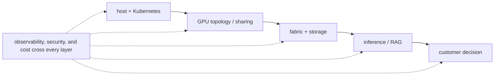

A current NVIDIA Solutions Architect, DevOps listing in Germany emphasizes four connected areas. The first is the platform foundation: Linux hosts, storage, Kubernetes, and infrastructure as code (IaC), which means defining infrastructure through reviewed configuration rather than manual changes. The second is automation and operations: Python or Bash for repeatable work, plus Prometheus, Grafana, and Loki for metrics, dashboards, and logs. The third is accelerated infrastructure: AI/HPC hardware and the high-speed interconnects that move data between GPUs and nodes. The fourth is customer architecture: turning workload requirements and constraints into a defensible design.

Other NVIDIA Solutions Architect postings add inference-specific signals. NIM is NVIDIA's packaged inference-microservice approach; Triton, TensorRT-LLM, and vLLM are serving platforms or engines with different packaging and performance trade-offs. MIG partitions a supported GPU into isolated hardware instances. TTFT (time to first token), TPOT (time per output token), and tokens per second describe different parts of inference latency and throughput. RAG combines retrieval with generation; agentic systems allow a model to select tools or additional steps. RDMA moves data directly between registered memory regions with minimal CPU copying.

Treat these as role-family signals, not a claim that every interview question will cover every technology. The senior skill is explaining how they connect—for example, how a serving SLO changes GPU scheduling, network, observability, and cost decisions—not merely recognizing the names.

## Targeted references and reinforcement

**NVIDIA Solutions Architect, DevOps — Germany:** [https://de.linkedin.com/jobs/view/solutions-architect-devops-at-nvidia-4424636420](https://de.linkedin.com/jobs/view/solutions-architect-devops-at-nvidia-4424636420) — Direct role-family signal for the interview focus.

**NVIDIA Senior SA GenAI practitioner hiring signal:** [https://www.linkedin.com/posts/amitnvidia\_hiring-bengaluru-mlops-activity-7475583242381721600-DIXX](https://www.linkedin.com/posts/amitnvidia_hiring-bengaluru-mlops-activity-7475583242381721600-DIXX) — Inference operations, GPU Kubernetes, metrics, RAG/agents and enterprise architecture.

**NVIDIA SA inference deployments:** [https://www.linkedin.com/jobs/view/solutions-architect-inference-deployments-at-nvidia-4395478253](https://www.linkedin.com/jobs/view/solutions-architect-inference-deployments-at-nvidia-4395478253) — Current role-family signal for Dynamo, Kubernetes and multiple inference backends.

**Vishakha Sadhwani public posts:** [https://www.linkedin.com/in/vsadhwani](https://www.linkedin.com/in/vsadhwani) — Foundations-first, networking traffic flow, AI infrastructure transition, system thinking and customer-facing SA role framing.

## ➕ Additions

➕ **Practice 21.** Cross-reference the role-family signals above against Chapter 11's question bank: for each of NIM/Triton/TensorRT-LLM/vLLM, MIG/scheduling, TTFT/TPOT, RAG/agents, and RDMA — name which chapter in this volume covers it, and which question in the bank you'd use to rehearse it. If any of the five has no clear chapter/question match in your own prep, that is a real gap to close before the interview, not a theoretical one.

➕ **Visual model — role breadth is a connected system, not a keyword list:**

**Memory hook:** *"Explain the connection between topics; that is the senior signal."*
