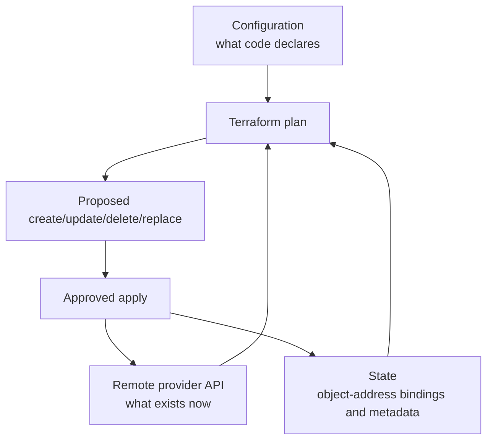

# Foundation — Infrastructure as Code, Terraform and Ansible from zero

## Why infrastructure needs code-like discipline

Imagine configuring ten servers manually. Six months later, nobody can prove whether they are identical, why one firewall rule differs, or how to rebuild after failure. Infrastructure as Code (IaC) stores intended infrastructure in version-controlled definitions so changes can be reviewed, repeated, tested and audited.

IaC does not make changes automatically safe. A repeatable destructive definition is still destructive. Safety comes from ownership boundaries, plans/diffs, tests, controlled credentials, small rollout scope, validation and recovery.

## Provisioning and configuration are related but different

| Concern | Example | Common tool in this volume |
|---|---|---|
| Provision infrastructure object | network, VM, IAM role, DNS record | Terraform through a provider API |
| Configure operating-system state | packages, users, files, services | Ansible over SSH or another connection |
| Manage bare-metal cluster lifecycle | images, node categories, provisioning | BCM |
| Schedule workload | allocate nodes/GPUs to jobs | Slurm/Kubernetes |

A tool can overlap these areas, but declare one authoritative owner for each object or field. Two reconcilers changing the same setting create oscillation and confusion.

## Terraform: declare API-managed resources

Terraform configuration describes resources. A **provider** translates Terraform operations into an external system's API. A **resource** represents one managed object. A **data source** reads information without managing that remote object's lifecycle.

```hcl
terraform {
  required_providers {
    local = {
      source  = "hashicorp/local"
      version = "~> 2.0"
    }
  }
}

resource "local_file" "cluster_note" {
  filename = "${path.module}/cluster-note.txt"
  content  = "environment=lab\ngpu_nodes=2\n"
}

output "note_path" {
  value = local_file.cluster_note.filename
}
```

The example uses a local provider so you can learn without cloud credentials. In production, providers may manage cloud, DNS, identity, Kubernetes or other APIs.

## Terraform's three views of reality



Terraform state primarily binds a resource address in configuration to the identity of a real remote object. For example, `aws_instance.worker[0]` may map to a particular cloud instance ID. Without that mapping, Terraform cannot reliably know which object it owns.

State may contain sensitive values. Team use normally requires a secure remote backend, access control, encryption, recovery/versioning and locking where supported. Do not commit production state to Git or edit its JSON directly.

## The Terraform workflow, with interpretation

```bash
terraform init
terraform fmt -check
terraform validate
terraform plan -out=tfplan
terraform show tfplan
terraform apply tfplan
```

| Command | What it proves | What it does not prove |
|---|---|---|
| `init` | providers/modules/backend initialization completed | configuration is safe |
| `fmt` | canonical formatting | semantic correctness |
| `validate` | syntax/internal schema consistency | credentials, real API outcome or policy correctness |
| `plan` | proposed changes from current config/state/provider observations | future apply cannot fail |
| `apply` | provider operations were attempted and state updated on success | workload/service outcome is healthy |

Plan symbols deserve deliberate review:

- `+` create;
- `~` update in place;
- `-` destroy;
- `-/+` replace (destroy/create lifecycle, often high risk).

Review identity/IAM, databases, network boundaries, DNS, storage and replacement actions carefully. A saved plan may contain sensitive data; protect it as an artifact.

## Terraform local lab

In an empty lab directory, save the previous HCL as `main.tf` and run:

```bash
terraform init
terraform plan -out=tfplan
terraform apply tfplan
cat cluster-note.txt
terraform state list
```

Then change `gpu_nodes=2` to `gpu_nodes=3`, run a new plan, and predict whether the file is updated or replaced. Finally run `terraform destroy` only in this disposable lab and inspect the proposed deletion before confirming.

The lesson is not local-file management. It is the write → plan → review → apply → verify loop and the role of state.

## Drift and import

**Drift** occurs when real infrastructure changes outside the declared workflow. Terraform refreshes provider observations during normal planning and may propose restoration or another action depending on configuration and provider behavior.

Import brings an existing object under a Terraform resource address. Import does not automatically design correct configuration or ownership. After import, produce a plan and reconcile configuration until the intended no-change baseline is understood.

## Modules: create an interface, not a hiding place

A Terraform module groups resources behind inputs and outputs. Good modules encode a useful architecture boundary with documented assumptions. Bad modules expose dozens of pass-through variables or hide dangerous lifecycle behavior.

Treat module inputs/outputs as an API:

- validate inputs;
- choose safe defaults;
- pin/version module sources;
- document created resources and destructive changes;
- expose only useful outputs;
- test upgrade and migration behavior.

## Ansible: converge host configuration

Ansible commonly runs from a control node and connects to managed nodes. An **inventory** organizes hosts/groups. A **play** targets hosts. **Tasks** invoke modules. Modules inspect or change state and return structured results. A **handler** runs when notified by a changed task, often to restart/reload a service.

```ini
# inventory.ini
[gpu_nodes]
gpu-01.example.net
gpu-02.example.net
```

```yaml
---
- name: Configure time synchronization on GPU nodes
  hosts: gpu_nodes
  become: true
  serial: 1
  tasks:
    - name: Install chrony
      ansible.builtin.package:
        name: chrony
        state: present

    - name: Deploy chrony configuration
      ansible.builtin.template:
        src: chrony.conf.j2
        dest: /etc/chrony.conf
        owner: root
        group: root
        mode: "0644"
      notify: Restart chrony

    - name: Ensure chrony is enabled and running
      ansible.builtin.service:
        name: chronyd
        enabled: true
        state: started

  handlers:
    - name: Restart chrony
      ansible.builtin.service:
        name: chronyd
        state: restarted
```

## Idempotency is observed behavior

An operation is idempotent when repeating it with the same desired state does not create unintended additional effects. Many Ansible modules are designed to avoid changes when current state already matches. Shell commands are not automatically idempotent.

Test the claim:

1. run against a disposable target;
2. inspect `changed` results;
3. run again unchanged;
4. expect zero changes for stable state;
5. inspect service and application outcome;
6. introduce controlled drift and confirm convergence.

## Check mode, diff mode and their limits

```bash
ansible-playbook -i inventory.ini site.yml --check --diff --limit gpu-01.example.net
```

Official Ansible documentation is explicit: check mode is simulation. Modules without support may do nothing/report nothing, and tasks depending on registered results can behave differently. Diff output can expose secrets, so disable it for sensitive tasks and control log access.

Production safety adds:

- syntax/lint/test checks;
- inventory review;
- `--limit` or canary group;
- `serial` rollout and failure threshold;
- pre/post health checks;
- scheduler drain before disruptive node work;
- rollback or previous artifact;
- clear ownership for secrets and privilege escalation.

## Terraform versus Ansible through one example

Build a cloud GPU worker:

1. Terraform creates network, security identity, instance and DNS through APIs.
2. Image/bootstrap establishes minimal connectivity and identity.
3. Ansible configures OS packages, files, users and services—or a golden-image/BCM process owns those instead.
4. GPU/cluster tooling validates the node and admits it to scheduling.

Terraform should not use endless remote shell provisioners to become an accidental configuration-management system. Ansible should not create every cloud object through ad hoc API shell commands when a provider/state workflow should own them.

## A complete change-review checklist

Before applying:

- Which objects/hosts are targeted exactly?
- Which system is authoritative for each field?
- Are create/update/delete/replacement actions expected?
- Could the plan/diff expose secrets?
- What dependency and workload impact follows?
- Is the canary representative?
- What signals stop rollout?
- Is rollback tested and does it restore data/state?
- Who approves and who observes the change?

After applying:

- Did the tool finish successfully?
- Does actual infrastructure match intended state?
- Did service/workload SLOs remain healthy?
- Is there drift or partial success?
- Are state, inventory and documentation current?

## Official and local references

- [What is Terraform?](https://developer.hashicorp.com/terraform/intro)
- [Terraform language](https://developer.hashicorp.com/terraform/language)
- [Terraform workflow](https://developer.hashicorp.com/terraform/cli/run)
- [Terraform state](https://developer.hashicorp.com/terraform/language/state)
- [Purpose of Terraform state](https://developer.hashicorp.com/terraform/language/state/purpose)
- [Terraform plan tutorial](https://developer.hashicorp.com/terraform/tutorials/cli/plan)
- [Ansible inventory getting started](https://docs.ansible.com/projects/ansible/latest/getting_started/get_started_inventory.html)
- [Ansible modules](https://docs.ansible.com/projects/ansible/latest/module_plugin_guide/modules_intro.html)
- [Ansible check and diff mode](https://docs.ansible.com/projects/ansible/latest/playbook_guide/playbooks_checkmode.html)
- Local Staff guide: `consolidated_guides/infrastructure-as-code_consolidated.md`
- Local SRE guides: `foundations/15-terraform-infrastructure-as-code.md` and `18-ansible-and-host-automation.md`

