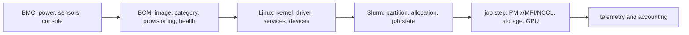
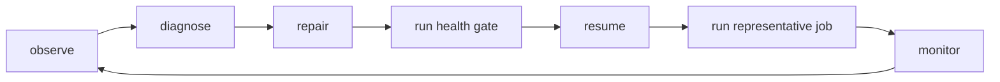

# Interview lab — operate a Slurm and BCM GPU cluster

This is a practice lab, not a promise that every command exists on every release. Run read-only commands in an authorized lab first, and verify mutating syntax against the installed Slurm and BCM manuals. The interview skill is to explain the control loop and evidence, not to recite a command from memory.

## The one-minute mental model



BCM answers “what should this physical node be and is it eligible?” Slurm answers “which eligible resources should this job receive?” MPI/PMIx starts and coordinates processes; NCCL moves GPU tensors; neither replaces the scheduler. This ownership boundary is the answer to many senior interview questions.

## Lab setup and safety

Use a test cluster, a read-only account, or captured command output. Never reset a GPU, power-cycle a server, reimage a node, resume a drained node, or alter `slurm.conf` during this exercise. Make a worksheet with columns: **question, command, expected evidence, observed evidence, decision**.

## Lab 1 — identify the cluster control plane

Run:

```bash
hostnamectl
systemctl --type=service --state=running | grep -E 'slurm|bcmd|nvidia|dcgm'
```

On a compute node, inspect the scheduler agent and GPU evidence:

```bash
scontrol show node "$(hostname -s)"
nvidia-smi --query-gpu=index,name,uuid,driver_version,temperature.gpu --format=csv
nvidia-smi topo -m
```

Interpret the result in layers:

- no `nvidia-smi` means host driver/device initialization is not proven;
- healthy `nvidia-smi` but no Slurm GPU allocation points downstream toward GRES, cgroups, `slurmd`, or controller configuration;
- a node shown as `IDLE` is scheduler-available, not proof that an NCCL path or filesystem is healthy;
- a node shown as `DRAIN` is deliberately excluded from new work until its reason is cleared and validation succeeds.

## Lab 2 — read a pending job like an operator

For a known job ID:

```bash
squeue -j <job_id> -o '%.18i %.10P %.10T %.12M %.12l %.30R'
scontrol show job <job_id>
```

The `Reason` field is a hypothesis about why the scheduler has not started the job:

| Reason shape | First interpretation | Next evidence |
|---|---|---|
| `Resources` | eligible resources are busy or fragmented | partition/node availability and requested shape |
| `Priority` | another job ranks ahead | `sprio`, fairshare, age, QoS |
| `Assoc`/`QOS` | account or policy prevents admission | `sacctmgr`, association, limits |
| `ReqNodeNotAvail` | requested nodes are unavailable | `sinfo -R`, node state/reason |
| `Dependency` | another job/event has not completed | dependency job state |
| `InvalidAccount` | submission identity is not authorized | account/association configuration |

Do not change priority merely to make a queue move. First distinguish capacity, shape, policy and health. A senior answer states what the reason proves and what it does not prove.

## Lab 3 — inspect fleet health before touching state

```bash
sinfo -Nel
sinfo -R
scontrol show node <node>
sacctmgr show assoc where cluster=<cluster> format=Cluster,Account,User,Partition,Fairshare,GrpTRES,MaxJobs
sacctmgr show qos format=Name,Priority,MaxWall,MaxTRES,Preempt
```

Read `sinfo -R` as an incident inventory. Preserve reasons such as `ECC errors`, `Prolog failure`, or `Not responding`; the reason is part of the audit trail. `RESUME` changes scheduler admission only. It is not a repair command. The safe lifecycle is:



## Lab 4 — connect BCM desired state to live state

The exact BCM shell syntax is release-specific, so begin with the conceptual questions:

1. Which node category owns this node?
2. Which software image does that category reference?
3. Which image version is the last known good?
4. Did the node actually boot the expected image?
5. Which health check failed, and did it affect Slurm admission?

In BCM, a category groups nodes with shared configuration and commonly references a software image. A golden image is not the same as a running process: it is desired filesystem and configuration state that becomes live after provisioning/boot. This distinction lets you classify a failure:

| Observation | Likely boundary |
|---|---|
| wrong image assigned to category | BCM desired state |
| correct image, node failed to provision | BMC/PXE/provisioning path |
| correct image, driver fails after boot | Linux/firmware/driver compatibility |
| node healthy locally but not schedulable | Slurm registration/GRES/policy |
| job starts but NCCL is slow | topology/fabric/container/workload path |

Use the [BCM Administrator Manual](https://docs.nvidia.com/base-command-manager/manuals/11/admin-manual.pdf) for the installed release before using `cmsh` to change categories or images. The official BCM documentation describes categories and software images as the unit for consistent cluster configuration; do not treat illustrative commands from an older release as safe copy/paste.

## Lab 5 — GPU admission gate

A useful admission gate is deliberately boring:

```bash
nvidia-smi -L
nvidia-smi --query-gpu=uuid,temperature.gpu,ecc.errors.uncorrected.aggregate.total --format=csv
systemctl is-active slurmd
grep -E 'AutoDetect|Name=gpu|File=' /etc/slurm/gres.conf
grep -E 'ConstrainDevices|ConstrainRAMSpace' /etc/slurm/cgroup.conf
scontrol show node <node> | grep -E 'State|CfgTRES|AllocTRES|Gres|CfgTRES'
```

The gate asks separate questions: is the hardware visible, is health acceptable, is `slurmd` registered, is GPU capability declared, and is device isolation enforced? One green command cannot answer all five.

## Lab 5b — write the request-side GPU allocation syntax

Labs 1-5 are read-side: they establish whether a job or node is healthy. An interviewer is just as likely to hand you a whiteboard and ask you to *write* the `sbatch` line that requests the resources in the first place. These are the three patterns worth having cold, copy-paste-ready:

**Single job, explicit GPU count per node:**

```bash
#!/bin/bash
#SBATCH --job-name=nccl-smoke
#SBATCH --partition=gpu
#SBATCH --nodes=2
#SBATCH --ntasks-per-node=2
#SBATCH --gres=gpu:2
#SBATCH --cpus-per-task=8
#SBATCH --time=00:30:00
#SBATCH --output=%x-%j.out

srun nvidia-smi --query-gpu=index,uuid --format=csv
```

`--gres=gpu:2` requests 2 GPUs per node (add a type, e.g. `--gres=gpu:h100:2`, when a partition mixes GPU generations). `--ntasks-per-node=2` pairs one task per requested GPU, which is the usual shape for an `srun`-launched NCCL/MPI job — mismatching tasks and GPUs is a common self-inflicted "why is only half the job running" bug.

**Job array — same script, many independent runs (e.g. a hyperparameter sweep):**

```bash
#!/bin/bash
#SBATCH --job-name=sweep
#SBATCH --partition=gpu
#SBATCH --gres=gpu:1
#SBATCH --array=1-8
#SBATCH --output=sweep-%A_%a.out

python train.py --config configs/run_${SLURM_ARRAY_TASK_ID}.yaml
```

`--array=1-8` submits 8 independent jobs sharing one script, each with its own `$SLURM_ARRAY_TASK_ID`; `%A_%a` in the output pattern expands to the array's parent job ID and the individual task index, so logs don't collide. Each array task gets its own GRES allocation (`--gres=gpu:1` here), not a shared one — this is the detail interviewers probe to check you understand array tasks are independent jobs, not threads inside one allocation.

**Exclusive whole-node allocation (no other job's processes share the node, even if GPUs are idle):**

```bash
#!/bin/bash
#SBATCH --job-name=full-node-training
#SBATCH --partition=gpu
#SBATCH --nodes=4
#SBATCH --exclusive
#SBATCH --gres=gpu:8
#SBATCH --time=04:00:00

srun --mpi=pmix ./launch_training.sh
```

`--exclusive` reserves the whole node for this job even if it doesn't request every core or GPU on it — the difference from a plain `--gres=gpu:8` request is that without `--exclusive`, Slurm is still free to schedule another job's CPU-only work onto the same node's leftover cores while your job runs, which is fine for shared inference nodes but is exactly what you don't want for a bandwidth-sensitive multi-node training job where a noisy neighbor process can perturb NCCL timing.

**Reading the result back — confirm the allocation matches what you asked for:**

```bash
scontrol show job <job_id> | grep -E 'JobId|NumNodes|NumCPUs|TRES|Gres'
```

| Field | What it confirms |
|---|---|
| `NumNodes` | node count matches `--nodes` |
| `TRES=...gres/gpu=N` | total GPUs across the allocation matches `--gres` × node count |
| `Gres=gpu:N(IDX:...)` | which physical GPU indices this job actually holds |
| `ExclusiveMode` (or `Shared=no` in `scontrol show job` output) | whether `--exclusive` actually took effect |

Never trust that a flag "worked" just because `sbatch` returned a job ID — a malformed `--gres` request that Slurm can't satisfy on any node will sit `PENDING` with `Reason=Resources` (or `ReqNodeNotAvail` if you also named specific nodes) rather than erroring at submit time. Cross-check `scontrol show job` against what you intended before assuming the request-side syntax is correct.

## Lab 6 — simulate a multi-node failure without changing the cluster

Use captured logs or a test allocation. Classify the failure by the last successful boundary:

| Symptom | First boundary | Evidence sequence |
|---|---|---|
| job remains pending | scheduler admission | `squeue`, `scontrol show job`, `sinfo -R` |
| job starts on one node only | launcher/daemon | `scontrol show job`, `slurmd` logs, PMIx output |
| all ranks start, collective hangs | fabric/GPU process path | NCCL debug logs, topology, interface selection, counters |
| ranks run but throughput is low | workload/data path | GPU utilization, CPU wait, storage, batch/shape |
| one node repeatedly fails | node health | DCGM, `nvidia-smi`, kernel logs, BMC sensors, drain reason |

The interview-quality answer is a narrowing sequence, not a list of 30 commands: prove allocation, prove rank startup, prove single-node GPU work, prove pairwise communication, then add storage and the real framework.

## Worked interview scenario: “The H100 cluster is underperforming”

**Prompt:** A customer says eight-node training is 40% slower than expected. Four nodes are `IDLE`, two are `MIXED`, and two are newly provisioned. What do you do?

**Strong answer:**

1. Clarify the baseline: model, batch, precision, number of steps, expected throughput, and whether the comparison is single-node or distributed.
2. Confirm the job actually received the intended GPU count and node shape (`scontrol show job`).
3. Check node eligibility and reasons (`sinfo -Nel`, `sinfo -R`).
4. Compare driver/CUDA/container/NCCL versions and GPU topology on old versus new nodes.
5. Run a single-node framework smoke test to exclude model/data issues.
6. Run a controlled two-node NCCL test to isolate the fabric from the training input pipeline.
7. Compare GPU busy time, CPU wait, filesystem throughput, and collective time.
8. If only newly provisioned nodes fail, compare BCM category/image and post-boot health evidence; do not tune NCCL first.
9. Quarantine a repeat offender, preserve logs and versions, and propose a canary image correction or rollback.

This answer demonstrates ownership boundaries, evidence, risk control, and a reversible change plan.

## Practice cards

### Card A — scheduler versus communication

**Question:** “Why did you start with `squeue` instead of NCCL logs?”

**Answer shape:** If the job is not allocated or ranks have not launched, NCCL cannot be the first boundary. Establish scheduler state and process startup before debugging data movement.

### Card B — BCM versus Ansible

**Question:** “When would you change BCM instead of running Ansible?”

**Answer shape:** Use BCM for category/image/provisioning lifecycle and consistent node identity. Use Ansible for repeatable host/application configuration when the ownership model says it is not part of the golden image. Do not let both tools own the same file or package without an explicit contract.

### Card C — drained node

**Question:** “A node is drained. Can you resume it to test?”

**Answer shape:** Not until the recorded reason is understood and the failed health gate passes. Resuming changes scheduling state but does not repair ECC, driver, fabric, or image problems; it can turn a known fault into a customer workload failure.

### Card D — Slurm versus Kubernetes

**Question:** “Why not run every AI workload in Kubernetes?”

**Answer shape:** Start from workload shape and operating model. Slurm is strong for queued batch/HPC jobs and gang-like distributed allocations; Kubernetes is strong for continuously reconciled services and platform APIs. The decision depends on latency, tenancy, elasticity, data locality, user workflow, and existing operations—not fashion.

## Final interview checklist

You are ready to discuss this stack when you can explain, without notes:

- BMC versus BCM versus Linux versus Slurm;
- category, image, provisioning, health, drain and resume;
- `squeue` reason, node state, GRES/TRES, association and QoS;
- how to write `sbatch --gres=gpu:N`, `--array=`, and `--exclusive` from memory, and how to confirm the resulting allocation in `scontrol show job`;
- why `slurmdbd` and accounting are separate from live scheduling;
- how a GPU reaches a Slurm job and becomes device-isolated;
- how to separate launch, GPU, fabric, storage and application failures;
- what evidence you collect before proposing a change;
- how you canary and roll back a driver/CUDA/image upgrade.

## References

- [NVIDIA Base Command Manager](https://docs.nvidia.com/base-command-manager/)
- [BCM 11 Administrator Manual](https://docs.nvidia.com/base-command-manager/manuals/11/admin-manual.pdf)
- [Slurm documentation](https://slurm.schedmd.com/documentation.html)
- [Slurm `squeue`](https://slurm.schedmd.com/squeue.html)
- [Slurm `scontrol`](https://slurm.schedmd.com/scontrol.html)
- [Slurm accounting administration](https://slurm.schedmd.com/accounting.html)
- [NVIDIA DCGM](https://docs.nvidia.com/datacenter/dcgm/latest/learn/)
- [NVIDIA NCCL](https://docs.nvidia.com/deeplearning/nccl/)
