# Interview Lab — NVIDIA Senior Solutions Architect: AI Factory from Bare-Metal to Workloads

This master technical lab is designed specifically for candidates preparing for an **NVIDIA Senior Solutions Architect (AI Infrastructure & Supercomputing)** interview. In this role, you are expected to demonstrate architectural authority across the entire **AI Factory Lifecycle**—from physical chassis racking, out-of-band management, and cluster operating systems to high-speed InfiniBand fabrics, workload orchestrators (Slurm, Kubernetes, Run:ai), and distributed training/inference pipelines.

---

## 1. The Complete AI Factory Architectural Stack

An NVIDIA Senior Solutions Architect must see the entire system as an integrated, multi-layered machine:

```mermaid
flowchart TD
    subgraph Layer1["1. Physical & Out-of-Band Management (OOB)"]
        HW["NVIDIA DGX H100 / H200 / GB200 NVL72"]
        BMC["Host BMC (AST2600) + SXM GPU Tray BMC + Rack Management Controller (RMC)"]
        REDFISH["DMTF Redfish REST APIs (JSON over HTTPS, TLS 1.3)"]
    end

    subgraph Layer2["2. Cluster Lifecycle & Provisioning"]
        BCM["NVIDIA Base Command Manager (BCM 10/11)"]
        IMAGES["Immutable Software Images (/cm/images) & Declarative Categories"]
        PROV["UEFI HTTPBoot & BitTorrent Peer-to-Peer Image Streaming"]
    end

    subgraph Layer3["3. Operating System & Kernel Acceleration"]
        LINUX["Enterprise Linux (Rocky 9 / Ubuntu 22.04) with locked kABI"]
        KERNEL["Kernel Tuning: iommu=pt, numa_balancing=0, transparent_hugepage=never"]
        DRV["NVIDIA Open-Source GPU Kernel Modules (nvidia-open) + MOFED"]
    end

    subgraph Layer4["4. Workload Orchestration (Dual-Track)"]
        SLURM["HPC Track: Slurm Workload Manager
        - GRES topology binding, cgroups v2, Fairshare decay"]
        K8S["Cloud-Native Track: Kubernetes + NVIDIA GPU Operator
        - CDI, Device Plugin, DCGM Exporter"]
        RUNAI["Resource Virtualization: Run:ai
        - Dynamic GPU fractioning, oversubscription, pooled quotas"]
    end

    subgraph Layer5["5. High-Speed Interconnect Fabrics"]
        IB["NVIDIA Quantum-2 InfiniBand (NDR 400G) / Spectrum-X RoCE"]
        CX7["8x ConnectX-7 HCAs per DGX + Dual BlueField-3 DPUs"]
        SHARP["In-Network Computing: NVIDIA SHARP v3 (Switch-assisted reductions)"]
    end

    subgraph Layer6["6. Communication & Distributed Execution"]
        NCCL["NVIDIA NCCL (Ring & Double-Binary Tree Topologies)"]
        GDS["GPUDirect Storage (nvidia-fs.ko zero-copy DMA to NVMe-oF)"]
        FRAMEWORKS["Training & Inference: Megatron-LM, NeMo, TensorRT-LLM, vLLM"]
    end

    Layer1 --> Layer2
    Layer2 --> Layer3
    Layer3 --> Layer4
    Layer4 --> Layer5
    Layer5 --> Layer6
```

---

## 2. Deep-Dive Domain Mastery: The Architectural Scorecard

### A. Bare-Metal & Out-of-Band (BMC / Redfish)
- **Key Concepts:** Dual-tray chassis architecture (Host Motherboard Tray vs. GPU SXM Tray). Why Redfish completely replaces legacy IPMI 2.0 (REST JSON vs. binary RMCP+ UDP packets).
- **DGX Specifics:** Querying `/redfish/v1/Chassis/GPU_Tray_0/Thermal` for per-GPU temperatures and NVLink power states. Issuing graceful resets via `ComputerSystem.Reset`.
- **System Diagnostics:** `nvsm show health`, `nvsm dump health`, reading PCIe AER errors from `dmesg`.

### B. NVIDIA Base Command Manager (BCM)
- **Key Concepts:** Head node active/passive high availability using Corosync/Pacemaker and DRBD. Declarative Node Categories as the unit of truth.
- **Image Management:** Chroot modification (`cm-chroot-image`), image cloning, and kABI package installation.
- **Fleet Scale (1,000+ Nodes):** Intermediate CMDaemon proxies to offload telemetry; BitTorrent and Multicast image distribution to prevent head node 25GbE link saturation.

### C. Slurm vs. Kubernetes with Run:ai
- **When Slurm:** Foundation model pre-training (GPT-4 / Llama 3 class models across 1,000+ GPUs). Strict gang scheduling, zero daemon overhead, deterministic NUMA core-to-GPU binding (`gres.conf` and `cgroup.conf`).
- **When Kubernetes + Run:ai:** Interactive research, rapid model experimentation, multi-tenant fine-tuning, and low-latency inference serving.
- **Run:ai Value-Add:** Solves Kubernetes' native limitation where GPUs cannot be sliced dynamically. Enables dynamic GPU fractioning, memory oversubscription, and guaranteed fairshare bursting across research teams on bare-metal Kubernetes.
- **Dynamic Reallocation:** Moving physical nodes between Slurm and Kubernetes/Run:ai on demand via BCM category reassignment in `cmsh`.

### D. NVIDIA Networking: InfiniBand vs. Spectrum-X RoCE
- **Quantum-2 InfiniBand (NDR 400G):** Credit-based flow control (guaranteed lossless at the physical layer), Subnet Manager (OpenSM) centralized path computation, NVIDIA SHARP v3 (switch-assisted in-network reduction).
- **Spectrum-X Ethernet (RoCE v2):** Lossless Ethernet via Priority Flow Control (PFC on Priority 3) and Explicit Congestion Notification (ECN / RoCE CC). Mandatory parameter: `NCCL_IB_GID_INDEX=3` for UDP encapsulation.
- **Multi-Rail Topologies:** 8 HCAs per DGX node mapped 1:1 to 8 independent leaf switch rails, eliminating cross-rail bottlenecks during All-Reduce collectives.

---

## 3. High-Pressure Whiteboard Scenarios (Senior SA Interview Questions)

### Scenario 1: The End-to-End AI Factory Sizing & Architecture
**Interviewer:** *"A sovereign AI customer wants to build a state-of-the-art AI Factory with 128 DGX H100 nodes for foundation model pre-training and real-time enterprise inference. Walk me through the architecture from physical infrastructure to workload orchestration."*

**Model Answer Structure:**
1. **Compute & Power Density:**
   - 128 DGX H100 systems = 1,024 SXM5 GPUs.
   - Power budget: Each DGX draws ~10.2 kW peak. Rack density: 4 DGX nodes per 45U rack (~42 kW per rack) requiring 3-phase 415V redundant PDU feeds (A/B) and direct liquid or rear-door heat exchanger (RDHx) cooling.
2. **Network Topology (Compute vs. Storage vs. Management):**
   - **Compute Fabric:** 8-Rail Fat-Tree Non-Blocking Quantum-2 InfiniBand network (NDR 400G). 8x ConnectX-7 HCAs per node connect to 8 independent leaf switches. Core spine layer provides 100% bisection bandwidth.
   - **Storage Fabric:** Dual BlueField-3 DPUs connect to a dedicated 200G/400G InfiniBand/RoCE storage network running GPUDirect Storage (GDS) into Lustre or WEKA NVMe flash pools.
   - **OOB Fabric:** Dedicated 1GbE network connecting all BMCs, PDUs, and switch consoles.
3. **Cluster Lifecycle & Workload Orchestrator:**
   - **BCM 11** on an active/passive HA head node pair manages bare-metal image deployment via UEFI HTTPBoot and BitTorrent.
   - **Dual-Track Scheduling:** Slurm is deployed for multi-node Foundation Model Pre-training (Megatron-LM, NeMo). Kubernetes with the **NVIDIA GPU Operator and Run:ai** is deployed on a dedicated pool for interactive Jupyter notebooks, fine-tuning, and Triton/vLLM inference serving. BCM allows dynamic node migration between the two pools via category shifts.

---

### Scenario 2: Debugging a Sudden NCCL Collective Hang at 512-GPU Scale
**Interviewer:** *"You are called into an urgent customer escalation. A 64-node DGX H100 training run has frozen at step 4,210. `squeue` shows the job running, but GPU utilization is 0%, and PyTorch has not logged an epoch update in 45 minutes. Walk me through your diagnostic sequence."*

**Model Answer Structure:**
1. **Rule Out the Scheduler:**
   - Run `scontrol show job <jobid>` to verify all 64 nodes remain allocated and no node was asynchronously marked `DRAIN` or `DOWN`.
2. **Execute the 4-Layer Diagnostic Ladder:**
   - **Layer 1 (Process Health):** Run `srun --jobid=<id> pgrep -fc python3` across all nodes. Verify all 512 ranks are alive. If one node shows 0 ranks, check `dmesg -T` for Out-Of-Memory (OOM-killer) or segmentation faults.
   - **Layer 2 (Hardware XIDs):** Check the kernel ring buffer across all nodes:
     `srun --jobid=<id> dmesg -T | grep -E "NVRM: Xid|AER"`
     If GPU 2 on node 18 threw **XID 79** (GPU fallen off the bus) or **XID 48** (Double-bit uncorrectable ECC memory error), that GPU halted. Because NCCL All-Reduce is a synchronized barrier, all 511 other GPUs entered an infinite spinlock waiting for node 18.
   - **Layer 3 (InfiniBand Optical Degradation):** If hardware logs are clean, query fabric health via `perfquery` across all 512 HCA ports. Look for climbing `SymbolErrorCounter` or `PortXmitWait` spikes on a specific leaf rail switch, indicating an optical cable degradation that stalled RDMA queue pairs.
3. **Remediation & Prevention:**
   - Drain the defective node: `scontrol update NodeName=dgx-018 State=DRAIN Reason="XID 79 on GPU 2"`.
   - Restore the job from the last saved checkpoint at step 4,200 on a replacement node.
   - Ensure the Slurm **Prolog/Epilog health gate** is active to prevent future jobs from landing on degraded hardware.

---

### Scenario 3: Slurm vs. Kubernetes with Run:ai Trade-Offs
**Interviewer:** *"An enterprise customer asks: 'Why should we bother with Slurm when our entire IT team already knows Kubernetes? Can't we just run our entire AI Factory on Kubernetes with Run:ai?' How do you advise them?"*

**Model Answer Structure:**
> "I advise them based on **workload characteristics, scale, and operational SLAs**:
> 1. **Where Kubernetes + Run:ai Wins:**
>    - **Inference & Microservices:** Kubernetes is the gold standard for continuous, API-driven services, auto-scaling inference endpoints (vLLM/Triton), and ingress routing.
>    - **Interactive & Fine-Tuning Workloads:** Run:ai provides fractional GPU allocation (e.g., giving an engineer 0.25 of an L40S GPU for prototyping), pooled workspace quotas, and automated oversubscription that standard Kubernetes cannot achieve natively.
> 2. **Where Slurm Remains Essential:**
>    - **Extreme-Scale Foundation Model Pre-Training (1,000+ GPUs):** In multi-node pre-training, all thousands of GPUs must execute synchronized collective barriers every few hundred milliseconds. Kubernetes daemons (`kubelet`, `containerd`, CNI pods, logging daemons) introduce periodic background CPU core context switches that cause **scheduling jitter**, introducing latency tails into NCCL All-Reduce. Slurm’s daemonless execution via Enroot/Pyxis eliminates core jitter.
>    - **Topology-Aware Scheduling:** Slurm’s native GRES and topology plugins understand multi-rail InfiniBand switches and NUMA core pinning out of the box.
> 3. **The Recommended Hybrid Architecture:**
>    We deploy **BCM as the foundational bare-metal control plane**. The customer does not need to choose one permanently: we partition the fleet into a Slurm pool for large-scale foundation pre-training, and a Kubernetes/Run:ai pool for development and inference, with the ability to dynamically reallocate physical nodes between them via BCM category policies."

---

## Key Takeaways for the Senior Solutions Architect Interview

1. **Think in Layers:** Always structure answers from physical hardware $\to$ firmware $\to$ OS/driver $\to$ network fabric $\to$ orchestrator $\to$ distributed application.
2. **Never Guess—Trace Evidence:** Emphasize verifiable diagnostic output (`dmesg`, `nvsm`, `dcgmi`, `ibstat`, `scontrol`, `sshare`, Redfish JSON).
3. **Respect Gang Scheduling:** In multi-node AI, one slow or dead GPU slows down or crashes the entire cluster; proactive health gating and straggler detection are mandatory.
4. **Master the Coexistence of Slurm and Kubernetes:** Frame Slurm as the deterministic engine for foundation pre-training, and Kubernetes with Run:ai as the agile platform for inference, fine-tuning, and research experimentation.
5. **Firmware is Immutable Infrastructure:** Treat BIOS, BMC, VBIOS, and HCA microcode as tightly coupled operational bundles governed by anti-rollback security and strict qualification rings.
