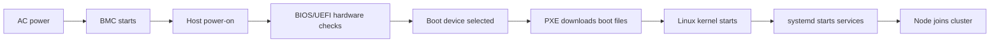
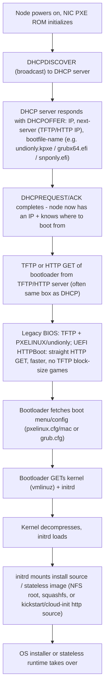

## Foundations: start here if the bare-metal HPC stack is new to you

### What this volume is trying to teach

Volume 10 follows a physical GPU server from hardware management through operating-system provisioning, configuration, scheduling, job execution and fleet-wide change. It integrates topics from earlier volumes and is intentionally operational. This chapter gives those tools separate places before later chapters combine them.

### The stack by responsibility

| Layer/tool | Primary responsibility | It does not replace |
|---|---|---|
| BMC with Redfish/IPMI | Out-of-band hardware inventory, console, sensors and power control | Host operating system or scheduler |
| BCM | Bare-metal cluster images, node categories, provisioning and health lifecycle | Every configuration/IaC use case or job communication library |
| Linux | Host processes, memory, devices, network, security and services | Cluster scheduler |
| Ansible | Repeated host/application configuration through tasks and inventory | Terraform state or Slurm scheduling |
| Terraform | Lifecycle of provider/API-managed infrastructure objects | Arbitrary OS configuration without an appropriate provider |
| Slurm | Resource allocation, queues and batch job launch | MPI/NCCL communication |
| MPI/PMIx | Process launch/bootstrap and process communication ecosystem | Scheduler allocation |
| NCCL | GPU collective communication | General cluster lifecycle management |
| Enroot/Pyxis | Unprivileged container user space integrated with Slurm | Host driver/kernel or scheduler policy |
| CI/CD/change process | Evidence, approval and controlled promotion of changes | Technical validation and rollback design |

### Follow one node and one job

A BMC makes a powered chassis manageable. Firmware and BIOS are baselined. Network boot or BCM installs a known OS image. Configuration tools establish users, security, drivers and services. Health checks prove the node is eligible. Slurm admits it to a partition and later allocates it. A launcher starts job ranks; MPI/NCCL and the network move data; storage supplies datasets and checkpoints. Logs/accounting record outcomes. Change management maintains compatibility across every layer.

When a job fails, locate the last successful boundary. When a change is planned, identify every compatibility boundary it touches.

### Essential distinctions

- **Provisioning** creates or installs a base system; **configuration** establishes its role.
- **Desired state** is what policy declares; **observed state** is what currently exists.
- A **scheduler** allocates resources; a **communication library** moves data among processes.
- **Availability** means reachable/operating; **readiness** means safe to accept the intended work.
- **Idempotent** means repeating an operation converges without unintended repeated effects.
- A **canary** is a deliberately representative limited exposure, not merely one spare node.
- **Rollback** must be a tested procedure; some firmware and state changes are not easily reversible.

### Follow a server from delivery to first job

#### 1. Physical readiness and out-of-band control

The rack must supply validated power, cooling and network cabling. The BMC has an independent management path for inventory, sensors, console and power control. Host Linux can be down while the BMC remains reachable.

#### 2. Firmware and boot baseline

Record BMC, BIOS/UEFI, GPU, NVSwitch, NIC/HCA and storage firmware as a tested compatibility set. Configure supported boot, security, virtualization/IOMMU and device settings. Network boot relies on address/boot discovery and artifact delivery before an OS exists.

#### 3. Image and operating system

BCM or another provisioner assigns a known image to node categories/roles. The node boots kernel/initramfs, discovers storage/network/devices and starts systemd services. Configuration/hardening establishes identity, time sync, repositories, audit, firewall and required cluster components.

#### 4. Accelerator and fabric stack

Install/validate driver, CUDA user-space expectations, container integration, NIC/RDMA stack and topology. Hardware visibility, driver initialization, framework execution and distributed communication are separate gates.

#### 5. Scheduler readiness

Health checks validate expected GPU count, critical errors, fabric links, mounts, time, daemon/config consistency and a representative test. Only then should Slurm or another scheduler accept the node.

#### 6. Job lifecycle

The user submits resource requirements. Slurm selects eligible nodes. Prolog validates/prepares. Launcher/PMIx starts ranks. MPI/NCCL and storage participate in execution. Epilog/accounting cleans and records outcomes. Failed health should drain/quarantine rather than silently return capacity.

### Control plane versus data plane

| Plane | Examples |
|---|---|
| Management/control | BMC network, BCM head node, Git/IaC pipeline, Slurm controller, monitoring control services |
| Workload/data | GPU computation, MPI/NCCL fabric, dataset reads, checkpoint writes, inference traffic |

A healthy control plane can schedule a job onto a degraded data path. A healthy data fabric cannot compensate for unavailable scheduler/identity services. Monitor and test both.

### Version and ownership matrix

Maintain one artifact listing:

- hardware generation and firmware bundle;
- OS/kernel;
- GPU driver;
- CUDA/framework/container image;
- NIC/HCA firmware and OFED/driver stack;
- NCCL/MPI/PMIx;
- Slurm/BCM/Enroot/Pyxis;
- storage client/server compatibility;
- Kubernetes/operator versions where present.

For each field record owner, source of truth, validation, rollout unit and rollback constraint. "Latest" is not a production version strategy.

### Safe first lab without physical mutations

On an authorized lab node, collect an evidence-only inventory:

```bash
hostnamectl
uname -a
lspci -nn
ip -brief address
ip route
findmnt
systemctl --failed
nvidia-smi --query-gpu=index,name,uuid,driver_version --format=csv
nvidia-smi topo -m
```

If Slurm is installed:

```bash
scontrol show node "$(hostname -s)"
```

Create a table with expected, observed, evidence source and admission consequence. Do not update firmware, reset GPUs, change BMC power or resume a drained node during an observation lab.

### Worked fault isolation

**Symptom:** Slurm node is idle but a multi-node job never starts correctly.

1. Confirm allocation and node/job reasons from Slurm.
2. Confirm every expected `slurmd`/rank starts and has consistent environment.
3. Run CPU/rank bootstrap test before GPU collectives.
4. Confirm local GPU framework test on each allocated node.
5. Compare driver/container/MPI/NCCL versions and topology.
6. Run a controlled two-node NCCL test.
7. Inspect selected interface/transport and fabric counters.
8. Add storage/data path and the real framework only after lower layers pass.
9. Drain/quarantine a consistently failing node and preserve evidence.

### Official references

- [NVIDIA Base Command Manager](https://docs.nvidia.com/base-command-manager/)
- [BCM 11 administrator manual](https://docs.nvidia.com/base-command-manager/manuals/11/admin-manual.pdf)
- [NVIDIA DCGM](https://docs.nvidia.com/datacenter/dcgm/latest/learn/)
- [NVIDIA NCCL](https://docs.nvidia.com/deeplearning/nccl/)
- [Slurm documentation](https://slurm.schedmd.com/documentation.html)
- [Terraform documentation](https://developer.hashicorp.com/terraform/docs)
- [Ansible documentation](https://docs.ansible.com/projects/ansible/latest/)

### How to study this volume

Read Chapters 1–3 for hardware/OS lifecycle, 4–5 for automation ownership, 6–8 for job execution, and 9–12 for health/change/delivery/documentation. Use deep dives only after the related core chapter. Perform power, firmware, reimage, scheduler-state and infrastructure mutations only in an authorized lab or approved maintenance process.

### Readiness check

You are ready when you can explain which layer owns power, image, host configuration, infrastructure API objects, resource allocation, process communication and container user space—and why a green check at one layer cannot validate all the others.

Before interview practice, complete the companion [Slurm and BCM interview lab](./slurm-bcm-interview-lab). It turns this stack into an evidence-driven sequence of commands, failure boundaries and senior-level answer patterns.

### Check your understanding

**Q1: The BMC is reachable while Linux is down. Why is that expected?**
A: The BMC is an independent management computer and network path; it remains available with chassis power even when the host OS is unavailable.

**Q2: Slurm allocated the expected GPUs. What remains unproved?**
A: Rank launch, framework execution, MPI/NCCL communication, fabric health, storage throughput, and application correctness remain separate boundaries.

### Glossary

- **BMC** — an independent controller for out-of-band hardware management.
- **BCM** — NVIDIA Base Command Manager for cluster provisioning and lifecycle.
- **Provisioning** — installing or creating a base system.
- **Configuration** — establishing the system's intended role and settings.
- **Readiness** — evidence that a resource is safe for its intended workload.
- **Canary** — a small, representative initial rollout scope.

### Ready to continue

- Name the owner of power, image, host configuration, scheduling, and process communication.
- Trace one server from rack power to an admitted Slurm node.
- Explain why availability at one layer does not prove workload readiness.

**Learning outcome:** Understand what happens to a physical GPU server between "racked and cabled" and "ready for an OS image" — BMC access, firmware baselining, and network boot — and be able to diagnose why a specific node refuses to PXE boot.

## Start here — build the physical-server mental model

A server is really two computers sharing one chassis:

- The **host** is the powerful machine that runs Linux, Slurm jobs, containers, and GPU workloads.
- The **BMC** is a small management computer that watches and controls the host. It has its own network address and remains available when the host is powered off, provided the chassis still has AC power.

This distinction explains a common beginner confusion: `ping` to the host OS can fail while the BMC still works. That is useful, not contradictory. You can use the BMC to inspect temperatures, read hardware events, open a remote console, or request a power cycle when Linux is unreachable.

Learn the boot path as a sequence of owners:



When a node fails, first locate the last successful boundary. No BMC response points toward power, cabling, BMC configuration, or the management network. A visible BIOS screen but no PXE offer points toward boot order, DHCP, VLAN, or PXE services. A downloaded kernel that later panics is no longer a PXE discovery problem; investigate the image, kernel arguments, driver, or storage path.

### Vocabulary before commands

| Term | Plain-language meaning | Why you care |
|---|---|---|
| In-band | Management through the running host OS | Fails when Linux or the host network fails |
| Out-of-band | Management through the independent BMC | Recovery path when the host is down |
| BIOS/UEFI | Firmware that initializes hardware and chooses what boots | Wrong settings can hide devices or skip PXE |
| PXE | Network-assisted boot process | Lets a fleet install an OS without local media |
| DHCP | Supplies an address and tells a client where to boot | A wrong scope/VLAN can stop the process immediately |
| TFTP/HTTP | Delivers bootloader, kernel, and installer/image data | A client may get DHCP yet fail during download |
| Firmware | Low-level software inside BMCs, NICs, GPUs, switches, and drives | Versions form a compatibility set, not isolated upgrades |

**Safety rule:** inventory and sensor reads are normally low risk. Power operations, firmware updates, BIOS changes, virtual-media mounts, and RAID changes are disruptive. Always identify the node, workload state, redundancy, and rollback path before using them.

## Why this layer exists

Everything above Kubernetes or Slurm assumes a node that boots, reports sane sensors, and takes an OS image. That assumption is not free. A GPU node arriving from the factory or returning from RMA is a pile of firmware revisions, BIOS settings, and RAID/BMC defaults that have to be brought into a known state before any cluster manager touches it. In an NVIDIA DGX/HGX-class deployment this matters more than on commodity compute: GPU VBIOS, NVSwitch firmware, NIC firmware (ConnectX/BlueField), and BIOS/BMC firmware all have compatibility matrices against the driver and CUDA stack, and a mismatched revision is a common root cause of "GPU falls off the bus" or "NCCL init hangs" tickets that look like software bugs three layers up.

Rack/power/cooling context, briefly: at GPU node densities (8-10kW+ per node for HGX systems), the constraint is often power and cooling delivery, not floor space — PDU circuit capacity and rack-level airflow (or direct liquid cooling loops) get sized before racking, and a node that trips a breaker or hits a thermal ceiling under full tensor-core load is a facilities problem, not a firmware one. That context sets the boundary of this chapter: everything below is what happens once power and cooling are already provisioned to the rack.

## IPMI vs Redfish

Both are out-of-band management protocols talked to the Baseboard Management Controller (BMC) — a service processor on the motherboard with its own CPU, memory, network port, and power feed, independent of the host OS. The BMC is alive whenever the node has AC power, even if the host CPU is off.

| | IPMI | Redfish |
|---|---|---|
| Transport | Binary protocol over LAN (RMCP+), UDP 623 | HTTPS REST/JSON, standard HTTP verbs |
| Data model | Opaque byte-packed records (SDR, sensor thresholds by numeric offset) | Self-describing JSON resources with a schema |
| Tooling | `ipmitool` | `redfishtool`, `curl`, any HTTP client |
| Scriptability | Awkward — fixed binary field offsets, vendor OEM extensions common | Native — JSON, discoverable via `$metadata`/schema links |
| Status | Legacy, DCMI subset still widely deployed | DMTF standard, the direction every major vendor (Dell iDRAC, HPE iLO, Lenovo XCC, Supermicro, NVIDIA/Mellanox BMC) has moved |

Redfish did not replace IPMI overnight — most BMCs today run both, and IPMI's `chassis power` and `sol` (serial-over-LAN) commands are still the fastest path for a quick power-cycle or console grab. But firmware inventory, structured event logs, and anything you want to automate at scale should go through Redfish: it returns typed JSON you can parse without knowing vendor-specific IPMI OEM byte layouts.

## Accessing the BMC

```
# IPMI — direct LAN access, or via ipmitool's "lan" interface
ipmitool -I lanplus -H <bmc-ip> -U admin -P <pass> chassis status
ipmitool -I lanplus -H <bmc-ip> -U admin -P <pass> power status
ipmitool -I lanplus -H <bmc-ip> -U admin -P <pass> power cycle
ipmitool -I lanplus -H <bmc-ip> -U admin -P <pass> sol activate       # serial-over-LAN console
ipmitool -I lanplus -H <bmc-ip> -U admin -P <pass> sensor list
ipmitool -I lanplus -H <bmc-ip> -U admin -P <pass> fru print          # field-replaceable unit inventory

# Redfish — HTTPS REST, works with curl or redfishtool
redfishtool -r <bmc-ip> -u admin -p <pass> raw GET /redfish/v1/Systems/1
curl -sk -u admin:<pass> https://<bmc-ip>/redfish/v1/Systems/1 | jq .
curl -sk -u admin:<pass> https://<bmc-ip>/redfish/v1/Systems/1/Processors | jq .
curl -sk -u admin:<pass> https://<bmc-ip>/redfish/v1/UpdateService/FirmwareInventory | jq .
```

Annotated `ipmitool sensor list` output — this is the first thing to pull when a node is reported "unhealthy" before you even try to log into the OS:

```bash
$ ipmitool -I lanplus -H 10.0.1.15 -U admin -P *** sensor list
CPU1 Temp | 52.000 | degrees C | ok | 0.000 | 3.000 | 5.000 | 92.000 | 95.000 | 98.000
CPU2 Temp | 108.000 | degrees C | ncr | 0.000 | 3.000 | 5.000 | 92.000 | 95.000 | 98.000 ← non-critical high, near upper-non-recoverable
GPU1 Temp | 61.000 | degrees C | ok | 0.000 | 3.000 | 5.000 | 88.000 | 92.000 | 95.000
FAN1 | 8400.000 | RPM | ok | 500.00 | 700.00 | 900.00 | na | na | na
PSU1 Status | 0x1 | discrete | 0x0180| na | na | na | na | na | na ← discrete sensor, decode bitmap not a number
PSU2 Status | 0x0 | discrete | 0x0180| na | na | na | na | na | na ← PSU2 reading 0 — likely no input power, check PDU/breaker
```
Reading this correctly: the six threshold columns are `lnr/lcr/lnc/unc/ucr/unr` (lower/upper non-recoverable, critical, non-critical). `CPU2 Temp` at `ncr` status with a reading of 108°C against an upper-non-critical threshold of 92°C is already past non-critical and closing on `ucr` (95) — this node should be pulled from scheduling before it thermally throttles or shuts down. `PSU2 Status` reading `0x0` on a discrete sensor is not "temperature is zero," it is a bitmap that needs decoding against the SDR — in practice, a PSU reporting nothing usually means no AC input, which is a facilities/PDU check, not a server fault.

The Redfish equivalent returns the same class of information as structured JSON — a `GET /redfish/v1/Systems/1` gives `PowerState`, `Status.Health`, `ProcessorSummary`, `MemorySummary`, and links to `/Processors`, `/Memory`, `/EthernetInterfaces`, `/SecureBoot` — no field-offset guessing required, which is why fleet-scale health polling is built on Redfish, not IPMI, in any modern shop.

## Firmware inventory and update workflow

A GPU node's firmware surface is wider than a general-purpose server's:

- **BIOS/UEFI** — boot mode, PCIe link training parameters, IOMMU/SR-IOV settings, NUMA/memory interleave — all of which affect GPU-to-GPU and GPU-to-NIC bandwidth.
- **BMC firmware** — the management controller's own firmware; a BMC firmware bug can cause false sensor readings or SOL hangs.
- **NIC firmware** — ConnectX/BlueField firmware revisions gate RoCE/InfiniBand feature support and interact with the driver (MLNX_OFED) version.
- **GPU VBIOS** — gates ECC modes, power limits, and ties to the driver's supported VBIOS range; a stale VBIOS is a frequent cause of Xid errors that look like driver bugs.
- **NVSwitch/NVLink firmware** on multi-GPU baseboards — affects fabric topology discovery.

Workflow, in order, for bringing a node's firmware to baseline:

```
1. Inventory   : curl .../UpdateService/FirmwareInventory   (or vendor tool, e.g. dcgm/nvidia-smi -q for GPU VBIOS)
2. Compare      : diff against the site's firmware baseline manifest (a pinned version per component per HW generation)
3. Stage image  : push firmware payload to BMC (Redfish SimpleUpdate action, or vendor USC/Lifecycle Controller)
4. Apply        : trigger update, most require a reboot; some (BMC-only) apply live
5. Verify       : re-read inventory, confirm version matches baseline; check POST completes cleanly
6. Log          : record serial + component + old/new version in the fleet firmware ledger (audit trail for driver compatibility claims later)
```

The reason step 2 (baseline manifest) matters operationally: NVIDIA driver releases publish a supported VBIOS/firmware compatibility range. If a fleet has mixed VBIOS revisions across nodes in the same Slurm partition, you get node-to-node inconsistency in ECC behavior or power capping that shows up as unexplained run-to-run variance in benchmark numbers — a support case that traces back to "we never enforced a firmware baseline" more often than teams expect.

## PXE/network boot fundamentals

Network boot is the mechanism by which a bare node with no OS on disk gets an installer or a stateless image without anyone touching a USB drive.

Boot sequence: DHCP → TFTP/HTTP → kernel/initrd handoff



Two failure classes dominate PXE troubleshooting: nothing offered (DHCP scope exhausted, PXE options not set on the DHCP server, or a rogue DHCP server on the segment answering first with wrong options), or offered-but-nothing-loads (TFTP blocked by a firewall/ACL, wrong `next-server` IP, boot filename mismatched to the node's firmware mode — legacy BIOS asking for an EFI bootloader or vice versa). `tcpdump -i <iface> port 67 or port 68 or port 69` on the boot network is the fastest way to see exactly where in this chain a specific node stalls.

## RAID/boot-drive configuration before OS install

Before any OS deployment tool can lay down a filesystem, the boot drive's RAID (or no-RAID/JBOD) topology has to exist as a block device the installer can see. This is configured either interactively in BIOS/RAID controller setup, or — for automation at scale — via the vendor's out-of-band RAID configuration API (often exposed through Redfish's `Storage` resource, or a vendor Lifecycle Controller/RACADM-equivalent tool) so it can be scripted as part of node bring-up rather than requiring a technician at a console. Common patterns for GPU nodes: RAID1 mirrored boot/OS drives for resilience, with local NVMe scratch left un-RAIDed (JBOD) since it's ephemeral job-local storage and mirroring it would only cost write bandwidth for no durability benefit anyone needs.

## From bare node to "provisionable"

A node is not ready for a cluster manager or Slurm/Kubernetes to claim it just because it powers on. "Provisionable" means:

1. BMC reachable and authenticated (Redfish/IPMI credentials rotated off vendor defaults).
2. Sensor health clean — no active critical/non-recoverable alarms.
3. Firmware at or above the site's pinned baseline (BIOS, BMC, NIC, GPU VBIOS, NVSwitch).
4. RAID/boot device configured and visible to the boot loader.
5. PXE path validated — DHCP scope has an entry (or the node's MAC is in the provisioning system), TFTP/HTTP boot artifacts reachable from that node's boot VLAN.
6. A health-check pass (burn-in/diagnostic — GPU memory test, NIC link test, storage SMART check) completed and recorded.

Only after all six is a node handed to the next layer up — in this book's context, that is NVIDIA Base Command Manager (Chapter 2), which owns the actual OS image push and ongoing category-based configuration.

## Worked scenario — a node that fails to PXE boot

**Situation:** Node `gpu-node-14` was just RMA'd (new mainboard) and reinserted into the rack. It never appears in the provisioning system's "installing" state; the console shows it sitting at "PXE-E51: No DHCP or proxyDHCP offers were received."

1. **Confirm the BMC/console is reachable at all.** `ipmitool -I lanplus -H <bmc-ip> ... sol activate` — if this fails, the problem is BMC network config, not PXE; fix that first, it's a prerequisite for diagnosing anything else.
2. **Check whether the NIC is even asking.** From a span port or another box on the same VLAN: `tcpdump -i eth0 port 67 or port 68`. No DHCPDISCOVER seen at all from that MAC → the problem is upstream of the network: cabling, switch port not on the correct VLAN, or the PXE NIC port itself disabled in BIOS (common after a mainboard swap — BIOS defaults may re-enable a different NIC as primary, or disable PXE ROM on the intended port).
3. **DHCPDISCOVER seen but no OFFER returned** → check the DHCP server's scope utilization and whether the node's MAC is registered (many provisioning systems require MAC pre-registration before offering a PXE-specific option set) — this is the single most common cause after a mainboard swap, since the RMA changed the MAC address and the old registration no longer matches.
4. **OFFER received, but TFTP/HTTP fetch fails** (`PXE-E32`, `PXE-E11`, or an HTTPBoot TLS/404 error) → check firewall/ACL on the TFTP/HTTP path from that VLAN, and confirm boot-mode match (UEFI node requesting `grubx64.efi`/HTTPBoot vs. a scope only configured to hand out a legacy `undionly.kpxe` filename).
5. **Files fetch but boot fails after kernel/initrd load** → likely not a PXE problem at all anymore; check the kickstart/cloud-init source reachability and RAID/boot-drive visibility — a fresh mainboard may have reset the RAID controller to a different default mode than the disks were configured under.

**Interview-ready line:** "PXE failures decompose cleanly into four stages — no DHCP offer, offer but no file transfer, file transfer but boot-mode mismatch, and boot succeeds but the install source is unreachable — and `tcpdump` on the DHCP/TFTP ports tells you which stage you're actually in before you start guessing at firmware or cabling."

**Mnemonic:** **"D-T-B-I"** — **D**HCP, **T**FTP/HTTP, **B**oot-mode match, **I**nstall source. Walk it in that order; each stage assumes the previous one succeeded.

## Practice

1. Explain the difference between IPMI and Redfish to someone who has only ever used `ipmitool`, and name one concrete reason a fleet-scale automation team would prefer Redfish.
2. A `sensor list` shows a PSU status of `0x0` on a discrete sensor. Why is treating this as "PSU reads zero" the wrong interpretation, and what's the correct way to read a discrete sensor?
3. Walk through, in order, the six checks that make a bare node "provisionable" rather than merely "powered on."
4. A node PXE-boots successfully but lands in the wrong OS image. Which stage of the DHCP→TFTP/HTTP→kernel/initrd chain does this point to, and what specifically would you check first?
5. Why does a GPU cluster need a firmware baseline manifest (pinned versions per component) rather than "just keep everything updated to latest," specifically with respect to driver/CUDA compatibility?
