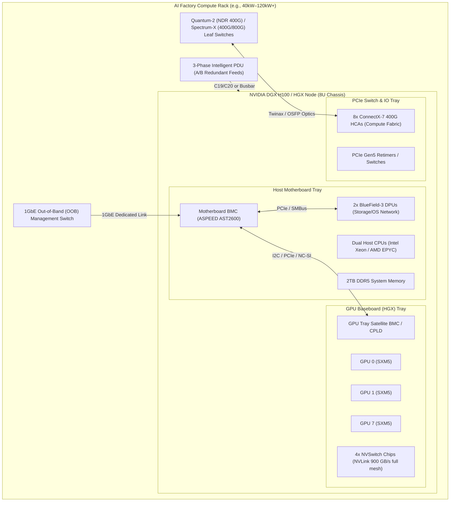
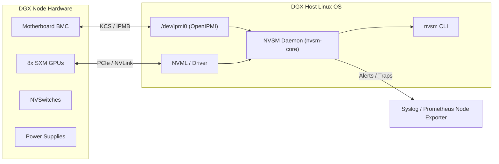
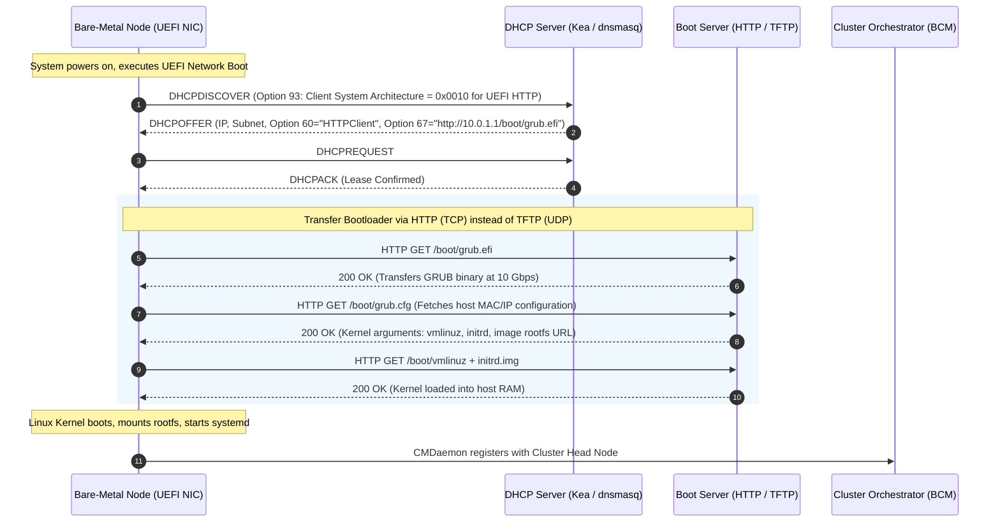

# Chapter 1 — Bare-Metal and BMC/Redfish Lifecycle

## Foundations: start here if the bare-metal HPC stack is new to you

In an **NVIDIA AI Factory**, the boundary between hardware and software is razor-thin. A high-performance distributed training run spanning thousands of GPUs is only as reliable as the physical and out-of-band layer underneath it. A single PCIe link running at Gen1 speed instead of Gen5, an uncorrected NVLink symbol error, or a mismatched GPU VBIOS across a 512-node cluster will manifest days later as silent data corruption, non-deterministic NCCL collective timeouts, or catastrophic job failures.

As an **NVIDIA Senior Solutions Architect**, you are expected to design, validate, and troubleshoot the hardware and management infrastructure from bare-metal delivery to job readiness. This chapter builds the authoritative foundation for physical server lifecycle management, out-of-band (OOB) orchestration via IPMI and DMTF Redfish, firmware baselines, BIOS/UEFI tuning for AI workloads, and deterministic network boot architectures.

---

## 1. Architectural Blueprint: The AI Factory Physical Hierarchy

To manage an AI cluster, you must first master the physical topology of accelerated compute systems such as the **NVIDIA DGX H100/H200**, **HGX 8-GPU baseboards**, and the **DGX GB200 NVL72** liquid-cooled rack-scale system.



### Key Hardware Boundaries

1. **Dual-Tray Physical Architecture**: Modern 8-GPU systems (such as DGX H100) decouple the compute/host motherboard tray (CPUs, system memory, boot NVMe, DPUs) from the GPU accelerator tray (8x SXM GPUs, heatsinks/cold plates, and 4x NVSwitch ASICs).
2. **Out-of-Band Network (OOB)**: A physically isolated, dedicated 1GbE network connects every BMC, PDU, and switch management port. It never carries workload traffic and remains fully operational even if the host operating system experiences a kernel panic or CPU lockup.
3. **Compute Data Fabric**: Eight discrete ConnectX-7 (or ConnectX-8) network adapters interface directly with the PCIe Gen5 tree, each paired 1:1 with an SXM GPU via PCIe switches or direct host controller root complexes for lossless GPUDirect RDMA.
4. **Storage/In-Band Management Fabric**: Dual BlueField-3 DPUs or dedicated ConnectX adapters handle boot-over-SAN/NVMe-oF, cluster file system mounts (e.g., Lustre, GPFS, WEKA), and in-band host telemetry.

---

## 2. The Out-of-Band Control Plane: IPMI vs. Redfish

Every bare-metal enterprise server contains a **Baseboard Management Controller (BMC)**—an autonomous ARM-based System-on-Chip (commonly ASPEED AST2500 or AST2600) powered by auxiliary power standby rails. Even when the host power state is `Off`, the BMC is alive, listening on its dedicated MAC address.

### The Architectural Shift: IPMI to Redfish

For decades, the Intelligent Platform Management Interface (IPMI 2.0) was the industry standard. Today, IPMI is a legacy liability, superseded by **DMTF Redfish**.

| Dimension | Legacy IPMI 2.0 | Modern DMTF Redfish |
|---|---|---|
| **Transport Protocol** | RMCP+ over UDP port 623 | HTTPS (TLS 1.2/1.3) over TCP port 443 |
| **Payload Structure** | Opaque binary byte-packed SDR (Sensor Data Records) | Human-readable, schema-validated JSON / OData |
| **Authentication & Security** | Cipher Suite 0/3 vulnerabilities, weak RAKP hashes | TLS certificates, OAuth2, RBAC, session tokens |
| **Query Flexibility** | Primitive byte offsets, vendor-specific OEM hex commands | Standard RESTful verbs (`GET`, `POST`, `PATCH`, `DELETE`) |
| **Eventing Model** | SNMP Traps, Platform Event Trap (PET) | Webhooks, Server-Sent Events (SSE) |
| **GPU & Accelerator Support** | None natively (requires opaque raw OEM hex bridges) | Standardized schemas for Processors, Memory, PCIeDevices, Fabrics |

### Redfish Resource Hierarchy on NVIDIA DGX Systems

Redfish exposes a predictable URI tree rooted at `/redfish/v1`:

```text
/redfish/v1
├── /Systems/System_0                <-- Host CPU, Memory, PowerState, Bios
│   ├── /Bios/Settings               <-- Pending BIOS attributes (staged for next boot)
│   ├── /Processors/CPU_0            <-- Host CPU telemetry & specs
│   └── /Storage/RAID_Controller     <-- Virtual drives and NVMe controller health
├── /Chassis
│   ├── /DGX_Chassis                 <-- Physical enclosure, Power, Thermal (Fans/Temperatures)
│   ├── /Motherboard                 <-- Host compute tray BMC, VRMs
│   └── /GPU_Tray_0                  <-- SXM Baseboard, NVSwitch thermal sensors
├── /Managers/BMC_0                  <-- BMC network, NTP, SSL certs, event logs
└── /UpdateService
    ├── /FirmwareInventory           <-- Installed firmware versions across all components
    └── /Actions/UpdateService.SimpleUpdate <-- Out-of-band firmware push
```

### Deep-Dive: Interacting with Redfish via cURL

In an automated AI Factory deployment pipeline, shell and Python scripts query the Redfish REST API directly to audit physical state.

#### 1. Querying Overall Chassis Health and Power State

```bash
# Retrieve power state and aggregated health status
curl -sk -u admin:"${BMC_PASSWORD}" \
  -H "Accept: application/json" \
  https://10.230.12.45/redfish/v1/Systems/System_0 | jq '{
    PowerState: .PowerState,
    Health: .Status.Health,
    HealthRollup: .Status.HealthRollup,
    Model: .Model,
    SerialNumber: .SerialNumber,
    MemoryTotalGiB: (.MemorySummary.TotalSystemMemoryGiB)
  }'
```

*Expected JSON output:*
```json
{
  "PowerState": "On",
  "Health": "OK",
  "HealthRollup": "OK",
  "Model": "DGX H100",
  "SerialNumber": "1564223000124",
  "MemoryTotalGiB": 2048
}
```

#### 2. Auditing GPU Tray Temperatures and Thermal Throttling

```bash
# Extract individual SXM GPU thermal sensors
curl -sk -u admin:"${BMC_PASSWORD}" \
  https://10.230.12.45/redfish/v1/Chassis/GPU_Tray_0/Thermal | jq '.Temperatures[] | {
    Sensor: .Name,
    CurrentTempC: .ReadingCelsius,
    CriticalThreshold: .UpperThresholdCritical,
    FatalThreshold: .UpperThresholdFatal,
    Status: .Status.Health
  }'
```

#### 3. Power Cycling a Frozen Node via Redfish Action

When a node's kernel panics and SSH/in-band agents stop responding, issue a graceful restart or immediate force-reset:

```bash
# Graceful shutdown followed by power-on (ForceRestart)
curl -sk -u admin:"${BMC_PASSWORD}" \
  -X POST \
  -H "Content-Type: application/json" \
  https://10.230.12.45/redfish/v1/Systems/System_0/Actions/ComputerSystem.Reset \
  -d '{"ResetType": "ForceRestart"}'
```

*Valid `ResetType` parameters:* `On`, `ForceOff`, `GracefulShutdown`, `GracefulRestart`, `ForceRestart`, `Nmi` (Non-Maskable Interrupt to trigger kernel crash dump).

---

## 3. NVIDIA System Management (`nvsm`) and Diagnostic Architecture

While Redfish operates out-of-band, the host OS on an NVIDIA DGX node runs the **NVIDIA System Management (`nvsm`)** daemon. `nvsm` bridges out-of-band BMC data, host kernel telemetry, and NVML GPU metrics into a unified hardware health engine.



### Production `nvsm` Commands for Hardware Triage

```bash
# 1. Quick cluster-readiness health check
$ sudo nvsm show health
Overall System Health: OK
  Component             Status
  --------------------  ------
  CPUs                  OK
  Memory                OK
  GPUs                  OK
  NVSwitches            OK
  Power Supplies        OK
  Fans                  OK
  Storage               OK
  PCIe Switches         OK
  Network Adapters      OK

# 2. Inspecting GPU baseboard detailed diagnostics
$ sudo nvsm show gpus
GPU 0: NVIDIA H100 80GB HBM3
  Health               : OK
  PCI Bus ID           : 0000:19:00.0
  Serial Number        : 1653222019481
  VBIOS Version        : 96.00.89.00.01
  Inforom Version      : G510.0200.00.03
  Temperature (Die)    : 42 C (Limit: 85 C)
  Power Consumption    : 145 W (Cap: 700 W)
  NVLink Status        : 18/18 Links Active (900 GB/s)
  ECC Single-Bit Errs  : 0
  ECC Double-Bit Errs  : 0

# 3. Generating a full diagnostic dump for NVIDIA Enterprise Support
$ sudo nvsm dump health --destination /tmp/dgx_health_dump_$(date +%F).tar.gz
```

---

## 4. Firmware Baselines and the Coordinated Release Matrix

In an AI Factory, firmware is not updated piecemeal. A cluster must run a **validated, deterministic firmware bundle**. NVIDIA publishes qualification matrices covering:

1. **System BIOS/UEFI**: Motherboard boot code, PCIe bifurcation, and memory training.
2. **BMC Firmware**: Service processor firmware, sensor threshold tables, and thermal fan curves.
3. **GPU VBIOS**: Microcode executed on the GPU controller at cold boot, setting voltage curves, clock limits, and thermal throttling behaviors.
4. **NVSwitch Firmware**: Fabric routing algorithms, link-level error recovery, and credit management.
5. **HCA Firmware (ConnectX-7 / BlueField-3)**: RoCE / InfiniBand link protocols, Congestion Control (CC), and GPUDirect RDMA engines.
6. **NVMe SSD Firmware**: Power-loss protection, wear leveling, and controller latency variance.

### The Danger of Firmware Drift

```text
Cluster State: 64x DGX H100 Nodes
- Node 01-60: GPU VBIOS 96.00.89.00.01 (Baseline)
- Node 61-64: GPU VBIOS 96.00.74.00.04 (Stale RMA replacement)

Result:
When executing 512-GPU Megatron-LM training, nodes 61-64 hit subtle voltage throttling under 
sustained 700W FP8 GEMM kernels. While nodes 01-60 sustain 1980 MHz core clocks, nodes 61-64 
throttle to 1755 MHz. 

Because All-Reduce is a synchronized collective, all 512 GPUs stall waiting for the slowest 
GPU at every backward pass step. Training throughput collapses by 14% across the entire 
multi-million dollar cluster due to four un-baselined RMA nodes.
```

### Modern Firmware Baselining via NVIDIA DGX Firmware Update Containers

NVIDIA provides automated containerized firmware bundles that flash and verify all subsystems in a single orchestrated pass:

```bash
# Pull and run the official NVIDIA DGX H100 Firmware Container
docker run --privileged --net=host --pid=host \
  -v /var/log:/var/log \
  -v /dev:/dev \
  nvcr.io/nvidia/dgx-h100-firmware:24.04.1 \
  update_fw all --preview

# Reviewing diff before live execution:
# Component          Current Version       Target Version        Action
# -----------------  --------------------  --------------------  ------
# Motherboard BIOS   1.24.0                1.28.0                UPDATE
# Motherboard BMC    23.09.04              24.03.02              UPDATE
# GPU 0-7 VBIOS      96.00.74.00.04        96.00.89.00.01        UPDATE
# NVSwitch 0-3       01.02.08              01.04.01              UPDATE
# ConnectX-7 (x8)    28.39.1002            28.40.1000            UPDATE
```

---

## 5. Host BIOS/UEFI Hardening and Optimization for AI Workloads

Standard server BIOS factory defaults favor power efficiency and general-purpose virtualization. These defaults are actively harmful to large-scale AI distributed training.

### Production BIOS Settings Matrix

| BIOS Setting Category | Factory Default | AI Factory Required Setting | Architectural Rationale |
|---|---|---|---|
| **Power Management** | Energy Efficient / Balanced | **Maximum Performance / Deterministic** | Prevents CPU cores from dropping into high-latency C-states (C1E, C6), eliminating jitter during MPI/NCCL barrier synchronization. |
| **NUMA Topology** | Auto / Single Node (NPS1) | **SNC2 / SNC4 (Intel) or NPS4 (AMD)** | Sub-NUMA Clustering splits sockets into distinct memory domains, keeping PCIe Gen5 GPU controllers pinned to local memory channels and minimizing cross-socket Ultra Path Interconnect (UPI/Infinity Fabric) traffic. |
| **Autonomous NUMA Balancing** | Enabled | **Disabled (`numa_balancing=0`)** | Linux kernel page scanning and background page migration introduce massive latency spikes during high-throughput RDMA tensor transfers. |
| **PCIe Link Speed** | Auto | **Force Gen 5 (32 GT/s)** | Disables runtime PCIe link renegotiation, preventing intermittent downgrades to Gen4/Gen3 under high thermal or electrical load. |
| **PCIe Relaxed Ordering** | Disabled | **Enabled** | Mandatory for GPUDirect RDMA and GPUDirect Storage (GDS); allows PCIe switches to optimize DMA packet delivery order to memory. |
| **PCIe Maximum Payload Size (MPS)** | 128 or 256 Bytes | **512 Bytes** | Maximizes PCIe transfer efficiency and reduces packet framing overhead for 400 Gb/s ConnectX-7 network adapters. |
| **IOMMU (Intel VT-d / AMD-Vi)** | Disabled or Enabled | **Enabled (or Host Passthrough)** | Required for SR-IOV and containerized device isolation, but must be paired with `iommu=pt` in the kernel to prevent DMA translation overhead. |
| **Above 4G Decoding** | Enabled | **Enabled** | Essential for mapping the vast 80GB/144GB HBM3 memory spaces of 8 discrete GPUs into 64-bit PCIe address space. |

---

## 6. Deterministic Network Boot: PXE vs. UEFI HTTPBoot

When provisioning hundreds of compute nodes from bare metal, manual media installation is impossible. Infrastructure teams use network boot.



### Why UEFI HTTPBoot Supersedes Legacy PXE

1. **Transport Robustness**: Legacy PXE uses **TFTP (Trivial File Transfer Protocol)** over UDP port 69. TFTP uses lockstep 512-byte blocks requiring an ACK for every packet. In large clusters boot-storming simultaneously, packet drops cause immediate timeout loops.
2. **Speed**: UEFI HTTPBoot leverages standard **HTTP/HTTPS over TCP**. It utilizes large TCP window scaling, saturation bandwidth over 10GbE/25GbE management switches, and completes initrd transfers in seconds instead of minutes.
3. **Security**: HTTPBoot supports native TLS encryption and server certificate verification directly in UEFI firmware, preventing Man-in-the-Middle (MitM) image tampering during provisioning.

### The "D-T-B-I" Triage Methodology for Boot Failures

When a node fails to boot over the network, follow the strict diagnostic chain:

```text
[D] DHCP Phase       --> Did the node broadcast DHCPDISCOVER and receive a valid IP & Boot URI?
[T] Transfer Phase   --> Did the node successfully download the bootloader (TFTP/HTTP)?
[B] Boot-Mode Phase  --> Did the binary match the CPU/firmware architecture (x86_64 UEFI vs ARM64)?
[I] Image Load Phase --> Did the initrd download the root filesystem and execute systemd?
```

#### Diagnostic Commands at the Management Gateway:

```bash
# 1. Capture live DHCP negotiation on the provisioning VLAN interface
sudo tcpdump -i eth1 -n -vvv -s 0 port 67 or port 68

# 2. Check if the node's MAC address is hitting the provisioning server
sudo tail -f /var/log/syslog | grep -E "dhcpd|kea|dnsmasq"

# 3. Monitor HTTPBoot download activity
sudo tail -f /var/log/nginx/access.log | grep "GET /boot/"
```

---

## 7. Senior Solutions Architect Interview Scenarios

### Scenario 1: The "Ghost" Throttling Incident
**Interviewer:** *"We deployed a 64-node DGX H100 cluster for an LLM training run. During checkpointing and heavy backward-pass steps, NCCL All-Reduce latency spikes randomly, but CPU and GPU utilization metrics look normal. How do you isolate this from the bare-metal layer up?"*

**Candidate Answer:**
> "I break this problem into three deterministic hardware boundaries:
> 1. **PCIe and Bus Link Health:** I first inspect whether any GPU or ConnectX-7 adapter suffered a PCIe link-speed degradation. I check `dmesg -T | grep -i aer` for Advanced Error Reporting Correctable/Uncorrectable errors and run `lspci -vvv -s <bus_id>` to confirm all devices operate at `LnkSta: Speed 32GT/s, Width x16`. A link trained down to Gen1 or x4 under electrical noise will throttle RDMA throughput without throwing an outright fatal error.
> 2. **NVLink Error Counters:** I query the NVSwitch and NVLink counters using `nvidia-smi nvlink --status -i 0` and check for cumulative symbol errors or replay events (`nvidia-smi nvlink -e`). A degrading NVLink cable or bad solder ball on an SXM baseboard will cause packet retransmissions, stalling the entire all-reduce ring.
> 3. **Thermal and Power Throttling:** I query the BMC out-of-band via Redfish (`/redfish/v1/Chassis/GPU_Tray_0/Thermal`) and check in-band GPU clocks via `nvidia-smi --query-gpu=clocks.current.graphics,clocks_event_reasons.hw_slowdown,clocks_event_reasons.sw_thermal_slowdown --format=csv`. If a fan tray failed or liquid cooling block flow is uneven, GPUs hit hardware slowdown, throttling clock speeds from 1980 MHz to 1200 MHz. In distributed training, because barrier synchronization requires all ranks to arrive together, one throttled GPU on one node slows down all 512 GPUs."

---

### Scenario 2: Racking and Bringing Up a Green-Field AI Cluster
**Interviewer:** *"You are architecting the bare-metal bring-up of 128 DGX H100 systems (1,024 GPUs) in a new data center. What is your strategy for day-0 provisioning and configuration validation?"*

**Candidate Answer:**
> "My strategy relies on three strict principles: out-of-band separation, immutable firmware baselining, and automated hardware qualification gates:
> 1. **OOB & Network Architecture:** We deploy dual-redundant 1GbE/10GbE out-of-band management switches connected to every BMC, PDU, and switch console. We establish DHCP reservations with Option 60/67 configured for UEFI HTTPBoot rather than legacy TFTP to prevent boot storms.
> 2. **Firmware & BIOS Baseline Engine:** Before installing an operating system, we execute a Redfish-driven workflow using the NVIDIA DGX firmware container to flash a locked baseline: system BIOS, BMC, GPU VBIOS, NVSwitch microcode, and ConnectX-7 firmware. We verify BIOS attributes: Sub-NUMA Clustering enabled (SNC2/NPS4), C-states disabled, PCIe Relaxed Ordering enabled, and Max Payload Size set to 512 bytes.
> 3. **Hardware Acceptance Burn-In (The Gate):** Before nodes are enrolled into BCM or Slurm, each node must pass an automated acceptance suite:
>    - Level 3 DCGM diagnostic (`dcgmi diag -r 3`) to stress GPU memory, tensor cores, and thermal dissipation.
>    - NVLink loopback and bandwidth tests using `nvbandwidth` to verify full 900 GB/s bidirectional mesh bandwidth.
>    - GPUDirect RDMA bidirectional bandwidth test using `ib_write_bw` across adjacent leaf switches to verify 400 Gb/s line-rate per port.
> Only nodes that generate clean evidence artifacts are admitted into the provisioning pool."

---

## Key Takeaways

1. **Out-of-Band is Authoritative:** The BMC is an independent computer. A responsive host OS does not imply healthy hardware, and a dead host OS does not prevent complete remote recovery.
2. **Redfish is the Standard:** Modern AI Factories automate fleet lifecycle through Redfish JSON APIs (`/redfish/v1/Systems`, `/redfish/v1/Chassis`, `/redfish/v1/UpdateService`), completely abandoning legacy IPMI 2.0.
3. **Firmware Consistency Trumps Everything:** GPU VBIOS, NVSwitch, HCA, and motherboard BIOS revisions form a unified operational envelope. Un-baselined firmware introduces clock throttling, silent corruption, and collective hangs.
4. **BIOS Tuning is Mandatory:** Factory BIOS settings destroy AI performance. High-performance computing requires C-states disabled, Sub-NUMA Clustering enabled, and PCIe Relaxed Ordering activated for RDMA.
5. **D-T-B-I Governs Network Boot:** Debug provisioning failures strictly down the pipeline: **D**HCP $\rightarrow$ **T**ransfer $\rightarrow$ **B**ootloader $\rightarrow$ **I**mage load.
