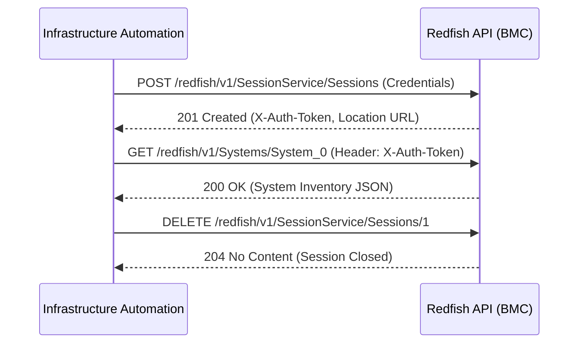
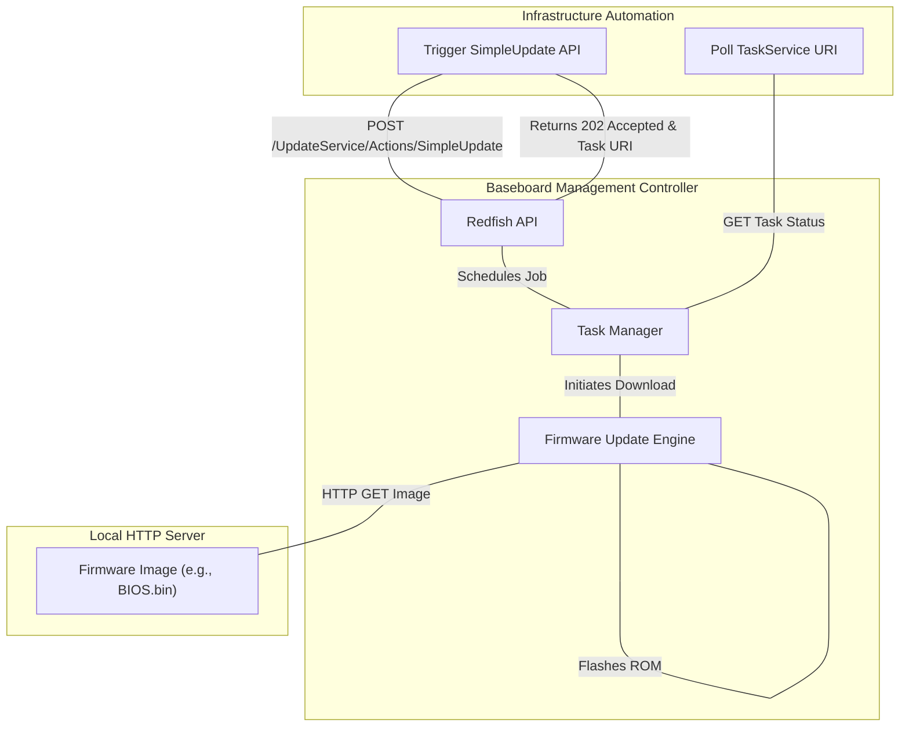
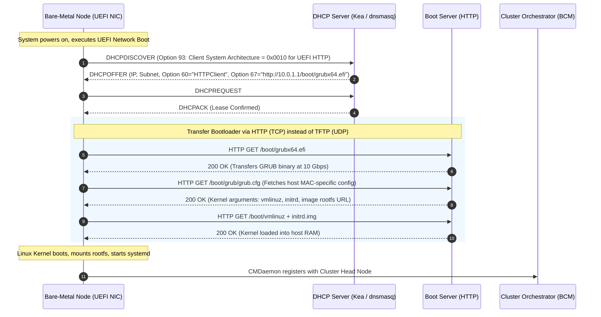

# Chapter 1 — Bare-Metal and BMC/Redfish Lifecycle

**Learning outcome:** Architect, validate, and troubleshoot the hardware and management infrastructure of an NVIDIA AI Factory from bare-metal delivery to job readiness. You will master the physical topology of accelerated compute systems (DGX H100/H200, HGX, GB200), transition from legacy IPMI to declarative DMTF Redfish APIs, automate firmware baselines at scale via Redfish REST operations, tune BIOS/UEFI parameters programmatically for multi-GPU workloads, and design deterministic HTTPBoot provisioning pipelines.

**Prerequisites:** Familiarity with Linux command line, IP networking (DHCP, TCP/UDP), basic server architecture (CPU, RAM, PCIe), and REST API concepts (JSON, HTTP methods).

**Difficulty:** Beginner to Advanced.

**Estimated reading time:** 120 minutes plus hands-on implementation practice.

---

## 1. Architectural Blueprint: The AI Factory Physical Hierarchy {#foundations-start-here-if-the-bare-metal-hpc-stack-is-new-to-you}

In an **NVIDIA AI Factory**, the boundary between hardware and software is razor-thin. A high-performance distributed training run spanning thousands of GPUs is only as reliable as the physical and out-of-band layer underneath it. A single PCIe link running at Gen1 speed instead of Gen5, an uncorrected NVLink symbol error, or a mismatched GPU VBIOS across a 512-node cluster will manifest days later as silent data corruption, non-deterministic NCCL collective timeouts, or catastrophic job failures.

To manage an AI cluster, you must first master the physical topology of accelerated compute systems such as the **NVIDIA DGX H100/H200**, **HGX 8-GPU baseboards**, and the **DGX GB200 NVL72** liquid-cooled rack-scale system.

### 1.1 The Hardware Architecture Diagram


### 1.2 Key Hardware Boundaries

Modern AI infrastructure systems like the DGX H100 are not standard 1U pizza-box servers; they are complex distributed systems contained within a single 8U chassis. 

1. **Dual-Tray Physical Architecture**: To accommodate extreme thermal and electrical requirements (up to 10.2kW per chassis), systems decouple the compute/host motherboard tray (CPUs, system memory, boot NVMe, DPUs) from the GPU accelerator tray (8x SXM GPUs, massive heatsinks or direct-to-chip cold plates, and 4x NVSwitch ASICs).
2. **Satellite Management Controllers**: Because of the dual-tray design, a single motherboard BMC is insufficient. The GPU tray contains its own Satellite Management Controller (often an FPGA or secondary ASPEED chip) that monitors GPU telemetry and NVSwitch temperatures, aggregating this data back to the primary motherboard BMC via internal I2C/SMBus fabrics.
3. **Out-of-Band Network (OOB)**: A physically isolated, dedicated 1GbE network connects every BMC, PDU, and switch management port. It never carries workload traffic and remains fully operational even if the host operating system experiences a kernel panic or CPU lockup. The OOB network is the ultimate "source of truth" and control.
4. **Compute Data Fabric**: Eight discrete ConnectX-7 (or ConnectX-8) network adapters interface directly with the PCIe Gen5 tree, each paired 1:1 with an SXM GPU via PCIe switches or direct host controller root complexes for lossless GPUDirect RDMA.
5. **Storage/In-Band Management Fabric**: Dual BlueField-3 DPUs or dedicated ConnectX adapters handle boot-over-SAN/NVMe-oF, cluster file system mounts (e.g., Lustre, GPFS, WEKA), and in-band host telemetry.

---

## 2. The Out-of-Band Control Plane: IPMI vs. Redfish

Every bare-metal enterprise server contains a **Baseboard Management Controller (BMC)**—an autonomous ARM-based System-on-Chip (commonly ASPEED AST2500 or AST2600) powered by auxiliary power standby rails. Even when the host power state is `Off` (and the CPUs/GPUs have no power), the BMC is alive, running its own embedded Linux OS (like OpenBMC), and listening on its dedicated MAC address on the OOB network.

### 2.1 The Architectural Shift: Why IPMI is Dead

For two decades, the **Intelligent Platform Management Interface (IPMI 2.0)** was the industry standard for out-of-band management. It operated over UDP port 623 using a binary packet format. Today, IPMI is considered a legacy protocol and a security liability, superseded by **DMTF Redfish**.

| Dimension | Legacy IPMI 2.0 | Modern DMTF Redfish |
|---|---|---|
| **Transport Protocol** | RMCP+ over UDP port 623 | HTTPS (TLS 1.2/1.3) over TCP port 443 |
| **Payload Structure** | Opaque binary byte-packed SDR (Sensor Data Records) | Human-readable, schema-validated JSON / OData |
| **Authentication & Security** | Cipher Suite 0/3 vulnerabilities, weak RAKP hashes | TLS certificates, OAuth2, RBAC, session tokens |
| **Query Flexibility** | Primitive byte offsets, vendor-specific OEM hex commands | Standard RESTful verbs (`GET`, `POST`, `PATCH`, `DELETE`) |
| **Eventing Model** | SNMP Traps, Platform Event Trap (PET) | Webhooks, Server-Sent Events (SSE) |
| **GPU & Accelerator Support** | None natively (requires opaque raw OEM hex bridges) | Standardized schemas for Processors, Memory, PCIeDevices, Fabrics |

### 2.2 The Reality of Legacy IPMI

To understand why AI Factories mandate Redfish, look at a legacy IPMI raw command. To get a vendor-specific GPU thermal reading via IPMI, an administrator had to send cryptic hexadecimal payloads:

```bash
# Legacy IPMI: Sending raw hex to query a proprietary OEM sensor
$ ipmitool -I lanplus -H 10.0.0.5 -U admin -P secret raw 0x30 0x90 0x01
 00 1a 45 00 00
```
*What does `00 1a 45 00 00` mean? Unless you have the vendor's proprietary datasheet, it is meaningless.*

Standard IPMI commands were also highly inefficient. To get a list of sensors, the client had to issue sequential requests, which over high-latency WAN links took minutes:

```bash
# Iterating through Sensor Data Records (SDR)
$ ipmitool -I lanplus -H 10.0.0.5 -U admin -P secret sdr list
CPU0_Temp        | 45 degrees C      | ok
CPU1_Temp        | 48 degrees C      | ok
MB_Air_Inlet     | 22 degrees C      | ok
# GPUs were rarely mapped natively without complex OEM extensions
```

By contrast, Redfish provides self-describing JSON over standard HTTPS.

---

## 3. Deep Dive: The DMTF Redfish REST API

Redfish exposes a predictable, hierarchical URI tree rooted at `/redfish/v1`. It acts as a RESTful interface to the BMC's internal state, structured around OData vocabularies.

```text
/redfish/v1
├── /Systems/System_0                <-- Host CPU, Memory, PowerState, Bios
│   ├── /Bios/Settings               <-- Pending BIOS attributes (staged for next boot)
│   ├── /Processors/CPU_0            <-- Host CPU telemetry & specs
│   └── /Storage/RAID_Controller     <-- Virtual drives and NVMe controller health
├── /Chassis
│   ├── /DGX_Chassis                 <-- Physical enclosure, Power, Thermal (Fans/Temperatures)
│   ├── /Motherboard                 <-- Host compute tray BMC, VRMs
│   └── /GPU_Tray_0                  <-- SXM Baseboard, NVSwitch thermal sensors
├── /Managers/BMC_0                  <-- BMC network, NTP, SSL certs, event logs
└── /UpdateService
    ├── /FirmwareInventory           <-- Installed firmware versions across all components
    └── /Actions/UpdateService.SimpleUpdate <-- Out-of-band firmware push
```

### 3.1 Authenticating and Establishing a Session

:::info
While basic auth (passing `-u user:password` to curl) works, production automation should create a session token. This avoids passing credentials in every HTTP header, prevents logging of plaintext passwords in proxies, and significantly reduces the cryptographic CPU load on the embedded BMC processor.
:::



```bash
# 1. Create a Redfish Session
$ curl -s -k -X POST https://10.230.12.45/redfish/v1/SessionService/Sessions \
  -H "Content-Type: application/json" \
  -d '{"UserName": "admin", "Password": "SuperSecretPassword123!"}' -i
```

*Response Header Extract:*
```http
HTTP/1.1 201 Created
X-Auth-Token: 12345678-abcd-efgh-ijkl-9876543210
Location: /redfish/v1/SessionService/Sessions/1
```

You now pass `X-Auth-Token: 12345678-abcd-efgh-ijkl-9876543210` in subsequent requests.

### 3.2 Querying System Inventory and Power State

Let's query the core system identity. This endpoint is critical for asset management, CMDB reconciliation, and pre-flight checks.

```bash
# Retrieve system metadata and power state
$ curl -s -k -H "X-Auth-Token: ${TOKEN}" \
  https://10.230.12.45/redfish/v1/Systems/System_0
```

*Truncated JSON Output:*
```json
{
  "@odata.type": "#ComputerSystem.v1_17_0.ComputerSystem",
  "Id": "System_0",
  "Name": "NVIDIA DGX H100",
  "SystemType": "Physical",
  "AssetTag": "AI-COMPUTE-042",
  "Manufacturer": "NVIDIA",
  "Model": "DGX H100",
  "SerialNumber": "1564223000124",
  "PartNumber": "900-23940-0000-000",
  "PowerState": "On",
  "Status": {
    "State": "Enabled",
    "Health": "OK",
    "HealthRollup": "OK"
  },
  "Boot": {
    "BootSourceOverrideEnabled": "Continuous",
    "BootSourceOverrideTarget": "Pxe",
    "BootSourceOverrideMode": "UEFI"
  },
  "ProcessorSummary": {
    "Count": 2,
    "Model": "Intel(R) Xeon(R) Platinum 8480C"
  },
  "MemorySummary": {
    "TotalSystemMemoryGiB": 2048,
    "Status": {
      "State": "Enabled",
      "Health": "OK"
    }
  },
  "Links": {
    "Chassis": [{"@odata.id": "/redfish/v1/Chassis/DGX_Chassis"}]
  }
}
```

### 3.3 Advanced Thermal Telemetry Extraction (The GPU Tray)

In an AI Factory, thermal throttling is the silent killer of cluster performance. The GPU tray contains dozens of critical sensors. Unlike traditional servers, the DGX exposes an entirely separate chassis entity for the GPU tray.

```bash
# Extract individual GPU and NVSwitch thermal sensors
$ curl -s -k -H "X-Auth-Token: ${TOKEN}" \
  https://10.230.12.45/redfish/v1/Chassis/GPU_Tray_0/Thermal
```

*Truncated JSON Output:*
```json
{
  "@odata.type": "#Thermal.v1_7_1.Thermal",
  "Id": "Thermal",
  "Name": "GPU Tray Thermal Subsystem",
  "Temperatures": [
    {
      "MemberId": "GPU_0_Die_Temp",
      "Name": "GPU 0 Die Temperature",
      "ReadingCelsius": 45.0,
      "UpperThresholdNonCritical": 82.0,
      "UpperThresholdCritical": 85.0,
      "UpperThresholdFatal": 90.0,
      "Status": {
        "State": "Enabled",
        "Health": "OK"
      }
    },
    {
      "MemberId": "GPU_1_Die_Temp",
      "Name": "GPU 1 Die Temperature",
      "ReadingCelsius": 47.0,
      "UpperThresholdNonCritical": 82.0,
      "UpperThresholdCritical": 85.0,
      "UpperThresholdFatal": 90.0,
      "Status": {
        "State": "Enabled",
        "Health": "OK"
      }
    },
    {
      "MemberId": "NVSwitch_0_Temp",
      "Name": "NVSwitch 0 ASIC Temperature",
      "ReadingCelsius": 52.0,
      "UpperThresholdCritical": 95.0,
      "Status": {
        "State": "Enabled",
        "Health": "OK"
      }
    }
  ],
  "Fans": [
    {
      "MemberId": "GPU_Fan_1",
      "Name": "GPU Tray Cooling Fan 1",
      "Reading": 12500,
      "ReadingUnits": "RPM",
      "LowerThresholdCritical": 1500,
      "Status": {
        "State": "Enabled",
        "Health": "OK"
      }
    }
  ]
}
```

### 3.4 Out-of-Band Power Control via Actions

:::warning
When a node's kernel panics and SSH/in-band agents stop responding, you must issue a reset via the BMC out-of-band interface. Redfish handles this via `Actions`. **Never** use `PATCH` for state transitions; you must use `POST` to an Action URI. `ForceRestart` should only be used when the OS is completely frozen, as it cuts power instantly and can corrupt file systems.
:::

```bash
# Perform a ForceRestart (equivalent to pulling the power plug and plugging it back in)
$ curl -s -k -X POST -H "X-Auth-Token: ${TOKEN}" \
  -H "Content-Type: application/json" \
  -d '{"ResetType": "ForceRestart"}' \
  https://10.230.12.45/redfish/v1/Systems/System_0/Actions/ComputerSystem.Reset
```

*Valid `ResetType` parameters:*
- `On`: Turn system on.
- `ForceOff`: Immediate hard shutdown.
- `GracefulShutdown`: Sends ACPI signal to OS to shut down cleanly.
- `GracefulRestart`: Sends ACPI signal to reboot cleanly.
- `ForceRestart`: Immediate hard reboot (use when OS is completely frozen).
- `Nmi`: Sends a Non-Maskable Interrupt to trigger an OS kernel crash dump.

### 3.5 Python Implementation for At-Scale Inventory

For clusters of 128+ nodes, shell scripts become unmaintainable. Python using the `requests` library is the standard for infrastructure engineers interacting with Redfish.

```python
import requests
import json
import urllib3

# Suppress insecure HTTPS warnings for internal IP schemas
urllib3.disable_warnings(urllib3.exceptions.InsecureRequestWarning)

def get_system_health(bmc_ip, username, password):
    base_url = f"https://{bmc_ip}/redfish/v1"
    headers = {"Content-Type": "application/json"}
    
    # 1. Establish Session
    session_payload = {"UserName": username, "Password": password}
    auth_resp = requests.post(
        f"{base_url}/SessionService/Sessions", 
        json=session_payload, 
        verify=False,
        timeout=10
    )
    auth_resp.raise_for_status()
    token = auth_resp.headers.get("X-Auth-Token")
    headers["X-Auth-Token"] = token
    
    # 2. Query System Health
    sys_resp = requests.get(f"{base_url}/Systems/System_0", headers=headers, verify=False)
    sys_data = sys_resp.json()
    
    health_status = sys_data.get("Status", {}).get("Health", "Unknown")
    power_state = sys_data.get("PowerState", "Unknown")
    
    print(f"[{bmc_ip}] Power: {power_state} | Health: {health_status}")
    
    # 3. Cleanup Session
    session_url = auth_resp.headers.get("Location")
    requests.delete(f"https://{bmc_ip}{session_url}", headers=headers, verify=False)

if __name__ == "__main__":
    get_system_health("10.230.12.45", "admin", "SuperSecretPassword123!")
```

### 3.6 Automating Redfish with Ansible

To orchestrate BMC configuration across hundreds of nodes seamlessly, Ansible's `uri` module natively parses JSON responses and handles Redfish authentication cycles.

```yaml
---
- name: Automate AI Node Power Cycle
  hosts: bmcs
  gather_facts: false
  tasks:
    - name: Establish Redfish Session
      ansible.builtin.uri:
        url: "https://{{ inventory_hostname }}/redfish/v1/SessionService/Sessions"
        method: POST
        body_format: json
        body:
          UserName: "{{ bmc_user }}"
          Password: "{{ bmc_password }}"
        validate_certs: false
        return_content: true
      register: session_login

    - name: Extract X-Auth-Token
      set_fact:
        bmc_token: "{{ session_login.x_auth_token }}"

    - name: Trigger Graceful Restart
      ansible.builtin.uri:
        url: "https://{{ inventory_hostname }}/redfish/v1/Systems/System_0/Actions/ComputerSystem.Reset"
        method: POST
        headers:
          X-Auth-Token: "{{ bmc_token }}"
        body_format: json
        body:
          ResetType: "GracefulRestart"
        validate_certs: false
```

---

## 4. Firmware Baselines and At-Scale Redfish Updates

In an AI Factory, firmware is not updated piecemeal. A cluster must run a **validated, deterministic firmware bundle**. NVIDIA publishes qualification matrices covering:

1. **System BIOS/UEFI**: Motherboard boot code, PCIe bifurcation, and memory training.
2. **BMC Firmware**: Service processor firmware, sensor threshold tables, and thermal fan curves.
3. **GPU VBIOS**: Microcode executed on the GPU controller at cold boot, setting voltage curves, clock limits, and thermal throttling behaviors.
4. **NVSwitch Firmware**: Fabric routing algorithms, link-level error recovery, and credit management.
5. **HCA Firmware (ConnectX-7 / BlueField-3)**: RoCE / InfiniBand link protocols, Congestion Control (CC), and GPUDirect RDMA engines.
6. **PCIe Retimer/Switch Firmware**: Signal integrity enhancements for Gen5 data pathways.
7. **NVMe SSD Firmware**: Wear leveling algorithms and controller bug fixes.

### 4.1 The Danger of Firmware Drift

:::warning
In a tightly coupled AI factory, firmware drift is catastrophic. A single un-baselined node can drag down the performance of an entire multi-million dollar cluster because distributed training relies on synchronized barrier collectives (like All-Reduce). The cluster moves at the speed of the slowest GPU.
:::

```text
Cluster State: 64x DGX H100 Nodes
- Node 01-60: GPU VBIOS 96.00.89.00.01 (Baseline)
- Node 61-64: GPU VBIOS 96.00.74.00.04 (Stale RMA replacement)

Result:
When executing 512-GPU Megatron-LM training, nodes 61-64 hit subtle voltage throttling under 
sustained 700W FP8 GEMM kernels. While nodes 01-60 sustain 1980 MHz core clocks, nodes 61-64 
throttle to 1755 MHz. 

Because All-Reduce is a synchronized collective, all 512 GPUs stall waiting for the slowest 
GPU at every backward pass step. Training throughput collapses by 14% across the entire 
multi-million dollar cluster due to four un-baselined RMA nodes.
```

### 4.2 Querying Firmware Inventory via Redfish

Before updating, you must audit the current state across the fleet.

```bash
# Query the Firmware Inventory Collection
$ curl -s -k -H "X-Auth-Token: ${TOKEN}" \
  https://10.230.12.45/redfish/v1/UpdateService/FirmwareInventory
```

*Truncated JSON Output:*
```json
{
  "@odata.type": "#SoftwareInventoryCollection.SoftwareInventoryCollection",
  "Name": "Firmware Inventory Collection",
  "Members@odata.count": 28,
  "Members": [
    {"@odata.id": "/redfish/v1/UpdateService/FirmwareInventory/BMC"},
    {"@odata.id": "/redfish/v1/UpdateService/FirmwareInventory/BIOS"},
    {"@odata.id": "/redfish/v1/UpdateService/FirmwareInventory/GPU_0"},
    {"@odata.id": "/redfish/v1/UpdateService/FirmwareInventory/GPU_1"},
    {"@odata.id": "/redfish/v1/UpdateService/FirmwareInventory/NVSwitch_0"},
    {"@odata.id": "/redfish/v1/UpdateService/FirmwareInventory/CX7_0"}
  ]
}
```

You can then iterate over these URIs to extract the specific version strings:

```bash
$ curl -s -k -H "X-Auth-Token: ${TOKEN}" \
  https://10.230.12.45/redfish/v1/UpdateService/FirmwareInventory/GPU_0
```
```json
{
  "@odata.type": "#SoftwareInventory.v1_3_0.SoftwareInventory",
  "Id": "GPU_0",
  "Name": "GPU 0 VBIOS",
  "Updateable": true,
  "Version": "96.00.89.00.01",
  "SoftwareId": "10DE:2330",
  "Status": {
    "State": "Enabled",
    "Health": "OK"
  }
}
```

### 4.3 Orchestrating Updates via Redfish `SimpleUpdate` (Pull Architecture)

:::tip
To flash firmware out-of-band without logging into the host OS, you instruct the BMC to download a firmware payload from a local HTTP server and apply it. This is a "Pull" architecture. It is highly scalable for large clusters as the BMCs pull the file asynchronously.
:::



```bash
# Instruct the BMC to pull the BIOS update file from your provisioning server
$ curl -s -k -X POST -H "X-Auth-Token: ${TOKEN}" \
  -H "Content-Type: application/json" \
  -d '{
    "ImageURI": "http://10.0.0.10/firmware/dgx_h100_bios_v1.28.bin",
    "TransferProtocol": "HTTP"
  }' \
  https://10.230.12.45/redfish/v1/UpdateService/Actions/UpdateService.SimpleUpdate
```

*Response Header Extract:*
```http
HTTP/1.1 202 Accepted
Location: /redfish/v1/TaskService/Tasks/Task_5
```

The BMC returns a `202 Accepted` and a Task URI. Firmware updates are asynchronous. You must poll the Task URI to monitor the progress:

```bash
# Polling the Task Status
$ curl -s -k -H "X-Auth-Token: ${TOKEN}" https://10.230.12.45/redfish/v1/TaskService/Tasks/Task_5
```
```json
{
  "@odata.type": "#Task.v1_5_1.Task",
  "Id": "Task_5",
  "Name": "BIOS Update Task",
  "TaskState": "Running",
  "TaskStatus": "OK",
  "PercentComplete": 45,
  "Messages": [
    {
      "MessageId": "Update.1.0.Downloading",
      "Message": "Downloading the update image."
    }
  ]
}
```

After the task completes, a system reboot (via Redfish `ForceRestart`) is usually required to activate the new firmware (especially for BIOS and VBIOS).

### 4.4 Push Architecture: Multipart HTTP Updates

Alternatively, you can "Push" the firmware payload directly to the BMC without hosting it on an external HTTP server. This requires a `multipart/form-data` POST request.

```bash
# Pushing firmware directly to the UpdateService
$ curl -s -k -X POST -H "X-Auth-Token: ${TOKEN}" \
  -F 'UpdateParameters={"Targets": ["/redfish/v1/UpdateService/FirmwareInventory/BMC"]};type=application/json' \
  -F 'UpdateFile=@/path/to/local/bmc_firmware_v2.0.bin;type=application/octet-stream' \
  https://10.230.12.45/redfish/v1/UpdateService/update
```

### 4.5 The NVIDIA Containerized Firmware Update Toolkit

While Redfish allows component-by-component updates, NVIDIA provides an automated containerized firmware bundle (`fw-update`) that hashes, flashes, and verifies all subsystems in a single orchestrated pass. This is executed in-band on the host OS but leverages the BMC bridges heavily.

```bash
# Pull and run the official NVIDIA DGX H100 Firmware Container
docker run --privileged --net=host --pid=host \
  -v /var/log:/var/log \
  -v /dev:/dev \
  nvcr.io/nvidia/dgx-h100-firmware:24.04.1 \
  update_fw all --preview

# Reviewing diff before live execution:
# Component          Current Version       Target Version        Action
# -----------------  --------------------  --------------------  ------
# Motherboard BIOS   1.24.0                1.28.0                UPDATE
# Motherboard BMC    23.09.04              24.03.02              UPDATE
# GPU 0-7 VBIOS      96.00.74.00.04        96.00.89.00.01        UPDATE
# NVSwitch 0-3       01.02.08              01.04.01              UPDATE
# ConnectX-7 (x8)    28.39.1002            28.40.1000            UPDATE
```

---

## 5. Host BIOS/UEFI Hardening and Optimization for AI Workloads

Standard server BIOS factory defaults favor power efficiency, acoustic noise reduction, and general-purpose virtualization. These defaults are actively harmful to large-scale AI distributed training. A high-performance compute node must be deterministic.

### 5.1 Production BIOS Settings Matrix

| BIOS Setting Category | Factory Default | AI Factory Required Setting | Architectural Rationale |
|---|---|---|---|
| **Power Management** | Energy Efficient / Balanced | **Maximum Performance** | Prevents CPU cores from dropping into high-latency C-states (C1E, C6). C-state transition latency causes micro-jitter during MPI/NCCL barrier synchronization, stalling GPU collectives. |
| **NUMA Topology** | Auto / Single Node (NPS1) | **SNC2 / SNC4 (Intel) or NPS4 (AMD)** | Sub-NUMA Clustering splits sockets into distinct memory domains, keeping PCIe Gen5 GPU controllers pinned to local memory channels and minimizing cross-socket UPI/Infinity Fabric bandwidth starvation. |
| **PCIe Link Speed** | Auto | **Force Gen 5 (32 GT/s)** | Disables runtime PCIe link renegotiation. "Auto" can intermittently downgrade links to Gen4/Gen3 under high thermal/electrical load, silently crushing RDMA bandwidth. |
| **PCIe Relaxed Ordering** | Disabled | **Enabled** | Mandatory for GPUDirect RDMA and GPUDirect Storage (GDS); allows PCIe switches to optimize DMA packet delivery order to memory without strict sequential enforcement. |
| **PCIe Maximum Payload Size (MPS)** | 128 or 256 Bytes | **512 Bytes** | Maximizes PCIe transfer efficiency and reduces packet framing overhead for 400 Gb/s ConnectX-7 HCAs pushing line-rate tensor data. |
| **Above 4G Decoding** | Enabled | **Enabled** | Essential for mapping the vast 80GB/144GB HBM3 memory spaces of 8 discrete GPUs into the 64-bit PCIe Base Address Register (BAR) space. |
| **IOMMU / VT-d** | Enabled | **Enabled** | Required for SR-IOV, but must be paired with Linux kernel parameter `iommu=pt` (passthrough) to bypass hardware DMA translation overhead for GPUDirect traffic. |
| **Hyper-Threading / SMT** | Enabled | **Workload Dependent** | Often disabled for strict MPI/HPC codes to guarantee deterministic L1/L2 cache allocation, but left enabled for Kubernetes control-plane agents. |

### 5.2 Automating BIOS Configuration via Redfish

Instead of physically connecting a crash-cart (keyboard/monitor) or using slow, macro-driven virtual KVM macros in a Java applet, you can modify BIOS attributes instantly and idempotently via the Redfish API.

BIOS settings are stored in `/redfish/v1/Systems/System_0/Bios`. Modifying them is a two-step process:

#### Step 1: Patch the Pending Attributes
You send a `PATCH` request to the `/Bios/Settings` endpoint. These settings are staged in a pending area (BMC NVRAM) and will be applied by the UEFI firmware on the next host reboot.

```bash
$ curl -s -k -X PATCH -H "X-Auth-Token: ${TOKEN}" \
  -H "Content-Type: application/json" \
  -d '{
    "Attributes": {
      "OperatingPerformance": "MaximumPerformance",
      "SubNumaClustering": "Enable",
      "PcieRelaxedOrdering": "Enable",
      "MaxPayloadSize": "512B",
      "HyperThreading": "Disable"
    }
  }' \
  https://10.230.12.45/redfish/v1/Systems/System_0/Bios/Settings
```

*Response Extract:*
```json
{
  "@odata.type": "#Message.v1_1_1.Message",
  "MessageId": "Base.1.8.UpdatePending",
  "Message": "The operation has been queued and will be applied on the next system reset."
}
```

#### Step 2: Reboot the System
```bash
$ curl -s -k -X POST -H "X-Auth-Token: ${TOKEN}" \
  -H "Content-Type: application/json" \
  -d '{"ResetType": "GracefulRestart"}' \
  https://10.230.12.45/redfish/v1/Systems/System_0/Actions/ComputerSystem.Reset
```

During POST (Power-On Self-Test), the UEFI firmware reads the pending settings from the BMC, applies them to the system CMOS, and then clears the pending queue. Once the OS boots, you can GET `/redfish/v1/Systems/System_0/Bios` to verify the active attributes.

---

## 6. BMC Security, Accounts, and OOB Networking

The Out-of-Band network is the most privileged domain in a datacenter. A compromised BMC allows an attacker to manipulate firmware, steal secrets from memory via DMA, or destroy hardware by altering thermal thresholds.

### 6.1 Securing the Redfish Endpoint

Redfish provides endpoints to manage local accounts, certificates, and network protocols.

**Replacing the Default SSL Certificate:**
By default, the BMC uses a self-signed certificate, which breaks automation scripts unless TLS verification is disabled (`curl -k`). In production, you must push a CA-signed certificate via Redfish.

```bash
# Push a PEM-encoded X509 certificate to the Manager's certificate collection
$ curl -s -k -X POST -H "X-Auth-Token: ${TOKEN}" \
  -H "Content-Type: application/json" \
  -d '{
    "CertificateString": "-----BEGIN CERTIFICATE-----\nMIIF...\n-----END CERTIFICATE-----\n",
    "CertificateType": "PEM"
  }' \
  https://10.230.12.45/redfish/v1/Managers/BMC_0/NetworkProtocol/HTTPS/Certificates
```

**Disabling Legacy Protocols:**
Redfish allows you to selectively disable vulnerable protocols like IPMI over LAN, Telnet, and HTTP (forcing HTTPS).

```bash
$ curl -s -k -X PATCH -H "X-Auth-Token: ${TOKEN}" \
  -H "Content-Type: application/json" \
  -d '{
    "IPMI": { "ProtocolEnabled": false },
    "Telnet": { "ProtocolEnabled": false },
    "HTTP": { "ProtocolEnabled": false },
    "SSH": { "ProtocolEnabled": true, "Port": 22 }
  }' \
  https://10.230.12.45/redfish/v1/Managers/BMC_0/NetworkProtocol
```

### 6.2 Role-Based Access Control (RBAC)

Redfish supports granular RBAC via the `AccountService`. Instead of sharing the `admin` account, automation systems should have dedicated accounts with limited privileges (e.g., `Operator` role for rebooting nodes, `ReadOnly` for scraping telemetry).

```bash
# Create a dedicated telemetry scraping account
$ curl -s -k -X POST -H "X-Auth-Token: ${TOKEN}" \
  -H "Content-Type: application/json" \
  -d '{
    "UserName": "prom_scraper",
    "Password": "ComplexPassword99!",
    "RoleId": "ReadOnly",
    "Enabled": true
  }' \
  https://10.230.12.45/redfish/v1/AccountService/Accounts
```

---

## 7. Deterministic Network Booting: PXE vs. UEFI HTTPBoot

When provisioning hundreds of compute nodes from bare metal, manual media installation is impossible. Infrastructure teams use network boot via DHCP to load OS images into RAM.

### 7.1 The Legacy Approach: PXE and TFTP
Legacy Preboot Execution Environment (PXE) relies on **TFTP (Trivial File Transfer Protocol)** over UDP port 69. 
- TFTP has no window scaling; it requires a literal ACK for every 512-byte block.
- Over 10Gbps or 100Gbps links, TFTP is appallingly slow.
- In a boot storm (rebooting 128 nodes simultaneously), the TFTP server is overwhelmed with UDP traffic, causing packet loss and timeout loops. 
- It offers zero security or encryption.

### 7.2 The Modern Architecture: UEFI HTTPBoot
Modern UEFI firmware supports **HTTPBoot**. Instead of TFTP, the firmware includes a tiny TCP/IP stack that downloads the bootloader and kernel via standard HTTP or HTTPS.
- Utilizes full TCP window scaling, capable of saturating 10GbE+ links.
- Can download a 500MB `initrd` in seconds rather than minutes.
- Supports TLS (HTTPS) to prevent man-in-the-middle attacks on the boot payload.



### 7.3 Kea DHCP Configuration for HTTPBoot

To dynamically serve HTTP boot URLs to DGX systems, you configure the ISC Kea DHCP server to parse the `Client System Architecture Type` (Option 93). If the client advertises `0x0010` (x86_64 HTTP), the server returns the HTTP URL instead of a TFTP path.

```json
{
  "Dhcp4": {
    "interfaces-config": { "interfaces": ["eth1"] },
    "subnet4": [
      {
        "subnet": "10.0.0.0/24",
        "pools": [ { "pool": "10.0.0.100 - 10.0.0.200" } ],
        "option-data": [
          {
            "name": "routers",
            "data": "10.0.0.1"
          },
          {
            "name": "boot-file-name",
            "data": "http://10.0.0.10:80/boot/grubx64.efi"
          },
          {
            "name": "vendor-class-identifier",
            "data": "HTTPClient"
          }
        ]
      }
    ]
  }
}
```

### 7.4 The "D-T-B-I" Triage Methodology for Boot Failures

When a node fails to boot over the network, rely on the strict diagnostic chain:

```text
[D] DHCP Phase       --> Did the node broadcast DHCPDISCOVER and receive a valid IP & Boot URI?
[T] Transfer Phase   --> Did the node successfully download the bootloader (HTTP 200 OK)?
[B] Boot-Mode Phase  --> Did the binary match the CPU/firmware architecture (x86_64 UEFI vs ARM64)?
[I] Image Load Phase --> Did the initrd download the root filesystem and execute systemd?
```

**Diagnostic Commands at the Provisioning Gateway:**

```bash
# 1. Capture live DHCP negotiation on the provisioning VLAN interface
$ sudo tcpdump -i eth1 -n -vvv -s 0 port 67 or port 68

# 2. Check if the node's MAC address is hitting the provisioning server
$ sudo tail -f /var/log/syslog | grep -E "dhcpd|kea|dnsmasq"

# 3. Monitor HTTPBoot download activity for the MAC address
$ sudo tail -f /var/log/nginx/access.log | awk '$7 ~ /boot/'
```

---

## 8. NVIDIA System Management (nvsm) In-Band Telemetry

While Redfish operates completely out-of-band, the host OS on an NVIDIA DGX node runs the **NVIDIA System Management (`nvsm`)** daemon. `nvsm` acts as the bridge. It aggregates out-of-band BMC data (via local KCS/IPMB interfaces), host kernel telemetry, and NVML GPU metrics into a unified hardware health engine accessible from the command line.

```bash
# Quick cluster-readiness health check
$ sudo nvsm show health
Overall System Health: OK
  Component             Status
  --------------------  ------
  CPUs                  OK
  Memory                OK
  GPUs                  OK
  NVSwitches            OK
  Power Supplies        OK
  Fans                  OK
  Storage               OK
  PCIe Switches         OK
  Network Adapters      OK

# Inspecting GPU baseboard detailed diagnostics and VBIOS parity
$ sudo nvsm show gpus
GPU 0: NVIDIA H100 80GB HBM3
  Health               : OK
  PCI Bus ID           : 0000:19:00.0
  Serial Number        : 1653222019481
  VBIOS Version        : 96.00.89.00.01
  Inforom Version      : G510.0200.00.03
  Temperature (Die)    : 42 C (Limit: 85 C)
  Power Consumption    : 145 W (Cap: 700 W)
  NVLink Status        : 18/18 Links Active (900 GB/s)
  ECC Single-Bit Errs  : 0
  ECC Double-Bit Errs  : 0
```

To generate a complete state snapshot for NVIDIA Enterprise Support (a mandatory step when RMA'ing hardware):
```bash
$ sudo nvsm dump health --destination /tmp/dgx_health_dump_$(date +%F).tar.gz
```

---

## 9. Senior Solutions Architect Troubleshooting Scenarios

### Scenario 1: The "Ghost" Throttling Incident
**Interviewer:** *"We deployed a 64-node DGX H100 cluster for an LLM training run. During checkpointing and heavy backward-pass steps, NCCL All-Reduce latency spikes randomly, but CPU and GPU utilization metrics look normal. How do you isolate this from the bare-metal layer up?"*

**Candidate Answer:**
> "I break this problem into three deterministic hardware boundaries:
> 
> 1. **PCIe and Bus Link Health:** I first inspect whether any GPU or ConnectX-7 adapter suffered a silent PCIe link-speed degradation. I check the host OS `dmesg -T | grep -i aer` for Advanced Error Reporting (AER) Correctable/Uncorrectable errors and run `lspci -vvv -s <bus_id>` to confirm all devices operate at `LnkSta: Speed 32GT/s, Width x16`. A link trained down to Gen1 or x4 under electrical noise will throttle RDMA throughput heavily without throwing a fatal crash.
> 
> 2. **NVLink Error Counters:** I query the NVSwitch and NVLink counters using `nvidia-smi nvlink --status -i 0` and check for cumulative symbol errors or replay events (`nvidia-smi nvlink -e`). A degrading NVLink cable or a microscopic defect on the SXM baseboard solder will cause packet retransmissions, stalling the entire all-reduce ring.
> 
> 3. **Thermal and Power Throttling:** I query the BMC out-of-band via Redfish (`/redfish/v1/Chassis/GPU_Tray_0/Thermal`) and check in-band GPU clocks via `nvidia-smi --query-gpu=clocks.current.graphics,clocks_event_reasons.hw_slowdown --format=csv`. If a fan tray failed or liquid cooling block flow is uneven, GPUs hit hardware slowdown, throttling clock speeds from 1980 MHz to 1200 MHz. In distributed training, because barrier synchronization requires all ranks to arrive together, one throttled GPU on one node forces all other 511 GPUs in the cluster to wait, killing performance."

---

### Scenario 2: Racking and Bringing Up a Green-Field AI Cluster
**Interviewer:** *"You are architecting the bare-metal bring-up of 128 DGX H100 systems (1,024 GPUs) in a new data center. What is your strategy for day-0 provisioning and configuration validation?"*

**Candidate Answer:**
> "My strategy relies on three strict principles: out-of-band separation, immutable firmware baselining, and automated hardware qualification gates.
> 
> 1. **OOB & Network Architecture:** We deploy dual-redundant 1GbE out-of-band management switches connected to every BMC, PDU, and switch console. We establish DHCP reservations with Option 60/67 configured for UEFI HTTPBoot rather than legacy TFTP to prevent boot storms across 128 nodes.
> 
> 2. **Firmware & BIOS Baseline Engine:** Before installing any operating system, we execute an automated Redfish-driven workflow. We push a locked baseline: system BIOS, BMC, GPU VBIOS, NVSwitch microcode, and ConnectX-7 firmware. We PATCH the BIOS attributes: Sub-NUMA Clustering enabled (SNC2/NPS4), C-states disabled, PCIe Relaxed Ordering enabled, and Max Payload Size set to 512 bytes. We assert these states via Redfish GETs before proceeding.
> 
> 3. **Hardware Acceptance Burn-In (The Gate):** Before nodes are enrolled into Base Command Manager or Slurm, each node must pass an automated acceptance suite:
>    - Level 3 DCGM diagnostic (`dcgmi diag -r 3`) to stress GPU memory, tensor cores, and thermal dissipation over 4 hours.
>    - NVLink loopback and bandwidth tests using `nvbandwidth` to verify full 900 GB/s bidirectional mesh bandwidth.
>    - GPUDirect RDMA bidirectional bandwidth test using `ib_write_bw` across adjacent leaf switches to verify 400 Gb/s line-rate per port.
> Only nodes that generate clean evidence artifacts are admitted into the provisioning pool."

---

### Scenario 3: Recovering a "Bricked" BMC
**Interviewer:** *"An engineer pushed a corrupted firmware image to the motherboard BMC. The BMC is now entirely unresponsive to ping, SSH, and Redfish on the OOB network. The host OS is still running, but fans are spinning at 100%. How do you recover this system?"*

**Candidate Answer:**
> "This is a classic split-brain scenario. The BMC SoC is hung, but the x86 host CPUs are independent.
> 
> 1. **In-Band BMC Reset:** Since the host OS is up, I can use the local KCS interface to command a BMC cold reset. I would log into the host via SSH (over the in-band ConnectX network) and run `ipmitool bmc reset cold`.
> 2. **Physical Y-Cable or USB Flashing:** If the BMC's flash chip is completely corrupted and fails to boot its own U-Boot/Linux kernel, the `bmc reset` will fail. At this point, we must dispatch smart-hands to the datacenter. They will either toggle the physical 'BMC reset' pinhole on the chassis or connect a USB drive loaded with a recovery image to the dedicated BMC debug port, forcing the AST2600 to boot from USB and re-flash its SPI ROM.
> 3. **Power Drain (Hard Reset):** If it's a soft lockup that survives a reboot, we issue a complete chassis power cycle via the intelligent PDU, dropping all AC power to the C19 inputs for 60 seconds to drain the capacitors and fully reset the BMC standby rails."

---

### Scenario 4: Investigating Spurious Memory ECC Errors
**Interviewer:** *"A user reports that their PyTorch job crashed with a CUDA Illegal Memory Access error. However, upon checking the OS logs, there are no immediate hardware faults. How do you trace if this was a transient soft-error or a failing DIMM/HBM module?"*

**Candidate Answer:**
> "I cross-reference host software telemetry with out-of-band hardware event logs.
> 
> 1. **Check DCGM/NVML:** For GPU HBM memory, I run `nvidia-smi -q -d ECC` to look for Uncorrectable (Double-Bit) ECC errors on the specific GPU. If an uncorrectable error occurred, the GPU must be drained and reset using `nvidia-smi -r`. 
> 2. **Query the BMC System Event Log (SEL):** Often, the OS may not catch rapid hardware faults before panicking. I query the Redfish event logs: `GET /redfish/v1/Managers/BMC_0/LogServices/EventLog/Entries`. I'm looking for memory bus parity errors, PCI AER fatal events, or CPU Machine Check Exceptions (MCE).
> 3. **Isolate the Component:** If Redfish logs an uncorrectable error on `DIMM_A1` (Host System Memory), I schedule a node drain in Slurm and submit a hardware replacement ticket. If it's on the GPU, I use `dcgmi diag` to run a targeted memory stress test to determine if the failure is reproducible or a one-off cosmic ray bit-flip."

---

### Scenario 5: Migrating from Legacy PXE to Secure Boot
**Interviewer:** *"We are migrating our cluster to enforce UEFI Secure Boot. The old TFTP PXE environment fails immediately on boot. Walk me through the necessary architectural changes."*

**Candidate Answer:**
> "UEFI Secure Boot mandates that the entire pre-OS boot chain is cryptographically signed by a trusted key enrolled in the BMC's secure boot database (db).
> 
> 1. **Replace the Bootloader:** We cannot boot arbitrary compiled PXELINUX or GRUB binaries. We must use a signed shim (`shimx64.efi`) which is signed by the Microsoft UEFI CA. The shim then chainloads our locally signed `grubx64.efi`.
> 2. **Enforce HTTPS:** Secure boot architectures typically mandate HTTPS rather than HTTP for the network transfer to prevent man-in-the-middle attacks injecting a malicious kernel. I will update the DHCP Option 67 to `https://10.0.0.10/boot/shimx64.efi`.
> 3. **Kernel Signing:** We must sign our `vmlinuz` payload using our organization's Machine Owner Key (MOK). During the first boot, we use an automated script or a remote KVM session to enroll the MOK public key into the UEFI variables via `mokutil`.
> 4. **Redfish Enforcement:** I will assert that Secure Boot is enabled across the fleet by reading `GET /redfish/v1/Systems/System_0/SecureBoot` and verifying the `SecureBootEnable` property is set to `true`."

---

## 10. Key Takeaways

1. **Out-of-Band is Authoritative:** The BMC is an independent, always-on computer. A responsive host OS does not imply healthy hardware, and a dead host OS does not prevent complete remote recovery.
2. **Redfish is the Standard:** Modern AI Factories automate fleet lifecycle through Redfish JSON APIs (`/redfish/v1/Systems`, `/redfish/v1/Chassis`, `/redfish/v1/UpdateService`), completely abandoning legacy IPMI 2.0 due to its opacity, slowness, and security flaws.
3. **Firmware Consistency Trumps Everything:** GPU VBIOS, NVSwitch, HCA, and motherboard BIOS revisions form a unified operational envelope. Un-baselined firmware introduces subtle clock throttling, silent corruption, and collective hangs.
4. **BIOS Tuning is Mandatory:** Factory BIOS settings prioritize power savings, which destroys AI performance. High-performance computing requires C-states disabled, Sub-NUMA Clustering enabled, and PCIe Relaxed Ordering activated.
5. **D-T-B-I Governs Network Boot:** Debug provisioning failures strictly down the pipeline: **D**HCP $\rightarrow$ **T**ransfer $\rightarrow$ **B**ootloader $\rightarrow$ **I**mage load, and ensure HTTPBoot is utilized over legacy TFTP to prevent boot storms.
6. **Automation is Non-Negotiable:** At a scale of 1,024 GPUs, any operation performed manually via a web UI is a failure of architecture. Redfish scripts and containerized firmware update tools are mandatory for maintaining operational cadence.
