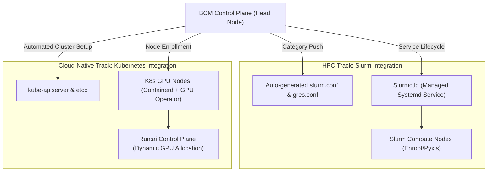

# Chapter 2 — NVIDIA Base Command Manager (BCM)

In a modern enterprise AI Factory, deploying and maintaining hundreds of accelerated compute nodes by hand—or even via fragmented ad-hoc automation scripts—is an operational anti-pattern. **NVIDIA Base Command Manager (BCM)** (the enterprise evolution of Bright Cluster Manager) serves as the foundational operating system of the AI cluster. It bridges raw bare-metal hardware (managed via BMCs and Redfish) to workload orchestrators (Slurm, Kubernetes, Run:ai).

As an **NVIDIA Senior Solutions Architect**, you must understand BCM not merely as a GUI or CLI tool, but as an **immutable infrastructure control plane**. You are expected to design high-availability head node topologies, engineer software images and category policies, orchestrate large-scale zero-downtime rolling upgrades, and automate hardware health gating.

---

## 1. BCM High-Level Architecture and Control Plane Topology

BCM operates on a hierarchical manager-agent architecture designed to eliminate single points of failure and scale across thousands of accelerated nodes.

```mermaid
flowchart TD
    subgraph ManagementCluster["BCM High-Availability Head Node Pair"]
        HN1["Active Head Node (HN-01)
        - CMDaemon (Primary)
        - Image Repository (/cm/images)
        - MariaDB Galera Cluster
        - DHCP / DNS / PXE / HTTPBoot
        - Slurmctld / K8s Control Plane"]
        
        HN2["Passive Head Node (HN-02)
        - CMDaemon (Standby)
        - Corosync / Pacemaker HA
        - DRBD / Shared Storage Replica
        - Slurmctld (Backup)"]
        
        HN1 <-->|Heartbeat & State Sync (DRBD / Galera)| HN2
    end

    VIP["Virtual IP (Cluster Management Gateway)"]
    HN1 --- VIP
    HN2 -.-> VIP

    subgraph Fabric["Out-of-Band & In-Band Management Fabrics"]
        OOB_NET["1GbE Out-of-Band Network (BMCs)"]
        MGMT_NET["10GbE/25GbE In-Band Provisioning Network"]
    end

    VIP --> OOB_NET
    VIP --> MGMT_NET

    subgraph NodeCategories["Declarative Node Categories"]
        subgraph Cat_Training["Category: dgx-h100-training"]
            T_NODE1["dgx-h100-01 (CMDaemon Agent)"]
            T_NODE2["dgx-h100-02 (CMDaemon Agent)"]
            T_NODE3["dgx-h100-32 (CMDaemon Agent)"]
        end

        subgraph Cat_Inference["Category: dgx-l40s-inference"]
            I_NODE1["dgx-l40s-01 (CMDaemon Agent)"]
            I_NODE2["dgx-l40s-16 (CMDaemon Agent)"]
        end
    end

    MGMT_NET --> Cat_Training
    MGMT_NET --> Cat_Inference
    OOB_NET -.->|Redfish/IPMI Power Control| Cat_Training
    OOB_NET -.->|Redfish/IPMI Power Control| Cat_Inference
```

### Core Components and Responsibilities

1. **Active/Passive Head Nodes**:
   - The head node orchestrates the cluster. Production AI clusters deploy two head nodes in an active/passive HA pair governed by **Corosync** and **Pacemaker** with an automated floating Virtual IP (VIP).
   - State synchronization relies on **DRBD** (Distributed Replicated Block Device) or enterprise shared storage for `/cm/shared` and `/cm/images`, paired with a **MariaDB** database storing all cluster topology, node parameters, and historical metrics.
   - If the active head node fails, Pacemaker promotes the standby head node, mounts the storage, starts CMDaemon, and resumes control in under 60 seconds without disrupting running GPU jobs.
2. **CMDaemon (Cluster Management Daemon)**:
   - The core engine running on both head nodes and every managed compute node.
   - The compute node CMDaemon handles local configuration application, monitors system health (temperatures, fans, ECC errors, network link state), and streams telemetry back to the head node.
3. **Software Images (`/cm/images`)**:
   - Complete OS root filesystems (golden images) stored on the head node. Nodes in a category boot or synchronize against these version-controlled directories.
4. **Node Categories**:
   - The primary abstraction unit in BCM. A category defines an operating template: assigned software image, kernel version, kernel boot parameters, network interface assignments, disk partitioning schemes, and workload manager roles (e.g., Slurm compute node vs. Kubernetes worker).

---

## 2. The BCM Object Model and Declarative State

In BCM, you never configure individual compute nodes manually. Instead, you operate on a hierarchical object tree:

```text
Cluster
├── Networks (Management, InfiniBand, Out-of-Band, Storage)
├── Software Images (rocky9-cuda12.4-v1, ubuntu22-cuda12.2-v3)
├── Node Categories (dgx-h100-prod, dgx-h100-canary, login-nodes)
│   ├── Assigned Software Image
│   ├── Kernel Boot Arguments (e.g., numa_balancing=0, iommu=pt)
│   ├── Workload Roles (Slurm Client, K8s Node)
│   └── Health Check Rulesets (DCGM, InfiniBand link checks)
└── Devices / Nodes (dgx-01 to dgx-64)
    ├── Hardware MAC & BMC IP
    └── Category Membership (inherits all category attributes)
```

### Navigating `cmsh` (Command Management Shell)

BCM provides `cmsh`, an interactive, hierarchical configuration shell. Below is a representative production session auditing and modifying category policies:

```bash
# Enter BCM management shell
$ cmsh

# Inspect available software images
[headnode]% softwareimage
[headnode->softwareimage]% list
Name                       Kernel Version             Path
-------------------------- -------------------------- ----------------------------------
rocky9-dgx-v1.0            5.14.0-362.8.1.el9_3       /cm/images/rocky9-dgx-v1.0
rocky9-dgx-v1.1-canary     5.14.0-427.18.1.el9_4      /cm/images/rocky9-dgx-v1.1-canary

# Inspect category parameters for production DGX H100s
[headnode->softwareimage]% ..
[headnode]% category use dgx-h100-prod
[headnode->category[dgx-h100-prod]]% show
Parameter                  Value
-------------------------- --------------------------------------------------------
Name                       dgx-h100-prod
Software image             rocky9-dgx-v1.0
Install mode               SYNCLOCAL (Stateful local NVMe installation)
Kernel arguments           console=tty0 console=ttyS0,115200n8 numa_balancing=0 iommu=pt
Nodes                      32
Workload managers          Slurm
Roles                      ComputeNode, DCGM-Exporter, InfiniBand-Node
```

---

## 3. Image Provisioning Mechanics: Stateless vs. Stateful

How an operating system image is delivered to hundreds of bare-metal servers dictates boot speed, network traffic, and cluster reliability. BCM supports three primary provisioning modes:

| Provisioning Mode | Mechanics | Advantages | Disadvantages & Operational Risk |
|---|---|---|---|
| **Stateless (RAM / tmpfs)** | Kernel and initrd are downloaded via HTTPBoot. The rootfs is loaded entirely into host RAM (tmpfs) or mounted read-only over NFS. | Instant rollback upon reboot; perfectly immutable; local disk failure does not stop the node from running. | Consumes 16GB–32GB of host RAM; rootfs writes are lost on reboot; network storms if 100+ nodes reboot simultaneously. |
| **Stateful (SYNCLOCAL / Disk-Full)** | Node boots a minimal provisioning kernel; the golden image is copied and written directly to local NVMe SSDs; node reboots from local disk. | Zero RAM overhead; node can boot independently even if head node network is temporarily degraded; fast local I/O. | Disk drift can occur if users write local files; reimaging requires streaming full image data over the network. |
| **Hybrid (Stateless Root + Local Caching)** | Read-only base OS loaded into memory or cached locally; local NVMe disks configured strictly as scratch storage (`/tmp`, `/scratch`, container cache). | Best of both worlds: guaranteed software immutability with maximum local storage performance for AI checkpoints. | Complex initial partitioning scripts; requires strict local scratch cleanup policies. |

### Mitigating Provisioning Storms at Scale (BitTorrent & Multicast)

When reimaging 128 DGX nodes (each requiring a 25GB golden image), traditional unicast HTTP or rsync would generate:
```text
Total Network Traffic = 128 nodes * 25 GB = 3.2 Terabytes
```
Saturating a single 25GbE head node interface would take over 20 minutes, leading to connection timeouts and failed boots.

**BCM's Production Solution:**
1. **Tree-Based / BitTorrent Distribution**: BCM leverages peer-to-peer distribution across compute nodes. The head node seeds the image to the first 4 nodes; those nodes immediately act as peers and seed the remaining nodes across leaf switches.
2. **Multicast Provisioning**: Uses UDP multicast to broadcast image chunks to all listening nodes simultaneously, reducing head node network load to a constant 25 GB payload, regardless of whether 10 or 1,000 nodes are being provisioned.

---

## 4. Workload Manager Integration: Slurm and Kubernetes Coexistence

A core strength of BCM in an AI Factory is its ability to provision and manage both **HPC/Slurm** and **Cloud-Native/Kubernetes** workload managers from the same control plane.



### 1. Slurm Automated Topology and GRES Generation

BCM queries the hardware topology of nodes via CMDaemon and automatically synthesizes consistent `slurm.conf` and `gres.conf` files:
- GPU models, counts, and PCIe/NVLink bus IDs are automatically populated into Generic Resources (`GRES`).
- Sockets, cores per socket, and threads are verified, preventing configuration drift where Slurm thinks a node has 128 cores when BIOS hyperthreading was disabled.

### 2. Kubernetes and Run:ai Deployment via BCM

BCM includes built-in roles for deploying certified Kubernetes clusters on bare metal:
- Provisions `kubeadm` or BCM's optimized Kubernetes packages.
- Deploys container runtimes (`containerd` with NVIDIA Container Toolkit pre-configured).
- Installs the **NVIDIA GPU Operator** to orchestrate driver containers, DCGM exporters, and device plugins.
- **Run:ai Layering**: Run:ai's cluster daemon is deployed directly onto the BCM-managed Kubernetes cluster, providing fractional GPU sharing, dynamic oversubscription, and sophisticated team quotas on top of bare-metal performance.

### 3. Dynamic Node Reallocation (Slurm $\leftrightarrow$ Kubernetes)

In an AI Factory, infrastructure flexibility is critical. You may need 100% of nodes running Slurm for a multi-week foundation model pre-training run, followed by shifting 30% of nodes to Kubernetes/Run:ai for interactive fine-tuning and inference serving.

**In BCM, this transition is declarative:**
```bash
# Reassign nodes 17 through 32 from Slurm to Kubernetes
$ cmsh
[headnode]% device
[headnode->device]% range dgx-017..dgx-032
[headnode->device[dgx-017..dgx-032]]% set category k8s-gpu-pool
[headnode->device[dgx-017..dgx-032]]% commit
# The nodes drain existing Slurm jobs, reboot into the k8s image, and register with kube-apiserver
```

---

## 5. BCM Health Management and Automated Remediation

In a multi-thousand GPU cluster, hardware degradation is a statistical certainty. If a job lands on a node with an uncorrectable ECC error or a failed NVLink, the entire distributed job will crash.

BCM provides an active **Health Checking Framework**:
- Health scripts run locally on compute nodes via CMDaemon (`/cm/local/apps/cmd/etc/healthcheck.d/`).
- Checks run at defined intervals (e.g., every 60 seconds) and during node boot/reprovisioning.

### Automated Node Quarantine Sequence

```mermaid
sequenceDiagram
    autonumber
    participant GPU as GPU 3 (SXM5)
    participant CMD as CMDaemon (Compute Node)
    participant HN as BCM Head Node
    participant Slurm as Slurm Controller (slurmctld)

    GPU->>CMD: NVML reports Double-Bit ECC Error (XID 48 / XID 79)
    Note over CMD: BCM Health Check "check_gpu_health" FAILS
    CMD->>HN: Alert: Node dgx-042 Health Status = UNHEALTHY (Metric: GPU_ECC_FAIL)
    HN->>Slurm: Execute Slurm Action: scontrol update NodeName=dgx-042 State=DRAIN Reason="BCM-Health: Double-bit ECC on GPU 3"
    Slurm-->>HN: Node Drained (Current job completes or checkpoints; no new jobs scheduled)
    HN->>HN: Trigger PagerDuty / Webhook notification to SA / Operations team
```

### Production Health Check Script (`check_nvlink.sh`)

```bash
#!/usr/bin/env bash
# /cm/local/apps/cmd/etc/healthcheck.d/check_nvlink.sh
# Exit 0 = HEALTHY, Exit 1 = WARNING, Exit 2 = CRITICAL/DRAIN

EXPECTED_LINKS=18 # 18 NVLinks per H100 SXM5 GPU
UNHEALTHY_GPUS=0

for i in {0..7}; do
    ACTIVE_LINKS=$(nvidia-smi nvlink --status -i $i | grep -c "Link.*: Active")
    if [ "$ACTIVE_LINKS" -lt "$EXPECTED_LINKS" ]; then
        echo "CRITICAL: GPU $i has only $ACTIVE_LINKS/$EXPECTED_LINKS active NVLinks!"
        UNHEALTHY_GPUS=$((UNHEALTHY_GPUS + 1))
    fi
done

if [ "$UNHEALTHY_GPUS" -gt 0 ]; then
    exit 2 # Triggers BCM automatic drain action
fi

echo "OK: All 8 GPUs report full NVLink mesh (18/18 links active)."
exit 0
```

---

## 6. Zero-Downtime Rolling Upgrade Architecture

Upgrading drivers, CUDA toolkits, or kernels across hundreds of production nodes requires a phased canary methodology.

```text
[Step 1: Clone Image]
  Head Node: cp -r /cm/images/prod-image-v1 /cm/images/prod-image-v2-canary

[Step 2: Chroot & Update]
  cm-chroot-image /cm/images/prod-image-v2-canary
  > dnf update -y kernel
  > dnf install -y nvidia-driver-550.90.07 cuda-12-4
  > dracut -f  # Regenerate initramfs with new NVIDIA kernel modules
  > exit

[Step 3: Canary Deployment (5% of Fleet)]
  Create Category: dgx-canary (Assigned Image: prod-image-v2-canary)
  Move 2 nodes into dgx-canary -> Drain Slurm -> Reboot into new image

[Step 4: Soak & Synthetic Stress Validation]
  Execute DCGM Level 3 Diagnostic (dcgmi diag -r 3)
  Run 2-node NCCL All-Reduce benchmark (all_reduce_perf)
  Soak for 24-48 hours under production training workload

[Step 5: Phased Fleet Promotion]
  Promote remaining nodes in 10% canary batches
  If error rate > 0%, immediately roll back category image pointer to v1
```

---

## 7. Senior Solutions Architect Interview Scenarios

### Scenario 1: Provisioning Network Saturation During Cluster Bring-Up
**Interviewer:** *"We are deploying a 256-node DGX H100 SuperPOD using BCM. During initial provisioning, nodes take over 45 minutes to pull the OS image, and 20% of nodes timeout and fail to boot. How do you re-architect the deployment?"*

**Candidate Answer:**
> "A 45-minute boot time with dropouts indicates head node network saturation and unicast exhaustion. 256 nodes pulling a 30GB image concurrently requires 7.6 TB of network throughput.
> 1. **Switch to Peer-to-Peer / BitTorrent Provisioning:** In BCM, I configure the category install mode to use BitTorrent or tree-based distribution instead of direct unicast rsync/HTTP. Compute nodes that have fetched image chunks immediately serve as seeds to adjacent nodes across the spine-leaf network.
> 2. **Leverage Multicast HTTPBoot:** If the leaf switches support PIM-SM and IGMP snooping, I enable BCM multicast provisioning. This streams the image payload once to all 256 nodes simultaneously, reducing head node egress to a constant 30GB.
> 3. **Implement Staggered Canary Provisioning:** I divide the 256 nodes into 4 provisioning waves of 64 nodes each, using BCM category groups, ensuring the head node’s DHCP and TFTP/HTTP servers are never overwhelmed."

---

### Scenario 2: Head Node Disaster Recovery and Database Brain-Split
**Interviewer:** *"The active BCM head node suffers a sudden catastrophic motherboard failure. How does BCM maintain cluster availability, and how do you prevent split-brain on the database and image store?"*

**Candidate Answer:**
> "BCM utilizes a high-availability architecture driven by Corosync and Pacemaker:
> 1. **Heartbeat and Quorum:** The two head nodes maintain redundant heartbeats across isolated physical interfaces. Pacemaker monitors health checks for CMDaemon, MariaDB, and NFS services.
> 2. **Split-Brain Prevention:** Pacemaker enforces STONITH (Shoot The Other Node In The Head) via out-of-band IPMI/Redfish fencing. The surviving node cuts power to the failed node before claiming the shared storage and virtual IP (VIP).
> 3. **State Consistency:** The MariaDB Galera database operates synchronously, ensuring zero committed data loss. The image repository (`/cm/images`) sits on replicated DRBD in synchronous dual-primary mode or an enterprise NAS/SAN.
> 4. **Compute Workload Isolation:** Critically, compute nodes and Slurm jobs continue executing uninterrupted even during the 45-second head node failover because the compute nodes run local daemons (`slurmd`, `containerd`) that do not require continuous head node connectivity."

---

## Key Takeaways

1. **Category-Driven Immutability:** BCM abstracts physical servers into categories. You manage golden software images and category policies, never individual node configurations.
2. **High-Availability Control Plane:** Production AI Factories require active/passive head node pairs with Corosync/Pacemaker, MariaDB Galera replication, and hardware fencing (STONITH).
3. **Optimized Image Distribution:** Large-scale clusters must utilize BitTorrent or Multicast provisioning to eliminate network saturation during cluster-wide re-imaging.
4. **Unified Slurm and Kubernetes Orchestration:** BCM seamlessly provisions Slurm HPC environments and bare-metal Kubernetes clusters (with NVIDIA GPU Operator and Run:ai), allowing dynamic capacity reallocation between the two.
5. **Proactive Health Gating:** Automated CMDaemon health scripts integrate with DCGM and NVML to detect degraded hardware (e.g., failed NVLinks or ECC double-bit errors) and immediately drain nodes from Slurm before jobs fail.
