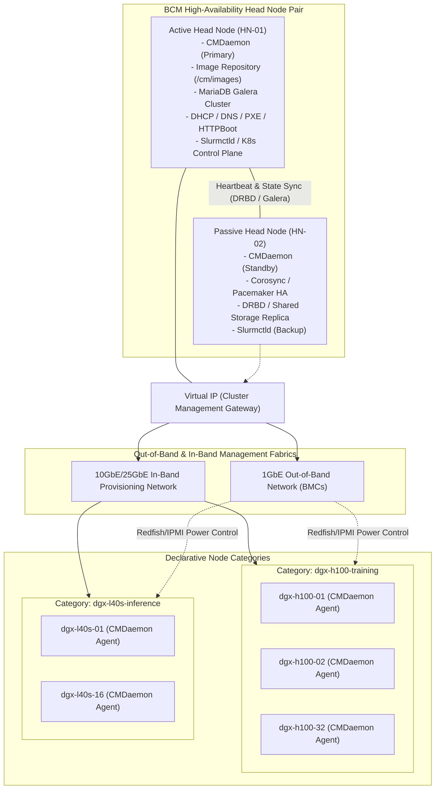
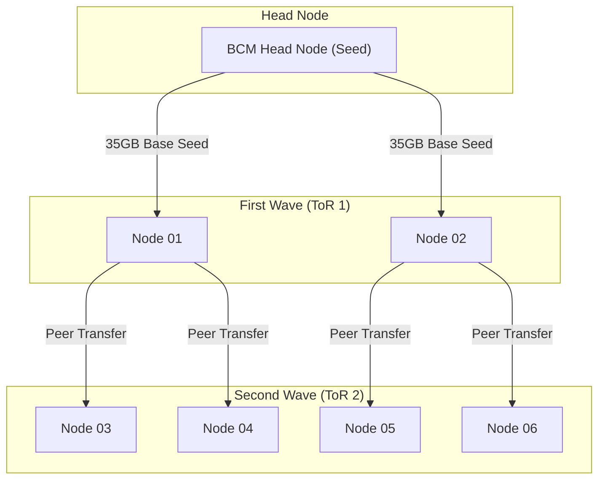
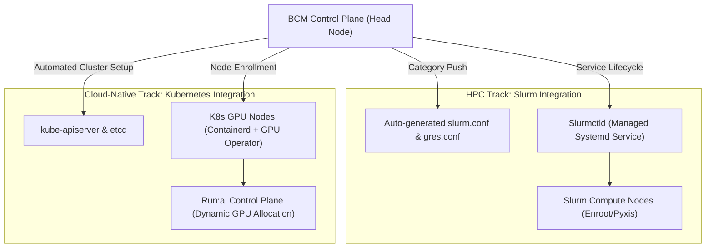
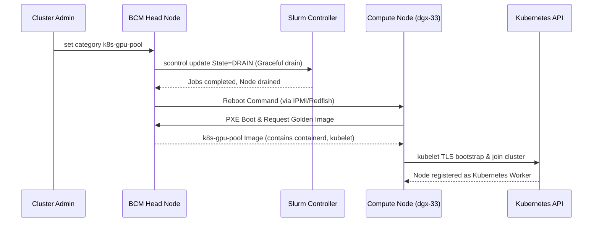

# Chapter 2 — NVIDIA Base Command Manager (BCM)

**Learning outcome:** Architect, deploy, configure, and safely operate an NVIDIA Base Command Manager (BCM) control plane for large-scale AI Factories. You will master the active/passive high-availability head node architecture, declarative category-based object models, software image provisioning mechanics (Stateless, Stateful, Overlay), network integration (InfiniBand, RoCE, Out-of-Band BMCs), workload orchestrator synchronization (Slurm, Kubernetes, Run:ai), and automated hardware health remediation using the `cmsh` CLI. 

**Prerequisites:** Familiarity with Linux command line, PXE/DHCP/DNS networking, fundamental high-availability concepts (Pacemaker, Corosync, DRBD), and basic understanding of GPU compute nodes.

**Difficulty:** Beginner to Advanced.

**Estimated reading time:** 120 minutes plus hands-on implementation practice.

---

## 1. Foundations: The Role of an AI Cluster Operating System

In a modern enterprise AI Factory, deploying and maintaining hundreds of accelerated compute nodes (e.g., NVIDIA DGX SuperPODs, OEM HGX reference architectures) by hand—or even via fragmented, ad-hoc automation scripts like raw Ansible loops—is an operational anti-pattern. 

Infrastructure configuration management tools (like Ansible, Puppet, or Chef) are highly effective for Day 2 configuration (installing packages, managing users). However, they are fundamentally inadequate for **Day 0 and Day 1 bare-metal lifecycle management**:
1. How does a brand-new, unformatted bare-metal node receive its initial operating system?
2. How do you simultaneously power-cycle 500 servers via their baseboard management controllers (BMCs)?
3. How do you prevent network saturation when 500 servers attempt to download a 30 GB OS image concurrently?
4. How do you dynamically inject the exact PCIe topology of an 8-GPU node into Slurm's `gres.conf` without manual transcription errors?

**NVIDIA Base Command Manager (BCM)** (the enterprise evolution of Bright Cluster Manager) solves these challenges. It serves as the foundational operating system of the AI cluster. It bridges raw bare-metal hardware (managed via BMCs, Redfish, and IPMI) to high-level workload orchestrators (Slurm, Kubernetes, Run:ai).

As an **NVIDIA Senior Solutions Architect**, you must understand BCM not merely as a GUI or CLI tool, but as an **immutable infrastructure control plane**. You are expected to design high-availability head node topologies, engineer software images and category policies, orchestrate large-scale zero-downtime rolling upgrades, and automate hardware health gating.

---

## 2. BCM High-Level Architecture and Control Plane Topology

BCM operates on a hierarchical manager-agent architecture designed to eliminate single points of failure and scale across thousands of accelerated nodes. 



### 2.1 Core Components and Responsibilities

1. **Active/Passive Head Nodes**:
   - The head node orchestrates the cluster. Production AI clusters **must** deploy two head nodes in an active/passive HA pair. This is governed by **Corosync** (cluster messaging) and **Pacemaker** (resource management) with an automated floating Virtual IP (VIP).
   - State synchronization relies on **DRBD** (Distributed Replicated Block Device) or enterprise shared storage (like NetApp or VAST) for `/cm/shared` and `/cm/images`.
   - A **MariaDB** cluster stores all cluster topology, node parameters, and historical metrics.
   - If the active head node fails, Pacemaker promotes the standby head node, mounts the storage, starts CMDaemon, and resumes control in under 60 seconds without disrupting running GPU jobs on compute nodes.
2. **CMDaemon (Cluster Management Daemon)**:
   - The core engine running on both head nodes and every managed compute node.
   - The head node CMDaemon provides the API, CLI (`cmsh`), and Web GUI. It acts as the central brain.
   - The compute node CMDaemon handles local configuration application, monitors system health (temperatures, fans, ECC errors, network link state), and streams telemetry back to the head node.
3. **Software Images (`/cm/images`)**:
   - Complete OS root filesystems (golden images) stored on the head node. Nodes in a category boot or synchronize against these version-controlled directories.
4. **Node Categories**:
   - The primary abstraction unit in BCM. A category defines an operating template: assigned software image, kernel version, kernel boot parameters, network interface assignments, disk partitioning schemes, and workload manager roles (e.g., Slurm compute node vs. Kubernetes worker).

---

## 3. Deep Dive: Head Node High Availability (HA) Mechanics

Operating an AI cluster requires five-nines (99.999%) uptime for the control plane. If the head node goes down permanently, new jobs cannot schedule, nodes cannot reboot, and telemetry is lost. 

### 3.1 The HA Software Stack

BCM abstracts standard Linux HA components but requires SREs to understand them when deep troubleshooting is needed:
* **Corosync:** Provides a robust multicast/unicast communication ring between `HN-01` and `HN-02`. It handles membership and quorum.
* **Pacemaker:** The cluster resource manager. It decides which node should host the VIP, the primary DRBD volume, the MariaDB active instance, and the BCM `cmd` service.
* **DRBD (Distributed Replicated Block Device):** A network block device that synchronously mirrors the `/cm/shared` and `/cm/images` partitions across the two head nodes.

### 3.2 Pacemaker Resource Status (crm_mon)

When logged into an active head node, you can view the state of the Pacemaker cluster using the native `crm status` or `crm_mon` commands:

```text
# crm status
Cluster Summary:
  * Stack: corosync
  * Current DC: headnode01 (version 2.0.5-10.el8) - partition with quorum
  * Last updated: Thu Sep 17 14:22:01 2026
  * Last change:  Wed Sep 16 09:15:00 2026 by root via crm_attribute on headnode01
  * 2 nodes configured
  * 15 resource instances configured

Node List:
  * Online: [ headnode01 headnode02 ]

Full List of Resources:
  * Clone Set: pingd-clone [pingd]
    * Started: [ headnode01 headnode02 ]
  * Master/Slave Set: drbd_data_clone [drbd_data]
    * Masters: [ headnode01 ]
    * Slaves: [ headnode02 ]
  * Resource Group: bcm-services
    * fs_data  (ocf::heartbeat:Filesystem): Started headnode01
    * vip_internal     (ocf::heartbeat:IPaddr2):    Started headnode01
    * vip_external     (ocf::heartbeat:IPaddr2):    Started headnode01
    * cmd_service      (systemd:cmd):               Started headnode01
    * mariadb_service  (systemd:mariadb):           Started headnode01
    * dhcpd_service    (systemd:dhcpd):             Started headnode01
    * slurmctld_service(systemd:slurmctld):         Started headnode01
```

### 3.3 STONITH and Split-Brain Prevention

:::danger
A **split-brain** scenario occurs when the Corosync heartbeat network link between `HN-01` and `HN-02` breaks, but both nodes are still running. If both nodes promote themselves to Active, they will both attempt to mount the DRBD filesystem and write to it, causing immediate and catastrophic filesystem corruption.
:::

To prevent this, BCM implements **STONITH** (Shoot The Other Node In The Head), also known as Fencing. 

```xml
<!-- Example Pacemaker CIB fencing configuration -->
<primitive id="fence_hn01" class="stonith" type="fence_ipmilan">
  <instance_attributes id="fence_hn01-instance_attributes">
    <nvpair id="fence_hn01-ipaddr" name="ipaddr" value="10.1.0.101"/>
    <nvpair id="fence_hn01-login" name="login" value="admin"/>
    <nvpair id="fence_hn01-passwd" name="passwd" value="SecureBMC_Pass!"/>
    <nvpair id="fence_hn01-action" name="action" value="reboot"/>
  </instance_attributes>
</primitive>
```

If `HN-01` loses contact with `HN-02`, before `HN-01` does *anything*, it uses the Out-of-Band (BMC/IPMI) network to issue a hard power-off command to `HN-02`. Only after receiving confirmation that `HN-02` is physically powered down will `HN-01` assume the Active role.

---

## 4. The Declarative Object Model: `cmsh` Masterclass

In BCM, you never SSH into individual compute nodes to manually edit `/etc/fstab` or `/etc/network/interfaces`. Instead, you operate on a hierarchical object tree via the **Command Management Shell (`cmsh`)**.

```text
Cluster Object Tree
├── Networks (Management, InfiniBand, Out-of-Band, Storage)
├── Software Images (rocky9-cuda12.4-v1, ubuntu22-cuda12.2-v3)
├── Node Categories (dgx-h100-prod, dgx-h100-canary, login-nodes)
│   ├── Assigned Software Image
│   ├── Kernel Boot Arguments (e.g., numa_balancing=0, iommu=pt)
│   ├── Workload Roles (Slurm Client, K8s Node)
│   └── Health Check Rulesets (DCGM, InfiniBand link checks)
└── Devices / Nodes (dgx-01 to dgx-64)
    ├── Hardware MAC & BMC IP
    └── Category Membership (inherits all category attributes)
```

### 4.1 Navigating `cmsh` and Configuring Categories

`cmsh` is modal and hierarchical, much like the Cisco IOS or Juniper Junos CLI.

```bash
# Enter BCM management shell
$ cmsh

# Inspect available software images
[headnode]% softwareimage
[headnode->softwareimage]% list
Name                       Kernel Version             Path
-------------------------- -------------------------- ----------------------------------
rocky9-dgx-v1.0            5.14.0-362.8.1.el9_3       /cm/images/rocky9-dgx-v1.0
rocky9-dgx-v1.1-canary     5.14.0-427.18.1.el9_4      /cm/images/rocky9-dgx-v1.1-canary

# Move up the tree and enter the category sub-mode
[headnode->softwareimage]% ..
[headnode]% category use dgx-h100-prod

# Display all configuration parameters for the category
[headnode->category[dgx-h100-prod]]% show
Parameter                  Value
-------------------------- --------------------------------------------------------
Name                       dgx-h100-prod
Software image             rocky9-dgx-v1.0
Install mode               SYNCLOCAL
Kernel arguments           console=tty0 console=ttyS0,115200n8 numa_balancing=0 iommu=pt
Nodes                      32
Workload managers          Slurm
Roles                      ComputeNode, DCGM-Exporter, InfiniBand-Node

# Modifying a Category attribute (e.g., changing the installation mode)
[headnode->category[dgx-h100-prod]]% set installmode FULL
[headnode->category[dgx-h100-prod]*]% commit
```

### 4.2 Extracting and Versioning Configurations with `cm-dump`

Infrastructure as Code (IaC) principles demand that cluster states be versioned in Git. While `cmsh` is interactive, BCM supports dumping its entire database or specific sub-trees into XML or JSON for backup and CI/CD integration.

```bash
# Dump the entire network topology configuration to XML
$ cmsh -c "network; dump" > /root/backups/bcm_network_topology.xml
```

*Example XML Output (`bcm_network_topology.xml`):*
```xml
<?xml version="1.0"?>
<cmConfig>
  <Network>
    <name>internalnet</name>
    <baseAddress>10.141.0.0</baseAddress>
    <broadcastAddress>10.141.255.255</broadcastAddress>
    <domainName>cm.cluster</domainName>
    <gateway>10.141.0.1</gateway>
    <ipv6>no</ipv6>
    <mtu>9000</mtu>
    <netmask>255.255.0.0</netmask>
    <notes>Primary high-speed provisioning and management fabric</notes>
  </Network>
  <Network>
    <name>ibnet</name>
    <baseAddress>10.142.0.0</baseAddress>
    <broadcastAddress>10.142.255.255</broadcastAddress>
    <domainName>ib.cluster</domainName>
    <ipv6>no</ipv6>
    <mtu>4092</mtu>
    <netmask>255.255.0.0</netmask>
    <notes>InfiniBand IPoIB Network for GPUDirect RDMA</notes>
  </Network>
</cmConfig>
```

These XML files can be stored in a Git repository. To restore or replicate the configuration on a new cluster:
```bash
$ cmsh -c "load /root/backups/bcm_network_topology.xml"
```

---

## 5. Software Images and Provisioning Mechanics

How an operating system image is delivered to hundreds of bare-metal servers dictates boot speed, network traffic, and cluster reliability. 

### 5.1 Image Storage and Modification (`cm-chroot-image`)

A "Software Image" in BCM is a literal directory tree on the head node (e.g., `/cm/images/rocky9-dgx-v1.0/`). It contains a full Linux filesystem (`/etc`, `/usr`, `/var`, `/opt`).

You do not SSH into a compute node to install packages. You install them into the image on the head node.

```bash
# Safely mount bind mounts (/dev, /proc, /sys) and chroot into the golden image
$ cm-chroot-image /cm/images/rocky9-dgx-v1.0

# You are now "inside" the golden image context
(chroot) [root@headnode01 /]# dnf install -y htop tcpdump nvme-cli
(chroot) [root@headnode01 /]# systemctl enable dcgm-exporter
(chroot) [root@headnode01 /]# exit

# Tell CMDaemon that the image has been modified so it updates the checksums
$ cmsh -c "softwareimage use rocky9-dgx-v1.0; commit"
```

### 5.2 Provisioning Modes: Stateless vs. Stateful

BCM supports three primary provisioning modes for AI Factories:

| Provisioning Mode | Mechanics | Advantages | Disadvantages & Operational Risk |
|---|---|---|---|
| **Stateless (RAM / tmpfs)** | Kernel and initrd downloaded via HTTPBoot. Rootfs loaded entirely into host RAM (`tmpfs`) or mounted read-only over NFS. | Instant rollback upon reboot; perfectly immutable; local disk failure does not stop node. | Consumes 16GB–32GB of host RAM; rootfs writes lost on reboot; network storms if 100+ nodes reboot simultaneously. |
| **Stateful (SYNCLOCAL)** | Node boots a minimal provisioning kernel; the golden image is synchronized via rsync directly to local NVMe SSDs; node reboots from local disk. | Zero RAM overhead; node can boot independently even if head node network is down; fast local I/O. | Disk drift can occur if users write local files; reimaging requires streaming full image data over the network. |
| **Hybrid (Stateless Root + Local Caching)** | Read-only base OS loaded into memory or cached locally; local NVMe disks configured strictly as scratch storage (`/tmp`, `/scratch`). | Guaranteed software immutability with maximum local storage performance for AI checkpoints. | Complex initial partitioning scripts; requires strict local scratch cleanup policies via Slurm prolog/epilog. |

### 5.3 Mitigating Provisioning Storms at Scale (BitTorrent)

:::warning
When reimaging 256 DGX H100 nodes (each requiring a 35 GB golden image), traditional unicast HTTP or rsync generates massive network storms. Saturating a single 25GbE head node interface would take over 50 minutes, leading to connection timeouts, failed DHCP leases, and kernel panics.
:::

Total Network Traffic = 256 nodes * 35 GB = 8.96 Terabytes

**BCM's Production Solution: BitTorrent / Tree-Based Provisioning**

BCM integrates a built-in BitTorrent tracker in CMDaemon. 
1. The head node seeds the 35GB image to the first 4 nodes.
2. Those 4 nodes immediately act as peers, seeding the chunks to 16 other nodes.
3. Distribution cascades across the spine-leaf network. The head node network load remains constant at 35 GB, while the cluster provisions itself utilizing massive bisectional Top-of-Rack switch bandwidth.



To enable BitTorrent for a category:
```bash
$ cmsh
[headnode]% category use dgx-h100-prod
[headnode->category[dgx-h100-prod]]% set installmode BITTORRENT
[headnode->category[dgx-h100-prod]]% commit
```

---

## 6. Large-Scale AI Factory Network Configuration

An AI node typically has multiple network interfaces serving distinct roles. BCM manages this complexity through its declarative network topology.

A standard NVIDIA DGX H100 node requires:
* `eth0` / `enp1s0`: 1GbE Out-of-Band (BMC/Redfish).
* `eth1` / `enp2s0`: 25GbE In-Band Provisioning and Slurm Management.
* `ib0` to `ib7`: 8x 400 Gbps InfiniBand (NDR) or RoCE adapters for GPUDirect RDMA.

### 6.1 Configuring GPUDirect RDMA Interfaces via `cmsh`

You must assign IP addresses and InfiniBand configurations across all nodes. Doing this manually is impossible. BCM automates this using **Node Cloning** and **Device Ranges**.

```bash
$ cmsh
[headnode]% device
# Define the range of the first 32 DGX nodes
[headnode->device]% range dgx-01..dgx-32

# Enter the interfaces sub-menu for all 32 nodes simultaneously!
[headnode->device[dgx-01..dgx-32]]% interfaces

# Create the first InfiniBand/RoCE network interface (ib0)
[headnode->device[dgx-01..dgx-32]->interfaces]% add ib0
[headnode->device[dgx-01..dgx-32]->interfaces[ib0]]% set network ibnet1
[headnode->device[dgx-01..dgx-32]->interfaces[ib0]]% set ip 10.142.1.X # X denotes auto-increment
[headnode->device[dgx-01..dgx-32]->interfaces[ib0]]% commit
```
*Notice the `X` in the IP address.* BCM intelligently auto-increments the final octet for each node in the range, mapping `dgx-01` to `10.142.1.1`, `dgx-02` to `10.142.1.2`, and so on.

### 6.2 Kernel Tuning for AI Workloads

AI workloads rely heavily on zero-copy DMA (Direct Memory Access) bypassing the CPU entirely. Certain default Linux kernel behaviors aggressively interfere with this. BCM applies kernel boot arguments universally via the Category configuration.

```bash
[headnode]% category use dgx-h100-prod
[headnode->category[dgx-h100-prod]]% append kernelparameters " numa_balancing=0 iommu=pt "
[headnode->category[dgx-h100-prod]]% commit
```

**Why these specific parameters?**
* `numa_balancing=0`: Disables the Linux kernel's automatic NUMA page migration. In PyTorch distributed training, data is precisely pinned to specific NUMA nodes nearest to specific GPUs. The kernel attempting to "helpfully" move this memory destroys performance.
* `iommu=pt` (Pass-Through): Tells the IOMMU to allow device drivers (like the NVIDIA OpenRM driver and MOFED) direct access to memory without translating addresses through the IOMMU translation tables, drastically reducing latency for GPUDirect RDMA operations.

---

## 7. Workload Manager Integration: Slurm and Kubernetes

A core strength of BCM is its ability to provision and manage both **HPC/Slurm** and **Cloud-Native/Kubernetes** workload managers from the same control plane, guaranteeing that hardware specifications match scheduler configurations exactly.



### 7.1 Slurm Automated Topology and GRES Generation

If you configure Slurm manually, you must hand-write the `/etc/slurm/gres.conf` file mapping exactly which GPU sits on which PCIe bus, nearest to which CPU socket. A single typo degrades inter-GPU NVLink traffic.

BCM queries the hardware topology of nodes via the CMDaemon agent upon boot, and automatically synthesizes consistent `slurm.conf` and `gres.conf` files, pushing them to the head node's `slurmctld`.

*Example of BCM Auto-Generated `gres.conf` (DO NOT EDIT MANUALLY):*
```text
# /cm/shared/apps/slurm/var/etc/gres.conf
# AUTOGENERATED BY BCM - ANY MANUAL CHANGES WILL BE OVERWRITTEN
NodeName=dgx-01 Name=gpu Type=h100 File=/dev/nvidia0 COREs=0-15,64-79
NodeName=dgx-01 Name=gpu Type=h100 File=/dev/nvidia1 COREs=0-15,64-79
NodeName=dgx-01 Name=gpu Type=h100 File=/dev/nvidia2 COREs=16-31,80-95
NodeName=dgx-01 Name=gpu Type=h100 File=/dev/nvidia3 COREs=16-31,80-95
```

### 7.2 Dynamic Node Reallocation (Slurm $\leftrightarrow$ Kubernetes)

:::info
In an AI Factory, infrastructure flexibility is critical. You may need 100% of nodes running Slurm for a multi-week foundation model pre-training run, followed by shifting 30% of nodes to Kubernetes for interactive fine-tuning (Jupyter) and inference serving (Triton/vLLM).
:::

**In BCM, this transition is declarative and fully automated:**
```bash
# Reassign nodes 33 through 64 from the Slurm category to the Kubernetes category
$ cmsh
[headnode]% device
[headnode->device]% range dgx-33..dgx-64
[headnode->device[dgx-33..dgx-64]]% set category k8s-gpu-pool
[headnode->device[dgx-33..dgx-64]]% commit
```



*What happens next?* 
1. BCM issues an API call to Slurm to drain nodes 33-64.
2. Once jobs complete, CMDaemon reboots the nodes.
3. The nodes PXE boot, pull the `k8s-gpu-pool` golden image, configure `containerd`, and register directly with the `kube-apiserver` as active GPU nodes.

---

## 8. BCM Health Management and Automated Remediation

In a multi-thousand GPU cluster, hardware degradation is a statistical certainty. If a job lands on a node with an uncorrectable ECC error or a failed NVLink, the entire distributed job (which might span 1,024 GPUs) will crash, wasting thousands of dollars in compute time.

BCM provides an active **Health Checking Framework**:
- Health scripts run locally on compute nodes via CMDaemon (`/cm/local/apps/cmd/etc/healthcheck.d/`).
- Checks run at defined intervals (e.g., every 60 seconds) and during node boot/reprovisioning.

### 8.1 Automated Node Quarantine Sequence

```mermaid
sequenceDiagram
    autonumber
    participant GPU as GPU 3 (SXM5)
    participant CMD as CMDaemon (Compute Node)
    participant HN as BCM Head Node
    participant Slurm as Slurm Controller (slurmctld)

    GPU->>CMD: NVML reports Double-Bit ECC Error (XID 48 / XID 79)
    Note over CMD: BCM Health Check "check_gpu_health" FAILS
    CMD->>HN: Alert: Node dgx-042 Health Status = UNHEALTHY (Metric: GPU_ECC_FAIL)
    HN->>Slurm: Execute Slurm Action: scontrol update NodeName=dgx-042 State=DRAIN Reason="BCM-Health: Double-bit ECC on GPU 3"
    Slurm-->>HN: Node Drained (Current job completes or checkpoints; no new jobs scheduled)
    HN->>HN: Trigger PagerDuty / Webhook notification to SA / Operations team
```

### 8.2 Production Health Check Script (`check_nvlink.sh`)

You will frequently write custom bash/python scripts for specific hardware edge cases. Here is a production-grade script that verifies all 18 NVLinks per H100 GPU are active before allowing the node to accept jobs.

```bash
#!/usr/bin/env bash
# /cm/local/apps/cmd/etc/healthcheck.d/check_nvlink.sh
# Exit 0 = HEALTHY, Exit 1 = WARNING, Exit 2 = CRITICAL/DRAIN

# NVIDIA H100 SXM5 GPUs have exactly 18 NVLinks per GPU
EXPECTED_LINKS=18 
UNHEALTHY_GPUS=0

# Ensure nvidia-smi is available
if ! command -v nvidia-smi &> /dev/null; then
    echo "CRITICAL: nvidia-smi not found. NVIDIA driver not loaded."
    exit 2
fi

for i in {0..7}; do
    # Query NVLink status for GPU $i
    ACTIVE_LINKS=$(nvidia-smi nvlink --status -i $i | grep -c "Link.*: Active")
    
    if [ "$ACTIVE_LINKS" -lt "$EXPECTED_LINKS" ]; then
        echo "CRITICAL: GPU $i has only $ACTIVE_LINKS/$EXPECTED_LINKS active NVLinks!"
        UNHEALTHY_GPUS=$((UNHEALTHY_GPUS + 1))
    fi
done

if [ "$UNHEALTHY_GPUS" -gt 0 ]; then
    # Returning exit code 2 triggers BCM's automatic "Drain" action in Slurm
    exit 2 
fi

echo "OK: All 8 GPUs report full NVLink mesh (18/18 links active)."
exit 0
```

---

## 9. Zero-Downtime Rolling Upgrade Architecture

Upgrading NVIDIA drivers, CUDA toolkits, or kernels across hundreds of production nodes requires a phased, strict **canary methodology** orchestrated by BCM. You do *not* run `yum update` globally.

**The 5-Step Immutable Upgrade Process:**

1. **Clone the Immutable Image:**
   ```bash
   $ cmsh -c "softwareimage clone rocky9-dgx-v1.0 rocky9-dgx-v2-canary"
   ```

2. **Chroot and Update the New Image:**
   ```bash
   $ cm-chroot-image /cm/images/rocky9-dgx-v2-canary
   (chroot) [root@headnode01 /]# dnf update -y kernel
   (chroot) [root@headnode01 /]# dnf install -y nvidia-driver-550.90.07 cuda-12-4
   (chroot) [root@headnode01 /]# dracut -f  # Regenerate initramfs with new modules
   (chroot) [root@headnode01 /]# exit
   ```

3. **Canary Deployment (5% of Fleet):**
   Create a new category pointing to the new image, and move a few nodes into it.
   ```bash
   $ cmsh
   [headnode]% category clone dgx-h100-prod dgx-h100-canary
   [headnode->category[dgx-h100-canary]]% set softwareimage rocky9-dgx-v2-canary
   [headnode->category[dgx-h100-canary]]% commit
   [headnode]% device range dgx-01..dgx-04
   [headnode->device[dgx-01..dgx-04]]% set category dgx-h100-canary
   [headnode->device[dgx-01..dgx-04]]% commit
   ```
   *Nodes 1-4 drain from Slurm, reboot, provision the new image, and rejoin.*

4. **Soak & Synthetic Stress Validation:**
   Run the NVIDIA Datacenter GPU Manager (DCGM) Level 3 Diagnostic on the canary nodes.
   ```bash
   $ pdsh -w dgx-[01-04] "dcgmi diag -r 3"
   ```
   Run a 4-node NCCL All-Reduce benchmark (`all_reduce_perf`) to verify IB throughput. Soak for 24-48 hours under a real training workload.

5. **Phased Fleet Promotion:**
   If the error rate is zero, update the primary production category to point to the new image, and issue rolling reboots via Slurm maintenance reservations. If failures occur, rollback is instantaneous: simply point the category back to `rocky9-dgx-v1.0` and reboot.

---

## 10. Senior Solutions Architect Troubleshooting Scenarios

### Scenario 1: Provisioning Network Saturation During Cluster Bring-Up

**Interviewer:** *"We are deploying a 1,024-node DGX H100 SuperPOD using BCM. During initial provisioning, nodes take over 60 minutes to pull the OS image, DHCP leases are timing out, and 30% of nodes fail to boot entirely. How do you re-architect the deployment?"*

**Candidate Answer:**
> "A 60-minute boot time with dropouts at that scale indicates severe head node network saturation, unicast exhaustion, and potential ARP table overflows on the provisioning switch.
> 1. **Switch to Peer-to-Peer / BitTorrent Provisioning:** In BCM, I configure the category install mode to use `BITTORRENT` instead of direct unicast `SYNCLOCAL`. The head node seeds chunks to the first set of Top-of-Rack (ToR) switches, and compute nodes distribute the chunks horizontally, utilizing massive non-blocking spine-leaf bandwidth rather than head node egress.
> 2. **Leverage Multicast HTTPBoot:** If the network fabric explicitly supports PIM-SM and IGMP snooping, I enable BCM multicast provisioning. This streams the image payload exactly once to all 1,024 nodes simultaneously via UDP, reducing head node network egress to a constant 35 GB.
> 3. **Implement Staggered Canary Provisioning:** I divide the 1,024 nodes into provisioning waves of 128 nodes each using BCM node groups. This ensures the head node’s MariaDB connection pools, DHCP daemon, and TFTP/HTTP servers are never overwhelmed."

---

### Scenario 2: Head Node Disaster Recovery and Database Brain-Split

**Interviewer:** *"The active BCM head node (HN-01) suffers a sudden catastrophic motherboard failure. How does BCM maintain cluster availability, and how do you prevent split-brain on the database and image store?"*

**Candidate Answer:**
> "BCM utilizes a high-availability architecture driven by Corosync and Pacemaker:
> 1. **Heartbeat and Quorum:** The two head nodes maintain redundant Corosync heartbeats across isolated physical interfaces (e.g., eth0 and eth1). Pacemaker monitors health checks for CMDaemon, MariaDB, and NFS services.
> 2. **Split-Brain Prevention (Fencing):** Pacemaker enforces STONITH (Shoot The Other Node In The Head) via out-of-band IPMI/Redfish fencing. The surviving node (`HN-02`) issues a power-off command to `HN-01` over the BMC network. **Crucially, it will not assume control until it receives confirmation that HN-01 is dead.** This absolutely prevents two nodes from mounting the DRBD block device simultaneously.
> 3. **State Consistency:** The image repository (`/cm/images`) and database (`/cm/shared`) sit on a DRBD block device operating in synchronous dual-primary or active/passive mode.
> 4. **Compute Workload Isolation:** Compute nodes and Slurm jobs continue executing uninterrupted even during the 45-second head node failover because the compute nodes run local daemons (`slurmd`, `containerd`) that buffer state and do not require continuous head node connectivity."

---

### Scenario 3: DCGM Page Retirement Looping

**Interviewer:** *"You notice a DGX node is flapping in and out of the 'DRAIN' state in Slurm every 15 minutes. The BCM health check logs indicate an ECC error, but the node passes diagnostics upon reboot. What is happening and how do you fix it?"*

**Candidate Answer:**
> "This is a classic 'Page Retirement Loop' caused by dynamic memory row mapping.
> When the GPU encounters a double-bit ECC error, the NVIDIA driver attempts to dynamically retire that memory page. BCM's CMDaemon detects the XID 48/79 error in syslog or NVML, flags the node as unhealthy, and drains it in Slurm.
> The automated remediation script then reboots the node. Upon reboot, the NVIDIA driver initializes, the faulty page is marked offline in the firmware frame buffer, and NVML reports 'Healthy'. BCM puts the node back online.
> However, under extreme heavy AI training load, adjacent memory rows on the same physical DIMM degrade, triggering another ECC error 15 minutes later, starting the cycle over.
> **The Fix:** I would manually intervene in BCM:
> ```bash
> $ cmsh -c "device use dgx-101; set status drain; commit"
> ```
> This prevents BCM from auto-resuming it. I would then run a long-duration `dcgmi diag -r 4` (Level 4, which takes hours) to permanently fail the hardware, extract the Field Replaceable Unit (FRU) logs via BCM's hardware tab, and open an RMA with NVIDIA Enterprise Support."

---

## Key Takeaways

1. **Category-Driven Immutability:** BCM abstracts physical servers into categories. You manage golden software images and category policies on the head node, never individual compute node configurations.
2. **High-Availability Control Plane:** Production AI Factories require active/passive head node pairs with Corosync/Pacemaker, DRBD replication, and strict hardware fencing (STONITH) to prevent split-brain data corruption.
3. **Optimized Image Distribution:** Large-scale clusters must utilize BitTorrent or Multicast provisioning to eliminate head-node network saturation during cluster-wide re-imaging.
4. **Unified Slurm and Kubernetes Orchestration:** BCM seamlessly provisions Slurm HPC environments and bare-metal Kubernetes clusters (with NVIDIA GPU Operator and Run:ai), allowing dynamic capacity reallocation between the two by simply changing a node's category.
5. **Proactive Health Gating:** Automated CMDaemon health scripts integrate with DCGM and NVML to detect degraded hardware (e.g., failed NVLinks or ECC double-bit errors) and immediately drain nodes from Slurm before distributed jobs fail.


## 11. BCM vs. Ansible: The Exact Boundary of Responsibilities

A common architectural trap for new AI platform teams is attempting to use Ansible for Day-0 bare-metal provisioning (which it is poor at) or attempting to use BCM to manage complex Day-2 application logic (which is clunky).

```mermaid
flowchart LR
    subgraph Day0["Day 0: NVIDIA BCM (Bare-Metal OS)"]
        PXE["PXE / UEFI Boot"]
        IMAGE["Golden OS Image Deployment"]
        NET_INIT["Base Network Initialization (IPoIB)"]
        KERNEL["Kernel Boot Parameters"]
    end

    subgraph Day1["Day 1: Ansible (Configuration & Daemons)"]
        LDAP["Active Directory / LDAP Bindings"]
        PROM["Prometheus Node Exporters"]
        TUNE["Sysctl Tuning (TCP/IP)"]
        DOCKER["Container Runtime Configs"]
    end

    subgraph Day2["Day 2: Slurm / K8s (Workload)"]
        SCHED["Job Scheduling"]
        MPI["MPI Runtimes"]
        NVIDIA_D["NVIDIA Container Toolkit"]
    end

    Day0 -->|CMDaemon Hands off| Day1
    Day1 -->|Systemd Services Started| Day2
```



### The Architectural Division of Responsibilities

| Responsibility Domain | Primary Tool | Why This Boundary Exists |
|---|---|---|
| **OS Provisioning & Disk Partitioning** | **NVIDIA BCM** | Bare-metal PXE booting, golden image management, and BitTorrent provisioning. |
| **Initial Network Interface Setup (IPs, MTU)** | **NVIDIA BCM** | BCM's internal DHCP and DNS depend on its central IPAM database. |
| **Kernel Parameters (`numa_balancing`)** | **NVIDIA BCM** | Configured via BCM Category so they are injected at boot via GRUB. |
| **Active Directory / SSSD Configuration** | **Ansible** | Easier to manage complex LDAP bind templates and TLS certificates via Jinja2. |
| **Prometheus / Grafana Exporters** | **Ansible** | Easy to deploy standard RPM/DEB packages and configure systemd units. |
| **NVIDIA Driver & MOFED Installation** | **BCM** (in Image) | Kernel module compilation and package management require live OS execution, best done inside the `cm-chroot-image`. |
| **Slurm Cluster Management** | **BCM** | BCM natively generates `/etc/slurm/slurm.conf` and synchronizes Munge keys automatically. |
| **Custom Day-2 User Environment Setup** | **Ansible** | Creating specific Anaconda environments, NFS user mounts, and SSH keys. |

---

## 12. Deep Dive: The Bare-Metal Boot Sequence (Trace Analysis)

To troubleshoot nodes that "hang on boot", a Senior Solutions Architect must understand the exact protocol flow of a BCM provisioned node.

1. **Power On (BMC/Redfish):** BCM head node sends an IPMI `chassis power on` or Redfish POST request to the DGX BMC.
2. **UEFI Network Boot:** The DGX node initializes the ConnectX-7 NIC and broadcasts a DHCPDISCOVER.
3. **DHCP Offer (Head Node):** `dhcpd` on the head node responds with an IP address (from the Category range) and the "next-server" IP (the head node).
4. **TFTP / HTTPBoot:** The node downloads the UEFI bootloader (`grubx64.efi`) and the GRUB menu configuration file via TFTP.
5. **GRUB Execution:** The node reads the BCM-generated GRUB config, which instructs it to download the Linux kernel (`vmlinuz`) and the initial RAM disk (`initramfs`) via fast HTTP.
6. **Kernel Initialization:** The kernel boots, loads essential modules (e.g., ext4, network drivers), and executes the BCM provisioning script inside the initramfs.
7. **Image Transfer (SYNCLOCAL mode):** The initramfs script establishes a connection to the CMDaemon on the head node, verifies disk partitioning, and initiates an `rsync` or `BitTorrent` pull of the golden image into the local NVMe drive.
8. **Pivot Root:** Once the image is copied, the initramfs executes a `pivot_root` or `chroot` into the newly populated NVMe disk.
9. **Systemd Boot:** Standard Linux boot continues (systemd starts `sshd`, `slurmd`, `containerd`).
10. **CMDaemon Registration:** The local `cmd` process starts, connects to the head node on port 8081, and reports `Node status: UP`.

*Example Syslog Snippet (Head Node) during Boot:*
```text
Sep 17 08:12:04 headnode01 dhcpd[1234]: DHCPDISCOVER from 00:11:22:33:44:55 via eth1
Sep 17 08:12:04 headnode01 dhcpd[1234]: DHCPOFFER on 10.141.1.10 to 00:11:22:33:44:55 via eth1
Sep 17 08:12:06 headnode01 in.tftpd[1235]: RRQ from 10.141.1.10 filename grubx64.efi
Sep 17 08:12:15 headnode01 httpd[1236]: "GET /image/rocky9-dgx-v1.0/boot/vmlinuz HTTP/1.1" 200
Sep 17 08:14:30 headnode01 cmd[999]: Node dgx-010 provisioning complete (SYNCLOCAL).
Sep 17 08:15:12 headnode01 cmd[999]: Node dgx-010 state changed from PROVISIONING to UP.
```

---

## 13. Advanced Slurm Integration: Epilog Storage Cleanup

When running stateful workloads (where jobs write massive checkpoint files to local NVMe scratch space `/tmp` or `/scratch`), you must guarantee that one job's data is wiped before the next job starts. If you rely on users to clean up, the NVMe drives will fill up, and subsequent jobs will crash with `No space left on device`.

BCM allows you to configure Slurm Prolog and Epilog scripts directly via `cmsh`.

### Slurm Epilog Script Generation via BCM

```bash
$ cmsh
[headnode]% wlm
[headnode->wlm]% slurm
[headnode->wlm[slurm]]% set epilogscript /cm/shared/apps/slurm/scripts/epilog.sh
[headnode->wlm[slurm]]% commit
```

*The Epilog Script (`/cm/shared/apps/slurm/scripts/epilog.sh`):*
```bash
#!/bin/bash
# Slurm Epilog Script: Executes as root on the compute node AFTER the job completes.

JOB_ID=$SLURM_JOB_ID
JOB_USER=$SLURM_JOB_USER

# 1. Terminate any rogue processes left by the user (PyTorch DDP zombie processes)
echo "Killing rogue processes for user $JOB_USER on job $JOB_ID"
pkill -u $JOB_USER -f python

# 2. Clean the local NVMe scratch space
SCRATCH_DIR="/scratch/slurm_job_$JOB_ID"
if [ -d "$SCRATCH_DIR" ]; then
    echo "Wiping local NVMe scratch directory: $SCRATCH_DIR"
    rm -rf "$SCRATCH_DIR"
fi

# 3. Reset GPU state (Clear memory and reset application clocks)
nvidia-smi --gpu-reset -i 0,1,2,3,4,5,6,7

exit 0
```

---

## 14. Identity Management: Active Directory and LDAP Integration

Enterprise AI Clusters require strict Role-Based Access Control (RBAC). You cannot manage local `/etc/passwd` files across 1,000 nodes. BCM natively integrates with Microsoft Active Directory and OpenLDAP.

When LDAP is configured in BCM, the CMDaemon automatically configures `sssd` (System Security Services Daemon) inside the golden images and dynamically injects the necessary TLS certificates and bind credentials.

### Configuring LDAP via `cmsh`

```bash
$ cmsh
[headnode]% ldap
[headnode->ldap]% set basedn "dc=enterprise,dc=com"
[headnode->ldap]% set server "ldaps://ad.enterprise.com"
[headnode->ldap]% set binddn "cn=bcm-svc,ou=ServiceAccounts,dc=enterprise,dc=com"
[headnode->ldap]% set bindpassword "SuperSecretBindPass!"
[headnode->ldap]% set enabletls yes
[headnode->ldap]% set tlscacertificate /cm/shared/certs/enterprise_ca.pem
[headnode->ldap]% commit
```

Once committed, BCM synchronizes this configuration. Any user logging into a DGX node via SSH (or authenticating to Slurm) is validated against the central Active Directory.

---

## 15. The InfiniBand Subnet Manager (OpenSM vs. UFM)

An AI cluster is useless without its network fabric. For NVIDIA HGX/DGX systems, the compute fabric is typically NVIDIA Quantum InfiniBand (NDR 400Gbps or XDR 800Gbps). 

InfiniBand is not Ethernet. It requires a central **Subnet Manager (SM)** to discover the topology, assign Local Identifiers (LIDs), and program routing tables across all switches.

*   **Small Clusters (< 200 nodes):** You run `opensm` (Open Subnet Manager) on the BCM head node.
*   **Large Clusters (> 200 nodes):** You disable OpenSM on the head node and use **NVIDIA UFM** (Unified Fabric Manager) running on dedicated appliances.

### Configuring OpenSM in BCM

If using BCM as the Subnet Manager, you assign the OpenSM role to the head nodes:

```bash
$ cmsh
[headnode]% category use dgx-h100-prod
# Ensure the IB network is configured
[headnode->category[dgx-h100-prod]]% set roles
# Add the SubnetManager role to the head node category (not the compute node category)
[headnode->category[dgx-h100-prod]]% ..
[headnode]% category use headnodes
[headnode->category[headnodes]]% append roles SubnetManager
[headnode->category[headnodes]]% commit
```

BCM will automatically generate `/etc/rdma/opensm.conf`, ensuring that if `HN-01` fails, `HN-02`'s OpenSM takes over the InfiniBand fabric without routing disruption (via SM standby handoff).

---

## 16. Extensive Troubleshooting: BCM Logs and Daemons

When an AI factory encounters a critical fault, you must know exactly which logs to grep.

| Component | Log Path | Typical Error Indicators |
|---|---|---|
| **CMDaemon (Head Node)** | `/var/log/cmd.log` | `Failed to assign IP`, `Corosync split-brain`, `Image sync timeout`. |
| **CMDaemon (Compute)** | `/var/log/cmd.log` (on node) | `Cannot reach headnode:8081`, `Health check failed`. |
| **Slurm Controller** | `/var/log/slurm/slurmctld.log` | `Node dgx-014 not responding`, `Munge decode failed`. |
| **Slurm Worker** | `/var/log/slurm/slurmd.log` | `OOM Killer invoked`, `GPU not accessible`. |
| **Pacemaker/Corosync** | `/var/log/cluster/corosync.log` | `TOTEM token lost`, `STONITH fencing triggered`. |
| **Provisioning TFTP** | `/var/log/messages` (filter `in.tftpd`) | `File not found`, `Timeout retrieving grubx64.efi`. |

### Grepping the CMDaemon Log for Provisioning Failures

If a node fails to boot, the first place to look is the head node `cmd.log`:

```bash
$ grep "dgx-045" /var/log/cmd.log | grep -i error

# Output:
2026-09-17 10:14:22 ERROR: Node dgx-045 MAC 00:11:22:AA:BB:CC requested DHCP but does not exist in BCM device database.
```
*Resolution:* The hardware team replaced a faulty NIC, changing the MAC address, but did not update BCM. Update the MAC via `cmsh`:
```bash
$ cmsh -c "device use dgx-045; set mac 00:11:22:AA:BB:CC; commit"
```

---

## 17. Multi-Tenant AI Factory: Kubernetes & Run:ai Setup via CLI

In a multi-tenant environment, raw Slurm is often replaced by Kubernetes and Run:ai. BCM natively supports deploying highly available Kubernetes clusters.

The `cm-kubernetes-setup` utility automates the deployment of `etcd`, `kube-apiserver`, `kubelet`, and CNI (Calico/Cilium) plugins.

### Transcript: Bootstrapping Kubernetes via BCM

```bash
# Launch the interactive Kubernetes setup utility
$ cm-kubernetes-setup

1. Select Kubernetes Version: v1.30.0
2. Select Container Runtime: containerd
3. Select Master Nodes: headnode01, headnode02
4. Select Worker Node Category: k8s-gpu-pool
5. Select CNI Plugin: Calico
6. Install NVIDIA GPU Operator? [Y/n]: Y
7. Configure Run:ai integration? [Y/n]: Y
   -> Enter Run:ai Tenant URL: https://enterprise.run.ai
   -> Enter Run:ai Client ID: xxx-yyy-zzz

# Executing setup...
[INFO] Generating Kubernetes PKI certificates...
[INFO] Pushing certificates to /cm/shared/apps/kubernetes/pki
[INFO] Updating BCM Category 'k8s-gpu-pool' with Kubernetes roles.
[INFO] Installing NVIDIA GPU Operator Helm chart...
[INFO] Applying Run:ai Cluster Daemon daemonset...
[SUCCESS] Kubernetes cluster initialized successfully.
```

Behind the scenes, BCM automatically updates the golden image for `k8s-gpu-pool` to include `kubelet` and `containerd`, and it modifies the systemd unit files so that upon boot, the nodes automatically join the Kubernetes cluster and register their GPUs via the NVIDIA device plugin.

---

## 18. Custom DCGM Exporter Configuration for Prometheus

BCM comes with built-in telemetry, but modern AI factories push all metrics to a central Prometheus/Grafana stack. You must configure the `dcgm-exporter` on all nodes to expose GPU telemetry (power, temperature, NVLink bandwidth, XID errors).

### Step 1: Install DCGM in the Image
```bash
$ cm-chroot-image /cm/images/rocky9-dgx-v1.0
(chroot) [root@headnode01 /]# dnf config-manager --add-repo https://developer.download.nvidia.com/compute/cuda/repos/rhel9/x86_64/cuda-rhel9.repo
(chroot) [root@headnode01 /]# dnf install -y datacenter-gpu-manager dcgm-exporter
(chroot) [root@headnode01 /]# systemctl enable dcgm-exporter
(chroot) [root@headnode01 /]# exit
```

### Step 2: Configure Prometheus Scrape Targets via BCM
You don't need to manually configure Prometheus `scrape_configs`. BCM's monitoring agent automatically aggregates the metrics and exposes them at the head node level.

```bash
$ cmsh
[headnode]% monitoring
[headnode->monitoring]% setup
# Follow prompts to enable Prometheus export on port 9090
```

---

## 19. Summary and Revision Material

### 19.1 Core Vocabulary
*   **CMDaemon**: The cluster management daemon, running on both head nodes and compute nodes, responsible for state execution and telemetry.
*   **SYNCLOCAL**: BCM's stateful provisioning mode where the image is copied to the local NVMe drive.
*   **Category**: A logical grouping of nodes that share the same software image, kernel parameters, and workload roles.
*   **STONITH**: "Shoot The Other Node In The Head" - the hardware fencing mechanism used to prevent Pacemaker split-brain scenarios.

### 19.2 Final Architecture Checklist
Before handing over a 1,000-node BCM cluster to production data scientists, an SA must verify:
- [ ] Active/Passive failover tested by physically unplugging the primary head node's power cords.
- [ ] Split-brain fencing verified by disconnecting the Corosync heartbeat network.
- [ ] BitTorrent provisioning tested (provisioning time should remain flat regardless of node count).
- [ ] Custom BCM Health Checks configured for NVLink degradation and ECC double-bit errors.
- [ ] Slurm auto-generated `gres.conf` validated against `nvidia-smi topo -m`.
- [ ] Out-of-Band BMC credentials securely stored and tested via BCM power control commands.


---

## 20. Extending BCM: The REST API and Python Bindings

For mature DevOps organizations, interacting exclusively via the `cmsh` CLI is insufficient. Automation pipelines, ServiceNow integrations, and custom dashboards require programmatic access.

BCM exposes a full JSON REST API (running by default on `https://<headnode-vip>:8081/json`). Alternatively, NVIDIA provides official Python bindings (`cm-python3`).

### 20.1 Automating Node Draining via Python (ServiceNow Integration)

Imagine an internal ITIL requirement where any node scheduled for physical maintenance in ServiceNow must be automatically drained in BCM and Slurm.

*Example Python Script (`bcm_drain_node.py`):*
```python
#!/usr/bin/env python3
import sys
import argparse
# cm-python3 is automatically installed in the BCM golden image
from cm.api import API
from cm.exception import CMException

def drain_node(node_name, reason):
    # Connect to the local CMDaemon
    api = API()
    try:
        # Retrieve the node object from BCM's internal database
        node = api.get_device(node_name)
        if not node:
            print(f"Error: Node {node_name} not found in BCM database.")
            sys.exit(1)
            
        print(f"Current status of {node_name}: {node.status}")
        
        # Set the node to DRAIN
        node.status = 'DRAIN'
        node.status_reason = reason
        
        # Commit the transaction to the MariaDB backend
        api.commit()
        print(f"Successfully set {node_name} to DRAIN. Slurm will automatically be updated by CMDaemon.")
        
    except CMException as e:
        print(f"BCM API Exception occurred: {str(e)}")
        sys.exit(1)

if __name__ == "__main__":
    parser = argparse.ArgumentParser(description="Drain a DGX node via BCM Python API")
    parser.add_argument("--node", required=True, help="Hostname of the DGX node (e.g., dgx-128)")
    parser.add_argument("--ticket", required=True, help="ServiceNow Ticket Number (e.g., INC0012345)")
    args = parser.parse_args()
    
    drain_node(args.node, f"Maintenance Window: {args.ticket}")
```

### 20.2 Extracting Telemetry via the REST API

Monitoring systems can dynamically query BCM for cluster state rather than statically hardcoding IP addresses.

*Example `curl` query to extract all node IP addresses in the `dgx-h100-prod` category:*
```bash
# Obtain a session token
TOKEN=$(curl -s -k -X POST https://headnode:8081/json \
  -d '{"service":"User","call":"login","args":["admin","SuperSecretPass!"]}' \
  | jq -r '.token')

# Query devices by category
curl -s -k -X POST https://headnode:8081/json \
  -H "Cookie: auth=$TOKEN" \
  -d '{"service":"Device","call":"getDevices","args":[{"category":"dgx-h100-prod"}]}' \
  | jq '.[] | {name: .hostname, ip: .ip}'
```

---

## 21. More Senior SRE Interview Scenarios

### Scenario 4: The Silent Slurm Partitioning Fault

**Interviewer:** *"After a network switch reboot, a subset of 32 nodes (dgx-001 to dgx-032) show up as 'UP' and healthy in BCM (cmsh), but Slurm shows them as 'DOWN' and will not schedule jobs. Ping works. SSH works. What is the root cause, and how do you trace it?"*

**Candidate Answer:**
> "This is a classic 'Split-Brain Orchestrator' problem. BCM thinks the nodes are healthy because the CMDaemon heartbeat on port 8081 is functioning. Slurm thinks they are down because `slurmctld` cannot communicate with `slurmd` on port 6818.
> 
> **Root Cause Analysis Steps:**
> 1. **Check Munge Authentication:** Slurm relies on Munge for cryptographic authentication. If the head node and the 32 compute nodes have drift in their `/etc/munge/munge.key`, or if time synchronization (NTP/Chrony) drifted by more than 5 minutes during the network outage, Munge will silently drop the packets. I would run `munge -n | ssh dgx-001 unmunge` to verify.
> 2. **Check MTU Mismatch:** A switch reboot might have reverted a port channel to MTU 1500, while the nodes and head node are configured for MTU 9000 (Jumbo Frames). Small ping packets pass, but large Slurm RPC payloads fragment and drop. I would test with `ping -M do -s 8972 dgx-001`.
> 3. **Check Firewall/iptables:** Ensure no rogue firewall rules were applied post-reboot blocking TCP 6818.
>
> **The BCM Fix:** If Munge keys are out of sync, I don't manually copy them. I use BCM to force a resync:
> ```bash
> $ cmsh -c "device use dgx-001..dgx-032; resync munge; commit"
> ```"

---

### Scenario 5: Managing Large-Scale Storage Mounts (Lustre/VAST)

**Interviewer:** *"Our AI researchers complain that when a node reboots, it takes 15 minutes before they can access the `/datasets` Lustre mount, stalling their Slurm jobs. How do you configure BCM to handle parallel, high-availability storage mounts?"*

**Candidate Answer:**
> "If `/datasets` is statically defined in `/etc/fstab` inside the BCM golden image, the node boot sequence blocks synchronously waiting for the network and the Lustre MDS to respond. At scale, 1,000 nodes simultaneously hitting the storage metadata server during a cluster reboot causes massive timeouts.
> 
> **The Architecture Solution:**
> 1. **Remove static fstab entries:** I would remove the mount from the golden image's `/etc/fstab`.
> 2. **Implement autofs (Automounter):** I configure `autofs` inside the BCM golden image. The filesystem is only mounted *just-in-time* when a user or a Slurm job accesses `/datasets`. This completely eliminates boot-time mount storms.
> 3. **Implement BCM FSMount Objects:** Alternatively, BCM has a declarative `fsmount` object. I would define the Lustre mount centrally:
> ```bash
> $ cmsh
> [headnode]% fsmount
> [headnode->fsmount]% add /datasets
> [headnode->fsmount[/datasets]]% set device 10.142.0.50@o2ib:/lfs
> [headnode->fsmount[/datasets]]% set filesystem lustre
> [headnode->fsmount[/datasets]]% set mountoptions _netdev,localflock
> [headnode->fsmount[/datasets]]% commit
> ```
> BCM automatically distributes this mount configuration to the compute nodes and handles the `systemd` mount dependencies correctly against the `network-online.target`."

---

## 22. End of Chapter Summary

Mastering NVIDIA Base Command Manager is what separates a standard Linux systems administrator from an **NVIDIA AI Factory Platform Engineer**. By fully embracing BCM's declarative object model, treating software images as immutable artifacts, and leveraging advanced deployment techniques like BitTorrent provisioning and dynamic Kubernetes reallocation, you can manage 10,000 GPUs with the same operational overhead as 10 GPUs.

Always rely on BCM as the ultimate source of truth for the physical infrastructure layer, and ensure strict boundaries between Day-0 BCM provisioning and Day-2 Ansible configuration management.
