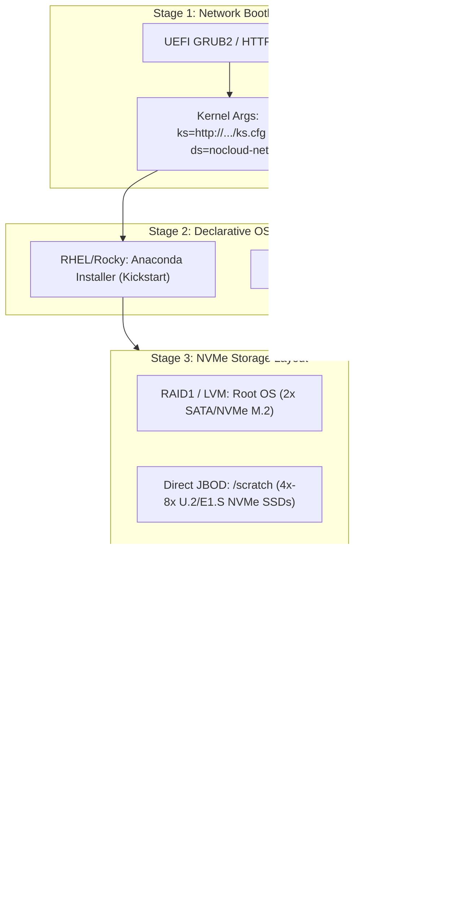

# Chapter 3 — OS Provisioning, Kernel Optimization, and Security Hardening

In an **NVIDIA AI Factory**, an out-of-the-box Linux operating system installation is severely misconfigured for high-throughput distributed training and inference. Generic enterprise kernels favor throughput buffering for web requests, aggressive power-saving sleep states, and defensive memory remapping. On an 8-GPU Hopper or Blackwell server running 400 Gb/s or 800 Gb/s InfiniBand/RoCE links, these default behaviors introduce **CPU jitter, memory fragmentation, PCIe DMA latency, and collective desynchronization**.

As an **NVIDIA Senior Solutions Architect**, you must design an automated OS delivery pipeline that applies mathematically sound kernel parameters, configures deterministic memory and NUMA domains, resolves the kernel-driver coupling matrix, and hardens the host without breaking GPUDirect RDMA or containerized GPU acceleration.

---

## 1. Automated OS Delivery: Kickstart and cloud-init Architecture

Provisioning bare-metal systems at scale requires fully non-interactive, declarative answer files fetched during network boot (via PXE or UEFI HTTPBoot).



### Partitioning Strategy for Accelerated Compute

A production AI server separates the host OS lifecycle from ephemeral scratch storage:
- **Root Filesystem (`/`)**: Mirrored RAID1 across dual enterprise M.2 SSDs (e.g., 480GB–960GB). Ext4 or XFS with `noatime` to eliminate metadata write amplification.
- **Job Scratch (`/scratch` or `/local_scratch`)**: Striped NVMe or raw NVMe disks mapped directly to local mounts. Used for uncompressed container squashfs images (Enroot), framework caches (Hugging Face, PyTorch), and local checkpoint staging. **Never mirror high-performance scratch disks**; RAID1/5 adds parity overhead and destroys sequential write performance.

---

## 2. Linux Kernel Optimization for Ultra-Scale AI

Every microsecond of CPU scheduling latency or memory allocation delay stalls GPU execution pipelines. Distributed AI frameworks (PyTorch, Megatron-Core, DeepSpeed) execute synchronized collective communication barriers (`MPI_Allreduce`, `ncclAllReduce`). If a single CPU core on one node enters a deep sleep state or stalls during memory compaction, all 1,024 GPUs in the job wait at the barrier.

### 1. Boot-Time Kernel Parameters (`/etc/default/grub`)

Add the following production arguments to `GRUB_CMDLINE_LINUX` on all accelerated compute nodes:

```bash
GRUB_CMDLINE_LINUX="console=tty0 console=ttyS0,115200n8 \
  iommu=pt \
  numa_balancing=0 \
  transparent_hugepage=never \
  processor.max_cstate=1 \
  intel_idle.max_cstate=1 \
  intel_pstate=passive \
  cpufreq.default_governor=performance \
  systemd.unified_cgroup_hierarchy=1 \
  audit=1"
```

#### First-Principles Explanation:

1. **`iommu=pt` (I/O Memory Management Unit Passthrough)**:
   - *Why*: Without passthrough, the Linux kernel creates dynamic virtual-to-physical DMA mappings for every PCIe transfer initiated by ConnectX-7 network adapters or GPUs.
   - *Impact*: In a 400 Gb/s GPUDirect RDMA environment, dynamic IOMMU translation incurs a 15–25% throughput penalty and generates severe PCIe transaction replay overhead. `iommu=pt` preserves physical 1:1 memory addressing for host devices.
2. **`numa_balancing=0`**:
   - *Why*: The kernel’s background NUMA balancing scanner periodically unmaps memory pages to detect which CPU socket accesses them, migrating pages across the interconnect.
   - *Impact*: In distributed training, tensor allocations are pinned explicitly to local NUMA sockets via `numactl` or framework runtimes. Background page faulting and memory migration introduce unpredictable 50ms+ latency spikes that rupture NCCL ring timing.
3. **`transparent_hugepage=never`**:
   - *Why*: Transparent Huge Pages (THP) attempt to allocate 2MB pages dynamically, falling back to 4KB pages and invoking the background `khugepaged` daemon for memory compaction.
   - *Impact*: Memory compaction causes kernel locks during high-rate GPU buffer allocations (e.g., loading model weights or pinning memory for GPUDirect Storage). AI nodes disable THP dynamically and instead pre-allocate static hugepages if required by DPDK or specialized communication fabrics.
4. **`intel_idle.max_cstate=1` / `processor.max_cstate=1`**:
   - *Why*: Deep C-states (C6, C7) shut down CPU clocks and flush caches to save power.
   - *Impact*: Waking a core from C6 to C0 takes 100–200 microseconds. Across thousands of barrier synchronizations per second, core sleep states cause severe timing jitter. Forcing C-state ceiling to C1 keeps the core in immediate ready-to-execute state.

---

### 2. Runtime Kernel Tunables (`/etc/sysctl.d/99-nvidia-ai.conf`)

Apply high-throughput networking and memory parameters:

```ini
# /etc/sysctl.d/99-nvidia-ai.conf

# Maximum socket receive and send buffer sizes for 400G/800G fabrics (2GB)
net.core.rmem_max = 2147483647
net.core.wmem_max = 2147483647
net.core.rmem_default = 67108864
net.core.wmem_default = 67108864

# Maximum network device backlog queue
net.core.netdev_max_backlog = 250000

# TCP window size tuning for high BDP (Bandwidth-Delay Product) links
net.ipv4.tcp_rmem = 4096 87380 2147483647
net.ipv4.tcp_wmem = 4096 65536 2147483647

# Prevent kernel memory swapping under heavy tensor caching
vm.swappiness = 0
vm.dirty_ratio = 80
vm.dirty_background_ratio = 5

# Increase maximum memory map areas (critical for PyTorch & Triton pinned memory)
vm.max_map_count = 1048576

# Maximum open file descriptors
fs.file-max = 2097152
```

---

## 3. NVIDIA Driver Packaging: Open Kernel Modules vs. Proprietary vs. kABI

One of the most frequent points of failure in AI cluster management is the **Linux Kernel $\leftrightarrow$ NVIDIA Driver** dependency chain.


### The Transition to Open-Source GPU Kernel Modules

Starting with NVIDIA Release 515 (and mandatory for optimal operation on Hopper H100, Blackwell B200, and Grace Hopper GH200), NVIDIA open-sourced its data center GPU kernel modules.

| Feature | Open-Source Kernel Modules (`nvidia-open`) | Legacy Proprietary Modules (`nvidia`) |
|---|---|---|
| **Source Code** | Fully open upstream on GitHub (`NVIDIA/open-gpu-kernel-modules`) | Proprietary binary wrapper around closed binary BLOB |
| **Supported Hardware** | Turing, Ampere, Ada Lovelace, **Hopper, Blackwell** | All legacy architectures (Pascal, Maxwell, Volta) |
| **Kernel Integration** | Native kernel memory management (`GDRCopy`, HMM, DMA-BUF) | Proprietary memory interfaces |
| **Hopper / Blackwell Optimization** | **Required for confidential computing, HMM, and full performance** | Not recommended for modern architecture features |

### Production Packaging: Why Enterprise AI Fleets Ban DKMS

In hobbyist and single-workstation setups, **DKMS** rebuilds the kernel module whenever a kernel update is applied. **In an enterprise AI Factory (500+ nodes), DKMS is strictly banned:**
1. **Compilation Failures**: If GCC, kernel-devel, or make tools differ by even a patch release across nodes, the DKMS build fails during boot, leaving the node without `nvidia.ko`.
2. **Boot Delays**: Compiling kernel modules across 128 cores adds 5–10 minutes to the node boot cycle.
3. **Non-Determinism**: Different nodes may compile slightly different binary artifacts.

**The Production Standard: kABI-Tracking Pre-Compiled Packages (`kmod-nvidia`)**:
- The enterprise repository (RHEL/Rocky or Ubuntu) compiles the kernel module once inside a centralized CI/CD image pipeline against a locked kernel ABI.
- The compute nodes install the pre-compiled `.rpm` or `.deb`. Installation takes 2 seconds, requires no C compiler on production nodes, and guarantees binary parity across 10,000 GPUs.

---

## 4. Linux Security Hardening: The HPC Multi-Tenancy Boundary

Security hardening in an AI cluster presents a classic tension: **Enterprise Compliance (CIS Benchmarks / ISO 27001) vs. Bare-Metal AI Performance**. Hardening policies that arbitrarily block device files, network interfaces, or user IPC destroy training jobs.

### 1. Mandatory Access Control (SELinux / AppArmor)

By default, strict SELinux `enforcing` mode on RHEL blocks containerized workloads and Slurm jobs from accessing `/dev/nvidia*`, `/dev/infiniband/uverbs*`, and unified virtual memory (`/dev/nvidia-uvm`).

```bash
# Investigating SELinux denial on GPU access
$ sudo ausearch -m avc -ts recent
type=AVC msg=audit(1724219400.124:942): avc:  denied  { read write } for  pid=4812 comm="python3" name="nvidia0" dev="devtmpfs" ino=1042 scontext=system_u:system_r:container_t:s0:c12,c45 tcontext=system_u:object_r:device_t:s0 tclass=chr_file permissive=0
```

#### Production Remedy: Custom SELinux Type Enforcement

Never run `setenforce 0` permanently. Instead, deploy the official NVIDIA SELinux policy package (`nvidia-container-toolkit-selinux` or custom type enforcement module) that assigns GPU device nodes the `gpu_device_t` context and grants containers `container_gpu_t` access:

```bash
# Verify GPU device labeling
$ ls -lZ /dev/nvidia*
crw-rw-rw-. 1 root root system_u:object_r:gpu_device_t:s0 195,   0 Aug 20 10:00 /dev/nvidia0
crw-rw-rw-. 1 root root system_u:object_r:gpu_device_t:s0 195, 255 Aug 20 10:00 /dev/nvidiactl
crw-rw-rw-. 1 root root system_u:object_r:gpu_device_t:s0 236,   0 Aug 20 10:00 /dev/nvidia-uvm
```

### 2. CIS Hardening Rules That Must Be Adjusted for AI Workloads

| Standard CIS Benchmark Rule | Default CIS Requirement | AI Factory Operational Adjustment | Architectural Justification |
|---|---|---|---|
| **Core Dumps** | Disable core dumps for all users (`* hard core 0`). | **Enable core dumps for AI framework processes in designated scratch directory.** | Distributed training framework bugs (NCCL crashes, PyTorch C++ segfaults) require core dumps with symbol tables for deep debugging. |
| **Process Ptrace / IPC** | Disable unprivileged `ptrace` (`kernel.yama.ptrace_scope = 2`). | **Set `kernel.yama.ptrace_scope = 1` or permit container IPC sharing.** | CUDA Multi-Process Service (MPS) and multi-rank PyTorch processes utilize shared memory (`/dev/shm`) and inter-process signals for intra-node NVLink tensor exchange. |
| **SSH Host Hardening** | Restrict ciphers, disable hostbased auth, set `ClientAliveInterval 300`. | **Allow passwordless internal SSH / PMIx agent communication across compute nodes on private management VLAN.** | Legacy MPI implementations and multi-node diagnostic launchers require rapid, low-latency inter-node communication across allocated Slurm nodes. |
| **Firewall (nftables / firewalld)** | Default DROP on all interfaces; strict port whitelisting. | **Trust dedicated InfiniBand (`ib*`) and RoCE interfaces completely; enforce firewall only on external management interfaces (`eth0`).** | InfiniBand and RoCE operate at microsecond latencies using hardware-offloaded queue pairs. Packet inspection on fabric interfaces introduces software bottlenecks and breaks RDMA. |

---

## 5. Senior Solutions Architect Interview Scenarios

### Scenario 1: Memory Allocation Stalls During Multi-Node Training
**Interviewer:** *"A customer reports that during a 70B parameter LLM training run on a 32-node DGX H100 cluster, individual nodes intermittently freeze for 2 to 4 seconds, causing the entire Slurm job to abort with an NCCL watchdog timeout error. What kernel mechanisms do you investigate?"*

**Candidate Answer:**
> "A multi-second periodic freeze on compute nodes running large models points directly to **Linux memory management and transparent hugepage compaction**:
> 1. **Transparent Hugepage (THP) Defragmentation:** If `transparent_hugepage` is set to `always`, the kernel’s background memory defragmentation thread (`khugepaged`) attempts to compact memory into contiguous 2MB pages when processes allocate large GPU staging buffers. Memory compaction takes global spinlocks across CPU cores, stalling all host processes. I verify this via `grep -i compact /proc/vmstat` and immediately set `echo never > /sys/kernel/mm/transparent_hugepage/enabled`.
> 2. **Kernel Swappiness:** I inspect `cat /proc/sys/vm/swappiness`. If swappiness is above 0, the kernel may swap out inactive framework pages or shared libraries to disk under heavy memory pressure. I enforce `vm.swappiness = 0` and verify swap space is completely disabled (`swapoff -a`).
> 3. **Zone Reclaim / NUMA Balancing:** I verify that `kernel.numa_balancing` is disabled (`sysctl kernel.numa_balancing=0`). If active, the kernel continuously revokes page table entries to observe cross-NUMA access, introducing periodic multi-millisecond page faults during RDMA streaming."

---

### Scenario 2: Selecting the Driver Packaging Strategy for a 2,000-GPU Cluster
**Interviewer:** *"You are designing the operating system build pipeline for a new Tier-1 AI supercomputer running Rocky Linux 9. The customer's DevOps lead wants to use DKMS for NVIDIA driver installation so that kernel security patches can be applied automatically via yum-cron. Do you approve this architecture?"*

**Candidate Answer:**
> "I strictly advise against DKMS and reject automatic un-gated kernel upgrades for three architectural reasons:
> 1. **Non-Deterministic Compilation Risk:** DKMS compiles the driver from source directly on the compute node during boot. If compiler headers, GCC minor revisions, or library paths drift across 250+ nodes, compilation will fail silently on a subset of the fleet, causing nodes to boot without a functional `nvidia.ko`.
> 2. **Boot Storm Delays:** When a 250-node cluster reboots simultaneously after a maintenance window, compiling the driver on every node consumes massive CPU cycles and delays cluster availability by 10 to 15 minutes.
> 3. **The Driver/CUDA Qualification Gate:** In an AI supercomputer, you never float the kernel independently. An unannounced kernel erratum can change kernel-module ABI or memory management interfaces that the NVIDIA driver depends on.
> 
> **My Recommended Architecture:**
> We adopt **kABI-tracking pre-compiled RPMs (`kmod-nvidia`)** or golden BCM images. The Linux kernel, Open-Source GPU kernel modules, and MOFED (Mellanox OFED) drivers are compiled and packaged together in an immutable CI/CD pipeline, validated on a hardware canary node against DCGM and NCCL benchmarks, and deployed across the fleet as a single, deterministic binary update."

---

## Key Takeaways

1. **Kernel Tuning is Non-Negotiable:** Out-of-the-box Linux kernels destroy AI performance. High-throughput distributed training mandates `iommu=pt`, `numa_balancing=0`, `transparent_hugepage=never`, and CPU C-state locking (`intel_idle.max_cstate=1`).
2. **Open-Source Kernel Modules are the Future:** For Hopper, Blackwell, and Grace systems, NVIDIA open-source GPU kernel modules (`nvidia-open`) provide native kernel memory integration and are required for full confidential computing and memory management.
3. **Ban DKMS in Production Fleets:** Use pre-compiled, kABI-validated driver packages (`kmod-nvidia`) generated in CI/CD pipelines to guarantee binary determinism and eliminate boot-time compilation failures.
4. **Hardening Must Be Workload-Aware:** Enforce CIS security on external management interfaces, but configure tailored SELinux policies (`container_gpu_t`) and trust private InfiniBand/RoCE fabrics to ensure zero RDMA performance degradation.
5. **Separate OS from Scratch Storage:** Isolate the mirrored OS boot drive from ephemeral NVMe scratch filesystems (`/scratch`) to maximize local checkpoint write performance.
