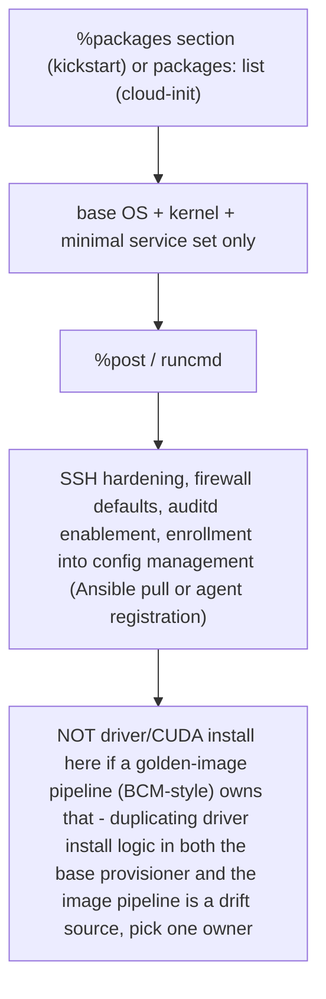
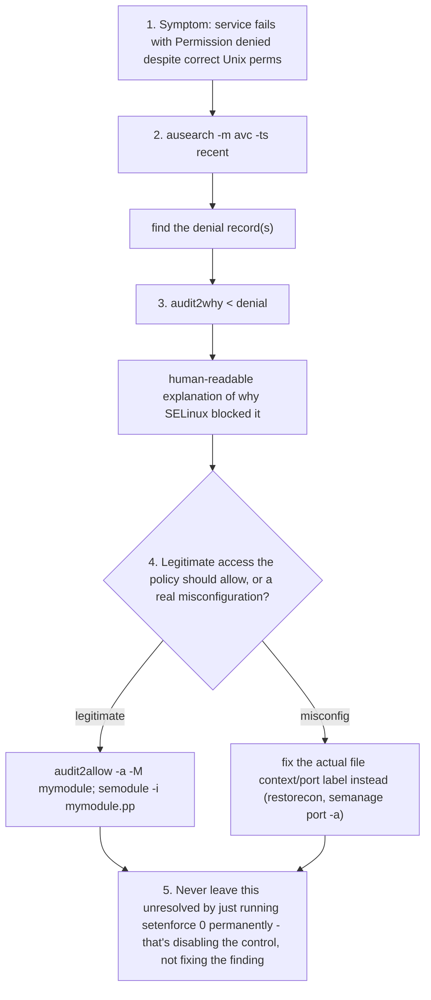
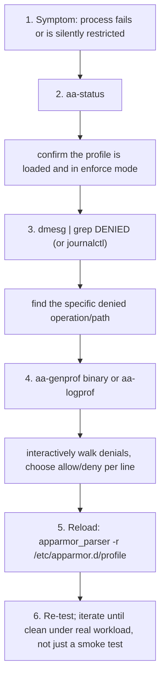
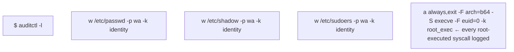
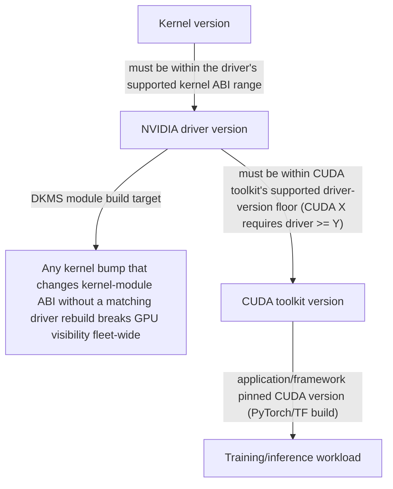

## Foundations: start here if Linux/cluster security concepts are new to you

### What this section does and does not do

This section builds the mental model needed to read the rest of this chapter's OS provisioning and Linux security hardening material without stumbling over unfamiliar security vocabulary. It will not make you a security engineer, and it won't teach you to configure SELinux or AppArmor policy — that's covered later in this chapter. Its only job is to make sure terms like "attack surface," "mandatory access control," and a `sestatus` check have a stable meaning in your head before the rest of this chapter uses them at full speed.

This section assumes you already have a basic sense of Linux users, groups, and file permissions. Here we go one level further: root and privilege, attack surface, mandatory access control, and the specific patching tension that GPU clusters create.

### A quick recap, one level further: root and least privilege

#### The problem

Regular Linux permissions (owner/group/other, read/write/execute) work well for one common case: many different regular users sharing a machine, each needing to be kept out of each other's files. But every Linux system also has one special account that ignores essentially all of those permission checks.

#### Naming the concept

That account is **root** — the Linux superuser, whose processes are allowed to bypass almost all normal permission checks: read any file, kill any process, reconfigure the network, install anything. This is enormously convenient for administration and enormously dangerous for the same reason: any program running as root that is tricked into doing something malicious (or simply has a bug) can do essentially anything to the machine, because normal permission checks won't stop it.

#### The concept this motivates: least privilege

**Least privilege** is the practice of giving any user, process, or program only the specific access it actually needs to do its job — never more "just in case." A web server that only needs to read its own config files and listen on one port shouldn't run as root, because if it's ever compromised, an attacker inherits whatever privilege the compromised process had. Run it as root, and a bug in that web server becomes a bug with root's power. Run it as a restricted, ordinary user, and the same bug is contained to whatever that limited user can touch.

#### Check your understanding

**Q1: Why is "just run it as root, it's simpler" a security problem even if the program itself isn't malicious?**
A: Because if that program is ever compromised (through a bug, a malicious input, or a supply-chain issue in a dependency), whoever exploits it inherits root's near-total access. Running as a limited user contains the damage to whatever that user can touch, regardless of the program's own intentions.

**Q2: In your own words, what does "least privilege" mean?**
A: Giving a user or process only the access it actually needs for its specific job, and nothing more — so that if it's ever misused or compromised, the potential damage is limited to that narrow scope.

### What "attack surface" means

#### The problem

Security work often needs a way to talk about "how exposed is this system," in general, before looking at any specific vulnerability. You need a concept that captures "how many different ways could something go wrong here," not just "is there a known bug."

#### Naming the concept

**Attack surface** is the total set of everything about a system that could potentially be exploited: every running service, every open network port, every piece of installed software, every account that exists, every way data can get in. It's not a single measurement — it's a way of thinking. More running services means more attack surface, even if each individual service is currently bug-free, because each one is one more thing that could later have a vulnerability discovered in it, and one more thing an attacker could probe.

#### The analogy

Think of attack surface like the number of doors and windows on a building, not whether any of them is currently unlocked. A building with 3 doors and no windows has a smaller attack surface than one with 3 doors and 20 windows — even if, today, every single opening happens to be locked. Reducing attack surface means removing doors and windows you don't need, not just locking the ones you have.

#### Check your understanding

**Q1: If a service has never had a reported vulnerability, does running it still add to attack surface?**
A: Yes. Attack surface is about the total number of things that could theoretically be exploited, not just currently-known problems. An unused, still-running service is one more thing that could later be found vulnerable, and one more thing worth removing if it isn't needed.

**Q2: What's the practical difference between "reduce attack surface" and "patch known vulnerabilities"?**
A: Patching fixes specific known problems in things you're keeping. Reducing attack surface means removing or disabling things you don't actually need at all, so there's nothing there to eventually have a vulnerability found in.

### What Mandatory Access Control adds on top of normal permissions

#### The problem

Ordinary Linux permissions answer one question: does this *user* own, or have rights to, this file? But that leaves a gap — if a legitimate, correctly-permissioned program is compromised (say, a web server exploited through a bug), normal permissions won't stop it from doing anything that the user it's running as is allowed to do. You'd want a way to additionally restrict what a *specific program* is allowed to do, regardless of which user it's running as, so that even a compromised program is boxed in.

#### Naming the concept

A **Mandatory Access Control (MAC)** system — SELinux and AppArmor are the two common Linux examples — adds a second, separate layer of restriction on top of normal (user-based) permissions. Normal permissions ask "does this user own or have rights to this file?" MAC additionally asks "is this specific program allowed to do this specific thing at all, no matter who it's running as?" Both checks have to pass. If MAC policy says a given program may never write to a certain directory, that program cannot write there even if it's running as root and root technically "owns everything."

#### The analogy

Think of a building where your key card (regular permissions — do you, the person, have rights to this door) is checked at every door, but some doors additionally have a second badge reader tied specifically to your *role*, not just your identity (MAC — is this specific role/program allowed through this specific door at all). Even the building manager with a master key card might still be blocked by the role-based badge reader on a server room door if their role isn't cleared for it. Both checks must pass; passing one doesn't override the other.

#### Check your understanding

**Q1: Why doesn't running as root bypass a MAC system like SELinux, when root normally bypasses everything?**
A: Because MAC is a separate, additional layer of checks tied to what the specific program/context is allowed to do, not to who owns what. Root bypasses the traditional user-permission layer, but MAC policy can still say "this program may never do this action," and that restriction applies regardless of the user running it.

**Q2: What real-world problem does MAC solve that plain user permissions can't?**
A: It limits the damage a compromised-but-legitimately-permissioned program can do. Even if an attacker takes over a process that's technically allowed (by user permissions) to access certain files, MAC policy can still block that specific program from doing things outside its expected, narrow role.

### Why patching is a security practice — and why it's harder on a GPU cluster

#### The problem

It's tempting to treat "keep software updated" as routine maintenance, like tidying up. But most real-world security incidents don't start from some exotic zero-day; they start from a *known, already-patched* vulnerability that a particular system simply hadn't gotten around to fixing yet. Patching is how you close doors that are already known to be unlocked (recall the attack-surface analogy) before someone tries them.

#### Why this is a genuine tension on a GPU cluster specifically

On a typical server, updating a package is usually low-risk and isolated. On a GPU cluster, several layers are tightly version-coupled: the GPU driver, CUDA (NVIDIA's software layer that lets programs use the GPU), and the Linux kernel all need to agree with each other on compatible versions. Updating just one of them — say, patching the kernel for an unrelated security fix — can silently break compatibility with the GPU driver, and a broken driver can mean every GPU on that node becomes unusable until someone notices and fixes the mismatch.

This creates a real tension: patching promptly is a security best practice, but on a GPU cluster, an update that isn't carefully validated first can take GPU capacity offline — which is exactly the kind of operational risk a cluster team is also trying to avoid. Neither "never patch" nor "patch immediately without testing" is safe. This is the concept-level version of a problem the rest of this chapter spends real space on: how to patch a GPU cluster safely without breaking the driver/CUDA/kernel relationship.

#### Check your understanding

**Q1: Why is "we'll patch it eventually" a real security risk, not just sloppy housekeeping?**
A: Because most incidents exploit vulnerabilities that are already known and already have a fix available — the risk window is the gap between "patch exists" and "patch applied." Leaving that gap open longer than necessary gives more time for that known, fixable weakness to be exploited.

**Q2: Why can't a GPU cluster just auto-apply every security patch the moment it's released, the way you might for a simple stateless web server?**
A: Because the kernel, GPU driver, and CUDA versions are tightly coupled — an update to one, applied without checking compatibility with the others, can break GPU functionality across a node. Patches need validation against this specific compatibility chain first, which is slower than a simple auto-update policy.

### A first honest look at an SELinux status check

#### The example

Here is the kind of command the rest of this chapter will show you in more depth:

```bash
sestatus
```

```text
SELinux status:                enabled
SELinuxfs mount:                /sys/fs/selinux
SELinux root directory:         /etc/selinux
Loaded policy name:             targeted
Current mode:                   enforcing
Mode from config file:          enforcing
Policy MLS status:              enabled
Policy deny_unknown status:     allowed
Max kernel policy version:      33
```

#### Evidence vs. proof

- **What this output DOES tell you:** SELinux is turned on, actively enforcing its rules (not just logging violations without blocking them), and using the "targeted" policy set.
- **What it does NOT tell you:** whether the policy that's loaded actually covers the specific software you care about protecting. SELinux can be "enabled" and "enforcing" while running under a policy that has no meaningful rules for your particular application — in which case that application is effectively unprotected by MAC even though the system-wide status looks fully locked down. It also doesn't tell you whether any given action was actually blocked recently, or whether a needed exception (a policy rule allowing something your specific software legitimately needs) is missing, which would show up as your software mysteriously failing rather than as an obvious security gap.
- **What additional evidence you'd want:** checking whether policy modules relevant to your specific software are loaded, checking the SELinux audit log for denials related to that software, and — ideally — deliberately testing that a disallowed action is actually blocked, not just assuming enforcement based on the status line alone.

This is the same "evidence, not proof" habit that applies throughout this chapter, applied to security tooling specifically: a green-looking status line is a data point, not a guarantee that the thing you actually care about is protected.

#### Check your understanding

**Q1: `sestatus` shows "Current mode: enforcing." Does that guarantee your application is protected by SELinux?**
A: No. It confirms SELinux is actively enforcing *some* policy, but not that the loaded policy has rules covering your specific application. A policy with no relevant rules for that software provides it no real MAC protection, even while the system overall shows "enforcing."

**Q2: What would strengthen your confidence that SELinux is actually protecting a specific piece of software, beyond the status line?**
A: Checking for policy modules relevant to that software, reviewing the audit log for denials tied to it, and deliberately testing that a disallowed action is actually blocked — combining several checks rather than trusting one status field.

### Glossary

- **Root** — the Linux superuser account whose processes bypass almost all normal permission checks.
- **Least privilege** — giving a user or process only the access it actually needs, and no more.
- **Attack surface** — the total set of everything about a system (services, ports, installed software, accounts) that could potentially be exploited.
- **Mandatory Access Control (MAC)** — a security layer (e.g., SELinux, AppArmor) that restricts what a specific program is allowed to do, independent of and in addition to normal user-based permissions.
- **SELinux** — a Linux MAC implementation; can be disabled, permissive (logs but doesn't block violations), or enforcing (actively blocks violations).
- **Patching** — applying updates that fix known security vulnerabilities, distinct from general maintenance.
- **Driver/CUDA/kernel coupling** — the tight version-compatibility relationship between the GPU driver, CUDA, and the Linux kernel on a GPU cluster, which makes patching riskier than on a typical server.

### Before you go deeper, make sure you can...

- Explain why running as root is risky even for a program that isn't itself malicious, using the concept of least privilege.
- Explain attack surface in plain terms and give an example of reducing it versus patching it.
- Explain what a MAC system like SELinux adds on top of normal Linux permissions, using the badge/role analogy or your own equivalent.
- Explain, at the concept level, why patching a GPU cluster is riskier than patching a typical server, without needing the specific fix the rest of this chapter teaches yet.
- Look at an `sestatus`-style output and state what it does and does not prove about your actual security posture.

With that model in place, here's the full provisioning and hardening picture.

**Learning outcome:** Understand automated OS provisioning (kickstart/cloud-init), the SELinux/AppArmor enforcement model and triage flow, a CIS-style hardening baseline, and why patch strategy on a GPU cluster is constrained by driver/kernel coupling in ways a stateless web-tier fleet is not.

## Start here — installation, configuration, and hardening are different stages

For a beginner, "build the server" sounds like one action. Operations teams separate it into stages because each has a different failure mode and rollback:


- **Provisioning** gets a repeatable base operating system onto a machine.
- **Configuration management** turns that base into a login node, controller, GPU worker, or storage client.
- **Hardening** reduces attack surface and adds controls without breaking the node's required function.
- **Validation** proves the machine can still boot, join identity services, see GPUs/network/storage, and run a representative job.

Linux security is layered. File ownership and Unix permissions answer "which user can access this object?" `sudo` controls privileged commands. SSH controls remote entry. A host firewall controls network paths. SELinux or AppArmor adds **mandatory access control**: even a process running as the expected user can be denied an operation outside its policy. `auditd` records security-relevant events. None replaces the others.

### A practical beginner investigation order

When a hardened service fails, do not disable controls until it works. Record the exact failure and move upward through evidence:

1. Is the service running, and what did systemd report? `systemctl status NAME` and `journalctl -u NAME`.
2. Are identity, ownership, permissions, and paths correct? `id`, `namei -l PATH`, `getfacl PATH`.
3. Is the expected port listening and reachable? `ss -lntup`, then test from the actual client network.
4. Did SELinux/AppArmor deny it? Inspect the audit or kernel log and explain the denied action.
5. Did a kernel, driver, or library change alter prerequisites? Compare the node with a known-good peer.

The senior skill is preserving the control while correcting policy or configuration. Turning off SELinux, AppArmor, or the firewall proves only that a control participates in the symptom; it is not a production solution.

## Automated OS provisioning

Once a node is provisionable (Chapter 1) and, if using a cluster manager, assigned to a category with a target image (Chapter 2), the actual OS install/config is driven by a declarative answer file rather than an interactive installer:

- **Kickstart** (RHEL/CentOS/Rocky) — a `.ks` file specifying partitioning, package selection (`%packages`), and a `%post` script block, served over HTTP/TFTP alongside the PXE boot artifacts. The installer (Anaconda) reads it non-interactively.
- **cloud-init** (Ubuntu and most cloud/VM images, increasingly used for bare metal too via tools like MAAS) — a `user-data`/`meta-data` YAML pair consumed at first boot, handling users, SSH keys, package installs, and arbitrary `runcmd` shell commands.
- **Preseed** — Debian/Ubuntu's older non-interactive installer mechanism, largely superseded by cloud-init/curtin in newer Ubuntu Server installs but still seen in older fleets.

The pattern across all three: separate "what does this class of node look like" (partitioning, base packages, users, SSH hardening, hostname pattern) from "what job does it do" (GPU driver stack, Slurm client, container runtime) — the former belongs in the base kickstart/cloud-init config, the latter is layered on via config management (Ansible) or is baked into the golden image the cluster manager distributes.



## SELinux vs AppArmor

Both are Linux Security Modules (LSM) implementing mandatory access control (MAC) — restricting what a process can do beyond standard Unix permissions, even as root. They differ in model:

| | SELinux (RHEL/CentOS/Rocky default) | AppArmor (Ubuntu/Debian default) |
|---|---|---|
| Labeling | Every file/process/port gets a security *context* (`user:role:type:level`) | Profiles bound to *file paths*, no persistent file labels |
| Policy granularity | Type Enforcement — very fine-grained, steep learning curve | Path-based profiles — coarser, easier to read/write |
| Modes | `Enforcing`, `Permissive`, `Disabled` | `enforce`, `complain` (log-only), profile can be `unconfined` |
| Check status | `sestatus`, `getenforce` | `aa-status` |
| Set mode | `setenforce 0\|1` (runtime), `/etc/selinux/config` (persistent) | `aa-enforce <profile>`, `aa-complain <profile>` |
| Denial logs | `/var/log/audit/audit.log`, queried via `ausearch -m avc` | `dmesg`/`journalctl`, `DENIED` lines tagged `apparmor="DENIED"` |
| Triage tool | `audit2allow` — generates a policy module from denial logs | `aa-genprof`/`aa-logprof` — interactively builds/updates a profile from logs |

Annotated `sestatus` output:

```
$ sestatus
SELinux status:                enabled
SELinuxfs mount:                /sys/fs/selinux
SELinux root directory:         /etc/selinux
Loaded policy name:              targeted
Current mode:                    enforcing
Mode from config file:           enforcing
Policy MLS status:               enabled
Policy deny_unknown status:      allowed
Max kernel policy version:       33
```
`Loaded policy name: targeted` is the detail worth knowing cold — "targeted" policy only confines a defined set of daemons (network-facing services, mostly), leaving most of the system unconfined; this is the RHEL default and is why SELinux denials in practice cluster around specific services (httpd, sshd, custom daemons touching non-standard paths) rather than everything on the box.

### SELinux triage flow (real, not aspirational)



### AppArmor triage flow



The instinct to `setenforce 0` or set a profile to `complain` "just to get the service running" is the single most common way a hardened baseline quietly becomes an unhardened one — it should be a temporary diagnostic step, and every use of it should have a tracked follow-up to build the correct policy module, not a permanent fix.

## CIS-benchmark-style hardening baseline

A hardening pass (whether run via a CIS benchmark tool, OpenSCAP, or a bespoke Ansible role) typically touches the same recurring surface area regardless of exact benchmark version:

- **SSH config** (`/etc/ssh/sshd_config`) — disable root login (`PermitRootLogin no`), disable password auth in favor of keys (`PasswordAuthentication no`), restrict ciphers/MACs to modern-only, `MaxAuthTries`, `LoginGraceTime`.
- **Firewall / nftables** — default-deny inbound, explicit allow rules per required service/port, egress control where the threat model calls for it. Modern RHEL/Ubuntu baselines use `nftables` as the backend even where `firewalld`/`ufw` is the admin-facing tool.
- **Unused service disablement** — anything listening that isn't needed (`systemctl list-unit-files --state=enabled`, then disable what the node's role doesn't require) shrinks attack surface and, on HPC nodes specifically, removes noisy neighbors competing for CPU/memory the job scheduler thinks is free.
- **Kernel sysctl hardening** — `net.ipv4.conf.all.rp_filter`, disabling IP forwarding on non-router nodes, `kernel.dmesg_restrict`, `kernel.kptr_restrict`, ASLR (`kernel.randomize_va_space=2`), disabling core dumps of setuid programs.
- **auditd** — rule sets watching identity/privilege files (`/etc/passwd`, `/etc/shadow`, `/etc/sudoers`), privileged command execution, and (per compliance regime) file access to sensitive data paths. `auditctl -l` shows the currently loaded rule set.

Annotated `auditctl -l` fragment:

`-k identity` and `-k root_exec` are audit *keys* — labels that let `ausearch -k identity` pull exactly the relevant subset out of a large audit log instead of grepping raw text, which matters once a node has been running long enough to accumulate a genuinely large `audit.log`.

## Patch/update strategy on a GPU cluster

The reason you cannot treat GPU compute nodes like a stateless web-tier fleet (`apt/yum upgrade` on a schedule, reboot, move on) is a hard coupling most other Linux fleets don't have:



A routine `dnf update`/`apt upgrade` that pulls a newer kernel is, from this diagram, a gate — not a no-op — because the NVIDIA driver kernel module is typically built via DKMS against the running kernel headers. Bump the kernel without a coordinated driver rebuild/reinstall, and every node that reboots into the new kernel loses `nvidia.ko`, and `nvidia-smi` fails cluster-wide on next reboot, even though nothing about CUDA or the application layer changed.

Operational implications:

- **Patch windows, not continuous patching** — GPU nodes get updated in scheduled maintenance windows coordinated with the scheduler (drain from Slurm/Kubernetes first), not by an unattended-upgrades cron job that can reboot a node mid-job or, worse, mid-fleet inconsistently.
- **Staged rollout** — same canary-then-batch pattern as Chapter 2's image rollout: patch a small subset, confirm `nvidia-smi`/`dcgmi diag`/a real multi-GPU job still works post-reboot, then batch the rest.
- **Kernel pinning** — many HPC/GPU shops pin the kernel version (hold it at a validated version) independent of the rest of the package set, only moving it forward in lockstep with a validated driver/DKMS rebuild, rather than letting the package manager float it.
- **Security patching without a kernel bump** — most CVE fixes for userspace packages (openssl, glibc, systemd components) don't touch the kernel-module ABI and can go through faster/lighter-weight patch cycles; the kernel-coupled subset is the one that needs the slow, staged path.

## The hardening-vs-HPC-operations tension

SELinux enforcing mode on a GPU node can generate denials against device-node access patterns (`/dev/nvidia*`, `/dev/nvidia-uvm`, GPUDirect RDMA paths touching NIC device nodes) that the stock "targeted" policy never anticipated, because these device classes didn't exist when the base policy was authored. NVIDIA and some distros ship or recommend supplemental SELinux policy modules for exactly this reason — installing the right policy module (mapping the correct type/context to the GPU device nodes) is the correct fix, not disabling enforcement.

In practice this is why some HPC shops run SELinux in `permissive` mode (or AppArmor profiles in `complain` mode) on GPU compute nodes specifically, with compensating controls instead: network segmentation on the cluster's management/boot VLANs, strict SSH/auth hardening, auditd watching privileged actions, and tight physical/BMC access control. This is a real, defensible trade-off in a closed HPC network with no direct internet-facing services on the compute nodes — but it is a trade-off, not a free pass, and should be a documented risk-acceptance decision (with the compensating controls named), not an unexamined default inherited from "enforcing broke a job once so we turned it off."

## Worked scenario — a routine kernel patch broke the GPU driver DKMS build fleet-wide

**Situation:** A maintenance window applies the latest RHEL kernel errata across the `gpu-a100` fleet along with routine userspace package updates. After reboot, `nvidia-smi` fails on every node in the batch with "No devices were found" / driver/library version mismatch, even though nothing about the NVIDIA driver package version changed in this patch set.

1. **Confirm the actual failure mode**: `dmesg | grep -i nvidia` on an affected node — typically shows the DKMS-built `nvidia.ko` either failed to build against the new kernel headers, or built against the old kernel and is now mismatched against the running (new) kernel, which is exactly what "Failed to initialize NVML: Driver/library version mismatch" means.
2. **Check DKMS status**: `dkms status` — shows whether the nvidia module built successfully for the new kernel version or is still only registered against the previous one.
3. **Root cause**: the patch pipeline updated the kernel package but did not trigger (or wait for) a DKMS rebuild against the new kernel headers before the node rebooted — a sequencing gap between "kernel package updated" and "GPU driver kernel module rebuilt for that kernel," not a driver bug.
4. **Immediate fix**: `dkms autoinstall` (or a targeted `dkms install nvidia/<version> -k <new-kernel>`) rebuilds the module against the currently running kernel; reboot not always required if the module can be loaded live, but a clean reboot-and-verify is the safer confirmation step.
5. **Prevention**: the patch pipeline must treat "kernel package update" and "DKMS rebuild + verify module load" as one atomic maintenance step per node — never reboot a node into a new kernel without a passing DKMS build gate for that exact kernel version, and the staged/canary rollout (patch one node, confirm `nvidia-smi` clean, then batch) would have caught this before it hit the whole fleet.

**Interview-ready line:** "A kernel patch on a GPU node isn't userspace-only risk — the driver's kernel module is typically DKMS-built against the running kernel, so any patch pipeline that bumps the kernel has to treat a successful DKMS rebuild as a hard gate before reboot, or you get a fleet-wide 'no devices found' the next morning."

**Mnemonic:** **"K-D-C"** — **K**ernel bump requires a **D**KMS rebuild gate before it requires a **C**UDA/app compatibility check; skip the middle step and the outer two don't matter.

## Practice

1. Explain the difference between SELinux's labeling model and AppArmor's path-based model to someone deciding which to adopt for a new GPU-node image, and name one practical consequence of that difference for GPU device-node access.
2. Walk through the `audit2allow` triage flow for a service denial and explain why `setenforce 0` is not an acceptable terminal step even when it "fixes" the symptom.
3. Why can't a GPU cluster safely run unattended kernel/package upgrades the way a stateless web-tier fleet might? Name the specific dependency chain that makes this unsafe.
4. A hardening review finds SELinux running in permissive mode on all GPU compute nodes. What questions would you ask before flagging this as a finding, and what would make it a defensible risk-acceptance rather than a gap?
5. Given `dkms status` showing the nvidia module registered only against the previous kernel version after a patch window, write the one-sentence root cause and the one specific pipeline fix that prevents recurrence.
