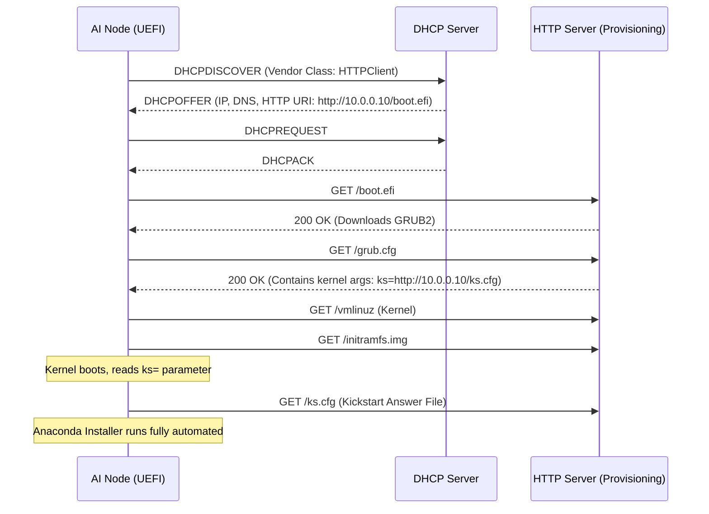
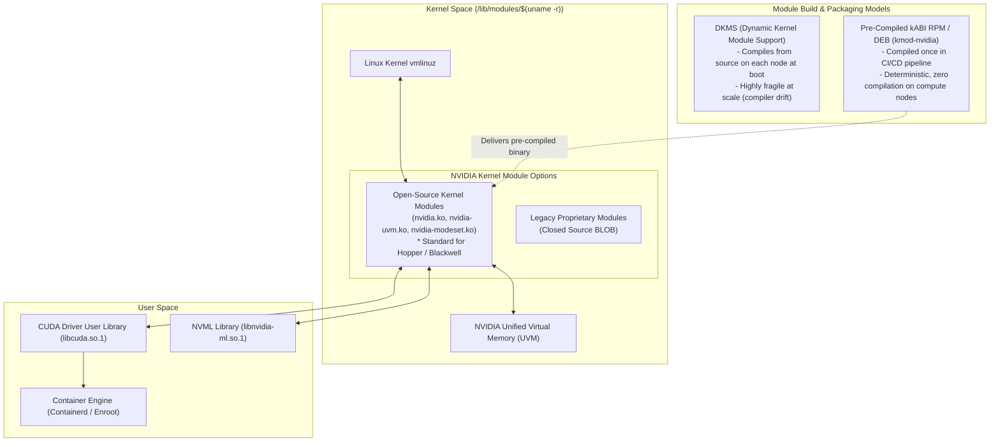

# Chapter 3 — OS Provisioning, Kernel Optimization, and Security Hardening

In an **NVIDIA AI Factory**, an out-of-the-box Linux operating system installation is severely misconfigured for high-throughput distributed training and inference. Generic enterprise kernels favor throughput buffering for web requests, aggressive power-saving sleep states, defensive memory remapping, and generalized CPU scheduling. On an 8-GPU Hopper or Blackwell server running 400 Gb/s or 800 Gb/s InfiniBand/RoCE links, these default behaviors introduce **CPU jitter, memory fragmentation, PCIe DMA latency, and collective desynchronization**.

As an **NVIDIA Senior Solutions Architect**, you must design an automated OS delivery pipeline that applies mathematically sound kernel parameters, configures deterministic memory and NUMA domains, resolves the kernel-driver coupling matrix, and hardens the host without breaking GPUDirect RDMA, InfiniBand topologies, or containerized GPU acceleration. 

This chapter is a comprehensive masterclass taking you from the fundamental Linux boot process to advanced, production-grade AI Factory OS deployments.

---

## 1. Introduction and Learning Objectives

### 1.1 The Problem Statement
When a distributed PyTorch training job synchronizes gradients across 1,024 GPUs, it executes a collective communication barrier (`MPI_Allreduce` or `ncclAllReduce`). If a single CPU core on *one* node enters a deep sleep state (C-state), or if a background kernel thread (like `khugepaged`) stalls memory allocation, every single GPU in the entire cluster waits at the barrier. This microsecond-level jitter cascades, reducing cluster-wide GPU utilization from 95% to 60%, wasting millions of dollars in compute time.

### 1.2 Realistic Production Story
A Tier-1 cloud provider launched a 4,000-GPU cluster utilizing default Ubuntu 22.04 LTS images. During benchmark testing, the NCCL all-reduce bandwidth fluctuated wildly, peaking at 350 GB/s but regularly dipping to 80 GB/s. Network diagnostics showed zero dropped packets. After a week of debugging, an NVIDIA architect identified two culprits: 
1. The kernel's `numa_balancing` daemon was periodically unmapping tensor memory to migrate it across CPU sockets, causing massive page fault storms.
2. The IOMMU was in default translation mode, forcing the CPU to dynamically map physical to virtual addresses for every PCIe RDMA transaction, saturating the CPU interconnect. 
Applying three GRUB parameters stabilized bandwidth at a deterministic 390 GB/s.

### 1.3 Measurable Learning Objectives
By the end of this chapter, you will be able to:
- Trace the complete Linux boot sequence and design a PXE/HTTPBoot provisioning architecture.
- Author declarative OS configuration files (Kickstart/Preseed/Cloud-init) tailored for NVMe storage layouts in accelerated compute.
- Implement advanced Linux kernel tuning (`sysctl` and GRUB) to eliminate OS jitter and maximize PCIe/DMA throughput.
- Architect golden image pipelines replacing fragile DKMS driver builds with robust kABI-tracking modules.
- Enforce CIS hardening benchmarks using Ansible, customized with SELinux/AppArmor profiles that permit high-performance GPU and InfiniBand access.
- Troubleshoot complex boot sequences, kernel panics, and secure boot failures related to proprietary NVIDIA kernel modules.

### 1.4 Chapter Metadata
- **Prerequisites:** Linux system administration, bash scripting, basic understanding of networking (PXE/DHCP).
- **Difficulty:** Intermediate to Advanced.
- **Reading Time:** ~45 minutes.

---

## 2. The Fundamentals: Linux Boot Process and Provisioning (Beginner)

Before managing fleets of 10,000 AI nodes, you must fundamentally understand how a single server goes from physical power-on to an interactive login prompt. 

### 2.1 The Linux Boot Sequence
Every Linux server follows a strict boot sequence. Understanding this is critical for troubleshooting when a node fails to mount its root filesystem or loads the wrong GPU driver version.

1. **Power-On Self Test (POST) & UEFI:** The Baseboard Management Controller (BMC) powers on the server. The Unified Extensible Firmware Interface (UEFI) initializes hardware, enumerates PCIe devices (GPUs, NICs), and finds a bootable device based on the NVRAM boot variables.
2. **Bootloader (GRUB2):** The UEFI executes the GRUB2 EFI binary (e.g., `grubx64.efi`). GRUB2 reads its configuration file (`grub.cfg`), presents a boot menu (if interactive), and loads the selected Linux kernel (`vmlinuz`) and Initial RAM Disk (`initramfs`) into memory.
3. **Kernel Initialization:** The kernel decompresses, initializes CPU cores, sets up memory management, and parses command-line parameters (like `iommu=pt`).
4. **Initramfs (Stage 1 User Space):** The kernel executes the `init` process from the temporary RAM disk. The initramfs contains just enough kernel modules (storage drivers, RAID, basic networking) to discover and mount the *actual* physical root filesystem.
5. **systemd (Stage 2 User Space):** Once the real root filesystem (`/`) is mounted, the kernel executes `/sbin/init` (which is a symlink to `systemd`). Systemd reads target files (e.g., `multi-user.target`), parallelizes service startup, mounts secondary filesystems (`/scratch`), and spawns login prompts.

### 2.2 Network Booting: PXE and HTTPBoot
In an AI Factory, servers do not have local USB drives or optical media. They boot over the network.

- **Legacy PXE (Preboot Execution Environment):** Relies on DHCP (options 66/67) and TFTP (Trivial File Transfer Protocol) to download the bootloader. TFTP is UDP-based, unencrypted, and painfully slow.
- **UEFI HTTPBoot:** The modern standard. The UEFI firmware obtains an IP via DHCP, receives an HTTP URI, and downloads the EFI bootloader directly via TCP over HTTP/HTTPS. It is vastly faster and supports TLS encryption.



### 2.3 Automated Provisioning: Kickstart Architecture
Red Hat Enterprise Linux (RHEL), Rocky Linux, and AlmaLinux use Kickstart to automate the Anaconda installer. Ubuntu uses Curtin/Cloud-init via Subiquity. 

In AI, the **Storage Layout** defined in Kickstart is a primary architectural decision.

#### Best Practices for AI Node Partitioning
- **Root OS (`/`)**: Mirrored RAID1 across dual enterprise M.2 SATA/NVMe SSDs. This ensures node survival if one boot drive dies. Format as `xfs` or `ext4` with the `noatime` mount option to prevent metadata write amplification.
- **Local Scratch (`/scratch` or `/var/lib/docker`)**: High-performance AI servers usually possess 4 to 8 high-capacity NVMe U.2/E1.S drives. These are **never mirrored**. They are configured as a striped RAID0 (mdadm) or LVM stripe, or mounted as separate JBOD disks. This directory holds Enroot/Docker container layers, model weights cached from object storage, and temporary PyTorch checkpoints. Parity (RAID5) or Mirroring (RAID1) kills sequential NVMe write speeds.

---

## 3. Deep Dive: A Production RHEL/Rocky Kickstart Profile

Let's examine a highly optimized Kickstart file for an 8-GPU Hopper system.

```bash
# /var/www/html/ks.cfg
# ---------------------------------------------------------
# NVIDIA AI Factory Production Kickstart - Rocky Linux 9

# Command Section
text
url --url="http://10.0.0.10/rocky9/BaseOS"
repo --name="AppStream" --baseurl="http://10.0.0.10/rocky9/AppStream"
lang en_US.UTF-8
keyboard us
timezone UTC --utc

# Network Configuration (Assuming enp1s0 is the 1GbE Management OOB port)
network --device=enp1s0 --bootproto=dhcp --onboot=yes --ipv6=auto
network --hostname=dgx-compute-01.mgmt.aifactory.local

# Security Defaults
rootpw --iscrypted $6$cryptedhashstringhere...
firewall --disabled
selinux --enforcing

# Advanced Storage Layout
# Clear partitions and initialize MBR/GPT
zerombr
clearpart --all --initlabel

# Create RAID1 OS Array across dual M.2 NVMe drives (nvme0n1, nvme1n1)
part raid.01 --size=1024 --ondisk=nvme0n1 --asprimary
part raid.02 --size=1024 --ondisk=nvme1n1 --asprimary
part raid.11 --size=100000 --grow --ondisk=nvme0n1
part raid.12 --size=100000 --grow --ondisk=nvme1n1

# RAID configuration for /boot/efi
raid /boot/efi --level=1 --device=md0 raid.01 raid.02 --fsoptions="umask=0077,shortname=winnt" --fstype=efi

# RAID configuration for Physical Volume (LVM)
raid pv.01 --level=1 --device=md1 raid.11 raid.12

# Volume Group and Logical Volumes for OS
volgroup sysvg pv.01
logvol / --fstype=xfs --name=rootlv --vgname=sysvg --size=1 --grow --fsoptions="defaults,noatime"
logvol swap --fstype=swap --name=swaplv --vgname=sysvg --size=8192

# Packages Section
%packages
@^minimal-environment
kexec-tools
tar
rsync
chrony
# Important: Do not install developer tools or compilers here to avoid DKMS drift.
%end

# Post-Install Script (Chroot Environment)
%post --log=/var/log/ks-post.log
echo "Configuring Base System..."
# Lock SSH to keys only
sed -i 's/^PasswordAuthentication yes/PasswordAuthentication no/' /etc/ssh/sshd_config
echo "Installation Post-Script Complete."
%end
```

#### First-Principles Explanation of the Kickstart:
1. `firewall --disabled`: Wait, disabling the firewall? Yes. On compute nodes, iptables/nftables connection tracking introduces massive software overhead and latency. Security is handled by physical network isolation (Management VLAN vs. High-Speed Fabric VLAN) and hardware ACLs on the ToR (Top of Rack) switches. We harden the host later, but we do not run stateful software firewalls on RDMA traffic.
2. `selinux --enforcing`: We do not disable SELinux. We will write custom policies to permit GPU and InfiniBand access later in the pipeline.
3. `noatime`: Every time a file is read, Linux updates its "access time" metadata, causing a disk write. For ML datasets with millions of small images, `atime` causes catastrophic IOPS degradation. `noatime` disables this.

---

## 4. Advanced: Building the AI Factory Golden Image (Packer + Ansible)

Installing the OS via network (Kickstart) on 10,000 nodes takes hours and is prone to repository timeouts. Advanced AI factories use **Golden Images** (or Golden AMIs in the cloud).

Instead of provisioning nodes directly, you provision a single virtual machine (or container/chroot), configure it completely, strip its unique identifiers (MAC addresses, SSH host keys), and capture a block-level disk image (`.qcow2`, `.raw`, or `.squashfs`). Bare-metal nodes then merely `dd` or stream this image directly to their local NVMe drives. 

### The NVIDIA Driver Dependency Chain (DKMS vs. kABI)

This is where Golden Images shine. The Linux Kernel $\leftrightarrow$ NVIDIA Driver dependency chain is the most fragile part of AI infrastructure.



#### Why Production Fleets Ban DKMS
**DKMS (Dynamic Kernel Module Support)** recompiles the `nvidia.ko` module from source code every time the node boots with a new kernel.
- **The Trade-Off:** It offers flexibility for workstations.
- **The Production Reality:** If 4,000 nodes reboot simultaneously after a maintenance window, DKMS causes a massive CPU spike, adding 10 minutes to the boot sequence. Worse, if the `gcc` compiler or `kernel-devel` headers have drifted between nodes, DKMS fails silently. Nodes boot up without GPU drivers, causing Slurm job black-holing.

#### The Golden Image / kABI Solution
We use Packer and Ansible to build a Golden Image where the kernel module is compiled **once** against a locked kernel version (kABI - Kernel Application Binary Interface). 
We use the NVIDIA open-source GPU kernel modules (`nvidia-open`), which are strictly required for Hopper/Blackwell confidential computing, Heterogeneous Memory Management (HMM), and full NVLink performance. The Golden Image ensures bit-for-bit binary determinism across the fleet.

---

## 5. Kernel Optimization for Ultra-Scale AI (Advanced)

Once the OS is on disk, the default kernel parameters must be aggressively tuned. Every microsecond of latency is magnified in distributed deep learning. 

### 5.1 Boot-Time Kernel Parameters (`/etc/default/grub`)

These parameters dictate how the kernel boots. Modify `GRUB_CMDLINE_LINUX`, rebuild the GRUB config (`grub2-mkconfig -o /boot/grub2/grub.cfg`), and reboot.

```bash
GRUB_CMDLINE_LINUX="crashkernel=auto resume=/dev/mapper/sysvg-swaplv rd.lvm.lv=sysvg/rootlv rd.lvm.lv=sysvg/swaplv \
  console=tty0 console=ttyS0,115200n8 \
  iommu=pt \
  numa_balancing=0 \
  transparent_hugepage=never \
  processor.max_cstate=1 \
  intel_idle.max_cstate=1 \
  intel_pstate=passive \
  cpufreq.default_governor=performance \
  systemd.unified_cgroup_hierarchy=1 \
  audit=1"
```

#### First-Principles Explanation of Critical Parameters:

1. **`iommu=pt` (IOMMU Passthrough):**
   - **WHY:** The Input/Output Memory Management Unit (IOMMU) translates device virtual addresses to physical memory addresses, much like an MMU does for CPUs. It also provides isolation.
   - **WHAT IT DOES:** In default mode, every time a ConnectX-7 NIC or GPU initiates a DMA transfer, the IOMMU must translate the address. At 400Gb/s (RDMA), this translation overhead becomes the primary bottleneck, causing PCIe transaction replays and massive latency.
   - **HOW:** Setting `iommu=pt` (Passthrough) leaves the IOMMU enabled (required for virtualization/SR-IOV if needed) but creates a 1:1 identity mapping for host devices. Devices DMA directly to physical memory with zero software overhead.

2. **`numa_balancing=0` (Disable Auto-NUMA Balancing):**
   - **WHY:** Modern servers have 2 or 4 physical CPU sockets (NUMA nodes). Memory attached to Socket 0 is accessed quickly by Socket 0, but slowly by Socket 1 (due to traversal across the UPI/xGMI interconnect).
   - **WHAT IT DOES:** The kernel runs a background thread that intentionally unmaps pages, waits for a CPU to access them (triggering a page fault), and if a different socket accessed it, migrates the memory page to that socket.
   - **HOW:** In AI workloads, MPI and frameworks like PyTorch pin processes and memory directly to the correct NUMA domains (`numactl`). The kernel's guessing game causes massive, unpredictable page faults and migrates memory needlessly. We must explicitly disable it.

3. **`transparent_hugepage=never` (Disable THP):**
   - **WHY:** Standard Linux memory pages are 4KB. AI workloads map hundreds of gigabytes, requiring millions of page table entries. Hugepages use 2MB or 1GB sizes, drastically reducing Translation Lookaside Buffer (TLB) misses.
   - **WHAT IT DOES:** Transparent Hugepages (THP) tries to dynamically allocate 2MB pages, falling back to 4KB if memory is fragmented. A background daemon (`khugepaged`) then tries to compact those 4KB pages into 2MB pages later. This compaction requires system-wide memory locks.
   - **HOW:** We disable THP (`never`). If a workload (like a DPDK network application or specific database) requires hugepages, we allocate them *statically* at boot (e.g., `hugepagesz=1G hugepages=128`), ensuring deterministic latency.

4. **`intel_idle.max_cstate=1` (Lock CPU Power States):**
   - **WHY:** CPUs save power by shutting down clocks and flushing caches (C-States: C6, C7).
   - **WHAT IT DOES:** Waking a core from C6 (Deep Sleep) to C0 (Active) takes 100 to 200 microseconds. During an NCCL ring synchronization, if one thread on one core is asleep, the entire ring waits.
   - **HOW:** We cap the maximum sleep state to C1. The CPU consumes more idle power, but response latency is negligible. (Note: For AMD EPYC, use `processor.max_cstate=1`).

### 5.2 Runtime Kernel Tunables (`sysctl`)

While GRUB dictates boot behavior, `sysctl` modifies runtime kernel memory and network stacks. These are deployed via `/etc/sysctl.d/99-nvidia-ai.conf`.

```ini
# /etc/sysctl.d/99-nvidia-ai.conf
# Kernel Runtime Tuning for Distributed AI Workloads

# 1. High-Bandwidth Networking
# Max socket receive and send buffer sizes (Set to ~2GB for 400G fabrics)
net.core.rmem_max = 2147483647
net.core.wmem_max = 2147483647
net.core.rmem_default = 67108864
net.core.wmem_default = 67108864

# Maximum network device backlog queue (Handle bursts without dropping packets)
net.core.netdev_max_backlog = 250000

# TCP window size tuning for high Bandwidth-Delay Product (BDP)
# Format: min, default, max
net.ipv4.tcp_rmem = 4096 87380 2147483647
net.ipv4.tcp_wmem = 4096 65536 2147483647

# 2. Virtual Memory Management
# Prevent kernel memory swapping. Swap kills AI training instantly.
vm.swappiness = 0

# Adjust dirty page flushing. Delay writing to disk to aggregate sequential writes.
vm.dirty_ratio = 80
vm.dirty_background_ratio = 5

# Increase maximum memory map areas (Critical for PyTorch dataloaders & pinned memory)
vm.max_map_count = 1048576

# 3. File Descriptors & Inotify
# Large-scale distributed logging and socket connections
fs.file-max = 2097152
fs.inotify.max_user_watches = 524288
```

#### Detailed Breakdown: Virtual Memory and PyTorch
The parameter `vm.max_map_count` is notoriously problematic. PyTorch data loaders use multiple worker processes that load data via memory-mapped files or pinned shared memory. The default Linux limit is `65530`. In deep learning, a training run processing thousands of shards will easily exceed this limit, crashing with an `Out of memory (OOM)` error—even if 1TB of physical RAM is completely free. Increasing this to over 1 million prevents artificial constraints on framework memory mappers.

---

## 6. Linux Security Hardening: The HPC Multi-Tenancy Boundary

Security hardening in an AI cluster presents a classic tension: **Enterprise Compliance (CIS Benchmarks) vs. Bare-Metal AI Performance**. Standard corporate policies will systematically break AI clusters.

### 6.1 Standard CIS vs. AI Factory Adjustments

| Standard CIS Benchmark Rule | Default CIS Requirement | AI Factory Operational Adjustment | Architectural Justification |
|---|---|---|---|
| **Core Dumps** | Disable core dumps (`* hard core 0`). | **Enable core dumps for AI frameworks.** | Distributed training framework bugs (NCCL crashes, PyTorch C++ segfaults) require core dumps with symbol tables for deep debugging. Store in secure `/scratch/cores`. |
| **Process Ptrace / IPC** | Disable unprivileged `ptrace` (`kernel.yama.ptrace_scope = 2`). | **Set `ptrace_scope = 1` or permit container IPC sharing.** | CUDA Multi-Process Service (MPS) and multi-rank PyTorch processes utilize shared memory (`/dev/shm`) and inter-process signals for intra-node NVLink tensor exchange. |
| **SSH Host Hardening** | Disable hostbased auth, set `ClientAliveInterval 300`. | **Allow passwordless internal SSH across compute nodes.** | Legacy MPI implementations and distributed job launchers (Slurm, pdsh) require rapid, low-latency inter-node communication over the private Management VLAN. |
| **Firewall (nftables)** | Default DROP on all interfaces; strict port whitelisting. | **Trust dedicated InfiniBand (`ib*`) completely.** | InfiniBand and RoCE operate via hardware-offloaded queue pairs at microsecond latencies. Software packet inspection breaks RDMA completely. |

### 6.2 Mandatory Access Control (SELinux / AppArmor)

By default, strict SELinux `enforcing` mode on RHEL will block containerized workloads and Slurm jobs from accessing GPU device files (`/dev/nvidia*`), InfiniBand character devices (`/dev/infiniband/uverbs*`), and unified virtual memory (`/dev/nvidia-uvm`).

**Anti-Pattern:** Running `setenforce 0` (Permissive) or disabling SELinux globally. This violates zero-trust architectures and fails compliance audits.

**Production Solution: Type Enforcement Policies**
Deploy the official NVIDIA SELinux policy package (`nvidia-container-toolkit-selinux`), or compile custom policies that assign specific contexts.

```bash
# Verify GPU device labeling after proper SELinux configuration
$ ls -lZ /dev/nvidia*
crw-rw-rw-. 1 root root system_u:object_r:gpu_device_t:s0 195,   0 Aug 20 10:00 /dev/nvidia0
crw-rw-rw-. 1 root root system_u:object_r:gpu_device_t:s0 195, 255 Aug 20 10:00 /dev/nvidiactl
crw-rw-rw-. 1 root root system_u:object_r:gpu_device_t:s0 236,   0 Aug 20 10:00 /dev/nvidia-uvm
```

Here, the label `gpu_device_t` tells the SELinux kernel module that this is an accelerator device. The container runtime (Enroot/Docker) executes the workload in the `container_t` domain, and policy booleans are set to allow `container_t` to read/write/mmap `gpu_device_t`.

### 6.3 Secure Boot and Kernel Module Signing

Enterprise IT mandates UEFI Secure Boot. Secure Boot ensures that the system only executes bootloaders and kernels cryptographically signed by trusted authorities (like Microsoft or Red Hat).

If Secure Boot is enabled, **the Linux kernel will refuse to load the `nvidia.ko` driver** unless the module itself is cryptographically signed by a key recognized by the kernel.

**The Workflow for NVIDIA Modules on Secure Boot:**
1. Generate an X.509 cryptographic key pair (Public/Private) locally on the management node.
2. Enroll the Public Key into the UEFI Machine Owner Key (MOK) database of every bare-metal node (requires physical presence or BMC redfish automation).
3. Use the `sign-file` utility (provided by the `kernel-devel` package) to sign the `nvidia.ko`, `nvidia-uvm.ko`, and `nvidia-modeset.ko` files using the Private Key.
4. When the kernel boots, it verifies the module signature against the MOK database and permits the driver to load.

---

## 7. Ansible Infrastructure as Code for OS Hardening

Instead of manual configuration, you apply OS parameters declaratively. Below is an advanced Ansible snippet illustrating how to apply GRUB configuration idempotently.

```yaml
# roles/os_tuning/tasks/main.yml
---
- name: Ensure critical GRUB kernel parameters are present for AI Workloads
  lineinfile:
    path: /etc/default/grub
    regexp: '^GRUB_CMDLINE_LINUX='
    line: 'GRUB_CMDLINE_LINUX="crashkernel=auto console=tty0 console=ttyS0,115200n8 iommu=pt numa_balancing=0 transparent_hugepage=never intel_idle.max_cstate=1 processor.max_cstate=1 systemd.unified_cgroup_hierarchy=1 audit=1"'
    backup: yes
  notify: Rebuild GRUB config

- name: Apply specialized sysctl parameters for NCCL / GPUDirect
  sysctl:
    name: "{{ item.name }}"
    value: "{{ item.value }}"
    state: present
    sysctl_set: yes
    sysctl_file: /etc/sysctl.d/99-nvidia-ai.conf
    reload: yes
  loop:
    - { name: 'net.core.rmem_max', value: '2147483647' }
    - { name: 'vm.swappiness', value: '0' }
    - { name: 'vm.max_map_count', value: '1048576' }

- name: Disable and stop firewalld on internal fabric nodes
  service:
    name: firewalld
    state: stopped
    enabled: no
```

---

## 8. Troubleshooting & Production Scenarios

### 8.1 Scenario: Kernel Panics on GPU Initialization (NVRM)
**Symptom:** You reboot a node. It comes up on the network, but the moment you type `nvidia-smi`, the SSH session freezes. The BMC console shows a complete kernel panic originating in `NVRM: Xid (PCI:0000:...): 79, GPU has fallen off the bus.`
**Interpretation:** This is often an IOMMU or PCIe ASPM (Active State Power Management) failure. If ASPM forces a PCIe link to a low-power state and the hardware takes too long to wake, the NVIDIA Resource Manager (NVRM) assumes the GPU is dead and triggers an NMI (Non-Maskable Interrupt), crashing the kernel to prevent memory corruption. 
**Remedy:** Append `pcie_aspm=off` to the GRUB command line to force PCIe links to stay fully active (L0 state) continuously.

### 8.2 Scenario: Secure Boot Rejection
**Symptom:** `nvidia-smi` returns `NVIDIA-SMI has failed because it couldn't communicate with the NVIDIA driver.` Checking `dmesg` reveals: `Lockdown: insmod: unsigned module loading is restricted; see man kernel_lockdown.7`.
**Interpretation:** UEFI Secure Boot is enabled, but the NVIDIA kernel modules (`kmod-nvidia` or locally built DKMS) were not signed with a recognized MOK key.
**Remedy:** Either disable Secure Boot in the BMC BIOS, or implement the module signing workflow using `sign-file` and `mokutil`. 

---

## 9. Senior Solutions Architect Interview Scenarios

### 9.1 Memory Allocation Stalls During Multi-Node Training
**Interviewer:** *"A customer reports that during a 70B parameter LLM training run on a 32-node DGX H100 cluster, individual nodes intermittently freeze for 2 to 4 seconds, causing the entire Slurm job to abort with an NCCL watchdog timeout error. What kernel mechanisms do you investigate?"*

**Candidate Answer:**
> "A multi-second periodic freeze on compute nodes running large models points directly to **Linux memory management and transparent hugepage compaction**:
> 1. **Transparent Hugepage (THP) Defragmentation:** If `transparent_hugepage` is set to `always`, the kernel’s background memory defragmentation thread (`khugepaged`) attempts to compact memory into contiguous 2MB pages when processes allocate large GPU staging buffers. Memory compaction takes global spinlocks across CPU cores, stalling all host processes. I verify this via `grep -i compact /proc/vmstat` and immediately set `echo never > /sys/kernel/mm/transparent_hugepage/enabled`.
> 2. **Kernel Swappiness:** I inspect `cat /proc/sys/vm/swappiness`. If swappiness is above 0, the kernel may swap out inactive framework pages or shared libraries to disk under heavy memory pressure. I enforce `vm.swappiness = 0` and verify swap space is completely disabled (`swapoff -a`).
> 3. **Zone Reclaim / NUMA Balancing:** I verify that `kernel.numa_balancing` is disabled (`sysctl kernel.numa_balancing=0`). If active, the kernel continuously revokes page table entries to observe cross-NUMA access, introducing periodic multi-millisecond page faults during RDMA streaming. Finally, I would ensure Slurm cgroups are correctly mapping tasks to the localized NUMA domains near the respective GPUs."

### 9.2 Selecting the Driver Packaging Strategy for a 2,000-GPU Cluster
**Interviewer:** *"You are designing the operating system build pipeline for a new Tier-1 AI supercomputer running Rocky Linux 9. The customer's DevOps lead wants to use DKMS for NVIDIA driver installation so that kernel security patches can be applied automatically via yum-cron. Do you approve this architecture?"*

**Candidate Answer:**
> "I strictly advise against DKMS and reject automatic un-gated kernel upgrades for three architectural reasons:
> 1. **Non-Deterministic Compilation Risk:** DKMS compiles the driver from source directly on the compute node during boot. If compiler headers, GCC minor revisions, or library paths drift across 250+ nodes, compilation will fail silently on a subset of the fleet, causing nodes to boot without a functional `nvidia.ko`.
> 2. **Boot Storm Delays:** When a 250-node cluster reboots simultaneously after a maintenance window, compiling the driver on every node consumes massive CPU cycles and delays cluster availability by 10 to 15 minutes.
> 3. **The Driver/CUDA Qualification Gate:** In an AI supercomputer, you never float the kernel independently. An unannounced kernel erratum can change kernel-module ABI or memory management interfaces that the NVIDIA driver depends on.
> 
> **My Recommended Architecture:**
> We adopt **kABI-tracking pre-compiled RPMs (`kmod-nvidia`)** or golden image methodology (e.g. Packer). The Linux kernel, Open-Source GPU kernel modules, and MOFED (Mellanox OFED) drivers are compiled and packaged together in an immutable CI/CD pipeline. This monolithic stack is validated on a hardware canary node against DCGM and NCCL benchmarks, and deployed across the fleet as a single, deterministic binary update, ensuring zero runtime compilation."

---

## 10. Summary and Next Steps

The operating system of an AI server is merely a hyper-optimized conduit connecting framework code (PyTorch) to hardware accelerators (GPUs and NICs). 

**Key Takeaways:**
1. **Kernel Tuning is Non-Negotiable:** Out-of-the-box Linux kernels destroy AI performance. High-throughput distributed training mandates `iommu=pt`, `numa_balancing=0`, `transparent_hugepage=never`, and CPU C-state locking (`intel_idle.max_cstate=1`).
2. **Deterministic Provisioning:** Rely on declarative automation (Kickstart, Cloud-init) combined with pre-compiled binary drivers (kABI `kmod-nvidia` or Golden Images). Ban DKMS in production environments.
3. **Hardware-Aware Security:** Standard enterprise CIS hardening will break high-performance networking and GPU access. Engineer specialized SELinux type enforcements (`gpu_device_t`, `container_gpu_t`) and trust private internal high-speed fabrics.
4. **Partition for Speed:** Never mirror NVMe scratch storage (`/scratch`). Preserve sequential I/O capabilities for framework caches by mapping scratch disks directly or as striped volumes.

### Cross-References and Further Reading
- For deploying these configurations at scale using infrastructure-as-code, proceed to **Chapter 5: Terraform and Ansible for Infrastructure as Code**.
- To understand how container runtimes leverage the device files created by the OS and drivers, review **Chapter 6: Containerization (Enroot, Docker, and Containerd)**.
- For deep dives into IOMMU and PCI-Express topology, refer to **Volume 2: System Architecture**.
- **Official NVIDIA Documentation:** Refer to the "NVIDIA Data Center GPU Driver Documentation" and the "NVIDIA Base Command Manager Administrator Guide".
