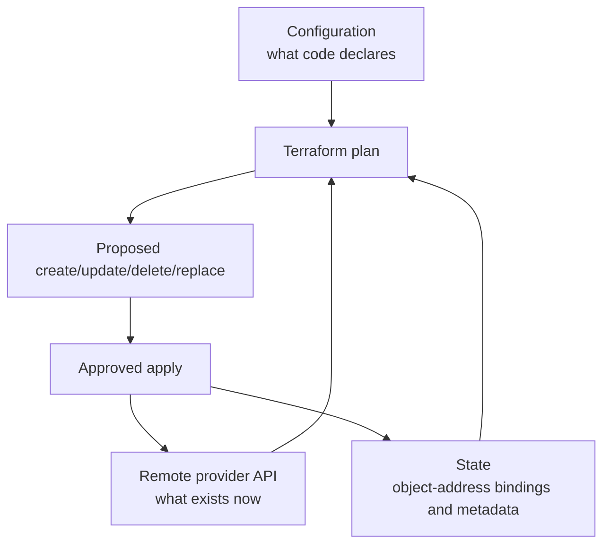
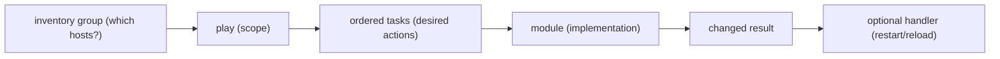
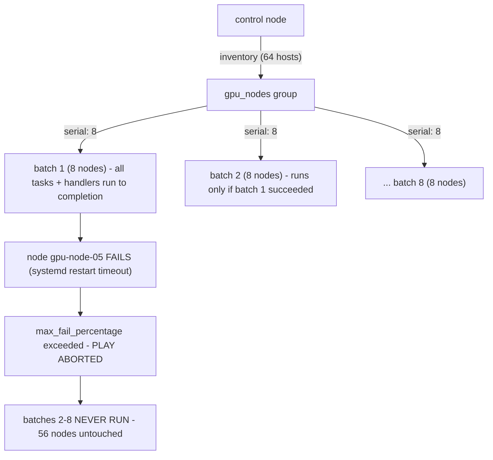

## Foundations: start here if Infrastructure as Code is new to you

### Why infrastructure needs code-like discipline

Imagine configuring ten servers manually. Six months later, nobody can prove whether they are identical, why one firewall rule differs, or how to rebuild after failure. Infrastructure as Code (IaC) stores intended infrastructure in version-controlled definitions so changes can be reviewed, repeated, tested and audited.

IaC does not make changes automatically safe. A repeatable destructive definition is still destructive. Safety comes from ownership boundaries, plans/diffs, tests, controlled credentials, small rollout scope, validation and recovery.

### Provisioning and configuration are related but different

| Concern | Example | Common tool in this volume |
|---|---|---|
| Provision infrastructure object | network, VM, IAM role, DNS record | Terraform through a provider API |
| Configure operating-system state | packages, users, files, services | Ansible over SSH or another connection |
| Manage bare-metal cluster lifecycle | images, node categories, provisioning | BCM |
| Schedule workload | allocate nodes/GPUs to jobs | Slurm/Kubernetes |

A tool can overlap these areas, but declare one authoritative owner for each object or field. Two reconcilers changing the same setting create oscillation and confusion.

### Terraform: declare API-managed resources

Terraform configuration describes resources. A **provider** translates Terraform operations into an external system's API. A **resource** represents one managed object. A **data source** reads information without managing that remote object's lifecycle.

```hcl
terraform {
  required_providers {
    local = {
      source  = "hashicorp/local"
      version = "~> 2.0"
    }
  }
}

resource "local_file" "cluster_note" {
  filename = "${path.module}/cluster-note.txt"
  content  = "environment=lab\ngpu_nodes=2\n"
}

output "note_path" {
  value = local_file.cluster_note.filename
}
```

The example uses a local provider so you can learn without cloud credentials. In production, providers may manage cloud, DNS, identity, Kubernetes or other APIs.

### Terraform's three views of reality



Terraform state primarily binds a resource address in configuration to the identity of a real remote object. For example, `aws_instance.worker[0]` may map to a particular cloud instance ID. Without that mapping, Terraform cannot reliably know which object it owns.

State may contain sensitive values. Team use normally requires a secure remote backend, access control, encryption, recovery/versioning and locking where supported. Do not commit production state to Git or edit its JSON directly.

### The Terraform workflow, with interpretation

```bash
terraform init
terraform fmt -check
terraform validate
terraform plan -out=tfplan
terraform show tfplan
terraform apply tfplan
```

| Command | What it proves | What it does not prove |
|---|---|---|
| `init` | providers/modules/backend initialization completed | configuration is safe |
| `fmt` | canonical formatting | semantic correctness |
| `validate` | syntax/internal schema consistency | credentials, real API outcome or policy correctness |
| `plan` | proposed changes from current config/state/provider observations | future apply cannot fail |
| `apply` | provider operations were attempted and state updated on success | workload/service outcome is healthy |

Plan symbols deserve deliberate review:

- `+` create;
- `~` update in place;
- `-` destroy;
- `-/+` replace (destroy/create lifecycle, often high risk).

Review identity/IAM, databases, network boundaries, DNS, storage and replacement actions carefully. A saved plan may contain sensitive data; protect it as an artifact.

### Terraform local lab

In an empty lab directory, save the previous HCL as `main.tf` and run:

```bash
terraform init
terraform plan -out=tfplan
terraform apply tfplan
cat cluster-note.txt
terraform state list
```

Then change `gpu_nodes=2` to `gpu_nodes=3`, run a new plan, and predict whether the file is updated or replaced. Finally run `terraform destroy` only in this disposable lab and inspect the proposed deletion before confirming.

The lesson is not local-file management. It is the write → plan → review → apply → verify loop and the role of state.

### Drift and import

**Drift** occurs when real infrastructure changes outside the declared workflow. Terraform refreshes provider observations during normal planning and may propose restoration or another action depending on configuration and provider behavior.

Import brings an existing object under a Terraform resource address. Import does not automatically design correct configuration or ownership. After import, produce a plan and reconcile configuration until the intended no-change baseline is understood.

### Modules: create an interface, not a hiding place

A Terraform module groups resources behind inputs and outputs. Good modules encode a useful architecture boundary with documented assumptions. Bad modules expose dozens of pass-through variables or hide dangerous lifecycle behavior.

Treat module inputs/outputs as an API:

- validate inputs;
- choose safe defaults;
- pin/version module sources;
- document created resources and destructive changes;
- expose only useful outputs;
- test upgrade and migration behavior.

### Ansible: converge host configuration

Ansible commonly runs from a control node and connects to managed nodes. An **inventory** organizes hosts/groups. A **play** targets hosts. **Tasks** invoke modules. Modules inspect or change state and return structured results. A **handler** runs when notified by a changed task, often to restart/reload a service.

```ini
# inventory.ini
[gpu_nodes]
gpu-01.example.net
gpu-02.example.net
```

```yaml
---
- name: Configure time synchronization on GPU nodes
  hosts: gpu_nodes
  become: true
  serial: 1
  tasks:
    - name: Install chrony
      ansible.builtin.package:
        name: chrony
        state: present

    - name: Deploy chrony configuration
      ansible.builtin.template:
        src: chrony.conf.j2
        dest: /etc/chrony.conf
        owner: root
        group: root
        mode: "0644"
      notify: Restart chrony

    - name: Ensure chrony is enabled and running
      ansible.builtin.service:
        name: chronyd
        enabled: true
        state: started

  handlers:
    - name: Restart chrony
      ansible.builtin.service:
        name: chronyd
        state: restarted
```

### Idempotency is observed behavior

An operation is idempotent when repeating it with the same desired state does not create unintended additional effects. Many Ansible modules are designed to avoid changes when current state already matches. Shell commands are not automatically idempotent.

Test the claim:

1. run against a disposable target;
2. inspect `changed` results;
3. run again unchanged;
4. expect zero changes for stable state;
5. inspect service and application outcome;
6. introduce controlled drift and confirm convergence.

### Check mode, diff mode and their limits

```bash
ansible-playbook -i inventory.ini site.yml --check --diff --limit gpu-01.example.net
```

Official Ansible documentation is explicit: check mode is simulation. Modules without support may do nothing/report nothing, and tasks depending on registered results can behave differently. Diff output can expose secrets, so disable it for sensitive tasks and control log access.

Production safety adds:

- syntax/lint/test checks;
- inventory review;
- `--limit` or canary group;
- `serial` rollout and failure threshold;
- pre/post health checks;
- scheduler drain before disruptive node work;
- rollback or previous artifact;
- clear ownership for secrets and privilege escalation.

### Terraform versus Ansible through one example

Build a cloud GPU worker:

1. Terraform creates network, security identity, instance and DNS through APIs.
2. Image/bootstrap establishes minimal connectivity and identity.
3. Ansible configures OS packages, files, users and services—or a golden-image/BCM process owns those instead.
4. GPU/cluster tooling validates the node and admits it to scheduling.

Terraform should not use endless remote shell provisioners to become an accidental configuration-management system. Ansible should not create every cloud object through ad hoc API shell commands when a provider/state workflow should own them.

### A complete change-review checklist

Before applying:

- Which objects/hosts are targeted exactly?
- Which system is authoritative for each field?
- Are create/update/delete/replacement actions expected?
- Could the plan/diff expose secrets?
- What dependency and workload impact follows?
- Is the canary representative?
- What signals stop rollout?
- Is rollback tested and does it restore data/state?
- Who approves and who observes the change?

After applying:

- Did the tool finish successfully?
- Does actual infrastructure match intended state?
- Did service/workload SLOs remain healthy?
- Is there drift or partial success?
- Are state, inventory and documentation current?

### Official and local references

- [What is Terraform?](https://developer.hashicorp.com/terraform/intro)
- [Terraform language](https://developer.hashicorp.com/terraform/language)
- [Terraform workflow](https://developer.hashicorp.com/terraform/cli/run)
- [Terraform state](https://developer.hashicorp.com/terraform/language/state)
- [Purpose of Terraform state](https://developer.hashicorp.com/terraform/language/state/purpose)
- [Terraform plan tutorial](https://developer.hashicorp.com/terraform/tutorials/cli/plan)
- [Ansible inventory getting started](https://docs.ansible.com/projects/ansible/latest/getting_started/get_started_inventory.html)
- [Ansible modules](https://docs.ansible.com/projects/ansible/latest/module_plugin_guide/modules_intro.html)
- [Ansible check and diff mode](https://docs.ansible.com/projects/ansible/latest/playbook_guide/playbooks_checkmode.html)
- Local Staff guide: `consolidated_guides/infrastructure-as-code_consolidated.md`
- Local SRE guides: `foundations/15-terraform-infrastructure-as-code.md` and `18-ansible-and-host-automation.md`

### Check your understanding

**Q1: Why should Terraform and Ansible not both own the same setting?**
A: Two reconcilers can continually overwrite each other, making drift and incident ownership ambiguous. Assign one authoritative owner per object or field.

**Q2: What does a clean Terraform plan prove?**
A: It shows no proposed difference under the current configuration, state, and provider observations. It does not prove workload health or that unmanaged resources are correct.

**Q3: What evidence supports an Ansible idempotency claim?**
A: An unchanged second run against a controlled target reports zero changes and the service outcome remains correct; successful exit alone is insufficient.

### Glossary

- **IaC** — version-controlled definitions of intended infrastructure.
- **Provider** — Terraform integration that translates resource operations to an API.
- **State** — Terraform's binding between configuration addresses and real objects.
- **Inventory** — Ansible's target hosts and groups.
- **Idempotent** — repeated execution converges without unintended repeated effects.
- **Drift** — observed infrastructure differing from declared intent.

### Ready to continue

- Separate provisioning, host configuration, cluster lifecycle, and workload scheduling.
- Read a Terraform plan for create, update, destroy, and replacement actions.
- Explain the limits of Ansible check mode and Terraform plans.
- Define canary scope, stop signals, rollback, and post-change validation.

**Learning outcome:** Explain how Ansible's push model, inventory, and idempotency guarantees are used to make configuration changes across a GPU fleet safely and predictably — including why "idempotent" is a claim you verify, not one you assume.

## Start here — read an Ansible run as a sentence

Ansible answers: **on these machines, make these facts true**. Its basic nouns fit together like this:



- An **inventory** names hosts and groups such as `gpu_nodes` or `login_nodes`.
- A **play** maps a group to tasks and execution settings.
- A **task** calls a **module** such as `package`, `template`, `service`, or `user`.
- A **role** packages tasks, templates, defaults, handlers, and tests around one responsibility.
- A **handler** runs only when notified by a task that actually changed something, commonly to restart a service.

Prefer a purpose-built module over `shell` or `command`. A module can inspect current state and report `ok` when no action is needed. A shell command usually cannot know that unless you implement the detection yourself.

```yaml
- name: Keep chrony installed and running
  hosts: gpu_nodes
  become: true
  tasks:
    - name: Install the package
      ansible.builtin.package:
        name: chrony
        state: present

    - name: Enable and start the service
      ansible.builtin.service:
        name: chronyd
        enabled: true
        state: started
```

Run it twice in a disposable environment. The first run may report changes; the second should report none. That is the simplest idempotency test. `--check --diff` is valuable preview evidence, but modules and external commands do not all simulate perfectly. Production safety also needs syntax/lint tests, a small canary group, `serial`, explicit health checks, and an abort threshold.

## Push model and inventory

Ansible has no persistent agent on managed hosts. A control node connects over SSH, pushes a Python-based module payload, executes it, and disconnects. There is nothing running on a compute node between runs — no daemon polling a server, no local state cache. This is the operational contrast worth having ready against BCM or Puppet: those run a resident agent that periodically re-converges toward a desired state on its own schedule; Ansible only acts when someone (or something) invokes `ansible-playbook`. That means Ansible cannot self-heal drift between runs — a node that gets manually changed at 2am stays changed until the next scheduled or manual run — but it also means there is no agent process consuming resources on every GPU node, no agent to patch/upgrade fleet-wide, and no agent-based attack surface to reason about.

Inventory defines what "the fleet" means to a given run:

```
# static inventory: /etc/ansible/hosts.ini
[gpu_nodes]
gpu-node-[01:64].cluster.local

[gpu_nodes:vars]
ansible_user=admin
nvidia_driver_version=550.90.07

[login_nodes]
login-[01:02].cluster.local

[dgx_a100]
gpu-node-[01:32].cluster.local

[dgx_h100]
gpu-node-[33:64].cluster.local
```

Static inventory is fine for a fixed bare-metal fleet where node names are stable and known in advance — the common case for an on-prem GPU cluster racked and cabled once. Dynamic inventory replaces the file with a script/plugin that queries a source of truth at run time:

```
ansible-inventory -i inventory/bcm_dynamic.py --list
ansible-playbook -i inventory/bcm_dynamic.py site.yml --limit dgx_h100
```

A dynamic inventory plugin against BCM's CMDaemon API, a Slurm node-list export, or a cloud provider's API means the inventory is never stale relative to the actual fleet — nodes added/decommissioned/RMA'd show up automatically instead of requiring someone to hand-edit an `.ini` file. For a GPU fleet with regular hardware churn (failed HBM, PSU replacements, RMA cycles), stale static inventory is a real operational risk: a playbook that thinks a decommissioned node is still a target will either fail loudly (host unreachable — the safe failure) or, worse, succeed against a node that was pulled from the rack for a different reason and shouldn't be touched.

## Playbooks, roles, and idempotency

A playbook is a list of plays; each play maps a set of hosts to a list of tasks; tasks invoke modules. Roles package related tasks, handlers, templates, and default variables into a reusable, testable unit — `roles/dcgm_exporter/`, `roles/nvidia_driver/`, `roles/nccl_tuning/` are natural role boundaries on a GPU fleet.

Idempotency means running the same playbook twice produces the same end state, and the second run reports no changes if nothing needs to change. This is not automatic — it is a property of which modules you use and how you use them. `command: rm -rf /old_config` is not idempotent (it succeeds and reports "changed" every time, whether or not the file existed). `file: path=/old_config state=absent` is idempotent (Ansible checks current state first, reports "changed" only on the run that actually removes something, and reports "ok" thereafter).

Why this matters specifically for a GPU fleet: re-running a playbook against a cluster is a routine operational act — you re-run it after adding new nodes, after a partial failure, as a scheduled drift check, or just to confirm compliance before a big training run. If the playbook is not truly idempotent, every re-run either (a) falsely reports "changed" on healthy nodes, burying the one node that actually needs attention in noise, or (b) worse, actively re-executes a disruptive action — restarting a service, regenerating a config that bounces `nvidia-persistenced`, or reloading a kernel module — on a node that was already correctly configured and possibly mid-job. A GPU node running a multi-day training job does not tolerate a "harmless" idempotent-looking re-run that happens to restart the DCGM exporter and drop five seconds of health-metric continuity, let alone one that restarts something GPU-driver-adjacent.

## Handlers and change notification

Handlers run only when a task notifies them, and only once per play even if notified multiple times — this is how you avoid restarting a service once per task that touched its config, and instead restart it exactly once after all relevant tasks in the play have run:

```yaml
- name: Deploy DCGM exporter config
  template:
    src: dcgm-exporter.yaml.j2
    dest: /etc/dcgm-exporter/dcgm-exporter.yaml
    owner: root
    mode: "0644"
  notify: restart dcgm-exporter

- name: Deploy DCGM exporter metrics allowlist
  copy:
    src: files/dcp-metrics.csv
    dest: /etc/dcgm-exporter/dcp-metrics.csv
  notify: restart dcgm-exporter

handlers:
  - name: restart dcgm-exporter
    systemd:
      name: dcgm-exporter
      state: restarted
```

Both tasks can notify the same handler; it fires once, at the end of the play, only if at least one of the notifying tasks actually reported `changed`. If neither task changed anything, the handler never fires — the restart is a *consequence* of a real change, not an unconditional step in the playbook.

## Ansible Vault for secrets

Vault encrypts variable files (or inline strings) with AES256 so secrets — Slurm accounting DB passwords, DCGM exporter TLS keys, NGC API tokens used by node-level pull credentials — can live in the same git repo as the playbooks without being readable in plaintext:

```
ansible-vault encrypt group_vars/gpu_nodes/secrets.yml
ansible-vault view group_vars/gpu_nodes/secrets.yml
ansible-playbook site.yml --vault-password-file /run/secrets/vault_pass
```

Vault-encrypted files diff as opaque ciphertext in git, which is the trade-off to know: you get secrets-in-git without secrets-in-plaintext-in-git, but you lose meaningful `git diff` review on the secret content itself — a code reviewer can see *that* a vaulted file changed, not *what* changed inside it, so vault content changes need a different review path (e.g., a controlled `ansible-vault view` walkthrough) than ordinary PR diffing.

## Dry-run and safe verification: `--check` and `--diff`

Before touching a production GPU fleet, run the playbook in check mode:

```
ansible-playbook site.yml --limit gpu_nodes --check --diff
```

`--check` runs every task's "would this change anything" logic without actually applying the change (module support varies — most core modules support it fully; some, particularly ones that shell out via `command`/`shell`, cannot meaningfully predict their own effect and will just report skipped or always-changed). `--diff` shows the actual before/after content diff for file and template changes, which is where you catch real problems before they hit hardware — see the worked scenario below. `ansible-lint` catches structural and style problems (deprecated syntax, missing handlers, unpinned versions, tasks without `name:`) before you even get to check mode:

```
ansible-lint playbooks/deploy_dcgm_exporter.yml
```

Routine practice on a fleet this size: lint → `--check --diff` on a single canary node → `--check --diff` on the full inventory → real run with `serial:` batching.

## Rolling rollout with `serial:` — limiting blast radius

```yaml
---
- name: Roll out DCGM exporter config update
  hosts: gpu_nodes
  serial: 8
  max_fail_percentage: 10
  tasks:
    - name: Deploy exporter config
      template:
        src: dcgm-exporter.yaml.j2
        dest: /etc/dcgm-exporter/dcgm-exporter.yaml
      notify: restart dcgm-exporter
  handlers:
    - name: restart dcgm-exporter
      systemd:
        name: dcgm-exporter
        state: restarted
```

`serial: 8` processes the 64-node `gpu_nodes` group in batches of 8: the entire play (all tasks, all handlers) runs to completion on batch 1 before batch 2 starts. `max_fail_percentage: 10` halts the whole run if more than 10% of hosts in a batch fail — on an 8-node batch that's a single host, so effectively any real failure stops further batches from starting. This is the mechanism that turns "one bad config pushed to 64 nodes" into "one bad config caught on 8 nodes, 56 nodes never touched."



## Annotated real run

```
$ ansible-playbook site.yml --limit gpu_nodes --check --diff

PLAY [Roll out DCGM exporter config update] **********************************

TASK [Deploy exporter config] *************************************************
--- before: /etc/dcgm-exporter/dcgm-exporter.yaml
+++ after: /etc/dcgm-exporter/dcgm-exporter.yaml
@@ -3,7 +3,7 @@
 metrics:
   - DCGM_FI_DEV_GPU_UTIL
   - DCGM_FI_DEV_FB_USED
-  - DCGM_FI_DEV_POWER_USAGE
+  - DCGM_FI_DEV_POWER_USAGE_INSTANT
   - DCGM_FI_DEV_SM_CLOCK
changed: [gpu-node-01]
changed: [gpu-node-02]
ok: [gpu-node-03]
ok: [gpu-node-04]
...

PLAY RECAP *********************************************************************
gpu-node-01  : ok=1  changed=1  unreachable=0  failed=0
gpu-node-02  : ok=1  changed=1  unreachable=0  failed=0
gpu-node-03  : ok=1  changed=0  unreachable=0  failed=0
gpu-node-04  : ok=1  changed=0  unreachable=0  failed=0
```

Read this before running for real: `gpu-node-01` and `gpu-node-02` still have the old metric name — they haven't been updated since the last config revision. `gpu-node-03`/`04` are already current (`changed=0`), meaning a previous partial run got that far. The `--diff` output tells you exactly what will change, on exactly which hosts, before a single byte is written or a single handler fires — this is the review gate, not a formality.

## Worked scenario — a playbook that looked idempotent but wasn't

**Situation:** A templated Fluent Bit / DCGM exporter sidecar config is deployed via a Jinja2 `template:` task rendering a Python-dict-derived YAML block. Every `--check --diff` run — even against nodes nobody touched since the last run — reports `changed: [gpu-node-NN]` for every single node, every single time, with a diff showing the same keys reordered (`metrics:` block re-emitted in a different order each render).

**Root cause:** The template iterates over a dictionary (`{{ dcgm_metrics_dict }}`) that was populated from a `set_fact` built by unioning two other dicts at play time. Dict key order in the underlying data structure was not guaranteed stable across runs (compounded by a `group_vars` merge across two files whose merge order depended on filesystem directory listing order, which is not guaranteed sorted on all target OS versions). The rendered YAML was semantically identical every time — same keys, same values — but textually different, and `template:`'s idempotency check is a content hash comparison: any byte-level difference, including whitespace/ordering, is "changed."

**Consequence:** This false "changed" on every node, every run, trained the on-call rotation to ignore the `changed=` count in `PLAY RECAP` entirely — "it always says changed, that's normal for this playbook." Three weeks later, a real unauthorized change (a manually edited allowlist file on two nodes) landed inside that same noisy "always changed" signal and went unnoticed for eleven days, because nobody was reading the diffs anymore — the alert fatigue from the false positive had trained the team to stop looking at the true positive.

**Fix:** Convert the source data to an explicitly sorted, ordered structure before templating (`dict2items | sort(attribute='key')` in the Jinja filter chain, or switch the underlying data to a list of `{key, value}` pairs with a fixed order) so the rendered output is byte-stable across runs when nothing semantically changed. Re-verified with three consecutive `--check --diff` runs against an untouched node showing zero diff — that is the actual definition of "idempotent," not "the playbook completes without error."

**Interview-ready line:** "Idempotent means a second run with no external change produces zero diff, not that a second run merely succeeds — module exit-status idempotency and content idempotency are different guarantees, and templated configs specifically can satisfy the first while failing the second."

## Mnemonic

**P.I.C.H.V.** — **P**ush (no agent) → **I**nventory (static or dynamic) → **C**heck/diff before apply → **H**andlers fire once, on real change → **V**ault for anything secret. Say it in that order and you've covered the safe-change lifecycle end to end.

## Practice

1. Explain why Ansible's push model, with no resident agent, is operationally different from BCM's or Puppet's continuous-reconciliation agent model — and name one advantage and one disadvantage of each for a 500-node GPU fleet.
2. A colleague says "the playbook is idempotent, it ran successfully both times." What's missing from that claim, and what command output would you ask them to show to actually verify idempotency?
3. Write the `serial:` and `max_fail_percentage:` values you'd choose for a 200-node fleet rollout of a change that touches the NVIDIA driver stack, and justify the batch size in terms of blast radius versus rollout speed.
4. A `--check --diff` run shows `changed` on a templated config for every node on every run, even when nobody has touched those nodes. Name two possible root causes and the one command/technique that would distinguish between them.
5. Why does `ansible-vault`-encrypted content undermine normal `git diff`-based code review, and what alternative review step would you insist on before merging a change to a vaulted secrets file?
