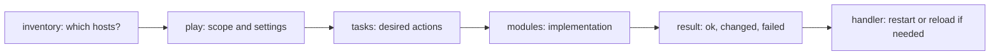
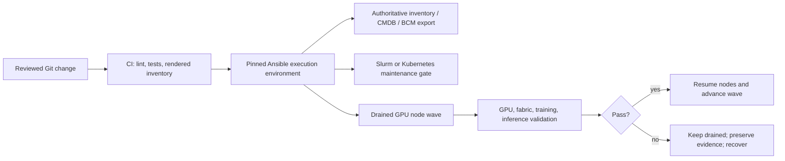
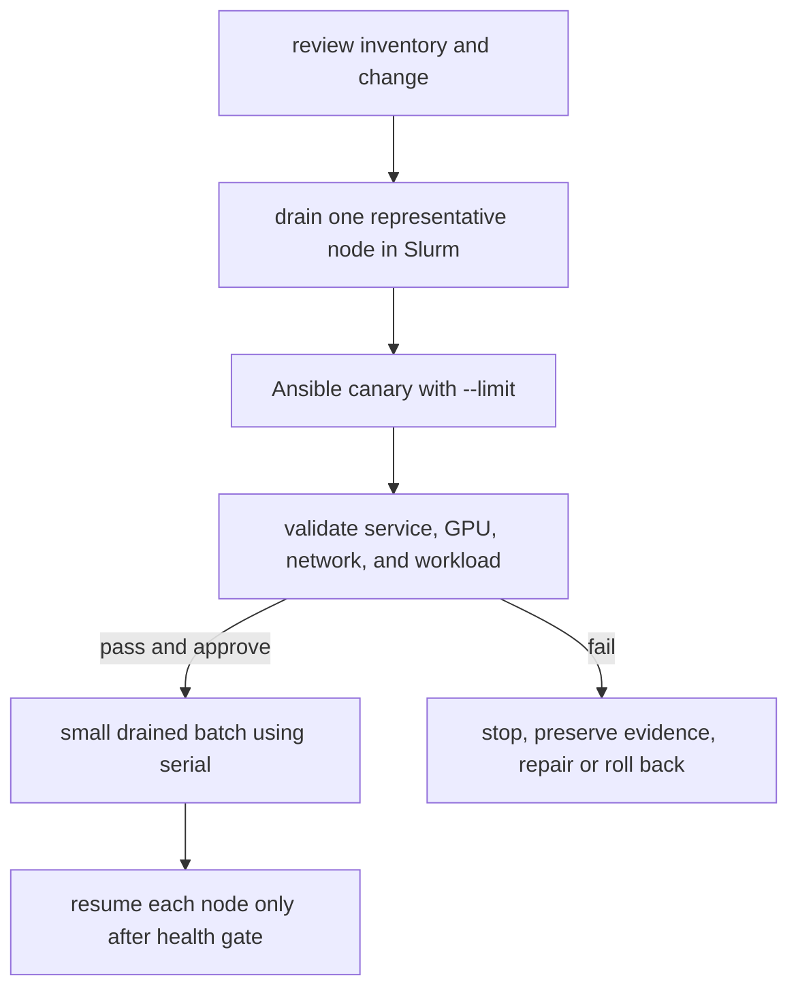

**Learning outcome:** Build, explain, and safely operate an Ansible project that configures bare-metal GPU nodes. You will be able to reason about inventory, plays, tasks, modules, variables, roles, idempotency, secrets, and staged production rollout.

**Prerequisites:** Linux shell, SSH, YAML, package management, and basic `systemctl` use. **Difficulty:** Beginner to advanced. **Estimated reading time:** 100 minutes plus hands-on practice.

## Foundations: start here if Infrastructure as Code is new to you

Infrastructure as Code stores the intended configuration of a fleet in reviewable files instead of relying on manual commands and memory. Ansible is a configuration-management tool: it connects to existing hosts and makes operating-system state conform to a declared intent.

It is useful to keep the boundaries clear in a bare-metal GPU cluster:

| System | Primary responsibility | Example |
|---|---|---|
| BMC/Redfish (Baseboard Management Controller — a small independent service processor built into a server that can power-cycle, console into, and inventory the machine even when its OS is unresponsive; Redfish is the standard HTTP/JSON API most modern BMCs expose for that control) | Hardware power and console | Power-cycle a failed server |
| BCM (Base Command Manager — NVIDIA's cluster-management platform for provisioning, imaging, and monitoring bare-metal GPU fleets) | Image, provisioning, category lifecycle | Boot a node into an approved OS image |
| Ansible | Repeated host configuration | Install a package and deploy a service configuration |
| Slurm | Workload scheduling and node admission | Drain a node before disruptive maintenance |
| Terraform | API-managed infrastructure | Create DNS, IAM, or cloud networking objects |

Do not let two tools own the same file, package, service, or image. For example, if BCM rebuilds `/etc/slurm/slurm.conf` from an image, an Ansible task that manages the same file creates an ownership conflict. Decide and document the owner first.

## The problem Ansible solves

Imagine 64 compute nodes. A security update requires a package, a configuration file, and a service reload. Logging into every server produces three problems:

1. The commands may differ from node to node.
2. Nobody has a durable record of what changed.
3. A partial failure is difficult to identify and safely retry.

Ansible lets you state the desired result once and apply it to an explicit target set. It does not make the change safe by itself. Safety comes from correct targeting, a small initial scope, review, validation, and a rollback path.

## Ansible structure in one picture

Read an Ansible run as: **on these hosts, make these facts true, in this order**.



| Term | Meaning | Bare-metal example |
|---|---|---|
| Control node | Machine that runs Ansible | Admin workstation or CI runner |
| Managed node | Machine configured by Ansible | `gpu-node-01` |
| Inventory | Hosts and groups that Ansible may target | `gpu_nodes`, `login_nodes` |
| Play | A host target plus execution settings | Apply baseline to `gpu_nodes` |
| Task | One ordered action | Ensure `chrony` (a Network Time Protocol daemon that keeps a host's clock synchronized against reference time servers — clock skew across nodes breaks distributed job timing, log correlation, and certain authentication protocols) is installed |
| Module | Code that performs a task | `ansible.builtin.package` |
| Role | Reusable unit of tasks, defaults, handlers, and templates | `roles/node_baseline` |
| Handler | Action triggered by a changed task | Restart `chronyd` after config changes |

## How Ansible reaches a bare-metal node

Ansible normally uses SSH. The control node connects, transfers or invokes a module, collects a structured result, and disconnects. There is normally no persistent Ansible agent polling each compute node. Most Unix modules require Python on the managed host; the `raw` module is a bootstrap exception when Python is not available yet.

This push model means Ansible only converges configuration when an operator or automation runs it. A manual edit at 2 a.m. remains until the next approved run. Schedule configuration runs deliberately and collect their results as change evidence.

## A study path: beginner to AI-factory operator

Do not try to memorize every Ansible keyword before you operate a GPU node. Build capability in this order, and prove each stage on disposable hosts before moving to the next one.

| Stage | You should be able to do | Evidence that you are ready to advance |
|---|---|---|
| 1. Foundations | Read inventory, write a play, use `package`, `service`, `template`, and `become` | A two-node baseline play has a clean second run |
| 2. Reusable automation | Move a responsibility into a role; use defaults, group variables, handlers, and Vault | A reviewer can change a node-class value without editing task logic |
| 3. Safe change execution | Use `--limit`, `--check --diff`, `serial`, assertions, and clear validation | A canary failure stops expansion and leaves the node drained |
| 4. Fleet engineering | Build inventory from an authoritative source; test roles; run a pinned automation environment from CI | A pull request produces lint, test, inventory-diff, and canary evidence |
| 5. AI-factory operations | Coordinate Slurm or Kubernetes, BCM/image ownership, GPU diagnostics, fabric checks, and workload gates | A representative training and inference test passes before a wave is resumed |

Ansible is not the control plane for every layer. At thousands of nodes, it is most effective as the controlled configuration and orchestration layer around systems with specialized ownership:



The automation runner should not decide that a node is safe merely because a task succeeded. The scheduler owns workload admission; BCM or an image pipeline may own provisioning and driver state; the validation gate determines whether the node returns to service.

## Workbook setup

Use a disposable control node and one or more disposable hosts for this workbook. Do not point these commands at a production cluster until identity, inventory, ownership, change approval, and rollback have been reviewed.

### 1. Create the project layout

Purpose: create a predictable place for inventory, playbooks, roles, and variables.

```text
ansible-baremetal/
├── ansible.cfg
├── collections/
│   └── requirements.yml
├── execution-environment/
│   └── execution-environment.yml
├── inventory/
│   ├── production.yml
│   └── generated/                 # CI-generated; do not hand-edit
├── group_vars/
│   └── gpu_nodes.yml
├── playbooks/
│   ├── ping.yml
│   ├── baseline.yml
│   ├── preflight.yml
│   └── rollout.yml
└── roles/
    └── node_baseline/
        ├── defaults/main.yml
        ├── handlers/main.yml
        ├── tasks/main.yml
        └── templates/chrony.conf.j2
```

Expected evidence: the files are version-controlled and a reviewer can locate each responsibility without reading one enormous playbook.

Common failure: putting production passwords, private keys, or vault passwords in this directory as plaintext. Store only encrypted secret material or references to an approved secret-delivery mechanism.

### 2. Configure Ansible defaults

Purpose: make project behavior explicit rather than relying on a user's global configuration.

```ini
# ansible.cfg
[defaults]
inventory = inventory/hosts.ini
interpreter_python = auto_silent
host_key_checking = True
retry_files_enabled = False
```

`host_key_checking = True` prevents Ansible from silently accepting an unexpected SSH host key. Keep it enabled in production. Establish trusted host keys through your provisioning and SSH trust process.

### 3. Define a static inventory

Purpose: define exactly which hosts can be targeted.

```ini
# inventory/hosts.ini
[gpu_nodes]
gpu-node-01.cluster.example
gpu-node-02.cluster.example

[login_nodes]
login-01.cluster.example

[gpu_nodes:vars]
ansible_user=automation
```

Expected evidence: `gpu_nodes` contains only the intended compute nodes. A host can belong to more than one group, so review group membership carefully.

Inspect the parsed inventory before a change:

```bash
ansible-inventory --graph
ansible-inventory --list
```

Expected evidence: the graph shows the expected hosts under each group; the JSON output contains the intended connection variables.

Common failure: a hostname resolves to an old address, a group includes an unintended node, or a stale dynamic inventory cache returns obsolete hosts. Stop and correct targeting before running a playbook.

### 3a. Model failure domains, not just host names

A 1,000-node AI factory is not one homogeneous `gpu_nodes` group. Node selection must encode the dimensions that determine blast radius and validation coverage: GPU SKU, NIC and firmware generation, rack or fabric pod, storage path, operating-system image, scheduler partition, and workload class. A rollout against `gpu_nodes` alone is an unsafe abstraction.

```yaml
# inventory/production.yml -- a small illustrative static export
all:
  children:
    gpu_nodes:
      children:
        gpu_h100_cx7:
          hosts:
            gpu-a-001:
              rack: rack-a
              slurm_partition: training
              gpu_sku: H100
              nic_sku: ConnectX-7
              image_id: gpu-rhel9-2026-09-01
        gpu_l40s_cx6:
          hosts:
            gpu-b-001:
              rack: rack-b
              slurm_partition: inference
              gpu_sku: L40S
              nic_sku: ConnectX-6
              image_id: gpu-rhel9-2026-09-01
    canary_gpu_nodes:
      children:
        gpu_h100_cx7:
        gpu_l40s_cx6:
```

This file is deliberately small. In production, generate it from the approved source of truth, such as a CMDB, IPAM/DCIM system, a cluster-manager export, or a cloud inventory. Review the generated inventory diff in the pull request and preserve it with the change evidence. Do not let an Ansible play discover a broad set of hosts and mutate them without an independently reviewed target list.

Inventory grouping is not a substitute for a representative canary. A driver or fabric change must include at least one canary for every relevant hardware and firmware combination. See [Chapter 10: coordinated cluster-wide software change management](./chapter-10-coordinated-cluster-wide-software-change-management) for the compatibility-matrix method.

### 3b. Make the control environment reproducible

The version of Ansible, Python, collections, and their dependencies can alter module behavior. A laptop with an unpinned global installation is acceptable for a disposable exercise, not for a production AI factory. Pin collections and run the same execution environment in CI and during an approved production change.

```yaml
# collections/requirements.yml
---
collections:
  - name: ansible.posix
  - name: community.general
```

```yaml
# execution-environment/execution-environment.yml
---
version: 3
dependencies:
  galaxy: ../collections/requirements.yml
```

Use an approved base image and record its immutable digest in the delivery pipeline. The files above specify dependencies, but they do not by themselves make an image trustworthy: review collection release notes, scan the resulting image, and promote the exact tested image digest. Add only the vendor or site collection required for a documented integration; every collection expands the code executed with your automation privileges.

For a production repository, add `ansible-lint` and YAML linting to CI. Test role behavior in an isolated environment where feasible, but do not claim a container-based role test proves a kernel driver, GPU, RDMA fabric, or scheduler integration. Those require a representative hardware canary.

### 4. Test transport before changing anything

Purpose: prove SSH connectivity, remote Python availability, and the automation identity before a mutating run.

```bash
ansible gpu_nodes -m ansible.builtin.ping --limit gpu-node-01.cluster.example
```

Expected evidence:

```text
gpu-node-01.cluster.example | SUCCESS => {
    "ping": "pong"
}
```

The `ping` module is not ICMP ping. It confirms that Ansible connected and executed its module.

Common failure interpretation:

| Result | Meaning | First action |
|---|---|---|
| `UNREACHABLE` | SSH, DNS, route, credential, or host availability failed | Test SSH manually and check the host's management state |
| Python interpreter error | Python is unavailable or incorrectly selected | Bootstrap the supported Python package through the approved image/provisioning path |
| `Permission denied` | The automation identity or SSH key is wrong | Correct access; do not fall back to a shared administrator account |

## Your first playbook

A playbook is YAML containing one or more plays. This first play is read-only.

```yaml
# playbooks/ping.yml
---
- name: Verify GPU node connectivity
  hosts: gpu_nodes
  gather_facts: false
  tasks:
    - name: Confirm Ansible can execute modules
      ansible.builtin.ping:
```

Run it against one host first:

```bash
ansible-playbook playbooks/ping.yml --limit gpu-node-01.cluster.example
```

Purpose: prove the playbook path, inventory, target limit, and remote transport together.

Expected evidence: one host reports `ok=1`, `failed=0`, and `unreachable=0` in the recap.

`--limit` is a safety control, not just a convenience option. Start every new or changed production playbook with a specific canary host or canary group.

## Tasks and modules: declare state, do not replay commands

Prefer modules that describe the state you want. They can inspect current state and report `ok` when no mutation is needed.

```yaml
- name: Ensure chrony is installed
  ansible.builtin.package:
    name: chrony
    state: present

- name: Ensure chrony is enabled and running
  ansible.builtin.service:
    name: chronyd
    enabled: true
    state: started
```

Avoid this when a purpose-built module exists:

```yaml
- name: Do not use an unconditional command for package state
  ansible.builtin.command: dnf install -y chrony
```

`command` can be necessary, but it does not automatically know whether a change is needed. If you must use it, document why a module is insufficient and use `creates`, `removes`, `changed_when`, and `failed_when` only when their behavior is genuinely correct.

## Idempotency: the property you must prove

An idempotent configuration action reaches the desired state once and does not create additional unintended effects on an unchanged second run. It is not a property Ansible grants to every task.

Test it this way:

1. Run the play on one disposable or drained canary node.
2. Validate the resulting service and, when relevant, the GPU workload outcome.
3. Run the unchanged play again.
4. Expect the second run to report no unexpected `changed` results.
5. Introduce controlled drift on the canary and prove the play restores the intended state.

A successful exit code is not sufficient evidence. A task can succeed while continually rewriting a file, restarting a service, or hiding a failure behind an incorrect `changed_when` expression.

## Variables: make configuration explicit

Variables let one role work for multiple node groups, but uncontrolled overrides make a fleet difficult to reason about.

```yaml
# group_vars/gpu_nodes.yml
chrony_service_name: chronyd
chrony_config_path: /etc/chrony.conf
chrony_servers:
  - time-01.cluster.example
  - time-02.cluster.example
```

Use role defaults for values that are safe to override and group variables for values shared by a node class. Avoid passing large sets of `--extra-vars` in production: extra variables have very high precedence and can silently override intended policy.

For an interview, explain variable precedence as a risk-management issue: know the approved override point for a setting, keep variables close to their scope, and inspect resolved behavior in a canary rather than relying on memory alone.

## Templates and handlers

Use `template` when a configuration file needs variables. A handler reloads or restarts a service only when the template actually changes.

```yaml
# roles/node_baseline/tasks/main.yml
---
- name: Install time synchronization package
  ansible.builtin.package:
    name: chrony
    state: present

- name: Render chrony configuration
  ansible.builtin.template:
    src: chrony.conf.j2
    dest: "{{ chrony_config_path }}"
    owner: root
    group: root
    mode: "0644"
  notify: Restart chrony

- name: Ensure chrony is enabled and running
  ansible.builtin.service:
    name: "{{ chrony_service_name }}"
    enabled: true
    state: started
```

```yaml
# roles/node_baseline/handlers/main.yml
---
- name: Restart chrony
  ansible.builtin.service:
    name: "{{ chrony_service_name }}"
    state: restarted
```

```jinja2
# roles/node_baseline/templates/chrony.conf.j2

server {{ server }} iburst

```

Handlers run when notified by a changed task and normally run once at handler flush points. If a later task needs the restarted service, use `meta: flush_handlers` deliberately before that validation. Do not restart GPU-driver-adjacent services without draining the node and assessing workload impact.

## Build and run a baseline play

```yaml
# playbooks/baseline.yml
---
- name: Apply the Linux baseline to GPU nodes
  hosts: gpu_nodes
  become: true
  gather_facts: true
  roles:
    - role: node_baseline
```

Purpose: use the `node_baseline` role to manage a reusable configuration responsibility.

Validate syntax first:

```bash
ansible-playbook playbooks/baseline.yml --syntax-check
```

Expected evidence: Ansible reports successful syntax validation. This does not connect to hosts or prove that variable values, package repositories, or services are correct.

Preview the canary:

```bash
ansible-playbook playbooks/baseline.yml --limit gpu-node-01.cluster.example --check --diff
```

Expected evidence: supported modules show their proposed changes. Review every target and file diff.

Important limit: check mode is a simulation. Modules vary in support, commands may not simulate meaningfully, and a check run cannot prove a service will restart or that a GPU workload will remain healthy.

Apply only after review:

```bash
ansible-playbook playbooks/baseline.yml --limit gpu-node-01.cluster.example
```

Expected evidence: the recap identifies whether each task was `ok`, `changed`, `failed`, or `unreachable`. Follow it with a service-level test such as `systemctl is-active chronyd` and, for a GPU-affecting change, the approved GPU and workload validation.

## Production execution controls

At fleet scale, a correct task with an incorrect execution policy is still an incident. Put the policy in the playbook so it is reviewed with the change rather than supplied from an operator's memory.

| Control | What it prevents | Use it deliberately |
|---|---|---|
| `--limit` | An unintended inventory-wide run | Require a named canary or approved wave group for every production run |
| `serial` | Too many nodes changing at once | Set batches from spare capacity, drain rate, and validation time |
| `max_fail_percentage` | Continuing after an unacceptable failure rate | Use only with a defined threshold; do not combine it with an unclear recovery plan |
| `any_errors_fatal` | Starting more hosts after a critical failure | Appropriate for disruptive, homogeneous waves |
| `strategy: linear` | Hosts progressing through a play independently | Prefer it for coordinated maintenance; use `free` only where independent progress is safe |
| `throttle` | Overloading a shared service such as a repository, BMC, or license service | Apply it to the task that has the constrained dependency |
| `run_once` and `delegate_to` | Repeating a cluster-level operation per host | Use for a single scheduler or API action, then verify the result per host |
| `tags` | Running broad unrelated work during an urgent change | Tag responsibilities; never make tags a substitute for target and approval controls |

Use assertions to stop before mutation when the requested state conflicts with the approved change. For example, a driver role should refuse to act if the node's image pipeline owns driver state:

```yaml
# playbooks/preflight.yml
---
- name: Reject an unsafe GPU-node change before mutation
  hosts: gpu_nodes
  gather_facts: false
  any_errors_fatal: true
  vars:
    requested_change: dcgm_exporter_config
  pre_tasks:
    - name: Require an explicit approved target group
      ansible.builtin.assert:
        that:
          - inventory_hostname in groups['canary_gpu_nodes']
          - node_change_approved | default(false) | bool
        fail_msg: >-
          This play requires an approved canary group and explicit change approval.
    - name: Reject a driver mutation when the image owns driver state
      ansible.builtin.assert:
        that: requested_change != 'nvidia_driver' or driver_owner == 'ansible'
        fail_msg: >-
          The image or BCM lifecycle owns the NVIDIA driver. Change that source instead.
```

An assertion is a guardrail, not an approval system. Bind `node_change_approved` to reviewed pipeline input or a change-management integration, protect who can set it, and retain the resulting run record. An unprotected `--extra-vars node_change_approved=true` bypasses the intent of the control.

### Failure handling that preserves the node boundary

`block`, `rescue`, and `always` are useful for keeping a failed node out of service and collecting useful evidence. They are not transactional rollback. A package, firmware, or configuration change may already be partially applied when `rescue` begins.

```yaml
    - name: Apply and validate a node-local change
      block:
        - name: Apply the reviewed role
          ansible.builtin.include_role:
            name: dcgm_exporter

        - name: Confirm that the exporter service is active
          ansible.builtin.command: systemctl is-active dcgm-exporter
          changed_when: false

      rescue:
        - name: Preserve the service journal for incident evidence
          ansible.builtin.command: journalctl -u dcgm-exporter --no-pager -n 200
          changed_when: false
          register: dcgm_exporter_journal

        - name: Keep the failed node unavailable to new work
          ansible.builtin.fail:
            msg: "Validation failed; leave this node drained and use the approved recovery path."

      always:
        - name: Record that the node reached the validation boundary
          ansible.builtin.debug:
            msg: "{{ inventory_hostname }} completed the change validation boundary"
```

The example intentionally does not issue a scheduler resume in `always`. Only a successful health gate should return a node to service. A real implementation should send the collected evidence to the approved log or incident system without placing secrets in logs.

### Asynchronous work and reboots

Package downloads, image operations, and reboot waits can outlast the SSH connection. Use Ansible asynchronous execution only when the remote operation is safe to continue independently and you have a bounded polling, timeout, and recovery design. Do not use async to hide a slow or unobserved driver installation.

For a rebooting change, use `ansible.builtin.reboot` and follow it with explicit checks for the intended kernel, GPU driver, scheduler agent, network, storage, and workload behavior. A host answering SSH after reboot proves only that it booted.

## Roles: scale organization, not complexity

A role packages one responsibility. Good bare-metal role boundaries could be:

| Role | Owns |
|---|---|
| `node_baseline` | time sync, users, SSH policy, standard repositories |
| `dcgm_exporter` | the DCGM (Data Center GPU Manager, NVIDIA's GPU telemetry and health-monitoring daemon) Prometheus exporter package, configuration, and service |
| `slurm_client` | Slurm client configuration only when Ansible owns it |
| `nvidia_driver` | driver state only when the image/BCM process does not own it |

Do not create a role just to hide one task. Do create a role when the responsibility has reusable tasks, variables, templates, handlers, and tests. Pin collection versions and review role dependencies so a routine run cannot silently change behavior after an upstream release.

### Decide ownership before automating an AI factory

Ansible can invoke APIs or command-line tools, but invocation does not make Ansible the authoritative owner of their state. This distinction is central to reliable bare-metal automation.

| Layer | Typical owner | What Ansible may safely do after ownership is agreed |
|---|---|---|
| Power, BIOS, BMC, firmware | BMC/Redfish workflow and vendor lifecycle process | Orchestrate an approved workflow; collect state; never hide an irreversible flash in a general baseline role |
| OS image, kernel, NVIDIA driver, CUDA | BCM or golden-image pipeline, unless deliberately assigned otherwise | Validate the applied image; configure only the portions not baked into the image |
| Host baseline | Ansible | Accounts, SSH policy, time, repositories, logging, approved agents, and configuration files |
| Slurm controller and node admission | Slurm administration workflow | Coordinate drain, health checks, and resume through a restricted integration boundary |
| Kubernetes GPU and Network Operators | Kubernetes/GitOps controller | Configure host prerequisites only when their documented ownership does not overlap; observe operator state |
| Training and inference deployment | Platform/team-specific workflow | Submit bounded validation jobs and collect outcomes; do not use a host play to impersonate application deployment |

The dangerous anti-pattern is a role named `nvidia_driver` that installs packages on hosts while a golden image or GPU Operator also manages the driver. The next rebuild or reconciliation can undo the role, and the next play can undo the image. Choose one owner per stateful object and document the handoff.

## Test and delivery model

Treat each playbook change as production software with a different test pyramid. Static tests catch cheap errors; representative hardware validation catches the failures static tools cannot model.

| Gate | Example evidence | What it cannot prove |
|---|---|---|
| YAML and Ansible lint | `yamllint`, `ansible-lint`, syntax check | Live variables, package availability, hardware behavior |
| Role test | Isolated role converge and idempotence test | Actual kernel, GPU, NIC, storage, or scheduler behavior |
| Inventory review | Generated inventory graph and diff, target count by hardware class | That a node is currently safe to modify |
| Check/diff review | Proposed managed-file and supported-module changes | Runtime side effects or workload success |
| Hardware canary | Boot, GPU, fabric, and workload gates on representative drained nodes | Behavior in unrepresented fleet variants |
| Wave evidence | Recap, validation artifacts, capacity impact, rollback readiness | That an unrelated future change is safe |

The CI pipeline should run non-mutating checks on every pull request. A protected deployment pipeline should run the pinned execution environment, require the reviewed commit and inventory artifact, restrict credentials to the intended environment, and attach the result to the change record. Do not let CI use a broadly privileged SSH key capable of changing every environment.

For a role that manages persistent configuration, test idempotence explicitly: converge once, converge again, and fail the test if the second execution reports unplanned changes. For a GPU-affecting role, that test is necessary but not sufficient. The release gate remains a drained, representative hardware canary with a real workload signal.

## Secrets and privilege escalation

`become: true` gives the remote automation identity a privileged path on every selected node. Use a dedicated automation account, least-privilege sudo policy, and approved credential rotation. Do not solve an access problem by using a shared root SSH account.

Ansible Vault encrypts variable files or individual values. It protects the encrypted content, not the vault password, CI log, or decrypted runtime value.

```bash
ansible-vault encrypt group_vars/gpu_nodes/secrets.yml
ansible-playbook playbooks/baseline.yml --vault-password-file /run/secrets/ansible_vault_password
```

Expected evidence: Git contains ciphertext rather than plaintext secrets, and the vault-password file is supplied by a protected runtime mechanism.

For tasks that could print credentials or tokens, use `no_log: true` narrowly. Remember that it reduces diagnostic detail, so validate those tasks with an approved non-secret health signal.

## Safe rollout for bare-metal GPU nodes

Configuration that touches drivers, kernel parameters, networking, Slurm, storage clients, or node services can affect running work. Ansible has no built-in understanding of job safety. Integrate it with the scheduler and change process.



The following play demonstrates rollout mechanics. The `node_change_approved` variable is an approval guard, not proof that Slurm drained the host. Verify drain state through the scheduler's approved workflow before invocation.

```yaml
---
- name: Roll out a reviewed configuration change
  hosts: gpu_nodes
  serial: 1
  any_errors_fatal: true
  become: true
  pre_tasks:
    - name: Require explicit canary approval
      ansible.builtin.assert:
        that: node_change_approved | bool
        fail_msg: "Drain and approve the canary before this play."
  roles:
    - role: dcgm_exporter
  post_tasks:
    - name: Verify the exporter service is active
      ansible.builtin.command: systemctl is-active dcgm-exporter
      changed_when: false
```

Start with `serial: 1`. After the canary passes the required health and workload tests, change to a small, capacity-aware batch only through the approved change process. `any_errors_fatal` stops additional work after a failure; it does not automatically undo modifications already made. Keep the prior configuration or image available and understand the rollback command before starting.

## GPU-node validation: host health is not AI-factory health

Ansible should validate the layer that the change can break. A `systemctl` check is adequate for a configuration that affects only a daemon. It is inadequate for a change that can affect GPU discovery, RDMA, NCCL, storage, the scheduler, or an application runtime.

| Change scope | Minimum node-level evidence | Fleet or workload evidence before expansion |
|---|---|---|
| OS baseline or security policy | Boot, service state, identity, time synchronization, expected mounts | Scheduled smoke job still starts and writes to its expected storage path |
| NVIDIA driver, kernel, CUDA, or image | Driver loaded, expected GPU count, no relevant errors, scheduler agent registered | GPU diagnostic plus representative training job |
| DCGM or telemetry | Service and metrics endpoint active; exporter sees expected devices | Monitoring backend ingests expected labels and alerts remain meaningful |
| NIC, RDMA, fabric, NCCL, or firmware | NIC is present and configured; required kernel drivers are loaded | Multi-node collective test compared with a recorded baseline |
| Inference-serving node configuration | GPU and service readiness | Representative request, correctness check, throughput, and tail-latency gate |

Use site-approved commands and thresholds. The following example shows the shape of a read-only GPU discovery check; it does not replace NVIDIA diagnostics, fabric tests, or a workload test.

```yaml
- name: Read GPU inventory from the driver
  ansible.builtin.command: nvidia-smi --query-gpu=index,name,uuid,driver_version --format=csv,noheader
  changed_when: false
  register: gpu_inventory

- name: Require the expected GPU count for this node class
  ansible.builtin.assert:
    that: gpu_inventory.stdout_lines | length == expected_gpu_count | int
    fail_msg: >-
      GPU count does not match the node class. Keep the node drained and investigate.

- name: Inspect recent NVIDIA Xid messages
  ansible.builtin.command: journalctl -k --no-pager -b
  changed_when: false
  register: kernel_journal
  failed_when: "'NVRM: Xid' in kernel_journal.stdout"
```

An absence-of-Xid check is intentionally conservative and may need an approved exception process for known benign messages. More importantly, it does not establish fabric performance. For a training partition, run a scheduler-submitted, multi-node representative validation that exercises the same container runtime, network path, storage path, framework, and collective communication path as the workloads you protect. For an inference partition, send a known request through the serving path and compare correctness, throughput, and tail latency against the recorded baseline.

Do not run a destructive diagnostic or a synthetic workload on an allocated node. The scheduler must allocate or reserve the canary nodes first. The validation job should have a bounded runtime, an owner, captured logs, explicit pass/fail thresholds, and a cleanup path.

### Scheduler-aware orchestration

The safe unit of work is not "an Ansible host." It is "a scheduler-drained node that has passed the health gate." Keep scheduler actions in a small, separately reviewed integration boundary. Depending on the environment, that boundary can call a scheduler API, submit a workflow, or run an approved controller command from a tightly restricted automation identity.

The sequence is always the same:

1. Select a representative canary or wave from reviewed inventory.
2. Request drain-when-idle; do not kill long-running training merely to make an Ansible command convenient.
3. Verify that every selected node is actually drained and has no active allocation.
4. Apply the node-local role with `serial` matching the approved wave.
5. Run node, fabric, and workload validation through the scheduler.
6. Resume only nodes that passed every required gate. Keep failures drained and attach their evidence to the recovery decision.

For Slurm, the scheduler integration needs to distinguish `DRAIN` requested from a node that is fully idle and safe to modify. For Kubernetes, distinguish cordoning from draining, and respect workload disruption constraints and checkpoint behavior. Ansible should orchestrate these APIs or commands; it must not infer workload safety solely from SSH reachability. See [Chapter 6: Slurm administration, HA, accounting, and upgrades](./chapter-6-slurm-administration-ha-accounting-and-upgrades) and [Chapter 9: job provisioning, health gating, and workflow orchestration](./chapter-9-job-provisioning-health-gating-and-workflow-orchestration).

### Waves for thousands of nodes

Start with a canary set stratified by every compatibility dimension touched by the change. The next wave should be one or a few failure domains, not a random percentage of the entire fleet. A rack, fabric pod, power domain, image category, or scheduler partition can be a useful boundary depending on the failure you are trying to contain.

The batch size is a capacity calculation, not an Ansible default. It must preserve capacity for running training and inference, allow a failed wave to remain drained, avoid repository/BMC/control-plane overload, and leave enough time for the workload soak gate. A fleet change can therefore use `serial: 1` for the canary, `serial: 4` for a representative domain wave, and a larger explicitly approved value only after evidence supports it. Record the criteria for changing wave size in the change plan.

## Worked scenario — an idempotent-looking task that silently restarted every node's GPU workload

**Situation:** An operator adds a `template` task to `node_baseline` that renders `/etc/security/limits.d/gpu.conf` (raising the file-descriptor and locked-memory limits GPU workloads need for RDMA). The task uses `notify: Restart chronyd` — copy-pasted from a nearby task in the same file — instead of the correct handler, which should have been something like "no restart required, this file is read at process start." Nobody catches it in review because the diff is small. `--check --diff` can model a changed template and notify a handler when module check-mode support permits, but it cannot prove what a real restart, external watcher, driver probe, or running GPU workload will do.

**What happens:** The play runs against the full `gpu_nodes` group with `serial: 5` (five nodes at a time, no canary gate because the operator judged "just a limits file" as low-risk). Every batch's changed `template` task fires `notify: Restart chronyd`, which restarts the `chronyd` time-sync service — harmless on its own — but the deploy pipeline's post-task health check only verifies `systemctl is-active chronyd`, not GPU workload health. What nobody checked: this cluster's driver-adjacent kernel module reload script also watches for `chronyd` restarts as a trigger (an unrelated, undocumented local customization from an earlier incident response) and re-probes the NVIDIA driver whenever it sees `chronyd` bounce, which briefly makes GPUs disappear from `nvidia-smi` on that node. Five nodes' worth of running multi-day training jobs lose their GPUs mid-step and crash.

**Root cause:** Two independent failures stacked. First, `notify:` was wrong: code review did not trace the handler chain and dry-run evidence was treated as runtime proof. Second, and more importantly, the rollout skipped the canary/validate/batch discipline this chapter describes — a `serial: 1` canary with a real GPU/workload health check (not just a systemd unit check) would have caught the driver re-probe on the very first node, at the cost of one job instead of the batch's worth.

**Fix:** Correct the handler (or remove `notify` entirely if the limits file needs no runtime action), then re-run through a proper canary: `serial: 1`, drain the canary node in Slurm first, run the corrected play, validate with `nvidia-smi` and a real allocated test job — not just `systemctl is-active` — before expanding to a batch.

**Lesson for the interview:** `--check --diff` is useful preview evidence, and may show module and handler behavior where check mode is supported. It does not prove real restart side effects, external watchers, driver stability, scheduler behavior, or workload health. A "GPU-safe" post-task health check has to validate the GPU/workload layer directly, not the systemd-unit layer one level below it — and canary-first, not batch-first, is what limits a wrong `notify:` to one job instead of a batch.

## Troubleshooting workbook

| Symptom | Likely boundary | Evidence to collect | Safe next step |
|---|---|---|---|
| `UNREACHABLE` | DNS, network, SSH, credentials, or host state | SSH error, DNS answer, BMC/console state | Exclude the node; do not expand rollout scope |
| Package task fails | Repository, dependency, disk, or OS package state | Package-manager output and free space | Repair on one drained node and retry only that node |
| Template changes every run | Generated timestamp, unstable input, whitespace, or wrong variable | Two `--check --diff` runs and variable inspection | Make output deterministic and prove a zero-change second run |
| Handler fails | Invalid configuration or missing dependency | `systemctl status`, journal, application validation | Restore the previous known-good configuration before expansion |
| Play succeeds but node fails jobs | Host-to-workload validation gap | `nvidia-smi`, DCGM, Slurm job evidence, network/storage checks | Keep node drained and investigate; Ansible success is not admission evidence |
| Wrong hosts changed | Inventory or `--limit` error | Rendered inventory, command record, recap | Stop, assess affected hosts, correct inventory before retrying |

## Interview answers to practice

1. **What is the difference between Ansible and Terraform?** Ansible configures state inside existing hosts through tasks and modules. Terraform manages API-backed infrastructure objects and tracks them in state. Assign a single owner for each object or field.
2. **What makes a playbook idempotent?** A repeated run against an unchanged host does not produce unintended changes. Prove it with a second run and service-level validation, not merely a successful exit code.
3. **Why use `serial`?** It limits concurrent hosts and therefore blast radius. Choose it from workload capacity, rollback speed, and validation time, not from a generic percentage.
4. **Why is `--check` insufficient?** It is a simulation with incomplete support. It cannot prove a restart, hardware state, scheduler behavior, or application workload result.
5. **How do you safely change a GPU node?** Establish ownership, drain it through Slurm, run a reviewed canary, validate service plus GPU/network/workload behavior, retain rollback, then progress through small drained batches.
6. **Why should `shell` be rare?** It bypasses module-level state modeling and makes idempotency, quoting, failure handling, and check-mode behavior your responsibility.
7. **How would you manage 1,000 GPU nodes with Ansible?** Generate reviewed inventory from an authoritative source and group nodes by hardware, image, network, rack, and scheduler domain. Start with representative drained canaries, use `serial` waves sized by capacity and validation time, and promote only after GPU, fabric, and workload gates pass. Ansible coordinates the change; the scheduler owns workload admission.
8. **Would you use Ansible to install NVIDIA drivers?** Only if Ansible is the documented single owner for that state. In many AI factories, a golden-image pipeline, BCM, or the Kubernetes GPU Operator owns driver lifecycle. I would avoid dual ownership, use Ansible to validate the applied state and configure adjacent host policy, and change the owning pipeline for driver updates.
9. **What does an Ansible execution environment solve?** It pins the control-plane runtime: Ansible, Python dependencies, and collections. That makes CI and production behavior repeatable. It does not prove that the target hardware, driver, fabric, or workload is healthy.
10. **How do you prevent a successful playbook from returning a broken node to service?** Make scheduler resume a separate final action gated on explicit node, GPU, network, storage, and workload evidence. Keep failed nodes drained; `rescue` can collect evidence but is not rollback.
11. **What is the difference between a static test and a production canary?** Lint and role tests catch syntax, style, and some idempotence failures cheaply. A representative physical canary is required to expose compatibility failures across GPU, NIC, firmware, kernel, driver, scheduler, and workload paths.

## Further reading

- [Ansible playbooks](https://docs.ansible.com/projects/ansible/latest/playbook_guide/playbooks_intro.html)
- [Ansible inventory](https://docs.ansible.com/projects/ansible/latest/inventory_guide/intro_inventory.html)
- [Ansible variables](https://docs.ansible.com/projects/ansible/latest/playbook_guide/playbooks_variables.html)
- [Ansible handlers](https://docs.ansible.com/projects/ansible/latest/playbook_guide/playbooks_handlers.html)
- [Ansible check and diff mode](https://docs.ansible.com/projects/ansible/latest/playbook_guide/playbooks_checkmode.html)
- [Ansible Vault](https://docs.ansible.com/projects/ansible/latest/vault_guide/index.html)
- [Ansible execution environments](https://docs.ansible.com/projects/ansible/latest/getting_started_ee/index.html)
- [Ansible playbook error handling](https://docs.ansible.com/projects/ansible/latest/playbook_guide/playbooks_error_handling.html)
- [Ansible strategies and execution control](https://docs.ansible.com/projects/ansible/latest/playbook_guide/playbooks_strategies.html)
- [Ansible collections](https://docs.ansible.com/projects/ansible/latest/collections_guide/index.html)
- [Chapter 2: NVIDIA Base Command Manager](./chapter-2-nvidia-base-command-manager)
- [Chapter 3: OS provisioning and Linux security hardening](./chapter-3-os-provisioning-and-linux-security-hardening)
- [Chapter 6: Slurm administration, HA, accounting, and upgrades](./chapter-6-slurm-administration-ha-accounting-and-upgrades)
- [Chapter 9: job provisioning, health gating, and workflow orchestration](./chapter-9-job-provisioning-health-gating-and-workflow-orchestration)
- [Chapter 10: coordinated cluster-wide software change management](./chapter-10-coordinated-cluster-wide-software-change-management)
- [Chapter 11: CI/CD for infrastructure and cluster configuration](./chapter-11-cicd-for-infrastructure-and-cluster-configuration)

## Key takeaways

- Inventory and `--limit` are safety boundaries.
- A module-based task is easier to make idempotent and review than an arbitrary shell command.
- A role groups one clear configuration responsibility.
- Check mode is useful evidence, never final proof.
- A successful Ansible recap does not prove that a GPU node is healthy enough for scheduling.
- Drain, canary, validate, batch, and retain rollback for disruptive bare-metal changes.
- At fleet scale, inventory must model hardware and failure domains, and each stateful layer needs one authoritative owner.
- Pin and test the control environment, but use representative hardware and workload gates to prove production behavior.
