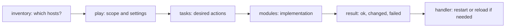
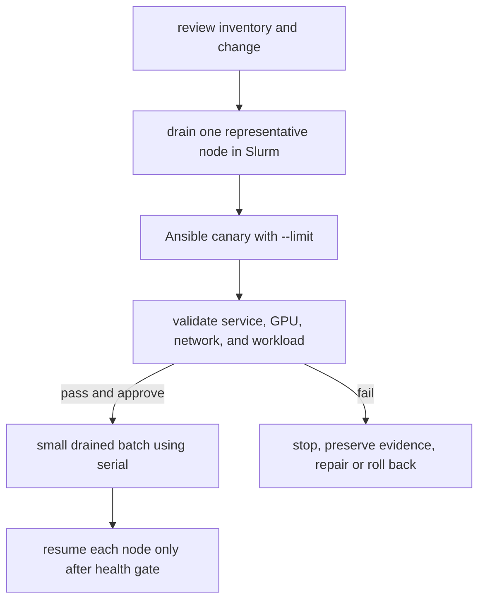

**Learning outcome:** Build, explain, and safely operate an Ansible project that configures bare-metal GPU nodes. You will be able to reason about inventory, plays, tasks, modules, variables, roles, idempotency, secrets, and staged production rollout.

**Prerequisites:** Linux shell, SSH, YAML, package management, and basic `systemctl` use. **Difficulty:** Intermediate. **Estimated reading time:** 60 minutes.

## Foundations: start here if Infrastructure as Code is new to you

Infrastructure as Code stores the intended configuration of a fleet in reviewable files instead of relying on manual commands and memory. Ansible is a configuration-management tool: it connects to existing hosts and makes operating-system state conform to a declared intent.

It is useful to keep the boundaries clear in a bare-metal GPU cluster:

| System | Primary responsibility | Example |
|---|---|---|
| BMC/Redfish | Hardware power and console | Power-cycle a failed server |
| BCM | Image, provisioning, category lifecycle | Boot a node into an approved OS image |
| Ansible | Repeated host configuration | Install a package and deploy a service configuration |
| Slurm | Workload scheduling and node admission | Drain a node before disruptive maintenance |
| Terraform | API-managed infrastructure | Create DNS, IAM, or cloud networking objects |

Do not let two tools own the same file, package, service, or image. For example, if BCM rebuilds `/etc/slurm/slurm.conf` from an image, an Ansible task that manages the same file creates an ownership conflict. Decide and document the owner first.

## The problem Ansible solves

Imagine 64 compute nodes. A security update requires a package, a configuration file, and a service reload. Logging into every server produces three problems:

1. The commands may differ from node to node.
2. Nobody has a durable record of what changed.
3. A partial failure is difficult to identify and safely retry.

Ansible lets you state the desired result once and apply it to an explicit target set. It does not make the change safe by itself. Safety comes from correct targeting, a small initial scope, review, validation, and a rollback path.

## Ansible structure in one picture

Read an Ansible run as: **on these hosts, make these facts true, in this order**.



| Term | Meaning | Bare-metal example |
|---|---|---|
| Control node | Machine that runs Ansible | Admin workstation or CI runner |
| Managed node | Machine configured by Ansible | `gpu-node-01` |
| Inventory | Hosts and groups that Ansible may target | `gpu_nodes`, `login_nodes` |
| Play | A host target plus execution settings | Apply baseline to `gpu_nodes` |
| Task | One ordered action | Ensure `chrony` is installed |
| Module | Code that performs a task | `ansible.builtin.package` |
| Role | Reusable unit of tasks, defaults, handlers, and templates | `roles/node_baseline` |
| Handler | Action triggered by a changed task | Restart `chronyd` after config changes |

## How Ansible reaches a bare-metal node

Ansible normally uses SSH. The control node connects, transfers or invokes a module, collects a structured result, and disconnects. There is normally no persistent Ansible agent polling each compute node. Most Unix modules require Python on the managed host; the `raw` module is a bootstrap exception when Python is not available yet.

This push model means Ansible only converges configuration when an operator or automation runs it. A manual edit at 2 a.m. remains until the next approved run. Schedule configuration runs deliberately and collect their results as change evidence.

## Workbook setup

Use a disposable control node and one or more disposable hosts for this workbook. Do not point these commands at a production cluster until identity, inventory, ownership, change approval, and rollback have been reviewed.

### 1. Create the project layout

Purpose: create a predictable place for inventory, playbooks, roles, and variables.

```text
ansible-baremetal/
├── ansible.cfg
├── inventory/
│   └── hosts.ini
├── group_vars/
│   └── gpu_nodes.yml
├── playbooks/
│   ├── ping.yml
│   └── baseline.yml
└── roles/
    └── node_baseline/
        ├── defaults/main.yml
        ├── handlers/main.yml
        ├── tasks/main.yml
        └── templates/chrony.conf.j2
```

Expected evidence: the files are version-controlled and a reviewer can locate each responsibility without reading one enormous playbook.

Common failure: putting production passwords, private keys, or vault passwords in this directory as plaintext. Store only encrypted secret material or references to an approved secret-delivery mechanism.

### 2. Configure Ansible defaults

Purpose: make project behavior explicit rather than relying on a user's global configuration.

```ini
# ansible.cfg
[defaults]
inventory = inventory/hosts.ini
interpreter_python = auto_silent
host_key_checking = True
retry_files_enabled = False
```

`host_key_checking = True` prevents Ansible from silently accepting an unexpected SSH host key. Keep it enabled in production. Establish trusted host keys through your provisioning and SSH trust process.

### 3. Define a static inventory

Purpose: define exactly which hosts can be targeted.

```ini
# inventory/hosts.ini
[gpu_nodes]
gpu-node-01.cluster.example
gpu-node-02.cluster.example

[login_nodes]
login-01.cluster.example

[gpu_nodes:vars]
ansible_user=automation
```

Expected evidence: `gpu_nodes` contains only the intended compute nodes. A host can belong to more than one group, so review group membership carefully.

Inspect the parsed inventory before a change:

```bash
ansible-inventory --graph
ansible-inventory --list
```

Expected evidence: the graph shows the expected hosts under each group; the JSON output contains the intended connection variables.

Common failure: a hostname resolves to an old address, a group includes an unintended node, or a stale dynamic inventory cache returns obsolete hosts. Stop and correct targeting before running a playbook.

### 4. Test transport before changing anything

Purpose: prove SSH connectivity, remote Python availability, and the automation identity before a mutating run.

```bash
ansible gpu_nodes -m ansible.builtin.ping --limit gpu-node-01.cluster.example
```

Expected evidence:

```text
gpu-node-01.cluster.example | SUCCESS => {
    "ping": "pong"
}
```

The `ping` module is not ICMP ping. It confirms that Ansible connected and executed its module.

Common failure interpretation:

| Result | Meaning | First action |
|---|---|---|
| `UNREACHABLE` | SSH, DNS, route, credential, or host availability failed | Test SSH manually and check the host's management state |
| Python interpreter error | Python is unavailable or incorrectly selected | Bootstrap the supported Python package through the approved image/provisioning path |
| `Permission denied` | The automation identity or SSH key is wrong | Correct access; do not fall back to a shared administrator account |

## Your first playbook

A playbook is YAML containing one or more plays. This first play is read-only.

```yaml
# playbooks/ping.yml
---
- name: Verify GPU node connectivity
  hosts: gpu_nodes
  gather_facts: false
  tasks:
    - name: Confirm Ansible can execute modules
      ansible.builtin.ping:
```

Run it against one host first:

```bash
ansible-playbook playbooks/ping.yml --limit gpu-node-01.cluster.example
```

Purpose: prove the playbook path, inventory, target limit, and remote transport together.

Expected evidence: one host reports `ok=1`, `failed=0`, and `unreachable=0` in the recap.

`--limit` is a safety control, not just a convenience option. Start every new or changed production playbook with a specific canary host or canary group.

## Tasks and modules: declare state, do not replay commands

Prefer modules that describe the state you want. They can inspect current state and report `ok` when no mutation is needed.

```yaml
- name: Ensure chrony is installed
  ansible.builtin.package:
    name: chrony
    state: present

- name: Ensure chrony is enabled and running
  ansible.builtin.service:
    name: chronyd
    enabled: true
    state: started
```

Avoid this when a purpose-built module exists:

```yaml
- name: Do not use an unconditional command for package state
  ansible.builtin.command: dnf install -y chrony
```

`command` can be necessary, but it does not automatically know whether a change is needed. If you must use it, document why a module is insufficient and use `creates`, `removes`, `changed_when`, and `failed_when` only when their behavior is genuinely correct.

## Idempotency: the property you must prove

An idempotent configuration action reaches the desired state once and does not create additional unintended effects on an unchanged second run. It is not a property Ansible grants to every task.

Test it this way:

1. Run the play on one disposable or drained canary node.
2. Validate the resulting service and, when relevant, the GPU workload outcome.
3. Run the unchanged play again.
4. Expect the second run to report no unexpected `changed` results.
5. Introduce controlled drift on the canary and prove the play restores the intended state.

A successful exit code is not sufficient evidence. A task can succeed while continually rewriting a file, restarting a service, or hiding a failure behind an incorrect `changed_when` expression.

## Variables: make configuration explicit

Variables let one role work for multiple node groups, but uncontrolled overrides make a fleet difficult to reason about.

```yaml
# group_vars/gpu_nodes.yml
chrony_service_name: chronyd
chrony_config_path: /etc/chrony.conf
chrony_servers:
  - time-01.cluster.example
  - time-02.cluster.example
```

Use role defaults for values that are safe to override and group variables for values shared by a node class. Avoid passing large sets of `--extra-vars` in production: extra variables have very high precedence and can silently override intended policy.

For an interview, explain variable precedence as a risk-management issue: know the approved override point for a setting, keep variables close to their scope, and inspect resolved behavior in a canary rather than relying on memory alone.

## Templates and handlers

Use `template` when a configuration file needs variables. A handler reloads or restarts a service only when the template actually changes.

```yaml
# roles/node_baseline/tasks/main.yml
---
- name: Install time synchronization package
  ansible.builtin.package:
    name: chrony
    state: present

- name: Render chrony configuration
  ansible.builtin.template:
    src: chrony.conf.j2
    dest: "{{ chrony_config_path }}"
    owner: root
    group: root
    mode: "0644"
  notify: Restart chrony

- name: Ensure chrony is enabled and running
  ansible.builtin.service:
    name: "{{ chrony_service_name }}"
    enabled: true
    state: started
```

```yaml
# roles/node_baseline/handlers/main.yml
---
- name: Restart chrony
  ansible.builtin.service:
    name: "{{ chrony_service_name }}"
    state: restarted
```

```jinja2
# roles/node_baseline/templates/chrony.conf.j2

server {{ server }} iburst

```

Handlers run when notified by a changed task and normally run once at handler flush points. If a later task needs the restarted service, use `meta: flush_handlers` deliberately before that validation. Do not restart GPU-driver-adjacent services without draining the node and assessing workload impact.

## Build and run a baseline play

```yaml
# playbooks/baseline.yml
---
- name: Apply the Linux baseline to GPU nodes
  hosts: gpu_nodes
  become: true
  gather_facts: true
  roles:
    - role: node_baseline
```

Purpose: use the `node_baseline` role to manage a reusable configuration responsibility.

Validate syntax first:

```bash
ansible-playbook playbooks/baseline.yml --syntax-check
```

Expected evidence: Ansible reports successful syntax validation. This does not connect to hosts or prove that variable values, package repositories, or services are correct.

Preview the canary:

```bash
ansible-playbook playbooks/baseline.yml --limit gpu-node-01.cluster.example --check --diff
```

Expected evidence: supported modules show their proposed changes. Review every target and file diff.

Important limit: check mode is a simulation. Modules vary in support, commands may not simulate meaningfully, and a check run cannot prove a service will restart or that a GPU workload will remain healthy.

Apply only after review:

```bash
ansible-playbook playbooks/baseline.yml --limit gpu-node-01.cluster.example
```

Expected evidence: the recap identifies whether each task was `ok`, `changed`, `failed`, or `unreachable`. Follow it with a service-level test such as `systemctl is-active chronyd` and, for a GPU-affecting change, the approved GPU and workload validation.

## Roles: scale organization, not complexity

A role packages one responsibility. Good bare-metal role boundaries could be:

| Role | Owns |
|---|---|
| `node_baseline` | time sync, users, SSH policy, standard repositories |
| `dcgm_exporter` | exporter package, configuration, and service |
| `slurm_client` | Slurm client configuration only when Ansible owns it |
| `nvidia_driver` | driver state only when the image/BCM process does not own it |

Do not create a role just to hide one task. Do create a role when the responsibility has reusable tasks, variables, templates, handlers, and tests. Pin collection versions and review role dependencies so a routine run cannot silently change behavior after an upstream release.

## Secrets and privilege escalation

`become: true` gives the remote automation identity a privileged path on every selected node. Use a dedicated automation account, least-privilege sudo policy, and approved credential rotation. Do not solve an access problem by using a shared root SSH account.

Ansible Vault encrypts variable files or individual values. It protects the encrypted content, not the vault password, CI log, or decrypted runtime value.

```bash
ansible-vault encrypt group_vars/gpu_nodes/secrets.yml
ansible-playbook playbooks/baseline.yml --vault-password-file /run/secrets/ansible_vault_password
```

Expected evidence: Git contains ciphertext rather than plaintext secrets, and the vault-password file is supplied by a protected runtime mechanism.

For tasks that could print credentials or tokens, use `no_log: true` narrowly. Remember that it reduces diagnostic detail, so validate those tasks with an approved non-secret health signal.

## Safe rollout for bare-metal GPU nodes

Configuration that touches drivers, kernel parameters, networking, Slurm, storage clients, or node services can affect running work. Ansible has no built-in understanding of job safety. Integrate it with the scheduler and change process.



The following play demonstrates rollout mechanics. The `node_change_approved` variable is an approval guard, not proof that Slurm drained the host. Verify drain state through the scheduler's approved workflow before invocation.

```yaml
---
- name: Roll out a reviewed configuration change
  hosts: gpu_nodes
  serial: 1
  any_errors_fatal: true
  become: true
  pre_tasks:
    - name: Require explicit canary approval
      ansible.builtin.assert:
        that: node_change_approved | bool
        fail_msg: "Drain and approve the canary before this play."
  roles:
    - role: dcgm_exporter
  post_tasks:
    - name: Verify the exporter service is active
      ansible.builtin.command: systemctl is-active dcgm-exporter
      changed_when: false
```

Start with `serial: 1`. After the canary passes the required health and workload tests, change to a small, capacity-aware batch only through the approved change process. `any_errors_fatal` stops additional work after a failure; it does not automatically undo modifications already made. Keep the prior configuration or image available and understand the rollback command before starting.

## Troubleshooting workbook

| Symptom | Likely boundary | Evidence to collect | Safe next step |
|---|---|---|---|
| `UNREACHABLE` | DNS, network, SSH, credentials, or host state | SSH error, DNS answer, BMC/console state | Exclude the node; do not expand rollout scope |
| Package task fails | Repository, dependency, disk, or OS package state | Package-manager output and free space | Repair on one drained node and retry only that node |
| Template changes every run | Generated timestamp, unstable input, whitespace, or wrong variable | Two `--check --diff` runs and variable inspection | Make output deterministic and prove a zero-change second run |
| Handler fails | Invalid configuration or missing dependency | `systemctl status`, journal, application validation | Restore the previous known-good configuration before expansion |
| Play succeeds but node fails jobs | Host-to-workload validation gap | `nvidia-smi`, DCGM, Slurm job evidence, network/storage checks | Keep node drained and investigate; Ansible success is not admission evidence |
| Wrong hosts changed | Inventory or `--limit` error | Rendered inventory, command record, recap | Stop, assess affected hosts, correct inventory before retrying |

## Interview answers to practice

1. **What is the difference between Ansible and Terraform?** Ansible configures state inside existing hosts through tasks and modules. Terraform manages API-backed infrastructure objects and tracks them in state. Assign a single owner for each object or field.
2. **What makes a playbook idempotent?** A repeated run against an unchanged host does not produce unintended changes. Prove it with a second run and service-level validation, not merely a successful exit code.
3. **Why use `serial`?** It limits concurrent hosts and therefore blast radius. Choose it from workload capacity, rollback speed, and validation time, not from a generic percentage.
4. **Why is `--check` insufficient?** It is a simulation with incomplete support. It cannot prove a restart, hardware state, scheduler behavior, or application workload result.
5. **How do you safely change a GPU node?** Establish ownership, drain it through Slurm, run a reviewed canary, validate service plus GPU/network/workload behavior, retain rollback, then progress through small drained batches.
6. **Why should `shell` be rare?** It bypasses module-level state modeling and makes idempotency, quoting, failure handling, and check-mode behavior your responsibility.

## Further reading

- [Ansible playbooks](https://docs.ansible.com/projects/ansible/latest/playbook_guide/playbooks_intro.html)
- [Ansible inventory](https://docs.ansible.com/projects/ansible/latest/inventory_guide/intro_inventory.html)
- [Ansible variables](https://docs.ansible.com/projects/ansible/latest/playbook_guide/playbooks_variables.html)
- [Ansible handlers](https://docs.ansible.com/projects/ansible/latest/playbook_guide/playbooks_handlers.html)
- [Ansible check and diff mode](https://docs.ansible.com/projects/ansible/latest/playbook_guide/playbooks_checkmode.html)
- [Ansible Vault](https://docs.ansible.com/projects/ansible/latest/vault_guide/index.html)
- [Chapter 2: NVIDIA Base Command Manager](./chapter-2-nvidia-base-command-manager)
- [Chapter 3: OS provisioning and Linux security hardening](./chapter-3-os-provisioning-and-linux-security-hardening)
- [Chapter 6: Slurm administration, HA, accounting, and upgrades](./chapter-6-slurm-administration-ha-accounting-and-upgrades)

## Key takeaways

- Inventory and `--limit` are safety boundaries.
- A module-based task is easier to make idempotent and review than an arbitrary shell command.
- A role groups one clear configuration responsibility.
- Check mode is useful evidence, never final proof.
- A successful Ansible recap does not prove that a GPU node is healthy enough for scheduling.
- Drain, canary, validate, batch, and retain rollback for disruptive bare-metal changes.
