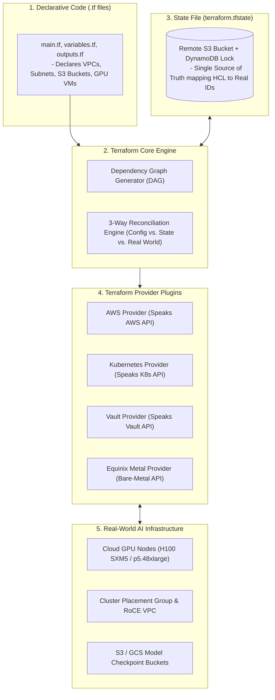
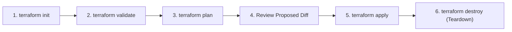

# Chapter 5 — Terraform for Infrastructure as Code in AI Factories

In modern accelerated computing, building an **AI Factory** involves far more than racking bare-metal GPU servers. High-performance distributed training and inference clusters depend on a vast ecosystem of API-driven scaffolding: **cloud-bursted GPU node pools (e.g., AWS P5 / Azure NDv5 / CoreWeave), ultra-low latency VPC networks with MTU 9000, cluster placement groups for 3.2 Tbps GPUDirect RDMA, high-throughput S3/GCS checkpoint buckets, DNS records, IAM roles, and Kubernetes control planes**.

Provisioning this infrastructure manually through cloud web consoles or unversioned shell scripts is an operational disaster. Manual clicking produces configuration drift, lacks an audit trail, cannot be reproduced in disaster recovery, and risks catastrophic accidental deletion of multi-terabyte checkpoint volumes.

This chapter provides a **ground-up, beginner-to-advanced masterclass** on **Terraform (and OpenTofu)**. You will learn what Infrastructure as Code (IaC) is, master the internal mechanics of `init`, `plan`, `apply`, and `state`, manage remote locking to prevent team corruption, deploy specialized GPU cluster placement groups, and define the clear architectural boundary between Terraform, Ansible, and NVIDIA Base Command Manager (BCM).

---

## 1. Foundations: What is Infrastructure as Code (IaC)?

Historically, infrastructure was managed **imperatively**: an engineer logged into a web console or ran sequential shell commands:
```bash
# Imperative approach: "Do this, then do that"
aws ec2 create-vpc --cidr-block 10.0.0.0/16
aws ec2 create-subnet --vpc-id vpc-12345 --cidr-block 10.0.1.0/24
aws ec2 run-instances --image-id ami-xyz --instance-type p5.48xlarge ...
```
*Why Imperative Scripts Fail at Scale:*
1. **Not Idempotent:** Running the script twice creates duplicate subnets or crashes because names collide.
2. **No State Awareness:** If someone manually deletes an instance in the console, the script has no idea that the real world diverged from the intended design.
3. **No Dependency Graph:** If creating a GPU worker pool requires a VPC, an IAM role, and a security group, shell scripts cannot easily resolve the parallel creation order or handle partial failures.

### The Declarative Paradigm of IaC
**Infrastructure as Code (IaC)** replaces imperative commands with **declarative configuration files**. Instead of telling the machine *how* to build each step, you declare **what the final desired state should look like**:

> *"I declare that a VPC with CIDR `10.0.0.0/16` and 32x `p5.48xlarge` GPU instances in a cluster placement group must exist. Terraform, figure out what API calls are needed to make reality match this file."*

---

## 2. What is Terraform and Why is it Used in AI Infrastructure?

**Terraform** (created by HashiCorp, with its open-source fork **OpenTofu**) is the industry-standard, cloud-agnostic declarative IaC engine. It uses the **HashiCorp Configuration Language (HCL)**—a human-readable, machine-parsable language.



### The Core Architectural Value for AI Factories
1. **Hybrid Cloud Bursting:** Terraform provisions on-demand GPU capacity in AWS, Azure, CoreWeave, or Lambda Labs when on-prem DGX SuperPOD capacity is saturated during foundation model training deadlines.
2. **Network Topology Consistency:** Training 70B+ parameter LLMs requires non-blocking bandwidth. Terraform provisions specialized **Cluster Placement Groups** (ensuring GPU instances are placed in the same physical rack row) and **EFA / RoCE network interfaces** automatically.
3. **Immutable Ephemeral Teardown:** A 64-node H100 cloud cluster costs upwards of $2,500/hour. With Terraform, you spin up the entire cluster for a 48-hour fine-tuning run via `terraform apply`, and tear it down cleanly to zero via `terraform destroy`, eliminating accidental multi-million dollar cloud idle bills.

---

## 3. The 4 Core Terraform Commands (The Lifecycle from Zero)

To operate Terraform safely, you must understand what happens internally during each phase of its execution loop:



### 1. `terraform init` (Initialization)
- **What it does:** Scans your `.tf` files, reads the `required_providers` block, and downloads the required provider binary plugins (e.g., `aws`, `kubernetes`) from the Terraform Registry into a local hidden directory: `.terraform/providers/`.
- **Backend Setup:** Initializes the remote state backend (e.g., S3 bucket and DynamoDB locking table).
- **Lock File:** Creates or verifies `.terraform.lock.hcl`, which cryptographically hashes the exact provider plugin versions to guarantee that every team member and CI/CD runner compiles against identical provider binaries.

```bash
$ terraform init
Initializing the backend...
Successfully configured the backend "s3"!
Initializing provider plugins...
- Finding hashicorp/aws versions matching "~> 5.50"...
- Installing hashicorp/aws v5.50.0...
- Installed hashicorp/aws v5.50.0 (signed by HashiCorp)
Terraform has been successfully initialized!
```

---

### 2. `terraform validate` and `terraform fmt`
- `terraform fmt`: Rewrites `.tf` files to adhere to canonical HCL style, tabs, and indentation standards across the team.
- `terraform validate`: Verifies syntax, checks variable types, and validates resource attributes against provider schemas without making network calls.

---

### 3. `terraform plan` (The Proposed Diff)
- **What it does:** Executes a **Three-Way Reconciliation**:
  1. Reads your declared `.tf` configuration files.
  2. Reads the current `terraform.tfstate` file.
  3. Queries the provider APIs (e.g., AWS EC2, S3) to refresh the real-world observed state of all managed resources.
- **Dependency Graph:** Constructs a Directed Acyclic Graph (DAG) of all resources to determine what can be created in parallel vs. sequentially.
- **Output:** Produces a detailed execution plan highlighting:
  - `+` **Create:** Resource does not exist; Terraform will create it.
  - `~` **Update in-place:** Resource exists; Terraform can modify its attributes without deleting it.
  - `-` **Destroy:** Resource exists in state but is no longer in configuration; Terraform will delete it.
  - `-/+` **Destroy and Re-create (Replacement):** An attribute was changed that the cloud provider does not support modifying live (e.g., changing VPC CIDR or instance subnet). **Terraform will destroy the existing resource and create a new one!**

```bash
# Save the execution plan to a binary file for deterministic application
$ terraform plan -out=tfplan
```

---

### 4. `terraform apply` (State Mutation)
- **What it does:** Executes the actions proposed in the plan.
- **Locking:** Acquires an exclusive write lock in DynamoDB/remote backend to prevent another engineer from running a concurrent apply.
- **Execution:** Calls the cloud provider REST APIs over HTTPS, adhering to topological dependency order.
- **State Update:** As each API call confirms resource creation, Terraform writes the assigned cloud IDs (e.g., `vpc-08219412`, `i-0a1b2c3d`) to `terraform.tfstate` and releases the lock.

```bash
# Apply the exact reviewed plan artifact
$ terraform apply tfplan
```

---

### 5. `terraform destroy`
- Reads the state file, reverses the dependency graph, and systematically deletes all managed resources in the cloud. Critical for tearing down temporary cloud-bursted GPU clusters once jobs finish.

---

## 4. Anatomy of HCL: Building a GPU Training VPC from Scratch

Let us build a complete, production-grade Terraform configuration for an accelerated AI environment.

### 1. Provider and Backend Configuration (`versions.tf`)

```hcl
# versions.tf
terraform {
  required_version = ">= 1.7.0"

  required_providers {
    aws = {
      source  = "hashicorp/aws"
      version = "~> 5.50.0"
    }
  }

  # Production remote backend with state locking
  backend "s3" {
    bucket         = "enterprise-ai-terraform-state"
    key            = "ai-factory/us-east-1/training-vpc/terraform.tfstate"
    region         = "us-east-1"
    dynamodb_table = "terraform-state-lock"
    encrypt        = true
  }
}

provider "aws" {
  region = var.aws_region

  default_tags {
    tags = {
      Environment = "Production"
      Workload    = "LLM-Pretraining"
      ManagedBy   = "Terraform"
    }
  }
}
```

---

### 2. Variables and Inputs (`variables.tf`)

```hcl
# variables.tf
variable "aws_region" {
  type        = string
  description = "AWS region for GPU cluster deployment"
  default     = "us-east-1"
}

variable "vpc_cidr" {
  type        = string
  description = "CIDR block for the AI training VPC"
  default     = "10.100.0.0/16"
}

variable "gpu_instance_count" {
  type        = number
  description = "Number of 8x H100 SXM5 GPU instances to provision"
  default     = 32

  validation {
    condition     = var.gpu_instance_count >= 1 && var.gpu_instance_count <= 128
    error_message = "GPU instance count must be between 1 and 128."
  }
}
```

---

### 3. Resource Declarations: Networking, Placement Groups, and Storage (`main.tf`)

```hcl
# main.tf

# 1. High-Bandwidth VPC for Distributed Training
resource "aws_vpc" "ai_vpc" {
  cidr_block           = var.vpc_cidr
  enable_dns_hostnames = true
  enable_dns_support   = true

  tags = {
    Name = "ai-training-vpc"
  }
}

# 2. Private Subnet with MTU 9000 (Jumbo Frames) Support
resource "aws_subnet" "ai_subnet_a" {
  vpc_id            = aws_vpc.ai_vpc.id
  cidr_block        = "10.100.1.0/24"
  availability_zone = "${var.aws_region}a"

  tags = {
    Name = "ai-training-subnet-a"
  }
}

# 3. Cluster Placement Group (MANDATORY for Distributed GPU Training)
# Forces all 32 GPU instances onto the same physical spine switch fabric
resource "aws_placement_group" "gpu_cluster_pg" {
  name     = "llm-training-cluster-pg"
  strategy = "cluster"
}

# 4. S3 Bucket for Checkpoint Storage with Lifecycle Rules
resource "aws_s3_bucket" "checkpoint_bucket" {
  bucket = "enterprise-ai-checkpoints-prod"
}

resource "aws_s3_bucket_lifecycle_configuration" "checkpoint_lifecycle" {
  bucket = aws_s3_bucket.checkpoint_bucket.id

  rule {
    id     = "expire-stale-checkpoints"
    status = "Enabled"

    # Automatically purge non-current model checkpoints older than 14 days
    noncurrent_version_expiration {
      noncurrent_days = 14
    }
  }
}

# 5. Cloud GPU Compute Fleet (p5.48xlarge = 8x NVIDIA H100 SXM5 GPUs)
resource "aws_instance" "gpu_workers" {
  count                = var.gpu_instance_count
  ami                  = "ami-0abc1234nvidia_deep_learning" # Pinned base image
  instance_type        = "p5.48xlarge"
  subnet_id            = aws_subnet.ai_subnet_a.id
  placement_group      = aws_placement_group.gpu_cluster_pg.id

  # Protect training nodes from accidental deletion
  lifecycle {
    create_before_destroy = true
    ignore_changes        = [ami] # AMI updates handled via Ansible/BCM
  }

  tags = {
    Name = "gpu-training-worker-${count.index}"
    Role = "Slurm-Compute-Node"
  }
}
```

---

### 4. Outputs (`outputs.tf`)

```hcl
# outputs.tf
output "vpc_id" {
  description = "VPC ID of the AI Training Fabric"
  value       = aws_vpc.ai_vpc.id
}

output "checkpoint_bucket_arn" {
  description = "S3 ARN for saving Megatron/PyTorch checkpoints"
  value       = aws_s3_bucket.checkpoint_bucket.arn
}

output "gpu_private_ips" {
  description = "Private IP addresses of all 32 GPU instances for Ansible inventory"
  value       = aws_instance.gpu_workers[*].private_ip
}
```

---

## 5. The State File: Architecture, Locking, and Disaster Recovery

The **state file (`terraform.tfstate`)** is the single most critical asset in Terraform. It is a structured JSON database that records the exact mapping between your declarative HCL resources and real-world infrastructure.

### Why Local State is an Enterprise Liability
- If an engineer runs `terraform apply` locally on their laptop, the state file resides in their local directory.
- Another engineer running `terraform apply` on their own laptop has no record of those resources and will attempt to recreate them, causing API naming collisions, orphaned instances, and silent overwrites.

### Production Solution: Remote State with Distributed Locking
In AWS, Terraform stores the state file in a private **S3 Bucket** (with SSE-KMS encryption and versioning) paired with a **DynamoDB Table**:

```text
[Engineer 1 runs: terraform apply]
  1. Acquires Lock: Writes a LockID item to DynamoDB.
  2. Pulls State: Downloads latest terraform.tfstate from S3.
  3. Executes Mutations: Calls AWS EC2/S3 APIs.

[Engineer 2 runs: terraform apply CONCURRENTLY]
  1. Attempts Lock: Checks DynamoDB -> Sees active LockID held by Engineer 1.
  2. FAILS FAST: "Error: Error acquiring the state lock: ConditionalCheckFailedException"
  3. State corruption is 100% prevented!

[Engineer 1 finishes apply]
  4. Pushes updated state back to S3.
  5. Releases Lock: Deletes LockID row from DynamoDB.
```

### Essential State Management CLI Commands

```bash
# 1. List all resources currently tracked in state
$ terraform state list
aws_instance.gpu_workers[0]
aws_instance.gpu_workers[1]
aws_placement_group.gpu_cluster_pg
aws_vpc.ai_vpc

# 2. Inspect the detailed state attributes of a specific GPU instance
$ terraform state show aws_instance.gpu_workers[0]

# 3. Import existing infrastructure (e.g., a manually created S3 bucket) into Terraform
$ terraform import aws_s3_bucket.dataset_bucket enterprise-raw-datasets-bucket

# 4. Remove a resource from state without deleting it in the real world
$ terraform state rm aws_instance.gpu_workers[31]
```

---

## 6. The AI Infrastructure Boundary: What Terraform Owns vs. What BCM/Ansible Owns

A fatal mistake in AI platform engineering is trying to use Terraform to configure what happens *inside* the Linux operating system (e.g., using `remote-exec` to install NVIDIA drivers or edit Slurm configuration files).

```mermaid
flowchart LR
    subgraph TerraformBoundary["Day 0: Terraform / OpenTofu (Cloud & Infrastructure APIs)"]
        VPC["VPCs, Subnets, Security Groups, MTU 9000"]
        PG["Cluster Placement Groups (InfiniBand locality)"]
        BUCKETS["S3 / GCS Checkpoint & Dataset Buckets"]
        INSTANCES["Cloud GPU Virtual Machines & Bare-Metal Allocations"]
        DNS["Route53 DNS & Cloud Load Balancer VIPs"]
    end

    subgraph BCM_Ansible_Boundary["Day 1 / Day 2: BCM & Ansible (OS, Hardware & Workload Stack)"]
        KERNEL["Linux Kernel Tuning (iommu=pt, numa_balancing=0)"]
        DRV["NVIDIA Open-Source Drivers & MOFED OFED Install"]
        DCGM["DCGM Exporter Daemon & Health Frameworks"]
        CONTAINERS["Enroot / Pyxis / Containerd / GPU Operator"]
        SCHEDULER["Slurm Node Joining, gres.conf & Partition Management"]
    end

    TerraformBoundary -->|Provisions API Objects & Handoffs IP Inventory| BCM_Ansible_Boundary
```



### The Golden Rule:
- **Terraform owns the Infrastructure Outside the OS:** If it has an API (cloud provider, DNS, storage bucket, network VPC), Terraform owns it.
- **BCM and Ansible own the Configuration Inside the OS:** If it is a file (`/etc/slurm/slurm.conf`), a kernel parameter (`sysctl`), a driver package, or a systemd service, BCM or Ansible owns it.

---

## 7. Senior Solutions Architect Interview Scenarios

### Scenario 1: The Catastrophic `-/+` (Forces Replacement) Incident
**Interviewer:** *"An engineer submits a pull request modifying your production Terraform code for an active 64-node DGX H100 cloud cluster. The team reviews the PR, merges it, and runs `terraform apply`. Suddenly, all 64 GPU instances are terminated, destroying an ongoing $500,000 foundation model pre-training run. What happened, and how do you architecturally prevent this?"*

**Candidate Answer:**
> "This is the classic catastrophe of an unreviewed **`-/+` (Destroy and Recreate / Forces Replacement)** plan:
> 1. **The Root Cause:** In cloud provider resource schemas (like `aws_instance`), certain attributes are immutable once an instance is launched. For example, if the engineer modified the subnet CIDR, changed the `availability_zone`, or toggled an immutable network interface attribute, the provider API does not support updating the running instance in place. Terraform's only path to satisfy the declared code is to **terminate the existing instance and spin up a new one**.
> 2. **Why Plan Summaries are Deceptive:** The engineer likely looked only at the final summary line: `Plan: 64 to add, 0 to change, 64 to destroy`, mistaking it for a scaling operation rather than a destructive teardown.
> 3. **The Architectural Safeguards:**
>    - **Prevent Destroy via Lifecycle Rules:** On mission-critical compute and stateful storage resources, we enforce:
>      ```hcl
>      lifecycle {
>        prevent_destroy = true
>      }
>      ```
>      If a proposed change would trigger recreation, Terraform immediately throws a hard fatal error and halts before executing any API calls.
>    - **Automated CI/CD Plan Inspection:** In our CI/CD pipeline (Atlantis / GitHub Actions), we pipe `terraform show -json tfplan` through a script that parses `.resource_changes[]`. If any active GPU instance or storage volume contains a `delete` action, the pipeline automatically blocks the PR and demands Senior Architect sign-off.
>    - **Apply Saved Plans Only:** We enforce `terraform plan -out=tfplan` and apply only the approved binary artifact, ensuring no drift occurs between review and execution."

---

### Scenario 2: Sizing Cluster Placement Groups for Multi-Node AI Training
**Interviewer:** *"A customer is deploying 32x 8-GPU instances in AWS or CoreWeave for distributed PyTorch training. Their model scales poorly across nodes, with NCCL All-Reduce latency 3x higher than local benchmarks. Their Terraform code provisions instances into a standard multi-AZ subnet. What is missing in their IaC architecture?"*

**Candidate Answer:**
> "Their Terraform code failed to define a **Cluster Placement Group**:
> 1. **The Physical Reality of Cloud Data Centers:** Without an explicit placement group, the cloud hypervisor schedules the 32 GPU instances across arbitrary server racks, rows, or availability zones within the data center. Traffic between ranks must traverse multiple spine switches and oversubscribed aggregation layers.
> 2. **The Architectural Fix in Terraform:**
>    - We define an `aws_placement_group` with `strategy = "cluster"` in HCL.
>    - A Cluster Placement Group instructs the cloud fabric to bin-pack all 32 instances into the same physical rack row or contiguous network spine domain.
>    - Combined with **Elastic Fabric Adapter (EFA)** or RoCE network interfaces with **Jumbo Frames (MTU 9000)** enabled in the VPC subnet, all GPU-to-GPU network hops are kept to a single leaf switch, eliminating spine hops and restoring full 400G / 3.2 Tbps GPUDirect RDMA line-rate throughput."

---

## Key Takeaways

1. **Declarative Beats Imperative:** Terraform declares desired end-state; its three-way reconciliation engine compares configuration, state file, and real-world APIs to calculate the minimal mutation path.
2. **Master the Lifecycle:** Understand the internal mechanics of `init` (plugin/backend setup), `plan` (dependency DAG diff), and `apply` (atomic mutation and state update).
3. **Remote State with Locking is Non-Negotiable:** Always store `terraform.tfstate` in an encrypted remote S3 bucket paired with a DynamoDB table to prevent concurrent execution races.
4. **Fear the `-/+` Marker:** A plan showing `-/+` means destructive replacement; protect production GPU fleets using `lifecycle { prevent_destroy = true }` and automated CI/CD delete filters.
5. **Cluster Placement Groups are Mandatory:** When provisioning cloud GPU instances in Terraform, always attach them to a cluster placement group to guarantee the physical switch locality required for low-latency GPUDirect RDMA.
6. **Respect the IaC Boundary:** Use Terraform for API-managed infrastructure outside the OS (VPCs, S3 buckets, Placement Groups, Instances); use BCM or Ansible for configuration inside the OS (Linux kernel, NVIDIA drivers, CUDA, Slurm).
